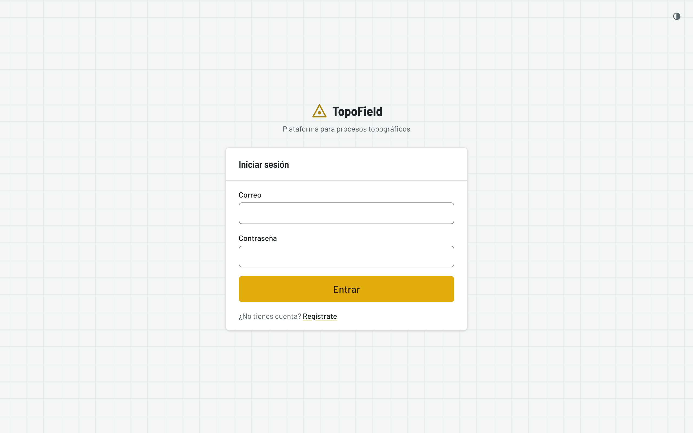
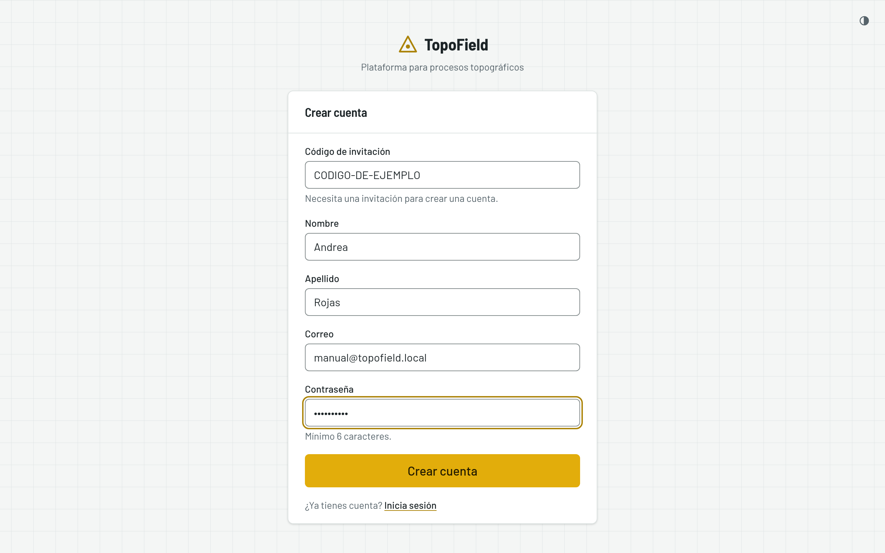
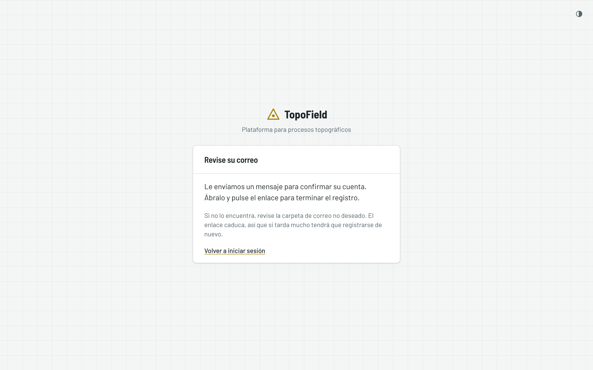
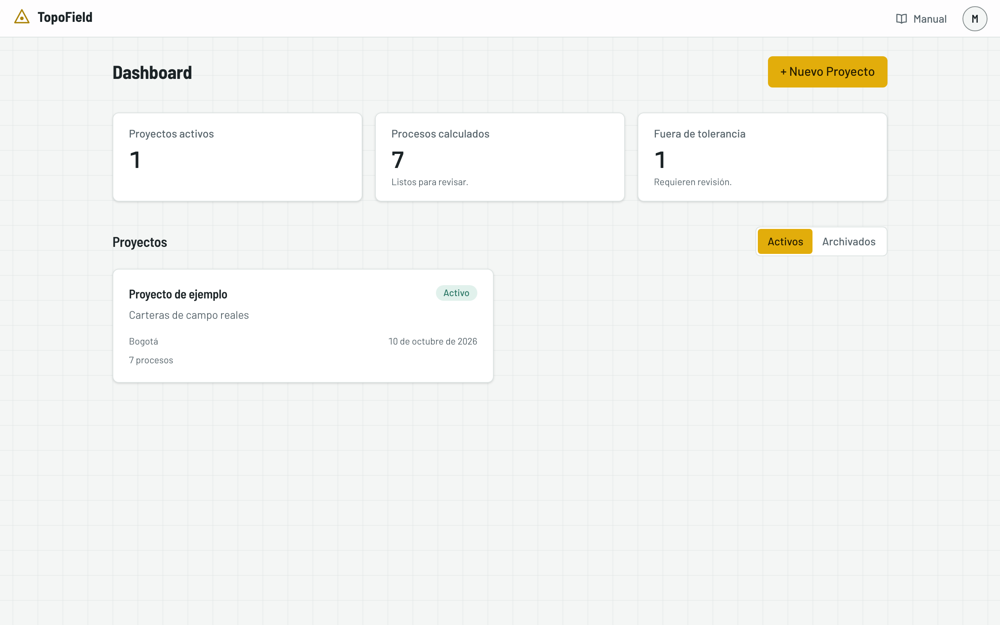
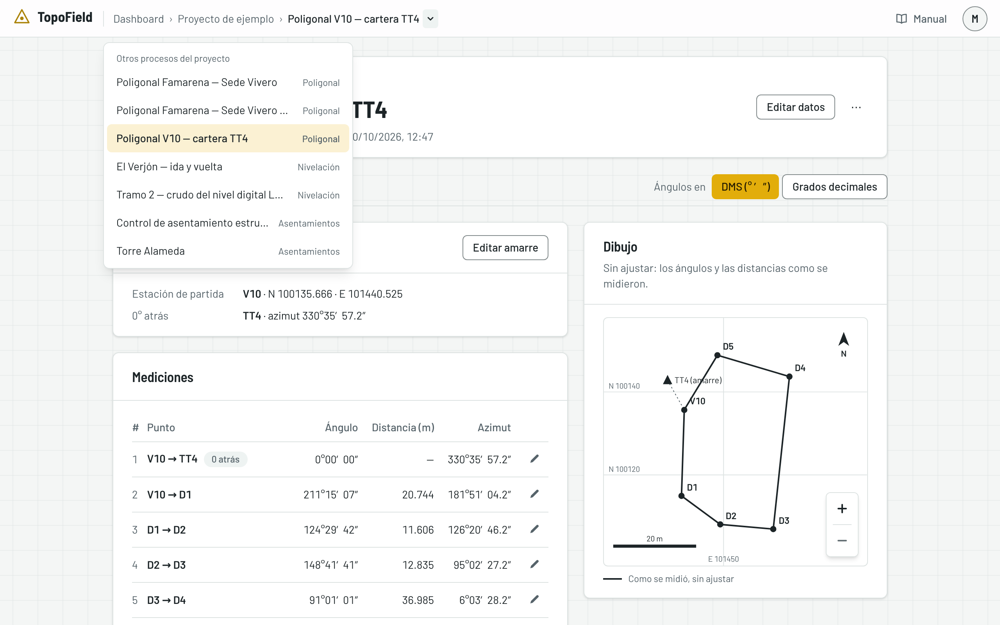
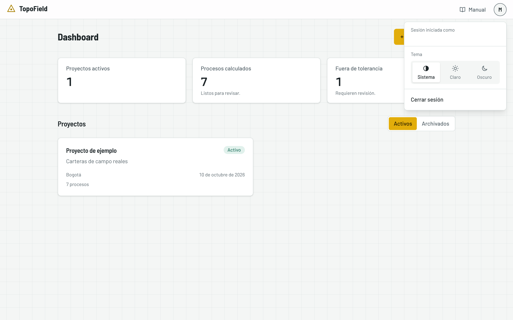
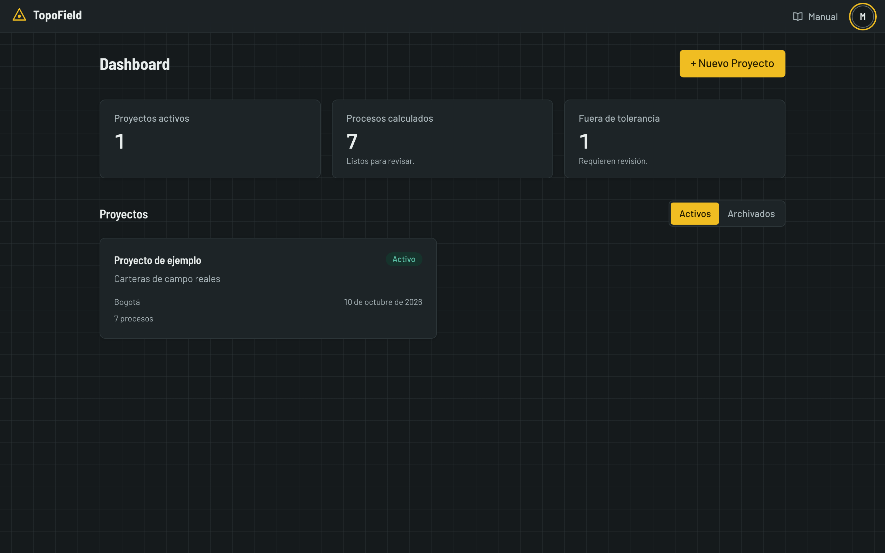

# Primeros pasos

Cómo crear su cuenta, entrar por primera vez y moverse por la aplicación. Al
final, las tres ideas que ordenan todo TopoField.

## Crear su cuenta

Para crear una cuenta necesita un **código de invitación**: la aplicación no
está abierta al público y, sin el código, el registro no avanza. Pídalo a
quien administra la aplicación.

1. Abra TopoField en el navegador. Verá la pantalla para entrar. Pulse
   **Regístrate**, debajo del botón **Entrar**.

   

2. Llene el formulario:
   - **Código de invitación**: el que le dieron, tal cual.
   - **Nombre** y **Apellido**: identifican su cuenta.
   - **Correo**: es su usuario para entrar, y a él llega el mensaje de
     confirmación. Use uno que revise.
   - **Contraseña**: al menos 6 caracteres.

   Pulse **Crear cuenta**.

   

3. La aplicación le pide que revise su correo. Abra el mensaje de TopoField y
   pulse el enlace para confirmar la cuenta. Si no lo encuentra, mire en el
   correo no deseado.

   

4. Al pulsar el enlace, la cuenta queda confirmada y entra directamente a la
   aplicación.

> Hasta que confirme el correo no podrá entrar. El enlace caduca: si tarda
> mucho, regístrese de nuevo.

## Entrar

Las siguientes veces, escriba su **correo** y su **contraseña** en la pantalla
de inicio y pulse **Entrar**. La sesión queda abierta en ese navegador hasta
que la cierre desde el menú de cuenta. Cada usuario ve solo sus propios
proyectos: nadie más puede abrirlos.

## El proyecto de ejemplo

La primera vez que entra, su cuenta ya trae un **Proyecto de ejemplo** hecho
con carteras de campo reales y ya calculado. Sirve para conocer la aplicación
sin capturar nada:

- **Tres poligonales.** La V10, amarrada al punto TT4; la de la Sede Vivero,
  ajustada por mínimos cuadrados, y la misma Sede Vivero medida en un sistema
  local, lista para georreferenciar.
- **Dos nivelaciones.** El Verjón, con ida y vuelta por los mismos puntos, y
  el tramo 2, leído del archivo de un nivel digital.
- **Dos controles de asentamientos.** Torre Alameda, simulado, con catorce
  visitas, y el control de asentamiento estructural, una cartera real de
  dieciséis puntos y siete visitas.

Es un proyecto como cualquier otro: puede abrir sus procesos, cambiar datos
para ver cómo se recalcula todo, archivarlo o eliminarlo cuando quiera. Lo que
haga en él no afecta a sus demás proyectos.

## El dashboard

Es la pantalla de inicio. Arriba hay tres indicadores:

- **Proyectos activos**: cuántos proyectos tiene en curso, sin contar los
  archivados.
- **Procesos calculados**: cuántos trabajos ya tienen su cálculo resuelto y
  están listos para revisar o para entregar.
- **Fuera de tolerancia**: cuántos trabajos piden su atención. Son las
  poligonales y nivelaciones que no alcanzan ningún orden de precisión, y los
  lugares con algún punto en alerta o alarma. Si es cero, no hay nada
  pendiente de revisar.

Debajo están sus proyectos, cada uno en una tarjeta con cuántos procesos
tiene; pulse una para abrir el proyecto. **Activos** y **Archivados** cambian
entre los proyectos en curso y los que guardó aparte, y **+ Nuevo Proyecto**
crea uno (vea [Proyectos](02-proyectos.md)).

## Moverse por la aplicación

La barra de arriba queda fija mientras baja por cualquier pantalla:

- **El logo** lo devuelve al dashboard.
- **La ruta**, a su lado, dice dónde está: «Dashboard › Proyecto de ejemplo ›
  Poligonal V10…». Cada nombre lleva a ese nivel. En el teléfono se reduce a
  «‹» y el nivel anterior.
- **La flecha ⌄** junto al proyecto o al proceso abre la lista de los demás:
  los otros proyectos de su cuenta, o los otros procesos del proyecto, con su
  tipo. Elija uno para ir directo, sin volver al dashboard.
- **Manual** abre este manual.
- **El círculo con su inicial** abre el menú de cuenta: su correo, el tema y
  **Cerrar sesión**.

## Elegir el tema

En el menú de cuenta elija el tema:

- **Sistema** sigue la configuración de su teléfono o computador: si el
  equipo pasa a oscuro de noche, la aplicación también.
- **Claro** y **Oscuro** fijan uno, sin importar el equipo.

La elección se recuerda en ese navegador. En la pantalla de inicio, el tema se
cambia con el icono de arriba a la derecha. El informe impreso sale siempre en
claro.

## Cómo se organiza TopoField

Tres ideas ordenan toda la aplicación:

- **Proyecto.** Es la carpeta de un trabajo topográfico. Guarda el cliente, la
  ubicación, el datum y la proyección, y los puntos de referencia que usan sus
  procesos.
- **Proceso.** Es un levantamiento concreto dentro de un proyecto: una
  poligonal, una nivelación o un control de asentamientos. Cada proceso guarda
  su propio equipo, porque puede cambiar de un levantamiento a otro.
- **Cálculo en vivo.** Lo que captura se guarda al confirmar cada ventana y se
  calcula en ese momento: el cierre, las cotas y el orden alcanzado se
  actualizan solos. No hay botón de calcular.

La poligonal, la nivelación y cada visita de asentamientos muestran su
**estado**:

| Estado | Qué significa |
|---|---|
| **Borrador** | Creado, todavía sin datos suficientes |
| **En progreso** | Con datos de campo, pero sin un cálculo completo. En una visita se dice **En medición** |
| **Calculado** | El cálculo está resuelto: listo para revisar y para el informe |

El **orden de precisión** no se declara: la aplicación lo detecta al calcular
y le dice qué orden alcanzó el trabajo.

## Nada se cierra: todo se recalcula

En TopoField ningún trabajo se cierra ni se bloquea. No hay botones para
cerrar o reabrir, y siempre puede corregir. A cambio:

- **Todo se recalcula en vivo.** Si corrige una lectura, la cota de un BM o la
  cota base de un punto, se recalcula todo lo que depende de ese dato. Antes
  de guardar, la aplicación le avisa qué va a cambiar.
- **El orden se detecta.** Cada trabajo dice qué orden de precisión alcanzó, y
  su informe avisa si no alcanza ninguno.
- **El PDF guarda el momento.** El informe muestra el trabajo tal como está al
  abrirlo. Si necesita conservar una versión, expórtela a PDF (vea
  [El informe y el Excel](06-informe-y-excel.md)).
