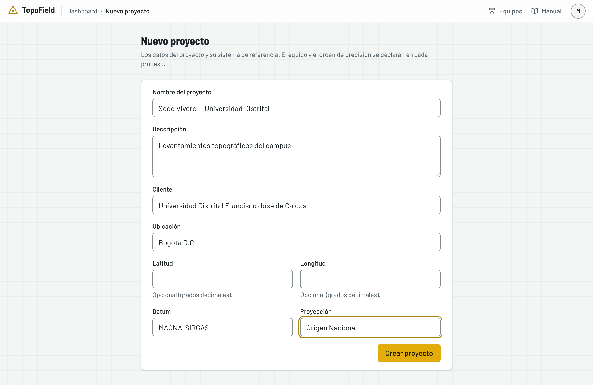
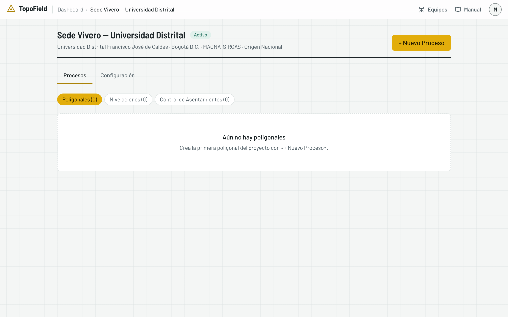
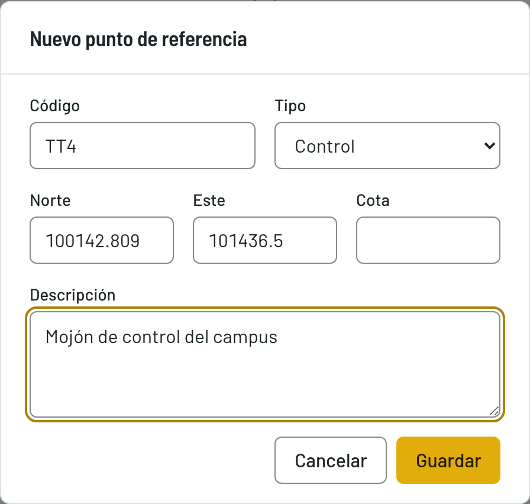
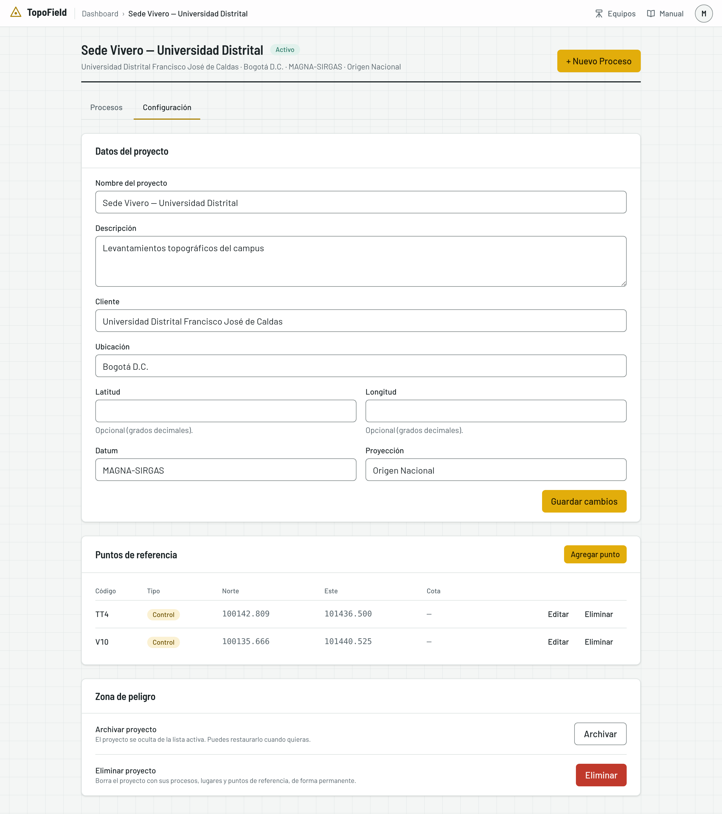
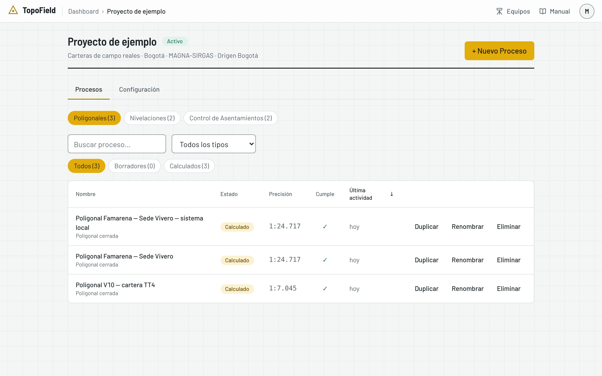
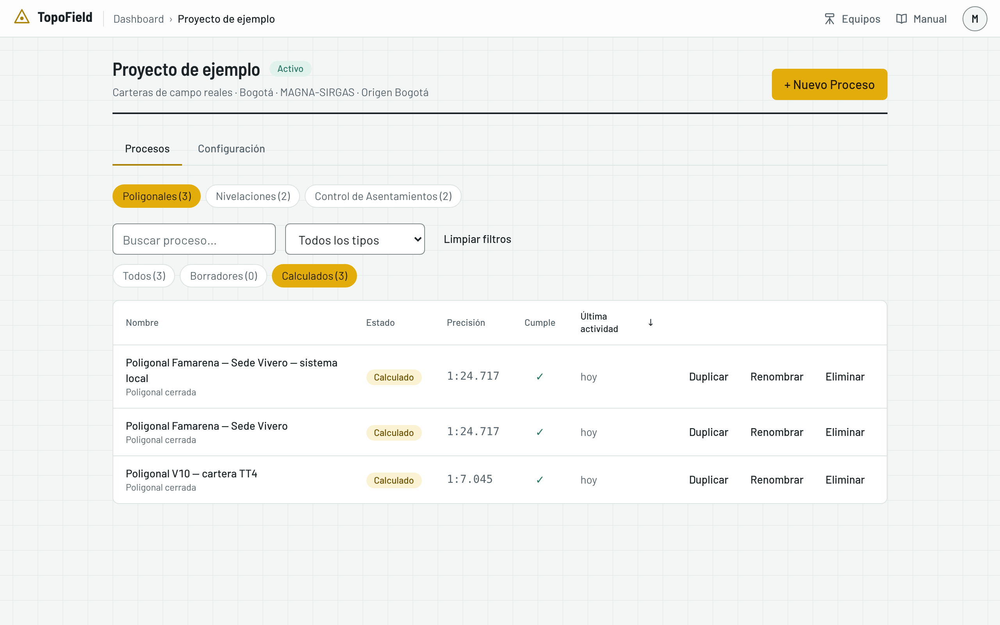
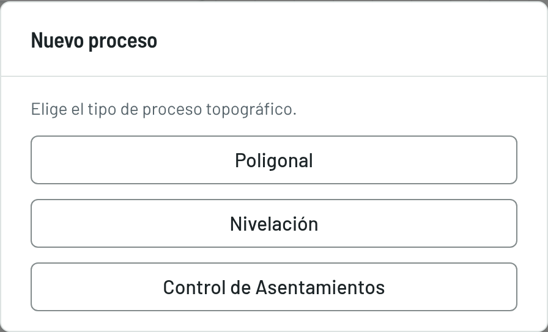

# Proyectos

Cómo crear un proyecto, guardar sus puntos de referencia y encontrar sus
procesos. Todo trabajo en TopoField vive dentro de un proyecto.

## Crear un proyecto

1. En el dashboard, pulse **+ Nuevo Proyecto**.
2. Llene los datos del proyecto:
   - **Nombre del proyecto**, **Cliente** y **Ubicación**, obligatorios.
   - **Descripción**, si quiere.
   - **Latitud** y **Longitud**, si quiere, en grados decimales.
   - **Datum**, obligatorio (viene MAGNA-SIRGAS), y **Proyección**.

   

3. Pulse **Crear proyecto**. Se abre el proyecto, todavía sin procesos.

   

> El equipo y el orden de precisión no se piden aquí. Cada poligonal,
> nivelación o visita lleva su propio equipo, y su orden se detecta al
> calcularla. Así, un mismo proyecto puede tener trabajos medidos con
> instrumentos distintos.

## El proyecto por dentro

Arriba van el nombre y el estado del proyecto, su cliente, su ubicación, su
sistema de referencia y el botón **+ Nuevo Proceso**. Debajo hay dos pestañas:

- **Procesos**: los levantamientos del proyecto.
- **Configuración**: los datos del proyecto, sus puntos de referencia, y
  archivarlo o eliminarlo.

## Los puntos de referencia

Son puntos de coordenadas conocidas, como vértices geodésicos o mojones. Se
guardan una vez en el proyecto y después se eligen como punto de partida o de
llegada de una poligonal, sin volver a teclearlos.

1. Abra la pestaña **Configuración** y, en **Puntos de referencia**, pulse
   **Agregar punto**.
2. Escriba el **Código**, elija el **Tipo** (BM, Control, GPS o Detalle) y
   escriba el **Norte**, el **Este** y, si la tiene, la **Cota**. Pulse
   **Guardar**.

   

3. El punto aparece en la tabla, con **Editar** y **Eliminar**.

Las visitas de asentamientos no usan estos puntos: cada lugar tiene sus
propios BM (vea [Control de asentamientos](05-asentamientos.md#los-bm-del-lugar)).

## Encontrar un proceso

La pestaña **Procesos** muestra los levantamientos del proyecto. Arriba,
**Poligonales**, **Nivelaciones** y **Control de Asentamientos** eligen el
módulo y dicen cuántos hay de cada uno.

Para encontrar lo que busca:

- **Buscar proceso…** filtra por nombre mientras escribe. No distingue
  mayúsculas ni tildes: «via» encuentra «Vía terciaria».
- **Todos los tipos** acota a un tipo de poligonal, de nivelación o de
  estructura.
- **Todos**, **Borradores** y **Calculados** muestran solo los procesos en ese
  estado, con cuántos hay en cada grupo. Un lugar de asentamientos no tiene
  estado, así que en ese módulo no aparecen.

Cuando hay un filtro activo aparece **Limpiar filtros**. Cada listado recuerda
el último filtro que usó en ese proyecto.

Las columnas de la tabla:

| Columna | Qué muestra |
|---|---|
| Nombre | El nombre y el tipo. En asentamientos, el tipo de estructura y cuántas visitas tiene |
| Estado | Borrador, En progreso o Calculado. No aparece en asentamientos |
| Resultado | La precisión de una poligonal, el cierre de una nivelación (o su discrepancia, si es abierta con vuelta) o la alerta de un lugar |
| Cumple | ✓ si alcanza algún orden de precisión, ✕ si no, y — si no aplica |
| Última actividad | Cuándo se modificó por última vez |

La columna **Cumple** le evita abrir cada proceso para saber si sirve. Pulse
**Nombre**, la columna de resultado o **Última actividad** para ordenar por
ella; pulse otra vez para invertir el orden.

En el teléfono, la tabla se convierte en tarjetas, una por proceso.

## Duplicar, renombrar o eliminar

Cada fila tiene tres acciones:

- **Duplicar** crea uno nuevo con la misma configuración, pero sin
  mediciones: una poligonal sin estaciones, una nivelación sin lecturas, un
  lugar con sus puntos y sus BM pero sin visitas.
- **Renombrar** cambia el nombre sin abrirlo.
- **Eliminar** lo borra con todo lo que contiene. Antes pide confirmación.

## Crear un proceso

Pulse **+ Nuevo Proceso** y elija qué va a medir. Cada tipo tiene su capítulo:

- **Poligonal**: vea [La poligonal](03-poligonal.md).
- **Nivelación**: vea [La nivelación](04-nivelacion.md).
- **Control de Asentamientos**: vea [Control de asentamientos](05-asentamientos.md).

La pantalla de cada proceso tiene la misma forma. Arriba, la cabecera con su
tipo, su estado y **Editar datos**; en **⋯**, **Duplicar** y **Eliminar**.
Debajo van sus pasos o pestañas. No hay botón **Guardar**: cada ventana guarda
al confirmar.

## Archivar o eliminar un proyecto

Al final de la pestaña **Configuración**, en **Zona de peligro**:

- **Archivar** oculta el proyecto de la lista de activos. Lo encuentra en
  **Archivados**, en el dashboard, y puede restaurarlo cuando quiera.
- **Eliminar** borra el proyecto con todos sus procesos, lugares y puntos de
  referencia, para siempre. Antes pide confirmación.
