# La poligonal

Cómo levantar una poligonal en TopoField: crearla, amarrarla, agregar las
mediciones como en la cartera, ajustarla y sacar su informe. Los ejemplos son
dos carteras reales de la Sede Vivero de la Universidad Distrital.

## Los tres tipos

| Tipo | Qué es | Cómo se comprueba |
|---|---|---|
| **Cerrada** | Parte de un punto y vuelve a él | Con la suma de los ángulos y el error de cierre lineal |
| **Abierta con control** | Parte de un punto conocido y llega a otro conocido | Con las coordenadas del punto de llegada |
| **Abierta sin control** | Parte de un punto conocido y no llega a otro | No se puede comprobar |

La abierta sin control sirve para reconocimiento: da coordenadas, pero no hay
cómo saber si son correctas. La aplicación lo dice en vez de mostrar una
precisión que no existe.

## Crear la poligonal

1. En el proyecto, pulse **+ Nuevo Proceso** y elija **Poligonal**.
2. Llene la ventana **Nueva poligonal**:
   - **Título**: el nombre con que la encontrará en el proyecto. Es el único
     campo obligatorio.
   - **Ubicación**, **Responsable** y **Cargo del responsable**: dónde se
     midió y quién responde por el trabajo. Salen en la cabecera y en la
     portada del informe.
   - **Tipo de poligonal**: elíjalo según cómo termina el recorrido. Si vuelve
     al punto de partida, **Cerrada**; si termina en otro punto de coordenadas
     conocidas, **Abierta con control**; si termina en un punto nuevo,
     **Abierta sin control**. El tipo decide qué se puede comprobar (vea la
     tabla de arriba), y debajo una línea se lo recuerda.
   - **Equipo**, plegado y opcional: la marca, el modelo y el número de serie
     de la estación total. Sale en el informe, para que conste con qué
     instrumento se midió.

   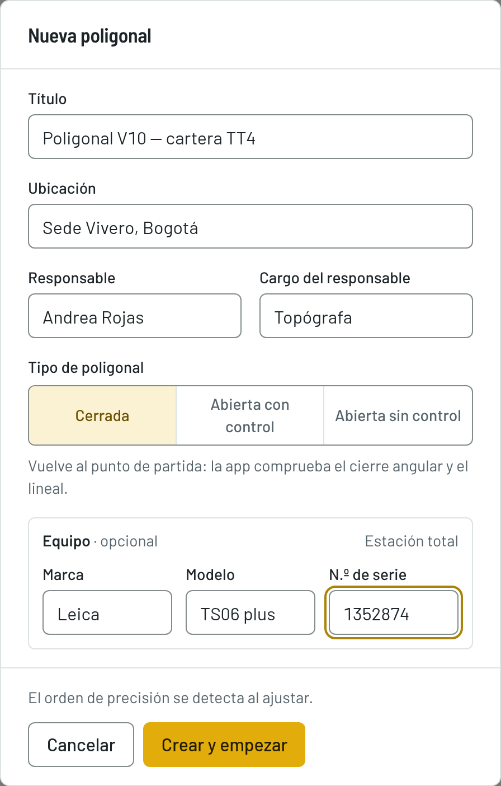

3. Pulse **Crear y empezar**. Se abre la pantalla de la poligonal, en el paso
   **Datos**, todavía vacía.

   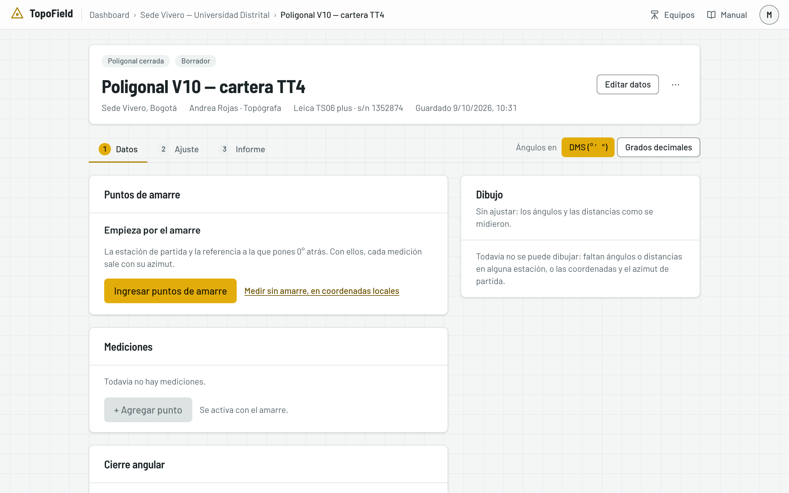

No se le pide el orden de precisión ni el tipo de ángulo: la aplicación los
detecta al calcular. Todo lo de esta ventana se cambia después con **Editar
datos**, en la cabecera.

## La pantalla por pasos

La pantalla de la poligonal tiene tres pasos: **1 · Datos**, **2 · Ajuste** y
**3 · Informe**. Arriba va la cabecera, con el tipo, el estado y el orden
alcanzado. No hay botón **Guardar**: cada ventana guarda al confirmar.

A la derecha de los pasos, **Ángulos en** cambia el formato: **DMS (° ′ ″)** o
**Grados decimales**. Es solo otra forma de ver los mismos ángulos: la
aplicación los guarda siempre en grados, minutos y segundos, a la décima de
segundo.

## El amarre

El amarre son los puntos conocidos de donde arranca la poligonal: la estación
donde armó primero y la dirección hacia la que orientó el instrumento. Con
ellos, la aplicación sabe en qué coordenadas y con qué azimut empieza el
recorrido.

1. Pulse **Ingresar puntos de amarre**.
2. En **Estación de partida**, elija el punto en **Tomar del catálogo**, que
   ofrece los puntos de referencia del proyecto, o escriba su nombre, su
   norte y su este si no lo guardó antes.
3. En **Referencia · 0° atrás**, diga cómo orientó el instrumento. Elija la
   opción que corresponda a lo que tiene en la cartera:
   - **Punto con coordenadas**: visó en 0° a otro punto conocido. Elíjalo o
     escriba sus coordenadas, y la aplicación calcula el azimut de partida y
     lo muestra debajo. Es el caso más común.
   - **Solo el azimut**: conoce la dirección hacia la referencia, pero no sus
     coordenadas. Escriba su nombre y el azimut de la estación de partida
     hacia ella.
   - **Sin 0 atrás**: no orientó contra una visual atrás. Escriba el azimut del
     primer lado, por ejemplo de un levantamiento anterior; la primera
     medición entonces no lleva ángulo.
4. En una abierta con control aparece también la **Llegada**: el punto conocido
   donde termina el recorrido. Su **Azimut de llegada** es opcional; si lo
   escribe, la aplicación comprueba además el cierre angular.
5. Pulse **Guardar el amarre**.

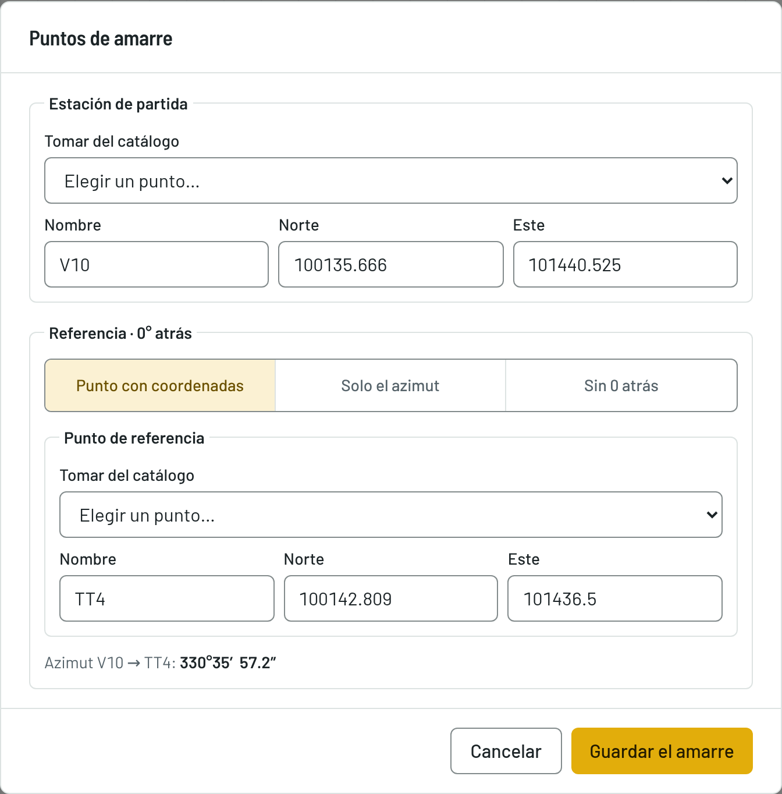

> Si corrige las coordenadas de un punto del amarre, la poligonal se
> recalcula con las mediciones que ya tiene, sin volver a medir. Antes de
> guardar, la ventana le avisa qué otros trabajos usan ese punto.

Si levanta en un sistema local, pulse **Medir sin amarre, en coordenadas
locales**: la poligonal arranca en P1 (1000, 1000) con azimut 0°. Cuando tenga
las coordenadas reales, edite el amarre o georreferencie (vea
[Georreferenciar](#georreferenciar)).

## Las mediciones

La tabla de mediciones se lee como la cartera: cada fila va **desde → hacia**,
por ejemplo «V10 → D1», con el ángulo medido en el punto de partida, la
distancia y el azimut sin ajustar.

1. Pulse **+ Agregar punto**. Arriba, la ventana le dice dónde está: «Estás en
   D1 · atrás en V10».
2. Escriba el **Punto siguiente**.
3. Escriba la **Lectura 1**: el ángulo horizontal medido en la estación donde
   está, desde el punto de atrás hasta el siguiente, en grados, minutos y
   segundos. Si lo midió varias veces, pulse **+ Lectura** por cada una: la
   ventana muestra el promedio, que es el que entra en el cálculo, y la
   dispersión entre lecturas, para que vea si alguna se aleja.
4. Escriba la **Distancia horizontal** hasta el punto siguiente, en metros.
   Es la distancia ya reducida al horizonte, como la anota la estación.
5. Pulse **Agregar y seguir en D2**: se guarda y la ventana queda lista para la
   medición siguiente. **Terminar** guarda y la cierra.

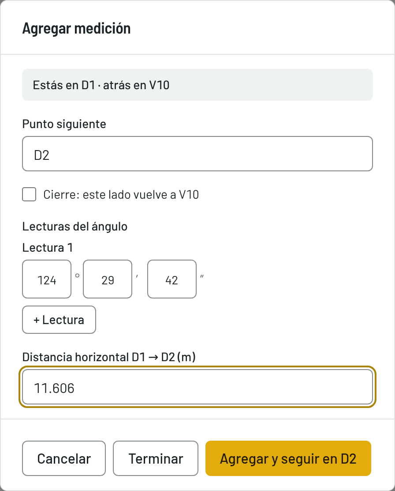

En una cerrada, desde la segunda medición aparece la casilla **Cierre: este
lado vuelve a V10**. Márquela en el último lado, el que regresa a la estación
de partida, y pulse **Agregar el cierre**.

En una abierta con control, desde la segunda estación la ventana pide la
**deflexión** en lugar del ángulo: cuánto se desvía el lado siguiente de la
prolongación del anterior. Escriba la lectura y elija su **Sentido**,
**Derecha** o **Izquierda**, como lo anotó en la cartera.

## Cerrar la poligonal

Después del cierre, la misma ventana le pide el **cierre angular**: el ángulo
en la estación de partida. Si la poligonal está amarrada, va hacia la
referencia, como en la cartera TT4. Si desmarca la casilla, va hacia el primer
lado. Escriba la lectura y pulse **Guardar el cierre angular**.

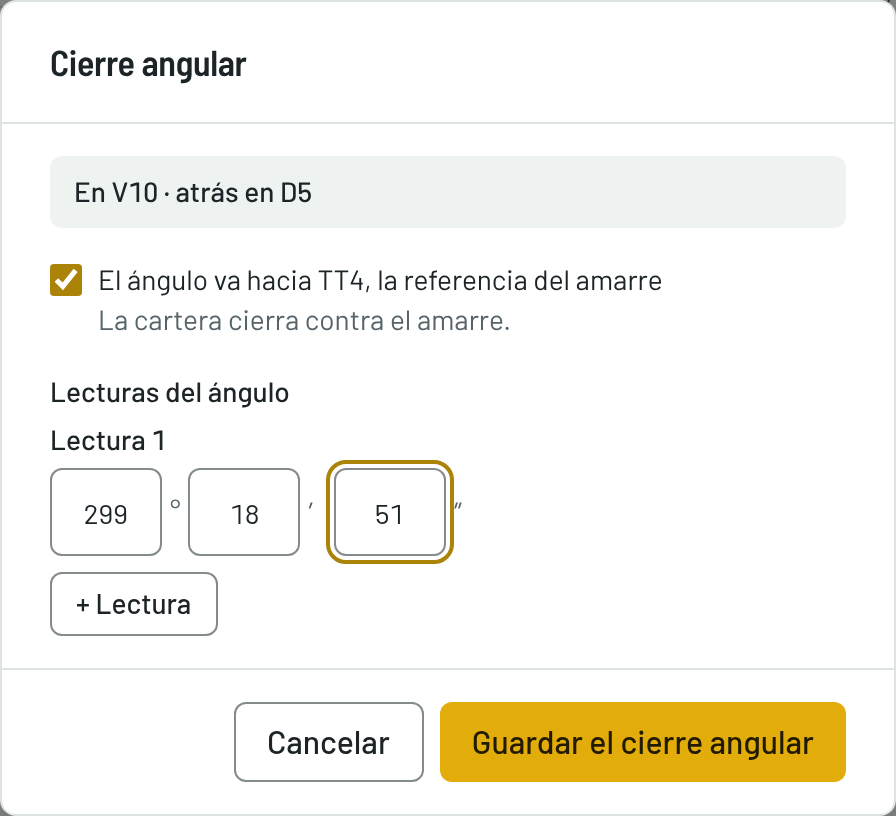

Con eso, el paso **Datos** muestra todo:

- **Los puntos de amarre.**
- **Las mediciones**: la primera fila es el **0 atrás**, el último lado lleva
  la marca **cierre** y la última fila, **cierre angular**.
- **El cierre angular**: la suma observada y la teórica, el error angular y la
  corrección que le toca a cada ángulo. El tipo de ángulo (interiores o
  exteriores) lleva la marca **detectado**.
- **El dibujo**, a la derecha, con lo medido sin ajustar.

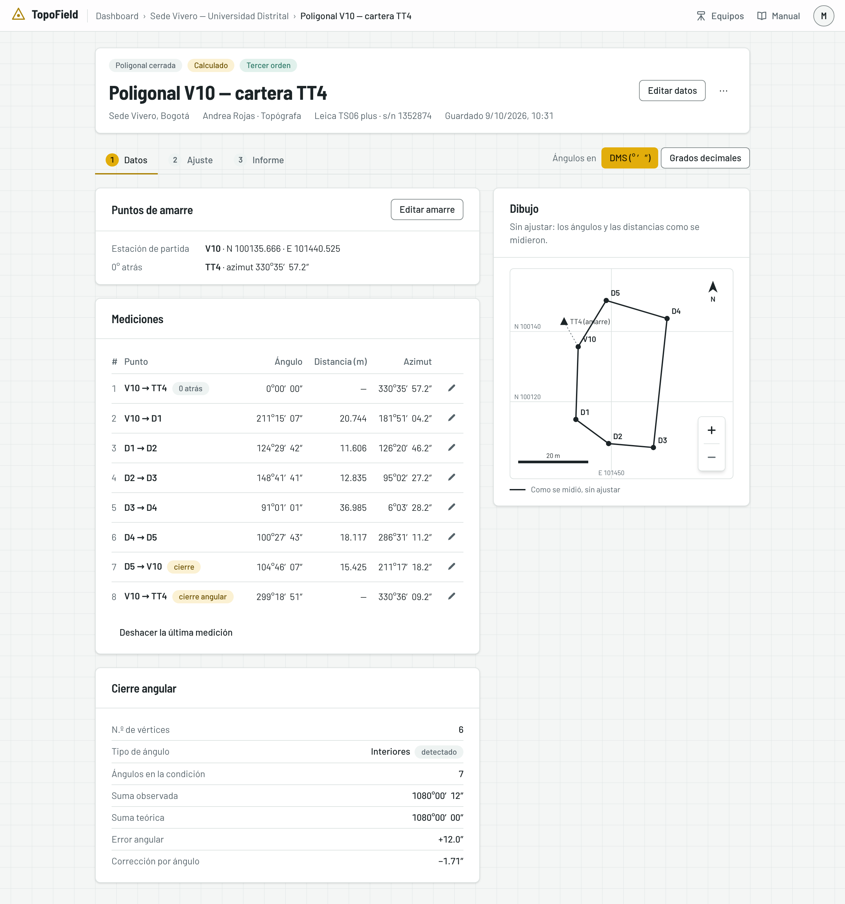

## Corregir una medición

- **El lápiz de cada fila** abre la misma ventana para cambiar el ángulo, la
  distancia o el nombre del punto, o para **Eliminar medición**. Si elimina
  una intermedia, el punto siguiente pasa a medirse desde el anterior, y la
  ventana se lo avisa.
- **Deshacer la última medición** quita la última fila: primero el cierre
  angular, después el cierre y luego cada lado.

Si algo está mal escrito, la ventana lo dice y no pierde lo tecleado. Por
ejemplo, un ángulo sin lecturas, minutos o segundos mayores de 59, una
distancia de cero o mayor de 1000 m, o un punto sin nombre.

## Ajustar

Abra el paso **2 · Ajuste**. Ajustar es repartir el error de cierre entre las
mediciones para que la poligonal cierre exactamente. Arriba elija el **Método
de ajuste**, que decide cómo se reparte. Cambiarlo recalcula y guarda al
momento, así que puede compararlos.

| Método | Cómo reparte el error |
|---|---|
| **Brújula (Bowditch)** | En proporción a la longitud de cada lado. El más usado |
| **Tránsito** | En proporción a las proyecciones. Útil si las distancias son menos fiables que los ángulos |
| **Crandall** | Corrige solo las distancias, por mínimos cuadrados, y conserva los ángulos ya corregidos |
| **Mínimos cuadrados** | Ajusta ángulos y distancias a la vez, según la precisión de cada uno. Solo en cerrada y abierta con control |

Debajo van cuatro cifras:

- **Error angular**: cuánto difiere la suma de los ángulos medidos de la que
  debería dar.
- **Error de cierre lineal**: la distancia entre donde terminó la poligonal y
  donde debía terminar, en metros.
- **Precisión relativa**: ese error frente al perímetro, como 1:7.045 (un
  metro de error por cada 7.045 m recorridos). Cuanto mayor el segundo número,
  mejor.
- **Orden alcanzado**: la clase de precisión que cumple el trabajo.

Pulse **Por qué** para ver cada orden con su tolerancia y si la poligonal la
cumple.

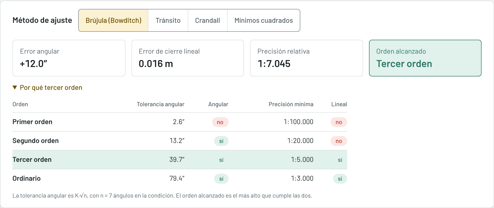

| Orden | Tolerancia angular | Precisión relativa mínima | Uso típico |
|---|---|---|---|
| Primer orden | 1″·√n | 1:100.000 | Geodésico de alta precisión |
| Segundo orden | 5″·√n | 1:20.000 | Control urbano y catastral |
| Tercer orden | 15″·√n | 1:5.000 | Levantamiento topográfico común |
| Ordinario | 30″·√n | 1:3.000 | Levantamiento rural o reconocimiento |

*n* es el número de ángulos de la condición. El orden alcanzado es el más alto
que cumple **las dos**: la tolerancia angular y la precisión mínima. En la
cartera TT4, el error de 12″ cabe en segundo orden (13.2″), pero 1:7.045 solo
alcanza el tercero. Si no alcanza ni el ordinario, la aplicación dice **No
alcanza ningún orden** y el informe lo advierte.

> El orden no depende del método: se juzga con el error de la cartera tal como
> se midió, antes de corregir.

Más abajo están:

- **La poligonal ajustada**: cada lado con el ángulo corregido, el azimut, la
  distancia, las proyecciones, las proyecciones corregidas y las coordenadas.
  La fila **Σ** suma las proyecciones: en las crudas da el error de cierre, y
  en las corregidas, cero.
- **Corrección por método …**: cómo corrigió el método elegido, con las cifras
  de esta poligonal.
- **El dibujo**: la poligonal ajustada en trazo continuo y la sin compensar en
  trazo discontinuo, con su error **exagerado** para que se vea (×100 en la
  imagen; la leyenda dice el factor).

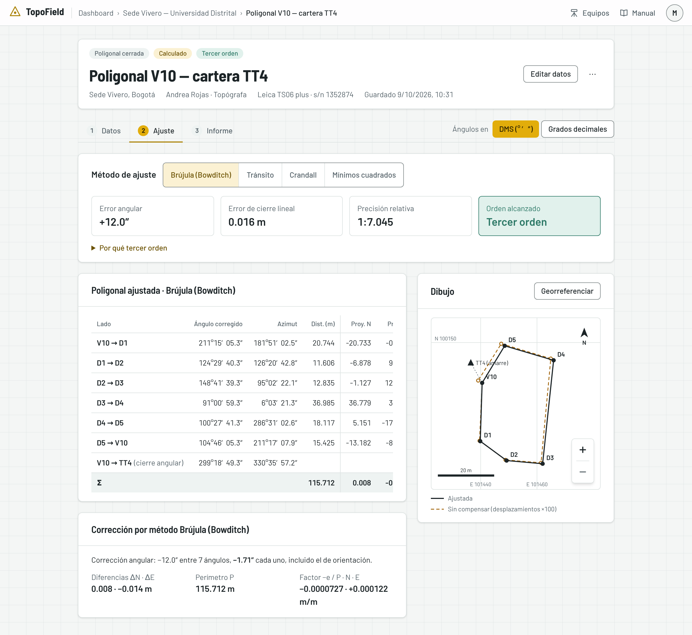

## Mover y acercar el dibujo

El dibujo se mueve como un mapa:

- **Arrástrelo** para desplazarlo.
- **Acérquese** con **Ctrl + rueda** (**⌘ + rueda** en Mac), con doble clic o,
  en el teléfono, pellizcando. La rueda sola sigue bajando la página.
- **Los botones + y −**, abajo a la derecha, acercan y alejan. Cuando la vista
  se movió, aparece el de **encuadrar**, que vuelve a mostrar toda la
  poligonal.
- **Con el teclado**, sobre el dibujo: las flechas lo desplazan, **+** y **−**
  acercan y alejan, y **0** encuadra.

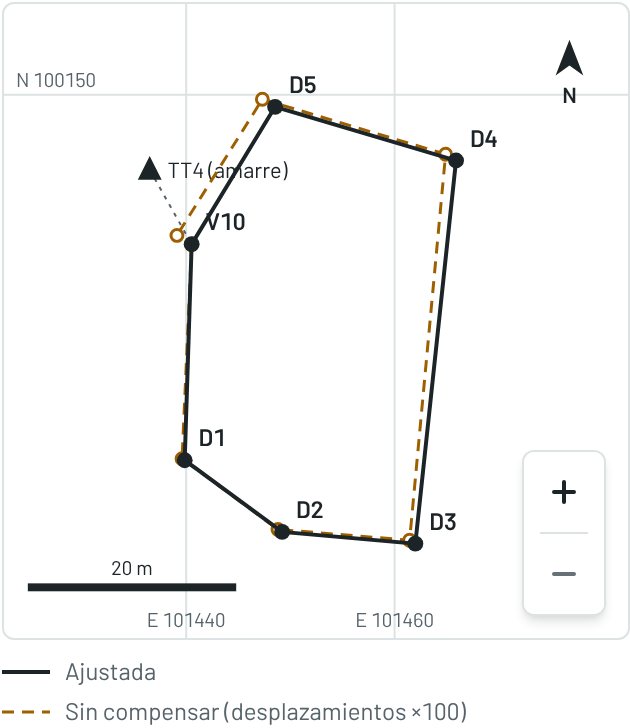

## Ajustar por mínimos cuadrados

Los otros métodos reparten el error con una regla fija. Mínimos cuadrados
busca las correcciones más pequeñas que hacen cerrar la poligonal, según la
precisión de cada medición. Por eso le pide tres datos:

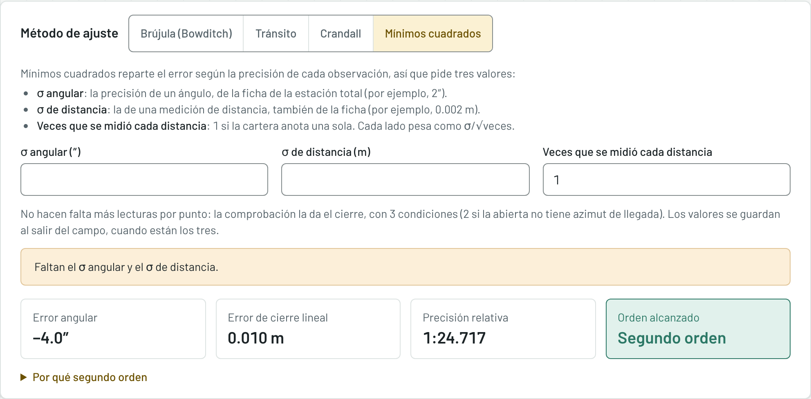

1. Elija **Mínimos cuadrados** en el método de ajuste.
2. Escriba la **σ angular (″)**, la precisión de un ángulo según la ficha de
   su estación total; por ejemplo, 2.
3. Escriba la **σ de distancia (m)**, la precisión de una distancia, también
   de la ficha; por ejemplo, 0.011.
4. Escriba las **Veces que se midió cada distancia**: 1 si la cartera anota una
   sola.

Se guardan al salir del campo, cuando están los tres. No hacen falta más
lecturas por punto: la comprobación la da el cierre.

Con los tres datos aparecen la corrección de cada ángulo y de cada distancia,
y **σ₀**, que dice si los datos que dio describen bien sus mediciones:

- **Dentro del intervalo** (de 0.268 a 1.765 con 3 condiciones): los datos
  están bien.
- **Por encima**: midió peor de lo que dijo, o hay un error grueso en la
  cartera.
- **Por debajo**: midió mejor de lo que dijo.

σ₀ es información, no un veredicto: el orden alcanzado no cambia con el
método.

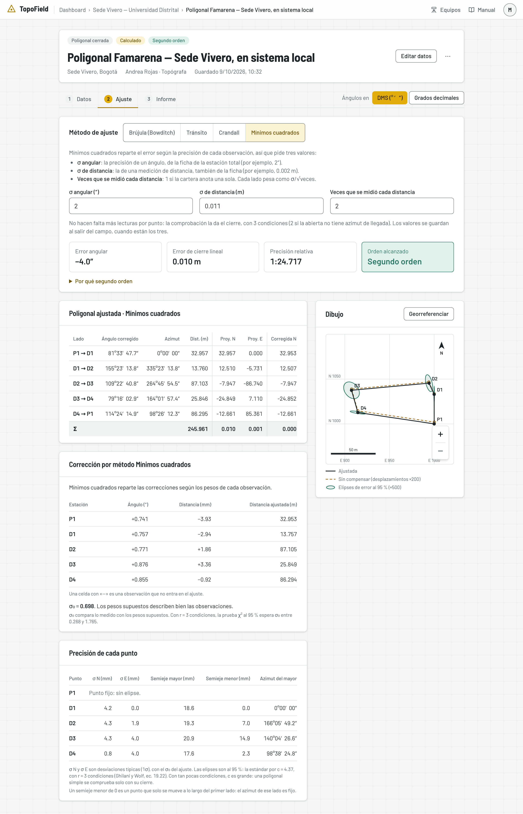

**La precisión de cada punto.** Con mínimos cuadrados, la tarjeta **Precisión
de cada punto** dice cuánto confiar en cada coordenada ajustada:

- **σ N** y **σ E**: la desviación típica del norte y del este, en milímetros.
- **La elipse de error al 95 %**: sus semiejes y el azimut del mayor. El punto
  está dentro de ella con un 95 % de probabilidad.

El punto de partida es fijo y no tiene elipse. El dibujo traza las elipses en
verde, exageradas.

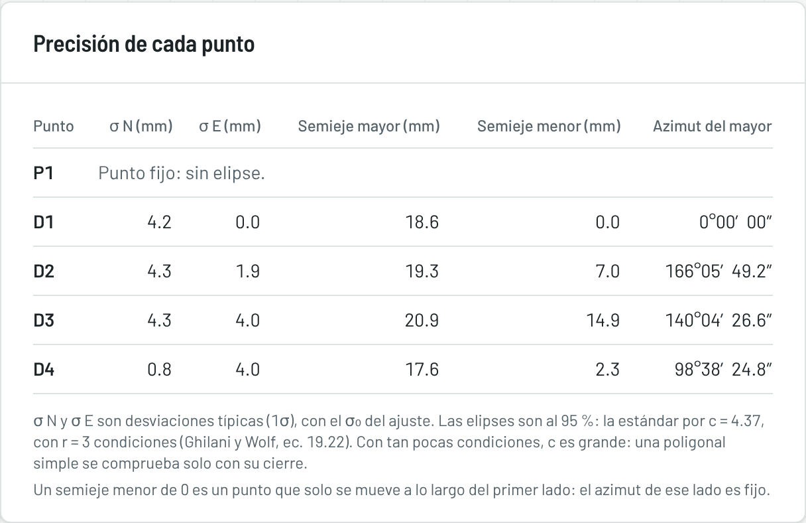

## Georreferenciar

Si midió en un sistema local, la poligonal se lleva al sistema real con **dos
de sus estaciones** de coordenadas conocidas. En el ejemplo, la Sede Vivero se
midió desde P1 (1000, 1000) y se georreferencia con los vértices D1 y D3.

1. En el paso **Ajuste**, junto al dibujo, pulse **Georreferenciar**.
2. En **Punto A**, elija la **Estación** de la poligonal y escriba su **Norte
   real** y su **Este real**, o tómelos de los puntos de referencia del
   proyecto.
3. Haga lo mismo en **Punto B**. Use las dos estaciones **más alejadas** entre
   sí: cuanto más separadas, mejor queda definida la rotación.
4. Revise la vista previa antes de confirmar:
   - **Rotación** y **traslación**: cuánto se gira y se desplaza la
     poligonal para llevarla al sistema real.
   - **Factor de escala**: la relación entre la distancia de los dos puntos
     en la poligonal y en el sistema real. Debe dar muy cerca de 1; si se
     aleja, una de las coordenadas que escribió probablemente está mal.
   - **Residuos**: cuánto difieren los puntos A y B, ya transformados, de las
     coordenadas reales que dio. Deben ser de milímetros.
   - Las coordenadas actuales de cada estación junto a las reales.
5. Pulse **Georreferenciar**.

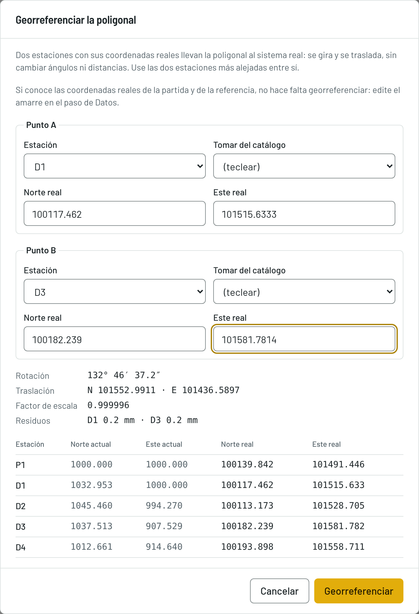

La poligonal se gira y se traslada, sin cambiar de escala: los ángulos y las
distancias medidos no cambian, ni el orden alcanzado. El dibujo anota la
georreferenciación con su fecha, sus puntos y su rotación.

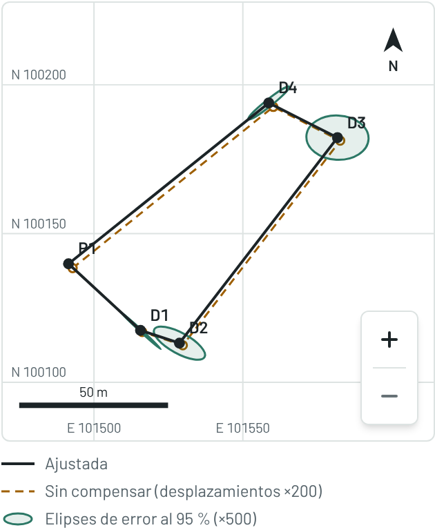

La ventana avisa, sin impedirlo, si el factor de escala se aparta de 1 más de
lo que admite el orden alcanzado: revise las coordenadas que escribió. Si lo
que tiene son las coordenadas reales de la partida y de la referencia, no hace
falta georreferenciar: edite el amarre.

## El informe

El paso **3 · Informe** muestra el informe de la poligonal, listo para
entregar:

1. **El resultado**: las cuatro cifras y por qué alcanza su orden.
2. **Los datos de campo**: el amarre, las mediciones y el cierre angular.
3. **La corrección por método**, con sus fórmulas y las cifras de esta
   poligonal.
4. **La poligonal ajustada**, con su fila Σ.
5. **Las coordenadas y el dibujo.**

Arriba están **Exportar PDF** y **Exportar Excel**. Vea
[El informe y el Excel](06-informe-y-excel.md).

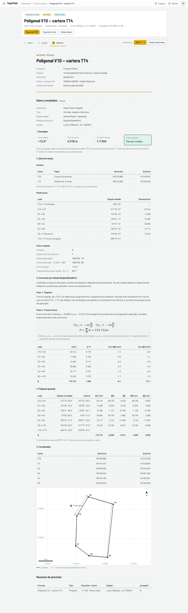
