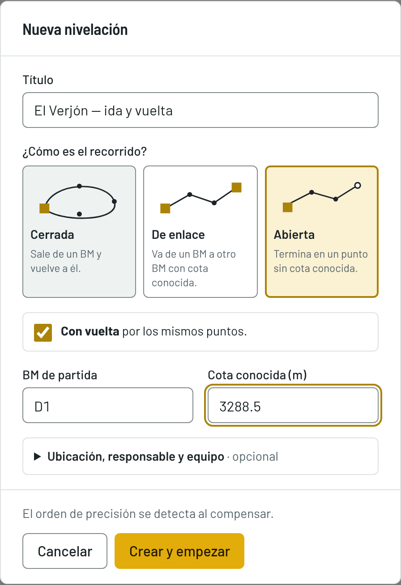
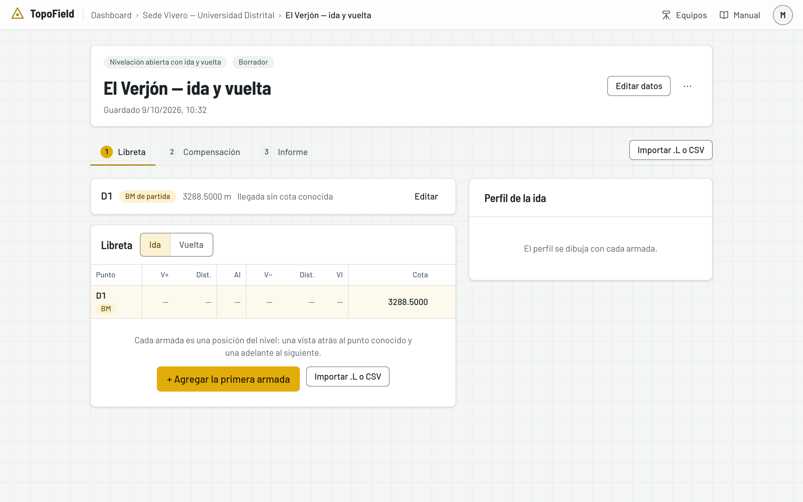
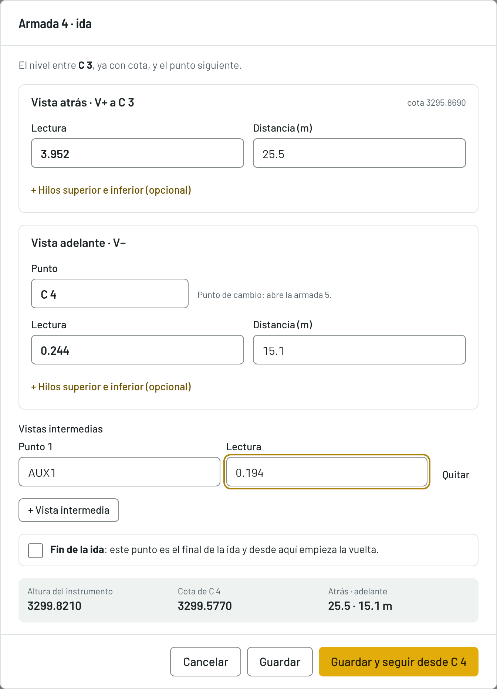
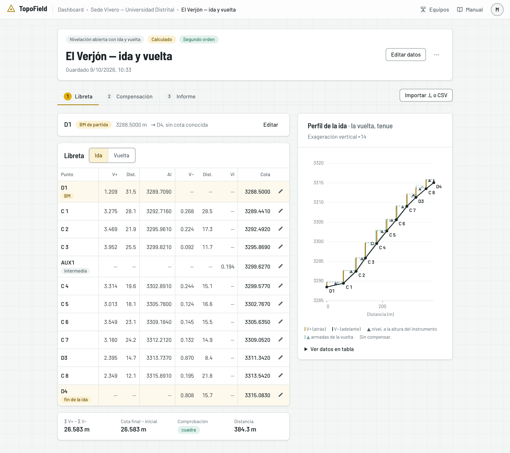
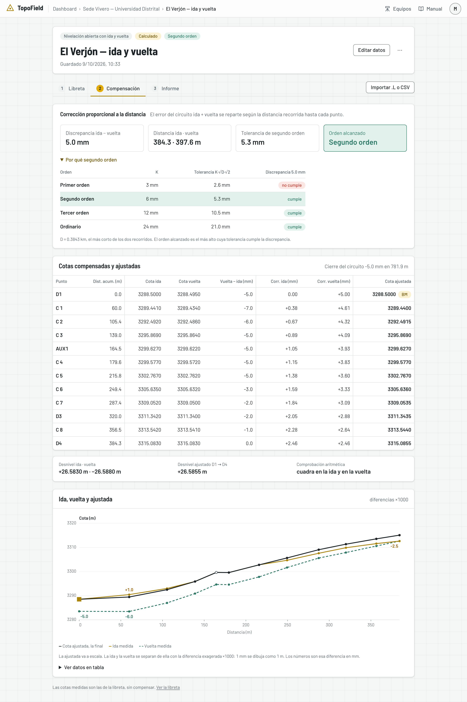
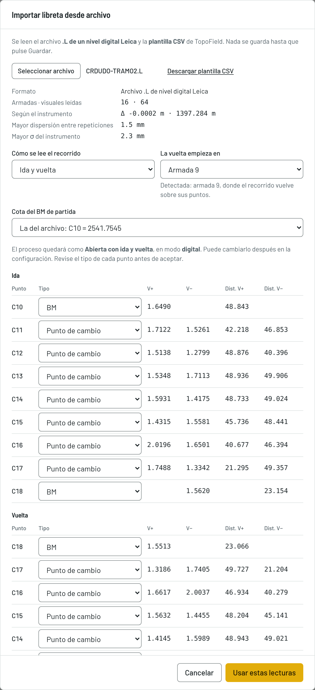
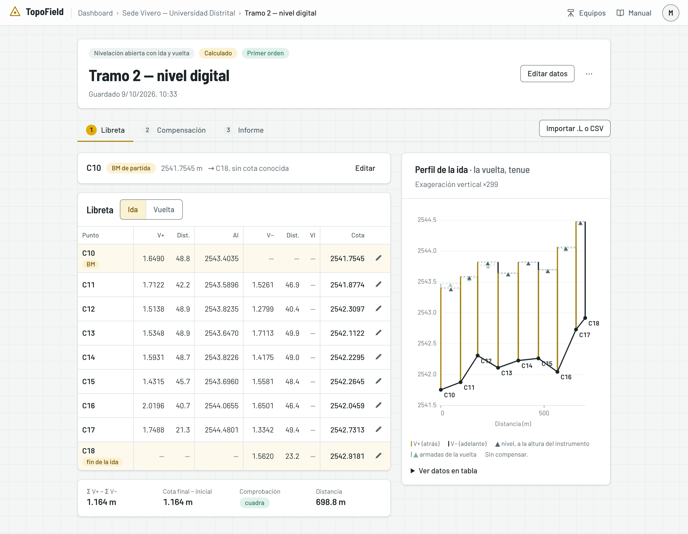
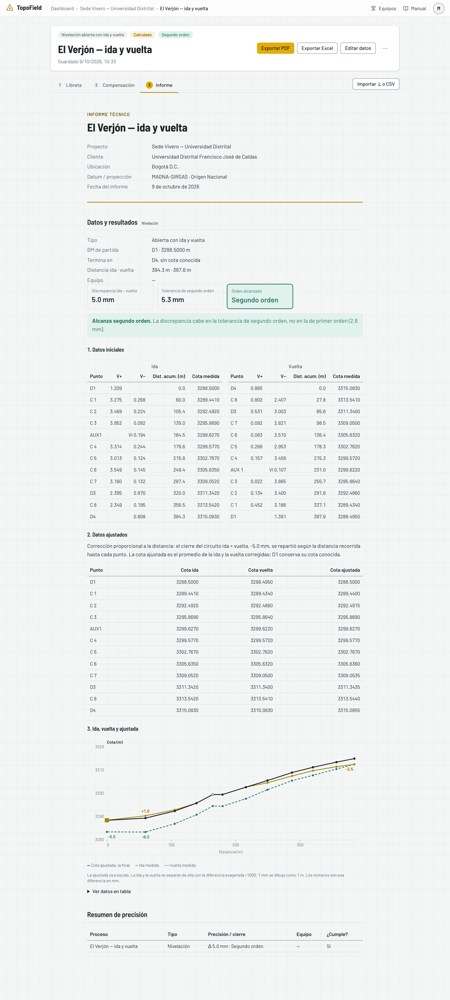

# La nivelación

Cómo llevar una nivelación geométrica en TopoField: crearla, llenar la libreta
armada por armada, medir la vuelta, compensar y sacar su informe. También cómo
importar la libreta de un nivel digital. El ejemplo es la nivelación real de
El Verjón, con ida y vuelta por los mismos puntos.

## Los tres tipos

| Tipo | Qué es | Cómo se comprueba |
|---|---|---|
| **Cerrada** | Sale de un BM y vuelve al mismo BM | Con el error de cierre contra la cota de partida |
| **De enlace** | Va de un BM conocido a otro BM conocido | Con el error de cierre contra la cota de llegada |
| **Abierta** | Termina en un punto sin cota conocida | Sin vuelta, no se puede comprobar. Con vuelta, con la diferencia entre la ida y la vuelta |

Una abierta sin vuelta sirve solo para reconocimiento: da cotas, pero no hay
cómo saber si son correctas. La aplicación la llama **Abierta sin control**.

## Cómo se lee la libreta

La libreta tiene una fila por punto, y cada fila puede llevar dos lecturas:

- **Vista más (V+)**: la primera lectura después de armar el nivel. Se suma a
  la cota del punto y da la **altura del instrumento**: AI = cota + V+.
- **Vista menos (V−)**: la lectura al punto siguiente. Se resta de la altura
  del instrumento y da su cota: cota = AI − V−.

Una **armada** es cada vez que arma el nivel: la V+ a un punto que ya tiene
cota, la V− al siguiente y, si las hay, las vistas intermedias. En TopoField
se captura así, armada por armada.

Cada fila es de un tipo de punto:

| Tipo | Qué hace | Lecturas |
|---|---|---|
| **BM** | Banco de nivel, de cota conocida. Ancla el recorrido | El primero solo lleva V+; el último, si es BM, solo V− |
| **Punto de cambio** | Pasa la cota de una armada a la siguiente | V− y V+ |
| **Intermedio (radiación)** | Se lee solo para conocer su cota | Solo una lectura |

El punto intermedio no pasa su cota a nadie: un error en su lectura no afecta
al resto del recorrido.

## Crear la nivelación

1. En el proyecto, pulse **+ Nuevo Proceso** y elija **Nivelación**.
2. Llene la ventana **Nueva nivelación**:
   - **Título**, obligatorio.
   - **¿Cómo es el recorrido?**: **Cerrada**, **De enlace** o **Abierta**,
     cada una con su dibujo.
   - **Con vuelta**, si va a volver por los mismos puntos.
   - **BM de partida** y su **Cota conocida (m)**. En la de enlace, también el
     **BM de llegada** y su cota.
   - Plegados y opcionales: la ubicación, el responsable y el equipo.

   

3. Pulse **Crear y empezar**. Se abre la libreta, todavía vacía, solo con el BM
   de partida.

   

El orden de precisión no se pide: se detecta al compensar.

## La libreta armada por armada

1. Pulse **+ Agregar la primera armada**. Arriba, la ventana dice dónde está
   el nivel: «El nivel entre D1, ya con cota, y el punto siguiente».
2. En **Vista atrás · V+**, escriba la **Lectura** y la **Distancia (m)** a la
   mira.
3. En **Vista adelante · V−**, escriba el **Punto**, su **Lectura** y su
   **Distancia (m)**.
4. Si leyó una radiación desde esta armada, pulse **+ Vista intermedia** y
   escriba su punto y su lectura.
5. Abajo, la ventana calcula en vivo la **altura del instrumento** y la
   **cota** del punto de adelante.
6. Pulse **Guardar y seguir desde …**: se guarda y se abre la armada
   siguiente. **Guardar** guarda y cierra.

> **Las distancias.** La distancia a cada mira es obligatoria en los BM y en
> los puntos de cambio: sin ella, la compensación queda mal repartida. Si
> anota los hilos, pulse **+ Hilos superior e inferior (opcional)**: la
> distancia sale de ellos y la aplicación comprueba que la lectura sea su
> promedio. La distancia acumulada no se escribe: la aplicación la suma.

En la última armada aparece la casilla de fin:

- **Llega al BM**, en la cerrada.
- **Llega a** el BM de llegada, en la de enlace.
- **Fin de la ida**, en la abierta.

Si hay vuelta, márquela y pulse **Guardar y seguir con la vuelta**: se abre la
primera armada de la vuelta. Al final de la vuelta, la casilla es **Llega a**
el BM de partida.

> **La libreta a medias se guarda.** Cada armada se guarda al confirmar,
> aunque el recorrido no haya terminado. Mientras tanto, la nivelación está
> **En progreso**, y se compensa cuando el recorrido llega a su fin.

## La libreta completa

El paso **Libreta** muestra:

- **La tabla**, como la cartera: punto, V+ y su distancia, AI, V− y su
  distancia, la vista intermedia y la cota sin compensar. Con vuelta, **Ida** y
  **Vuelta** cambian de recorrido.
- **La comprobación aritmética**: ΣV+ − ΣV− frente a la cota final menos la
  inicial. Dice **cuadra** si coinciden. Comprueba las sumas de la libreta, no
  la calidad de la medición.
- **El perfil**, a la derecha: la cota de cada punto y, por cada armada, la
  mira atrás, la visual del nivel y la mira adelante.

Para corregir, el **lápiz** de cada fila abre la armada que esa fila cierra.
**Quitar la armada** borra la última.

## Compensar

Abra el paso **2 · Compensación**. El método es la **corrección proporcional a
la distancia**: el error se reparte según la distancia recorrida hasta cada
punto.

Arriba van cuatro cifras: el **error de cierre** (en una abierta con vuelta, la
**discrepancia** entre ida y vuelta), la **distancia**, la **tolerancia** y el
**orden alcanzado**, el más alto cuya tolerancia K·√D cumple el trabajo. D es
la distancia en kilómetros, en un solo sentido.

| Orden | K (mm) |
|---|---|
| Primer orden | 3 |
| Segundo orden | 6 |
| Tercer orden | 12 |
| Ordinario | 24 |

**Por qué** muestra cada orden con su tolerancia y si el trabajo la cumple. En
El Verjón, la discrepancia de 5.0 mm cabe en segundo orden (5.3 mm) y no en
primero (2.6 mm).

- **Se compensa siempre** que haya contra qué cerrar. Si el trabajo no alcanza
  ni el ordinario, se compensa igual y un aviso lo dice: un trabajo así, en la
  práctica, se repite.
- **El BM de partida no se corrige**: su cota es conocida.
- **La cota ajustada** es una por punto. Si el punto se leyó dos veces (en la
  ida y en la vuelta), es el promedio de sus dos cotas compensadas.
- **El gráfico** muestra la cota ajustada y, separadas de ella con la
  diferencia exagerada ×1000, la ida y la vuelta medidas.

Una abierta sin vuelta no se compensa. Una libreta que no encadena (un punto
de cambio sin su V+ o su V−, o una comprobación aritmética que no cuadra)
tampoco: la aplicación le dice qué fila revisar.

## Ida y vuelta

La ida y la vuelta son dos mediciones independientes. La aplicación compara
sus desniveles totales y juzga la diferencia con la tolerancia K·√D·√2.

- **En una abierta**, la discrepancia decide el orden alcanzado. Ida y vuelta
  forman un circuito que sale del BM y vuelve a él, y su error se reparte por
  distancia.
- **En una cerrada o de enlace**, cada recorrido se juzga y se compensa con su
  propio cierre.

Si la vuelta pasa por los mismos puntos, la tabla compara la cota de cada
punto en los dos recorridos, en la columna **Vuelta − ida (mm)**:

- si la diferencia **crece** a lo largo del recorrido, hay un error
  sistemático;
- si **salta** en un punto, revise ese punto.

## Importar un archivo .L o CSV

Con un nivel digital, las lecturas ya están en un archivo. **Importar .L o
CSV**, a la derecha de los pasos, las pasa a la libreta sin teclearlas.

1. Pulse **Importar .L o CSV** y elija el archivo: el **.L de un nivel digital
   Leica** o la **plantilla CSV** de TopoField, que se descarga desde la misma
   ventana.
2. Revise la vista previa:
   - **Cómo se lee el recorrido**: un recorrido cerrado, o ida y vuelta. Con
     ida y vuelta, en qué armada empieza la vuelta; la aplicación propone la
     que detecta.
   - **La cota del BM de partida**, si la del archivo no coincide.
   - **El tipo de cada punto**: el nivel no distingue un BM de un punto de
     cambio, así que la aplicación lo deduce y usted lo corrige.
3. Pulse **Usar estas lecturas**. La libreta se reemplaza y se guarda.

El nivel mide dos veces cada visual: se guarda el promedio, y la ventana
muestra la mayor diferencia entre las dos como control.

## El informe

El paso **3 · Informe** muestra el informe de la nivelación:

1. **El resumen**: el tipo, los BM, la distancia, el equipo, el orden alcanzado
   y por qué.
2. **Los datos iniciales**: la libreta, con sus lecturas y la cota medida.
3. **Los datos ajustados**: el método y la cota ajustada de cada punto.
4. **El gráfico** de la compensación.

Arriba están **Exportar PDF** y **Exportar Excel**. Vea
[El informe y el Excel](06-informe-y-excel.md).

