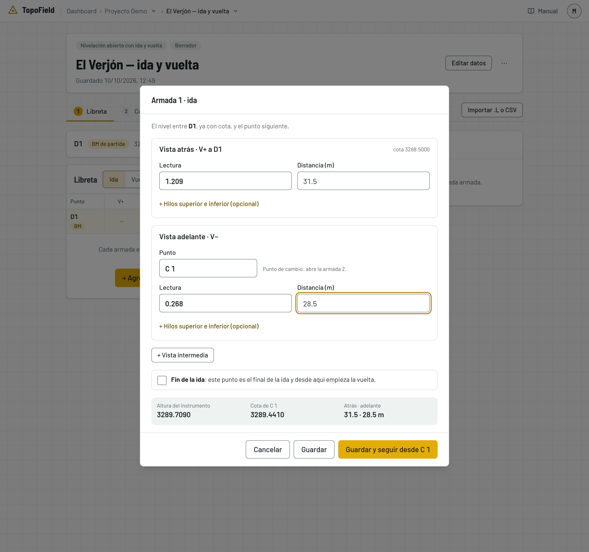
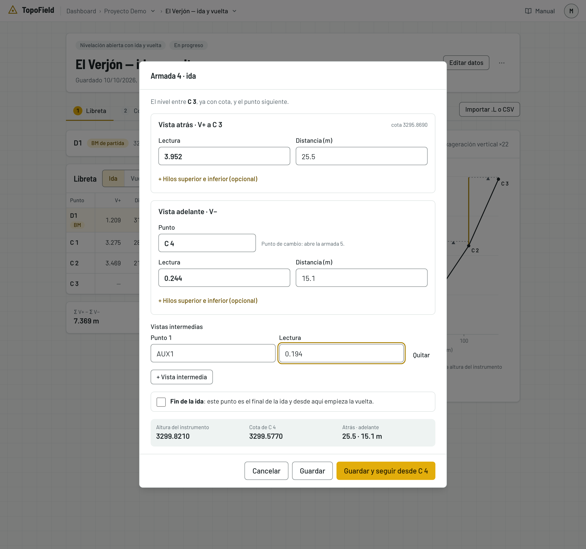
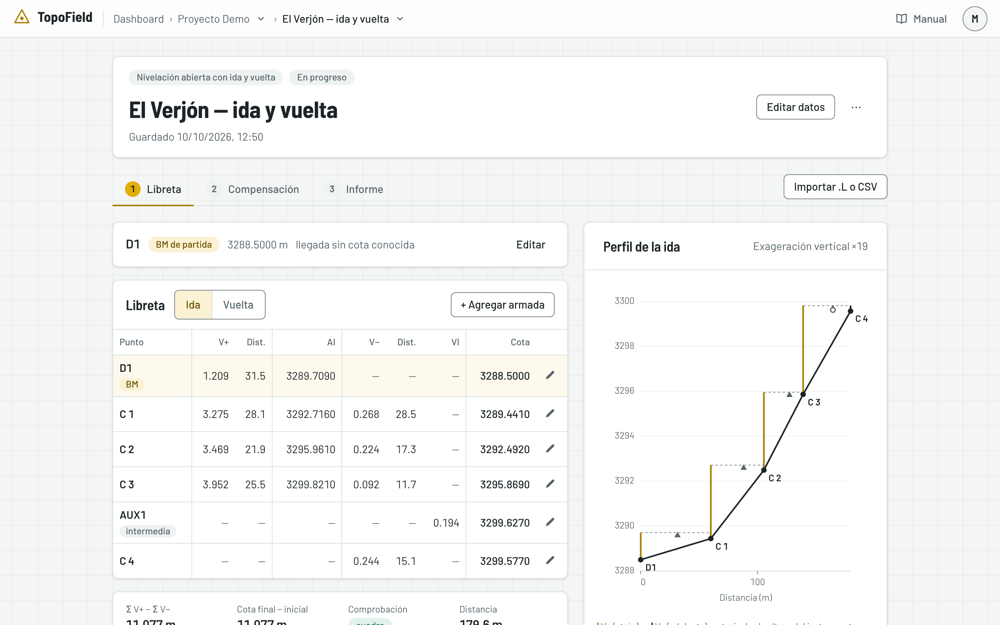
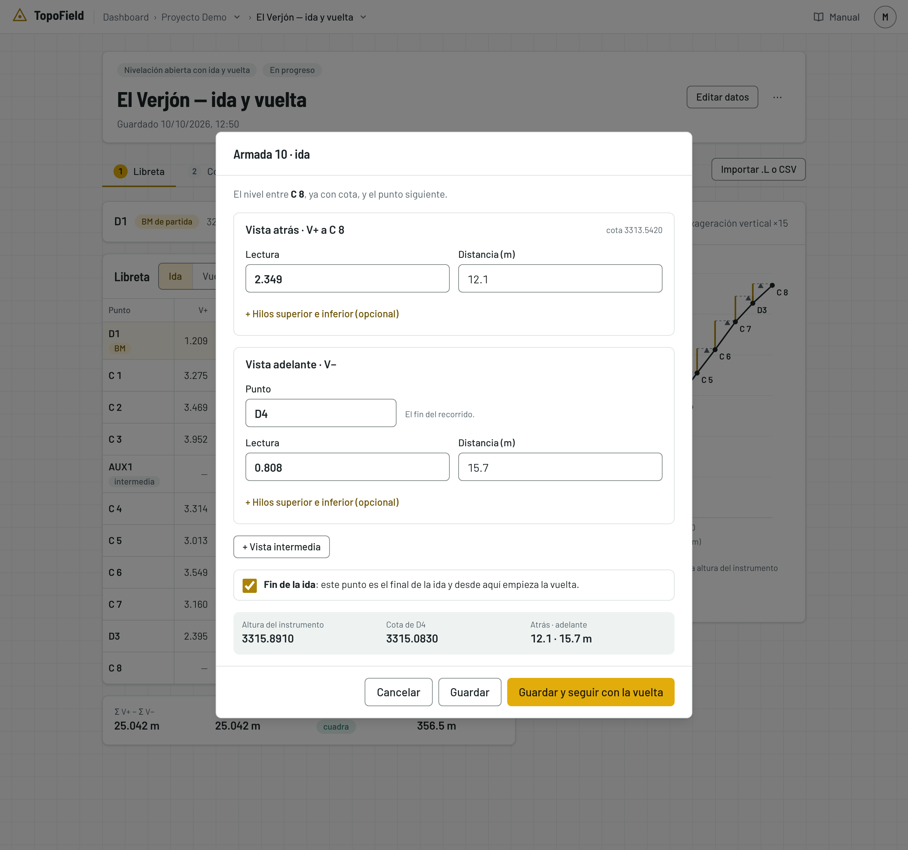
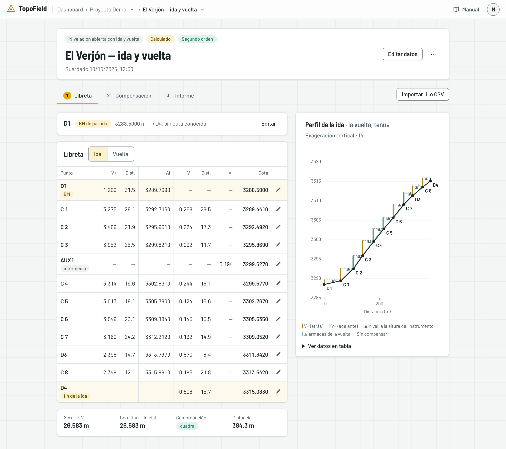
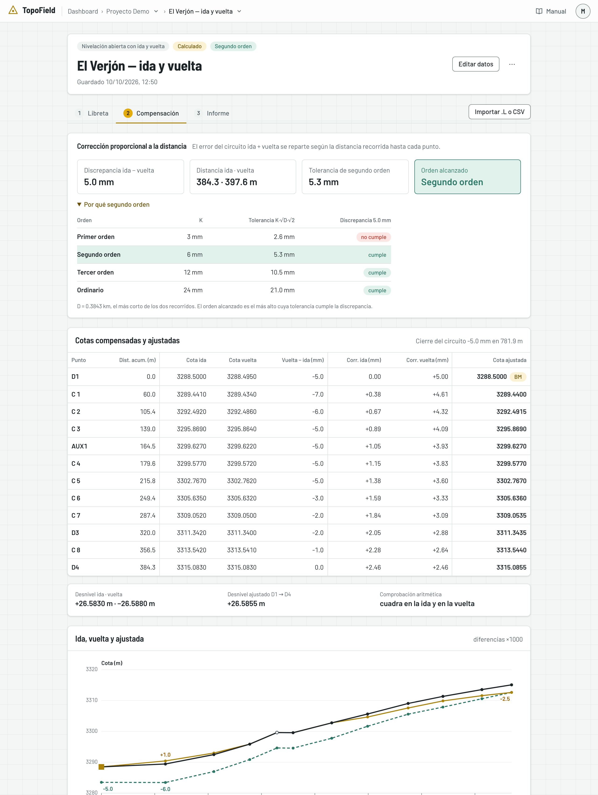
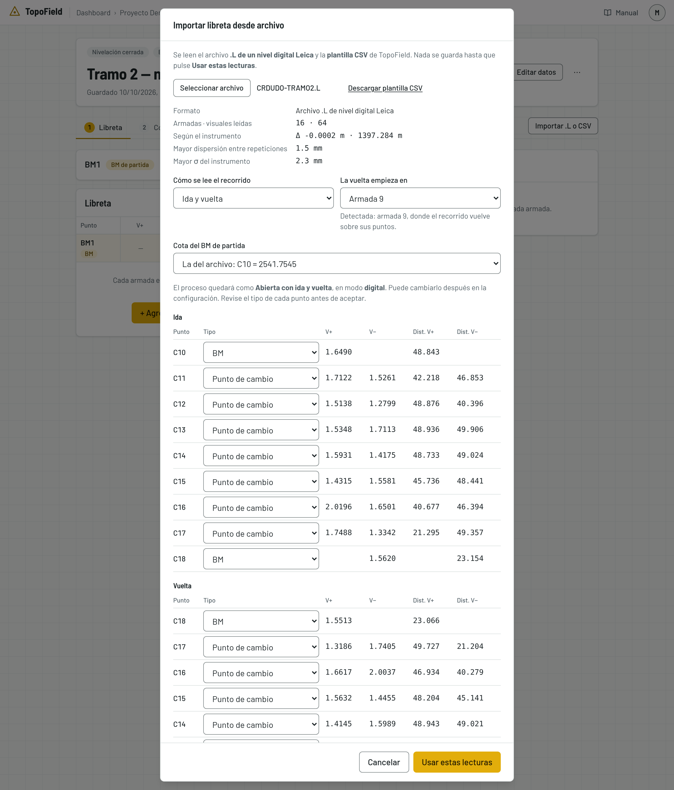
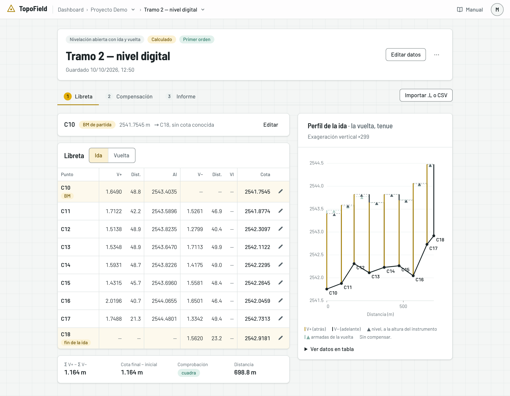
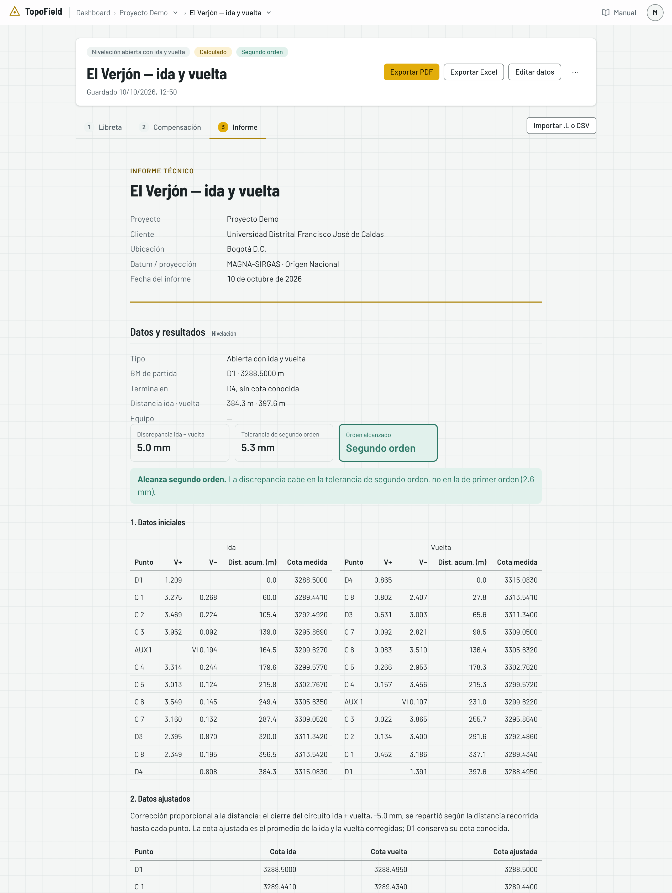

# La nivelación

Cómo llevar una nivelación geométrica en TopoField: crearla, llenar la libreta
armada por armada, medir la vuelta, compensar y sacar su informe. También cómo
importar la libreta de un nivel digital. El ejemplo es la nivelación real de
El Verjón, con ida y vuelta por los mismos puntos.

## Los tres tipos

| Tipo | Qué es | Cómo se comprueba |
|---|---|---|
| **Cerrada** | Sale de un BM y vuelve al mismo BM | Con el error de cierre contra la cota de partida |
| **De enlace** | Va de un BM conocido a otro BM conocido | Con el error de cierre contra la cota de llegada |
| **Abierta** | Termina en un punto sin cota conocida | Sin vuelta, no se puede comprobar. Con vuelta, con la diferencia entre la ida y la vuelta |

Una abierta sin vuelta sirve solo para reconocimiento: da cotas, pero no hay
cómo saber si son correctas. La aplicación la llama **Abierta sin control**.

## Cómo se lee la libreta

La libreta tiene una fila por punto, y cada fila puede llevar dos lecturas:

- **Vista más (V+)**: la primera lectura después de armar el nivel. Se suma a
  la cota del punto y da la **altura del instrumento**: AI = cota + V+.
- **Vista menos (V−)**: la lectura al punto siguiente. Se resta de la altura
  del instrumento y da su cota: cota = AI − V−.

Una **armada** es cada vez que arma el nivel: la V+ a un punto que ya tiene
cota, la V− al siguiente y, si las hay, las vistas intermedias. En TopoField
se captura así, armada por armada.

Cada fila es de un tipo de punto:

| Tipo | Qué hace | Lecturas |
|---|---|---|
| **BM** | Banco de nivel, de cota conocida. Ancla el recorrido | El primero solo lleva V+; el último, si es BM, solo V− |
| **Punto de cambio** | Pasa la cota de una armada a la siguiente | V− y V+ |
| **Intermedio (radiación)** | Se lee solo para conocer su cota | Solo una lectura |

El punto intermedio no pasa su cota a nadie: un error en su lectura no afecta
al resto del recorrido.

## Crear la nivelación

1. En el proyecto, pulse **+ Nuevo Proceso** y elija **Nivelación**.
2. Llene la ventana **Nueva nivelación**:
   - **Título**: el nombre con que la encontrará en el proyecto. Obligatorio.
   - **¿Cómo es el recorrido?**: elija según dónde termina la nivelación.
     - **Cerrada** si sale de un BM y vuelve a él. El error de cierre es la
       diferencia entre la cota con que llega y la cota conocida del BM.
     - **De enlace** si sale de un BM y termina en otro BM de cota conocida.
       El error de cierre se mide contra la cota de llegada, así que la
       ventana le pide también ese BM.
     - **Abierta** si termina en un punto sin cota conocida. Solo se puede
       comprobar si vuelve por los mismos puntos.
   - **Con vuelta**: márquela si, después de llegar, va a medir de regreso por
     los mismos puntos. La aplicación comparará la ida con la vuelta, y en una
     abierta es la única forma de comprobar el trabajo.
   - **BM de partida** y su **Cota conocida (m)**: el código del banco de
     nivel donde arranca, como lo tiene en la cartera, y su cota. De esa cota
     salen todas las demás.
   - En la de enlace, además, el **BM de llegada** y su **Cota conocida del BM
     de llegada (m)**.
   - **Ubicación, responsable y equipo**, plegado y opcional: dónde se midió,
     quién responde por el trabajo y con qué nivel (marca, modelo y n.º de
     serie). Salen en la cabecera y en el informe.

   

3. Pulse **Crear y empezar**. Se abre la libreta, todavía vacía, solo con el BM
   de partida.

   

El orden de precisión no se pide: la aplicación lo detecta al compensar,
según el error que dé el trabajo. Todo lo de esta ventana se cambia después
con **Editar datos**, en la cabecera.

## La libreta armada por armada

Cada armada se captura en una ventana, en el mismo orden en que se lee en el
terreno.

1. Pulse **+ Agregar la primera armada**. Arriba, la ventana dice dónde está
   el nivel: «El nivel entre D1, ya con cota, y el punto siguiente». Así sabe
   siempre desde qué punto viene la cota.

   

2. En **Vista atrás · V+**, escriba la **Lectura** de la mira sobre el punto
   que ya tiene cota y la **Distancia (m)** del nivel a esa mira.
3. En **Vista adelante · V−**, escriba el **Punto** al que lleva la cota (por
   ejemplo, C 1), su **Lectura** y su **Distancia (m)**.
4. Si desde esta misma armada leyó puntos solo para conocer su cota, pulse
   **+ Vista intermedia** por cada uno y escriba su punto y su lectura.
5. Revise abajo la **altura del instrumento** y la **cota** del punto de
   adelante: la ventana las calcula mientras escribe, y sirven para detectar
   una lectura mal tecleada antes de guardar.
6. Pulse **Guardar y seguir desde …**: se guarda y se abre la armada
   siguiente, que ya parte del punto de adelante. **Guardar** guarda y cierra
   la ventana.

Cada armada guardada aparece en la libreta, con su altura del instrumento y la
cota de cada punto, y el perfil se dibuja a la derecha. Si cierra la ventana,
**+ Agregar armada** sigue desde el último punto.

> **Las distancias.** La distancia a cada mira es obligatoria en los BM y en
> los puntos de cambio: sin ella, la compensación queda mal repartida. Si
> anota los hilos, pulse **+ Hilos superior e inferior (opcional)**: la
> distancia sale de ellos y la aplicación comprueba que la lectura sea su
> promedio. La distancia acumulada no se escribe: la aplicación la suma.

En la última armada aparece una casilla para indicar que el recorrido
terminó. Márquela cuando la vista adelante sea el punto final:

- **Llega al BM**, en la cerrada: la vista adelante es el BM de partida.
- **Llega a** el BM de llegada, en la de enlace.
- **Fin de la ida**, en la abierta: el último punto de la ida.

Sin esa marca, la aplicación entiende que la libreta sigue a medias y no
compensa.

Si hay vuelta, márquela y pulse **Guardar y seguir con la vuelta**: se abre la
primera armada de la vuelta. Al final de la vuelta, la casilla es **Llega a**
el BM de partida.

> **La libreta a medias se guarda.** Cada armada se guarda al confirmar,
> aunque el recorrido no haya terminado. Mientras tanto, la nivelación está
> **En progreso**, y se compensa cuando el recorrido llega a su fin.

## La libreta completa

El paso **Libreta** muestra:

- **La tabla**, con las mismas columnas de la cartera: punto, V+ y su
  distancia, AI, V− y su distancia, la vista intermedia y la cota sin
  compensar. Con vuelta, **Ida** y **Vuelta** cambian de recorrido.
- **La comprobación aritmética**: la suma de las V+ menos la suma de las V−
  debe ser igual a la cota final menos la inicial. Si coinciden, dice
  **cuadra**. Comprueba que las cuentas de la libreta estén bien hechas, no
  que la medición sea buena: eso lo dice la compensación.
- **El perfil**, a la derecha: el dibujo del terreno con la cota de cada
  punto y, por cada armada, la mira atrás, la visual del nivel y la mira
  adelante. Sirve para ver de un vistazo si alguna cota se sale de lo
  esperado.

Para corregir, el **lápiz** de cada fila abre la armada que esa fila cierra.
**Quitar la armada** borra la última.

## Compensar

Abra el paso **2 · Compensación**. Compensar es repartir el error de cierre
entre los puntos para que la nivelación cierre exactamente. El método es la
**corrección proporcional a la distancia**: cada punto recibe una parte del
error según la distancia recorrida hasta él, porque el error se acumula con
cada armada.

Arriba van cuatro cifras: el **error de cierre** (en una abierta con vuelta, la
**discrepancia** entre ida y vuelta), la **distancia**, la **tolerancia** y el
**orden alcanzado**, el más alto cuya tolerancia K·√D cumple el trabajo. D es
la distancia en kilómetros, en un solo sentido.

| Orden | K (mm) |
|---|---|
| Primer orden | 3 |
| Segundo orden | 6 |
| Tercer orden | 12 |
| Ordinario | 24 |

**Por qué** muestra cada orden con su tolerancia y si el trabajo la cumple. En
El Verjón, la discrepancia de 5.0 mm cabe en segundo orden (5.3 mm) y no en
primero (2.6 mm).

- **Se compensa siempre** que haya contra qué cerrar. Si el trabajo no alcanza
  ni el ordinario, se compensa igual y un aviso lo dice: un trabajo así, en la
  práctica, se repite.
- **El BM de partida no se corrige**: su cota es conocida.
- **La cota ajustada** es una por punto. Si el punto se leyó dos veces (en la
  ida y en la vuelta), es el promedio de sus dos cotas compensadas.
- **El gráfico** muestra la cota ajustada y, separadas de ella con la
  diferencia exagerada ×1000, la ida y la vuelta medidas.

Una abierta sin vuelta no se compensa. Una libreta que no encadena (un punto
de cambio sin su V+ o su V−, o una comprobación aritmética que no cuadra)
tampoco: la aplicación le dice qué fila revisar.

## Ida y vuelta

La ida y la vuelta son dos mediciones independientes. La aplicación compara
sus desniveles totales y juzga la diferencia con la tolerancia K·√D·√2.

- **En una abierta**, la discrepancia decide el orden alcanzado. Ida y vuelta
  forman un circuito que sale del BM y vuelve a él, y su error se reparte por
  distancia.
- **En una cerrada o de enlace**, cada recorrido se juzga y se compensa con su
  propio cierre.

Si la vuelta pasa por los mismos puntos, la tabla compara la cota de cada
punto en los dos recorridos, en la columna **Vuelta − ida (mm)**:

- si la diferencia **crece** a lo largo del recorrido, hay un error
  sistemático;
- si **salta** en un punto, revise ese punto.

## Importar un archivo .L o CSV

Con un nivel digital, las lecturas ya están en un archivo. **Importar .L o
CSV**, a la derecha de los pasos, las pasa a la libreta sin teclearlas.

1. Pulse **Importar .L o CSV** y elija el archivo: el **.L de un nivel digital
   Leica** o la **plantilla CSV** de TopoField, que se descarga desde la misma
   ventana.
2. Revise la vista previa. El archivo trae las lecturas, pero no todo lo que
   la aplicación necesita, así que confirme tres cosas:
   - **Cómo se lee el recorrido**: si es un recorrido cerrado o una ida y
     vuelta. Con ida y vuelta, en qué armada empieza la vuelta. La aplicación
     propone la que detecta (donde el recorrido vuelve sobre sus puntos);
     cámbiela si no es esa.
   - **La cota del BM de partida**: la del archivo o la que ya tiene la
     nivelación, si no coinciden.
   - **El tipo de cada punto**: el nivel no distingue un BM de un punto de
     cambio, así que la aplicación lo deduce. Corríjalo donde no acierte,
     porque el tipo decide qué lecturas lleva cada fila.
3. Pulse **Usar estas lecturas**. La libreta se reemplaza y se guarda.

El nivel mide dos veces cada visual: se guarda el promedio, y la ventana
muestra la mayor diferencia entre las dos como control.

## El informe

El paso **3 · Informe** muestra el informe de la nivelación:

1. **El resumen**: el tipo, los BM, la distancia, el equipo, el orden alcanzado
   y por qué.
2. **Los datos iniciales**: la libreta, con sus lecturas y la cota medida.
3. **Los datos ajustados**: el método y la cota ajustada de cada punto.
4. **El gráfico** de la compensación.

Arriba están **Exportar PDF** y **Exportar Excel**. Vea
[El informe y el Excel](06-informe-y-excel.md).

