# Control de asentamientos

Cómo seguir el descenso de una estructura en el tiempo: crear el lugar, sus
puntos de control y sus BM, medir cada visita con la libreta y leer el panel.
El ejemplo es una cartera real: dieciséis puntos de un edificio y siete
visitas, de marzo a junio de 2022.

## Cómo se organiza

- **El lugar** es lo que se monitorea: un edificio, una presa, un terraplén.
  Tiene cuatro pestañas: **Panel**, **Puntos**, **BMs** e **Informe**.
- **Los puntos de control** son los que se miden en cada visita.
- **Los BM del lugar** son los puntos de cota conocida desde donde se nivela.
- **Cada visita** es una fecha en la que se releyeron los puntos. Tiene dos
  pasos: **1 · Libreta** y **2 · Resultados**. La primera visita es la **línea
  base** y lleva el número 0.

La visita **no se compensa**: la cota de cada punto es la de su lectura. Y nada
se cierra: si corrige un dato, todo lo que depende de él se recalcula.

## Crear el lugar

1. En el proyecto, pulse **+ Nuevo Proceso** y elija **Control de
   Asentamientos**.
2. Llene la ventana **Nuevo lugar**:
   - **Nombre**: cómo reconocerá el lugar en el proyecto. Es el único
     obligatorio.
   - **Tipo de estructura**: edificio, presa, terraplén u otro. Elegirlo
     carga los **umbrales del semáforo** típicos de esa estructura: los
     límites de velocidad (mm/mes) y de asentamiento acumulado (mm) a partir
     de los cuales un punto pasa a precaución, a alerta y a alarma. Una presa,
     por ejemplo, tolera menos acumulado que un edificio.
   - **Descripción**, opcional: qué se monitorea y dónde. Sale en el informe.
   - **Umbrales del semáforo**, plegados: muestran los valores cargados.
     Ábralos solo si el estudio de la estructura fija otros límites, y
     cámbielos allí.

   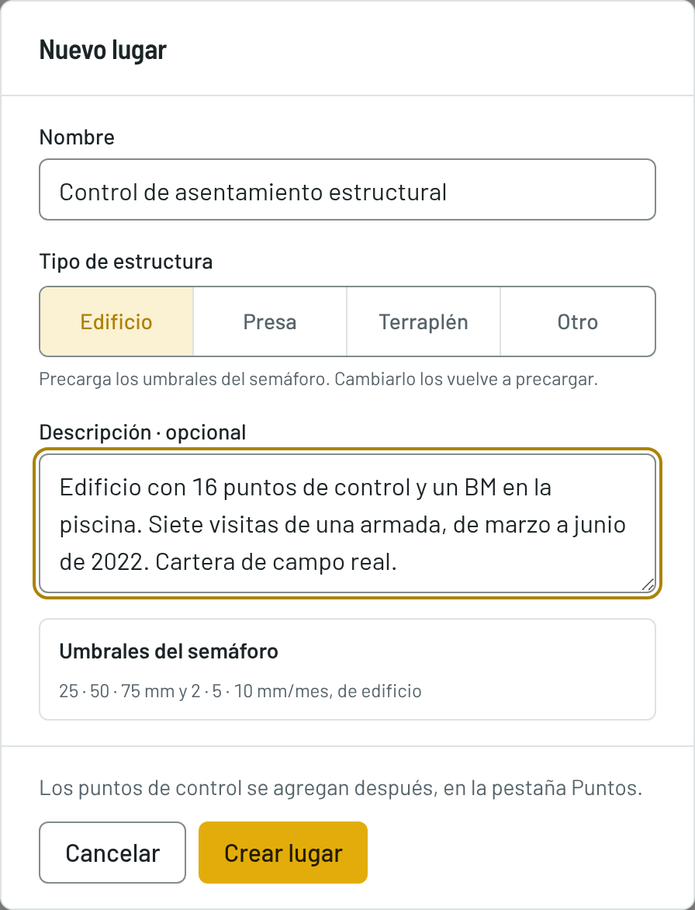

3. Pulse **Crear lugar**. Se abre el lugar, todavía sin puntos: se agregan
   en el paso siguiente.

   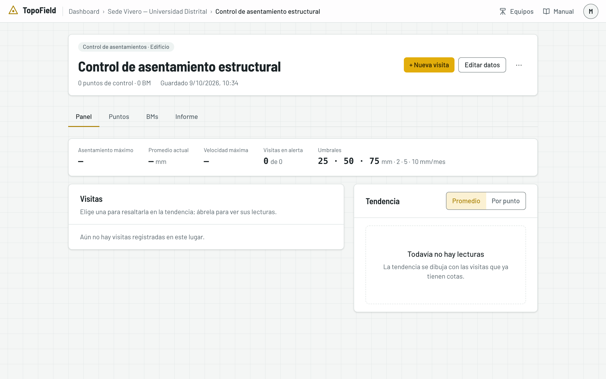

## Los puntos de control

Son las marcas fijadas en la estructura cuyo descenso se quiere seguir.

1. Abra la pestaña **Puntos** y pulse **Agregar punto**.
2. Llene la ventana:
   - **Código**: el nombre del punto, como en la cartera. Es el que verá en
     la libreta de cada visita.
   - **Ubicación**: dónde está en la estructura (por ejemplo, la columna o el
     eje), para encontrarlo en campo.
   - **Cota C0**, opcional: la cota de referencia contra la que se mide el
     asentamiento acumulado del punto, si ya la conoce por un estudio
     anterior. Si la deja vacía, la referencia es su primera lectura.
3. Pulse **Guardar**. Repita por cada punto.

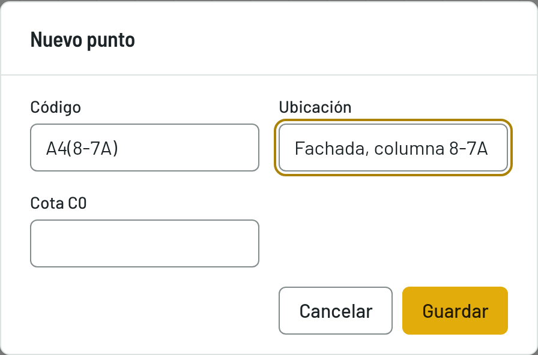

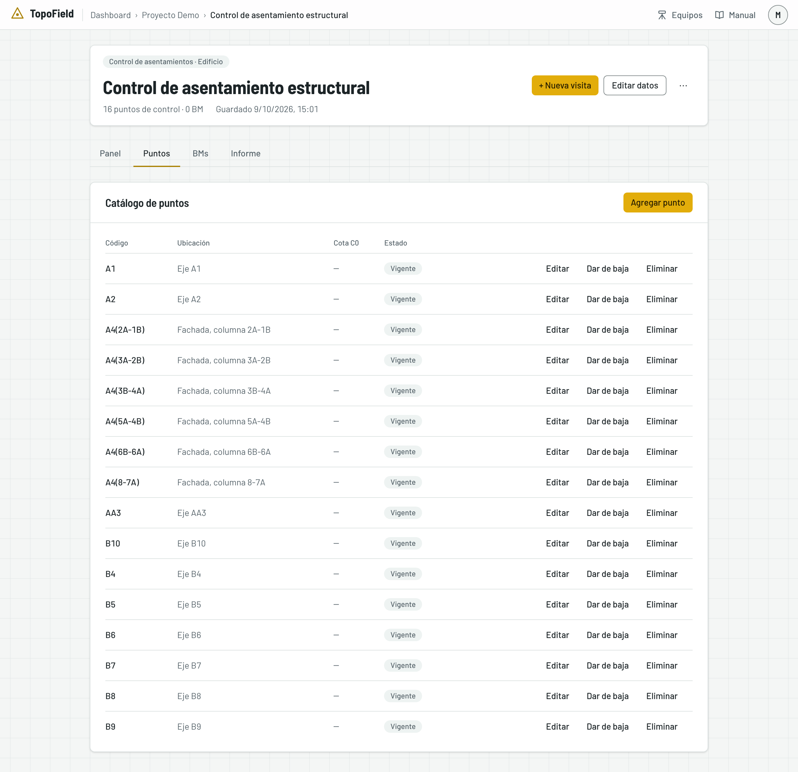

Los puntos no llevan coordenadas: el módulo mide cuánto baja cada punto, no
dónde está.

Cada punto tiene **Editar**, **Dar de baja** y **Eliminar**. Si cambia la C0 de
un punto ya medido, la aplicación le avisa en cuántas visitas cambia su
acumulado antes de guardar.

## Los BM del lugar

Los BM son los puntos de cota conocida, fuera de la estructura y que no se
mueven, desde donde se nivela cada visita. Cada lugar tiene los suyos. Son
copias propias del lugar: aunque el mismo BM aparezca en una nivelación del
proyecto, cambiarlo allí no lo cambia aquí.

1. Abra la pestaña **BMs** y pulse **+ BM**.
2. Escriba el **Código** del BM, su **Cota (m)** conocida y, si quiere, una
   **Descripción** que ayude a encontrarlo.
3. Pulse **Guardar**.

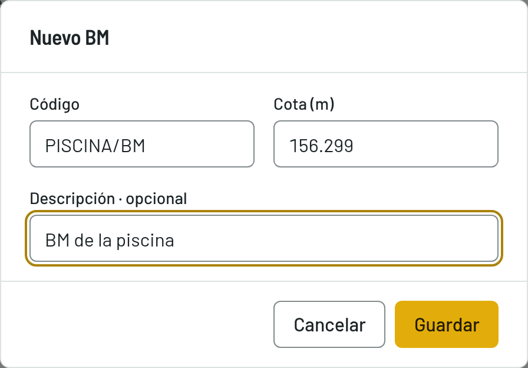

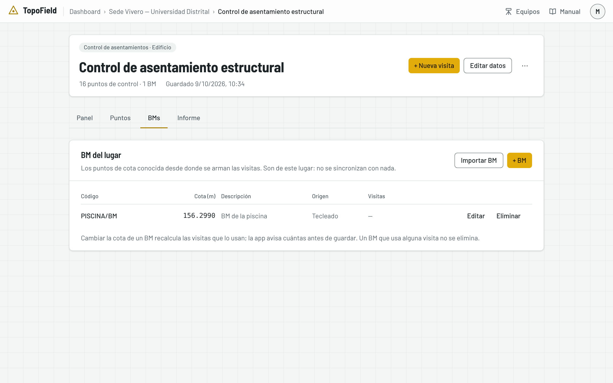

**Importar BM** los trae de una nivelación del proyecto (con su cota
ajustada) o de un archivo CSV con `codigo,cota,descripcion`. Los BM
importados son copias: si la nivelación cambia después, el BM no.

## Una visita

1. En la cabecera del lugar, pulse **+ Nueva visita**.
2. Llene la ventana:
   - **Fecha**: el día en que midió. Tiene que ser posterior a la de la
     última visita, porque el historial se ordena por fecha.
   - **Nivelador**: quién hizo la medición. Sale en el informe.
   - **Nota**, opcional: lo que conviene saber de esa campaña (lluvia, un
     punto tapado, una obra cerca). Sale en el informe junto a la visita.
   - **Equipo**, plegado y opcional: la marca, el modelo y el n.º de serie del
     nivel.
3. Pulse **Crear y empezar**.

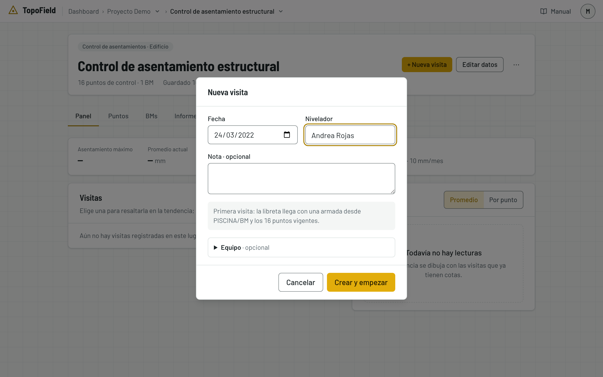

La libreta llega **armada como la de la visita anterior**: las mismas armadas,
con sus BM y sus puntos, pero sin lecturas. La primera visita llega con una
armada desde el primer BM del lugar y todos los puntos. Solo queda escribir
las lecturas.

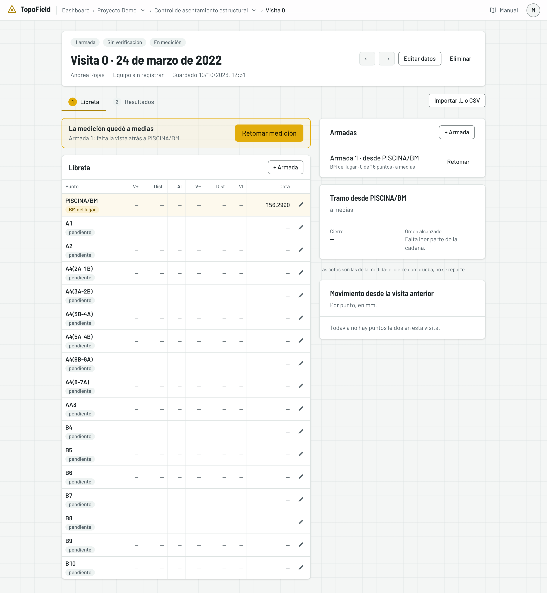

## La libreta y la armada

1. Pulse **Retomar medición**, o **Editar** en la armada. Se abre su ventana.
2. En **Vista atrás · V+**, escriba la **Lectura** de la mira sobre el BM. La
   distancia es opcional: la visita no se compensa, así que no la necesita
   para calcular.
3. En **Vistas a los puntos**, escriba la lectura de cada punto. Cada lectura
   **se guarda al escribirla**: al salir del campo o con Enter, que además pasa
   al campo siguiente. Junto a cada una aparece su cota y un ✓ cuando quedó
   guardada.
4. En **Vista adelante · V−**, diga cómo termina la armada:
   - **Sin vista adelante**, si leyó los puntos y no cerró contra nada. Es lo
     más común en una visita corta.
   - El **punto**, su **lectura** y su **distancia**, si terminó en un punto
     de cambio (para seguir en otra armada) o en un BM del lugar (para
     comprobar la medición).
5. Pulse **Terminar armada**.

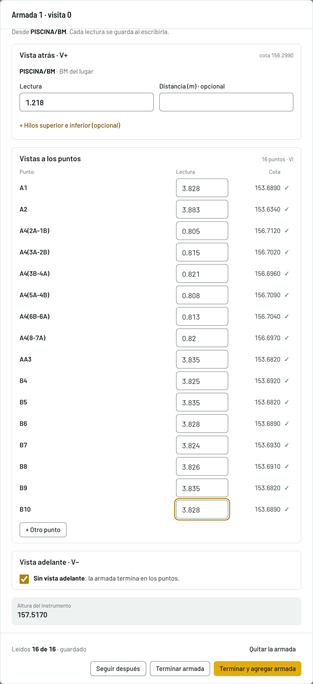

Abajo, la ventana dice cuántos puntos van leídos. Los botones:

- **Seguir después** cierra la ventana. Lo leído ya está guardado; si falta
  algo, la visita queda **En medición**.
- **Terminar armada** la da por terminada.
- **Terminar y seguir…** termina y abre la armada siguiente.

> Una lectura fuera de 0 a 4 m no bloquea: la ventana avisa para que la
> revise. Una mira de 5 m da lecturas como 4.120.

**Varias armadas.** Si tuvo que cambiar el nivel de sitio, la vista adelante va
a un **punto de cambio** y la armada siguiente sale de él. Si la última vista
adelante cae en un BM del lugar, el tramo se **verifica**: la ventana muestra
el cierre y el orden alcanzado.

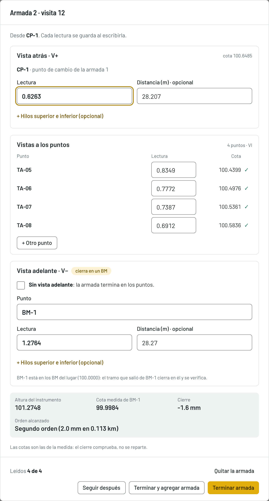

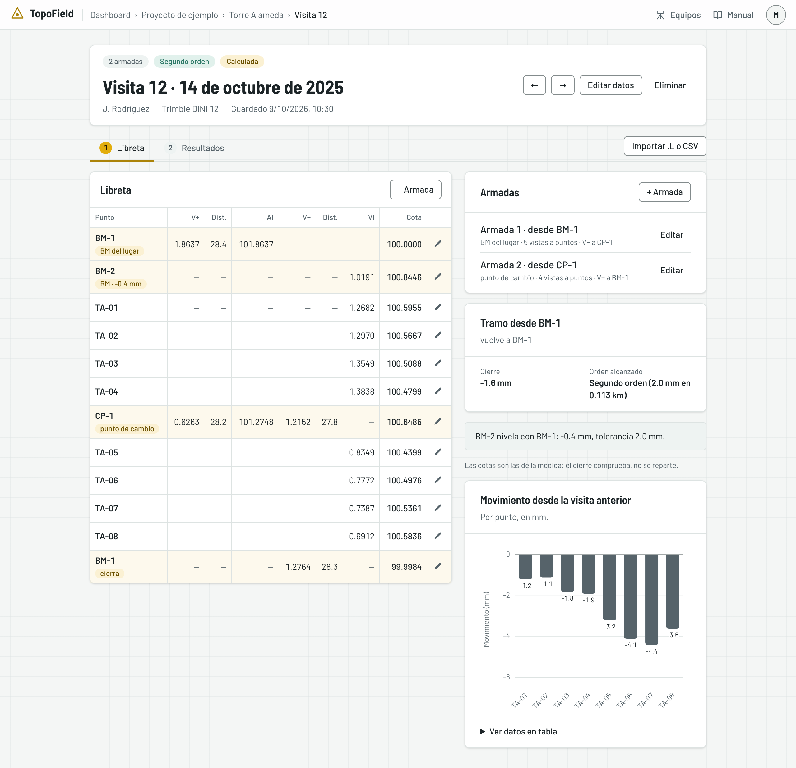

## Importar la libreta

Con un nivel digital, las lecturas ya están en un archivo. **Importar .L o
CSV**, a la derecha de los pasos, las pasa a la libreta sin teclearlas: acepta
el archivo **.L de Leica** o la **plantilla CSV**, como en la nivelación.

El archivo se lee como un solo tramo que sale del BM de su primera fila, así
que ese BM tiene que estar antes en la pestaña **BMs** del lugar, con el mismo
código. Importar reemplaza la libreta de la visita; si ya tenía lecturas, la
ventana lo avisa antes.

## Cómo se calcula

La cota de cada punto sale de su lectura:

- **AI = cota del BM + V+**: la altura del instrumento de la armada.
- **Cota = AI − lectura** del punto.

Con la cota, la aplicación calcula al momento:

- **Parcial**: cuánto bajó (o subió) el punto desde la visita anterior, en mm.
- **Acumulado**: cuánto ha bajado desde su línea base, en mm.
- **Velocidad**: el parcial dividido por los **días reales** entre las dos
  visitas, en mm/mes.
- **Estado**: el semáforo del punto (vea [El panel del lugar](#el-panel-del-lugar)).

Un valor positivo es un **levantamiento** y se muestra como tal.

**La verificación de un tramo.** Si el tramo vuelve a su BM, su cierre se
compara con la tolerancia de cada orden. Si termina en sus puntos, como en esta
cartera, dice **Sin verificación**.

**Un BM leído de paso.** Si la libreta pasa también por otro BM del lugar, la
aplicación compara la cota medida con la suya. Si no coinciden, avisa: uno de
los dos BM pudo moverse.

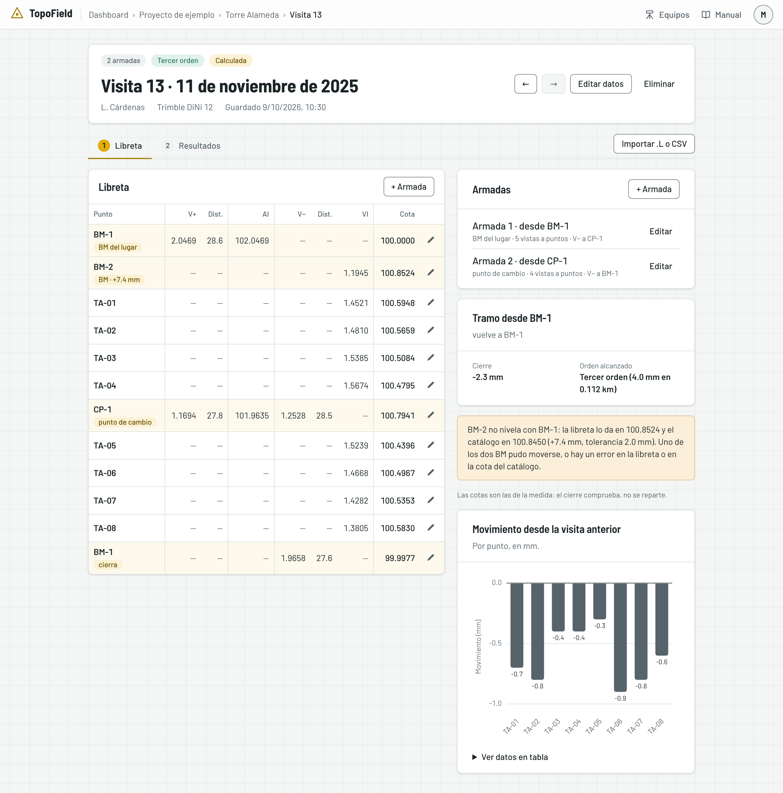

**Lecturas fuera de tendencia.** Desde la tercera lectura de un punto, la
aplicación avisa si una lectura va contra su tendencia o lo mueve mucho más
de lo que su ritmo preveía. En esta cartera, B10 baja 50 mm en 12 días donde su
ritmo preveía unos 17: la libreta lo avisa para que revise la lectura.

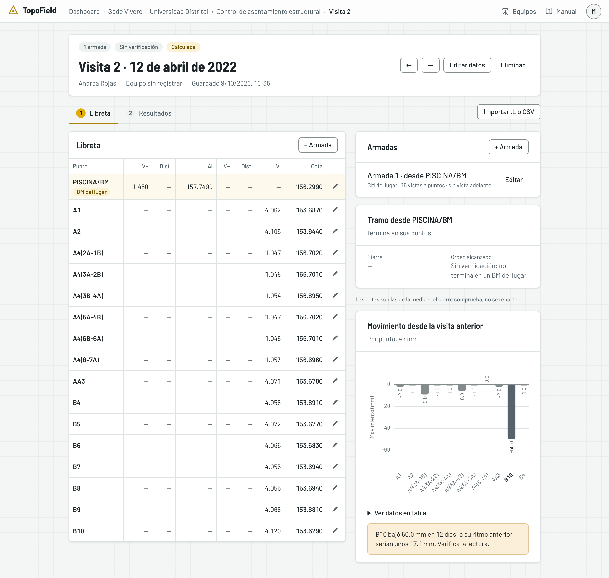

> El aviso no bloquea. Pide revisar la lectura o volver a medir; una lectura
> atípica también puede ser real.

## Los resultados

El paso **2 · Resultados** de cada visita muestra cómo quedó la estructura en
esa fecha. Arriba, sus indicadores: el asentamiento máximo, el promedio, el
mayor movimiento desde la visita anterior y la peor alerta. Debajo, una fila
por punto con su cota, el parcial, el acumulado, la velocidad, el estado y la
**tendencia**, que compara sus dos últimas velocidades:

- **Converge** si el punto baja cada vez más despacio: se está
  estabilizando.
- **Acelera** si baja cada vez más rápido, más allá de lo que explica el error
  de la medición: conviene vigilarlo.

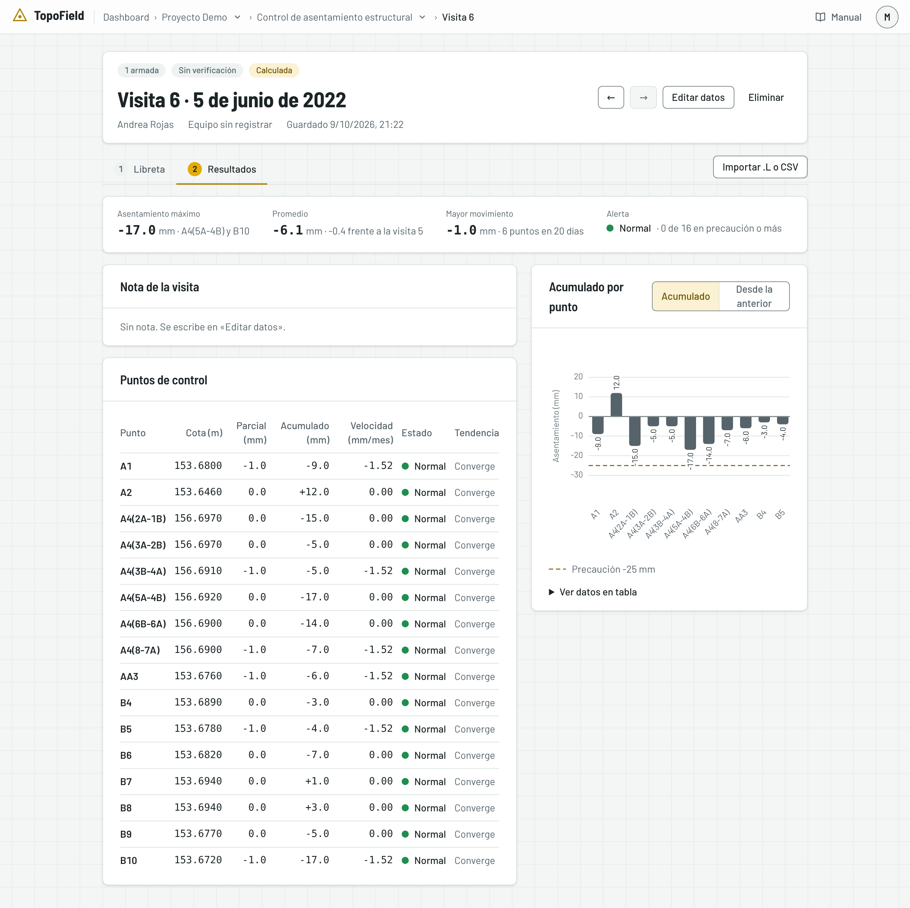

## El panel del lugar

La pestaña **Panel** reúne todo el historial:

- **Los indicadores**: el asentamiento máximo y en qué punto, el promedio
  actual, la velocidad máxima, cuántas visitas tienen algún punto en alerta o
  alarma, y los umbrales con que se juzga.
- **Las visitas**, de la más reciente a la más antigua, con su promedio, su
  máximo y su mayor movimiento —debajo de cada uno, el punto donde ocurre— y
  su peor alerta.
- **La tendencia**: una gráfica del asentamiento promedio en el tiempo, con
  las líneas de los umbrales y la franja entre el punto que más bajó y el que
  menos. **Por punto** muestra cada punto por separado. Pulsar una visita en
  la tabla la resalta en la gráfica.
- **Los avisos** de lecturas fuera de tendencia.

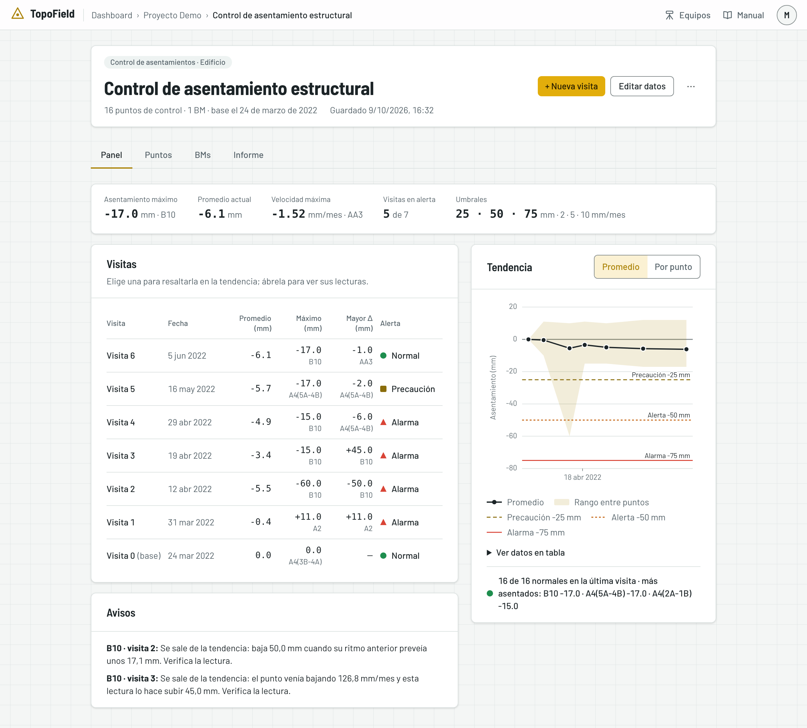

**El semáforo.** Cada punto tiene un estado según sus umbrales de velocidad y
de acumulado; gana el peor de los dos:

| Nivel | Qué significa | Forma |
|---|---|---|
| **Normal** | Dentro de todos los umbrales | ● círculo |
| **Precaución** | Pasa el primer umbral: vigile la tendencia | ■ cuadrado |
| **Alerta** | Pasa el segundo umbral: revise el punto | ◆ rombo |
| **Alarma** | Pasa el umbral más alto: requiere atención inmediata | ▲ triángulo |

Cada nivel tiene su forma y su nombre, además del color: se reconoce con
daltonismo o impreso en blanco y negro.

Un movimiento de hasta **6 mm** entre dos visitas no cuenta para la velocidad:
cabe en el error normal de la medición. Con visitas cada semana, 1 mm daría
más de 4 mm/mes y pondría el punto en precaución sin que se haya movido. En
ese caso el punto se juzga solo por su acumulado. La velocidad se sigue
mostrando igual.

> Un punto en alarma se guarda como cualquier otro. El semáforo es un
> diagnóstico, no un bloqueo: un asentamiento alarmante es justo lo que este
> módulo existe para documentar.

## Dar de baja o de alta un punto

Si un punto se destruye o se pierde, **no lo elimine**: dele de baja.

1. En la pestaña **Puntos**, pulse **Dar de baja** en su fila.
2. Escriba **De baja desde**, la primera fecha en que el punto ya no se mide, y
   el **Motivo**, que es obligatorio.
3. Pulse **Dar de baja**.

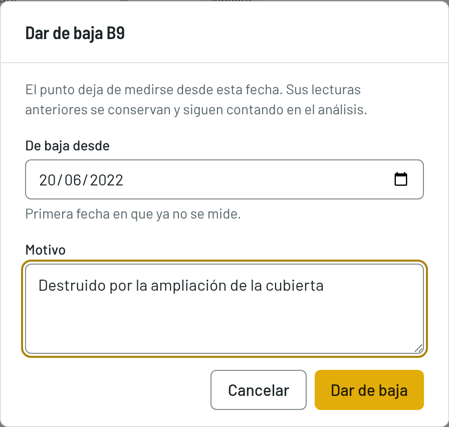

La baja no borra nada: las lecturas anteriores siguen en el análisis, y las
visitas nuevas ya no traen el punto en su libreta. **Deshacer baja** la quita,
si fue un error.

Un punto que se agrega cuando el lugar ya tiene visitas se **da de alta**: el
formulario pide su **fecha de alta**, y su línea base es su primera lectura.

## El informe del lugar

La pestaña **Informe** muestra el informe del lugar:

1. **Los datos del lugar**: el tipo de estructura, los puntos, las visitas, el
   BM y el equipo.
2. **El veredicto**: la peor alerta de la última visita y el mayor acumulado.
3. **Cómo se calcula**, en un párrafo.
4. **La evolución** del acumulado de cada punto en el tiempo.
5. **Las visitas** y **los puntos de la última visita**.
6. **Las notas** y **los avisos**.

Informa las visitas calculadas; las que están en medición se nombran aparte.
Arriba están **Exportar PDF** y **Exportar Excel**. Vea
[El informe y el Excel](06-informe-y-excel.md).

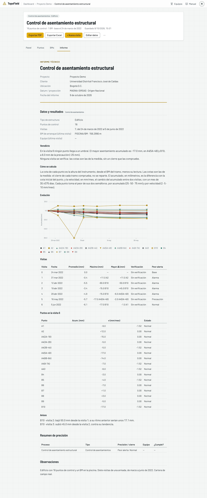
