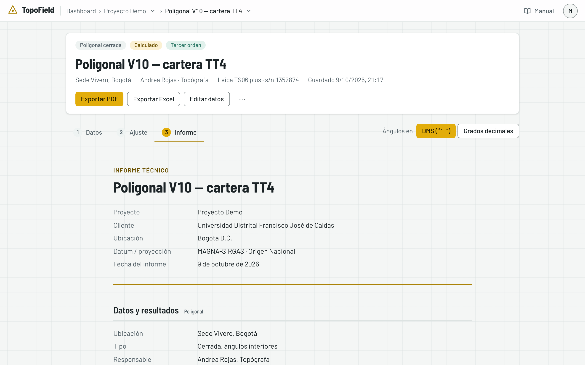
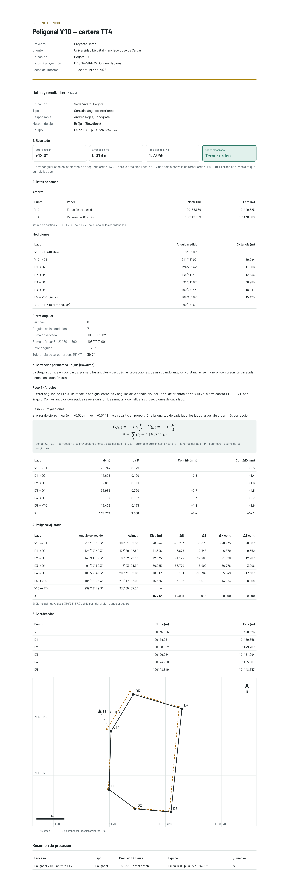

# El informe y el Excel

Cada proceso tiene un informe listo para entregar, en su propia pantalla, y
desde ahí se exporta a PDF y a Excel. Este capítulo explica qué lleva el
informe y cómo sacar los dos archivos.

## Dónde está el informe

- En la poligonal y en la nivelación, es el paso **3 · Informe**.
- En el control de asentamientos, es la pestaña **Informe** del lugar. Una
  visita no tiene informe propio: sus resultados van en el del lugar.

No hay que generarlo: se arma con los datos del proceso cada vez que lo abre.
Arriba, la cabecera trae **Exportar PDF** y **Exportar Excel**. Solo la página
del informe exporta.

## Qué lleva el informe

- **La portada**: el nombre del proceso, los datos del proyecto (nombre,
  cliente, ubicación, datum y proyección) y la fecha del informe.
- **Los datos y resultados** del proceso, con su equipo. Cada capítulo de este
  manual dice qué lleva el de su módulo.
- **Las fórmulas del ajuste**, en notación matemática, con una línea
  «donde:» que dice qué es cada símbolo.
- **El resumen de precisión**: el tipo, la precisión o el cierre, el equipo y
  si cumple.
- **Las observaciones**, si el proceso tiene notas.

Es un documento para entregar: no nombra la aplicación ni sus pantallas. Un
proceso sin terminar se informa como tal, por ejemplo «Nivelación incompleta»,
con lo medido hasta ese momento.

## Exportar PDF

1. En la página de informe, pulse **Exportar PDF**.
2. Se abre el diálogo de impresión del navegador, con el informe ya armado en
   hoja A4. Elija **Guardar como PDF** como destino.
3. Guarde el archivo. Se propone con el nombre del proceso y del proyecto.

Al imprimir sale solo el informe, sin la barra, los pasos ni los botones.
Desde la segunda página, cada una lleva al pie el proyecto, el proceso y
«Página X de Y».

> Si en el PDF aparecen arriba o abajo la dirección de la página y la fecha,
> desmarque **Encabezados y pies de página** en el diálogo de impresión.

El informe muestra el proceso tal como está al abrirlo. Si lo corrige después,
el informe cambia; el PDF que guardó no. Para conservar una versión, guarde el
PDF.

## Exportar Excel

**Exportar Excel**, junto a **Exportar PDF**, descarga un libro de Excel
(`.xlsx`) con la forma de las carteras de campo de cada módulo. Sirve para
entregar el cálculo de forma que se pueda revisar: quien lo reciba ve cada
fórmula y puede rehacer las cuentas sin la aplicación.

- **Las celdas amarillas** son los datos medidos o escritos: las lecturas,
  las distancias, las cotas conocidas.
- **Las demás llevan fórmulas** que dan el mismo valor que la aplicación. Si
  cambia un dato amarillo, Excel recalcula todo lo que depende de él, así que
  sirve también para probar qué pasaría con otra lectura.
- **Las tolerancias** de cada orden van en un bloque de celdas, y las fórmulas
  las usan.

### El libro de la poligonal

| Hoja | Qué tiene |
|---|---|
| Brújula, Tránsito, Crandall o Mínimos cuadrados | La del método elegido: la tabla de la poligonal con su fila de sumatoria y, debajo, el cierre angular, el cierre lineal, las tolerancias, el orden alcanzado y el veredicto |
| Resumen | Los datos del proyecto y del proceso, el equipo y las notas |

Con mínimos cuadrados, la hoja trae además las matrices de la última iteración
y la precisión de cada punto. Si la poligonal se georreferenció, lleva también
un bloque con la fecha, los puntos, la rotación y la escala.

### El libro de la nivelación

| Hoja | Qué tiene |
|---|---|
| Nivelación | La ida: punto, tipo, V+, AI, V−, vista intermedia, cota, distancias, acumulado, corrección y cota ajustada; debajo, el bloque de cierre |
| Contranivelación | La vuelta, si la hay |
| Cotas ajustadas | Una fila por punto con su cota ajustada, si la nivelación se compensó |
| Resumen | Los datos del proyecto y del proceso, el equipo y las notas |

Con hilos, cada lectura ocupa tres filas (superior, medio e inferior) y la
distancia sale de ellos.

### El libro del control de asentamientos

| Hoja | Qué tiene |
|---|---|
| Libretas | Un bloque por visita, con su fecha, el nivelador, el equipo y su libreta |
| Comparación | Los umbrales del lugar y, por punto y por visita, la cota, el acumulado, el parcial, la velocidad y el semáforo; al pie, los avisos de tendencia |
| Resumen | Los datos del proyecto, del lugar y de sus BM |
