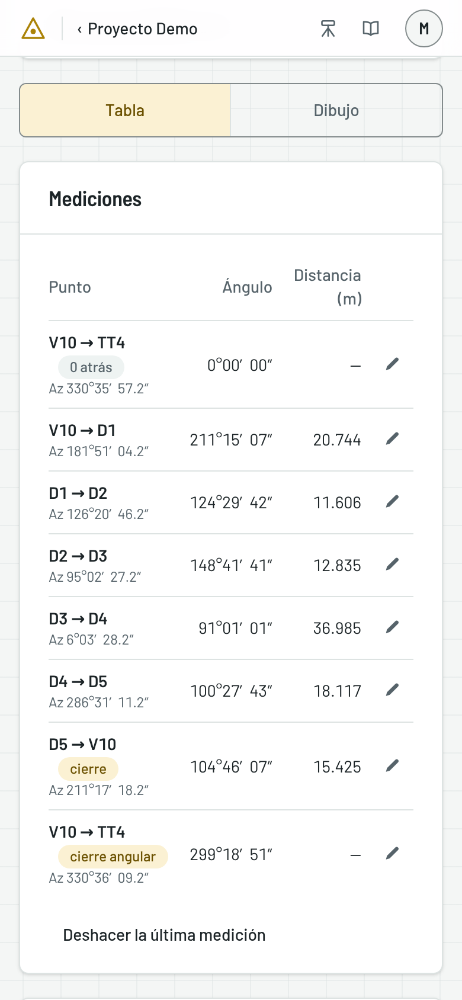
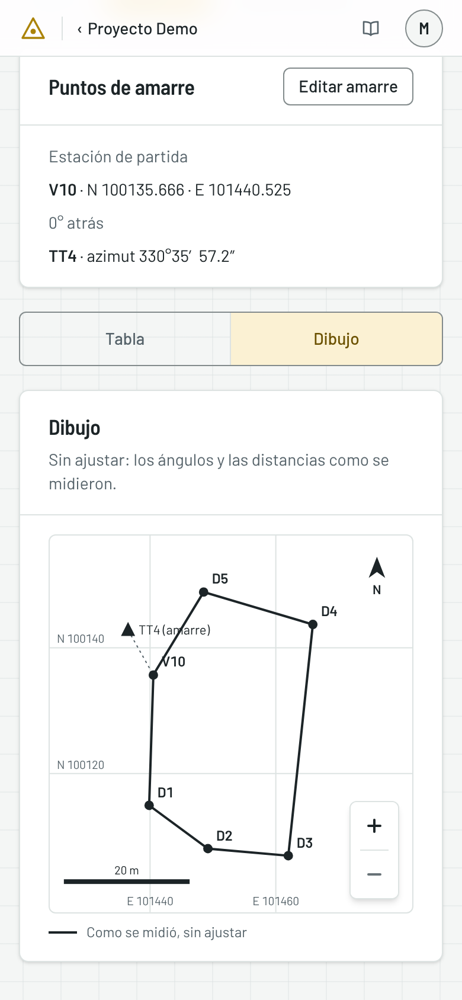
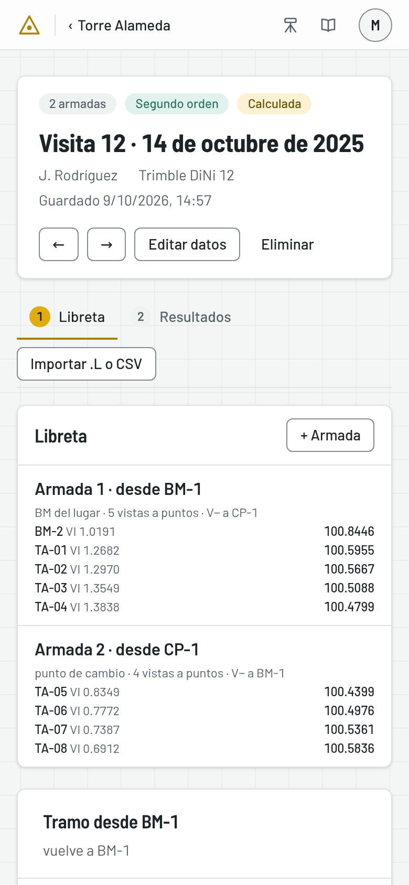
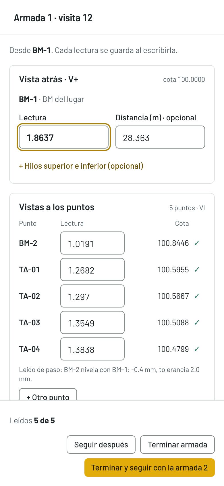
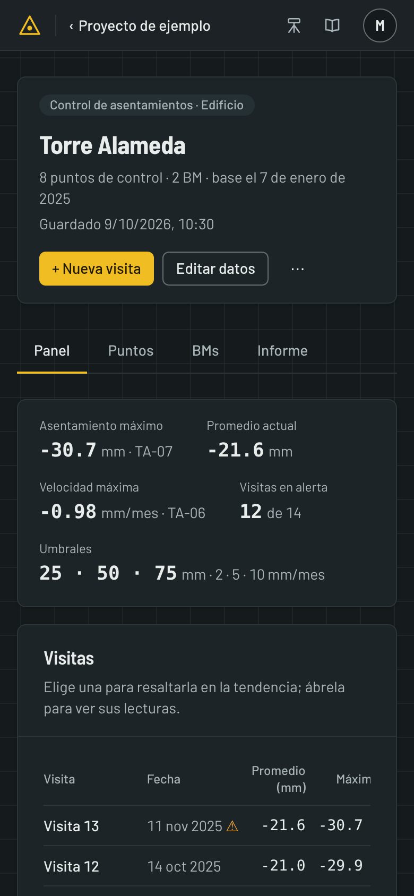

# En campo, con el teléfono

TopoField se usa también desde el teléfono, para capturar en el sitio de
trabajo en lugar de pasar la cartera después. Las pantallas se acomodan al
ancho del teléfono; este capítulo muestra qué cambia frente al computador.

## La poligonal en el teléfono

En el teléfono, el paso **Datos** apila sus partes, y un selector **Tabla |
Dibujo** cambia entre las mediciones y el dibujo. La tabla muestra el azimut
bajo cada punto, sin desplazarse de lado, y cada medición se escribe en su
ventana, que ocupa el ancho de la pantalla.

La barra de arriba se reduce a «‹» y el nivel anterior, para volver atrás.

## La visita en el teléfono

La libreta de una visita se ve como una lista de armadas, en lugar de la
tabla completa, para que quepa en la pantalla. Cada una dice desde qué BM o
punto sale y cuántos puntos van leídos. Pulse una para abrirla.

La armada ocupa toda la pantalla, con los botones fijos abajo. Cada lectura se
guarda al salir del campo o al pulsar Enter, que además pasa al campo
siguiente, como en la libreta de papel.

> Si se pierde la señal, lo que escribió se queda en la ventana y se guarda con
> la lectura siguiente. Si tiene que irse, pulse **Seguir después**: lo leído
> ya está guardado, y **Retomar medición** sigue donde quedó.

## Coma o punto decimal

Las celdas de números aceptan los dos: `2541,7545` y `2541.7545` son el mismo
número, y el teclado del teléfono ofrece el separador de su idioma. Lo que no
se acepta es un separador de miles: `1.234,5` no se adivina.

Si lo que escribió no es un número, la celda dice **No es un número** y la
aplicación no guarda hasta que lo corrija.

## A pleno sol

A pleno sol, el tema claro se lee mejor; de noche o bajo techo, el oscuro
cansa menos. Se cambia en el menú de cuenta (vea
[Primeros pasos](01-primeros-pasos.md#elegir-el-tema)).

