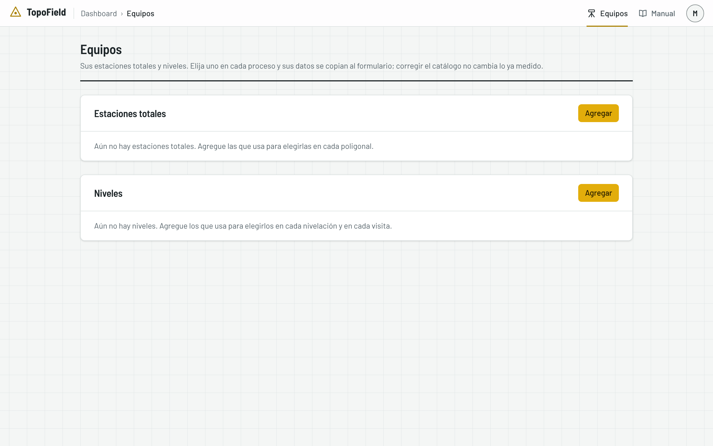
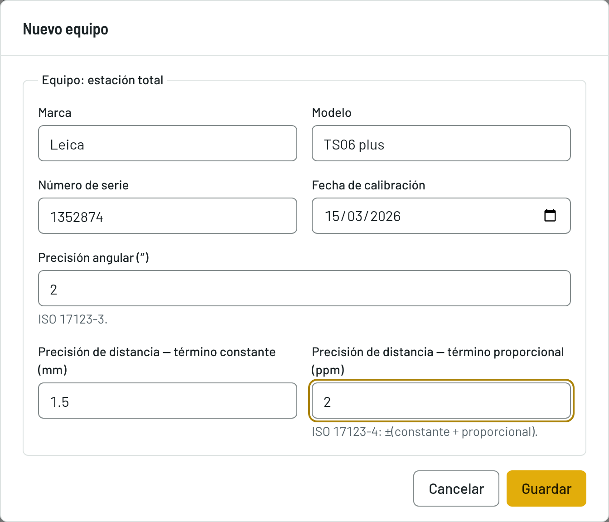
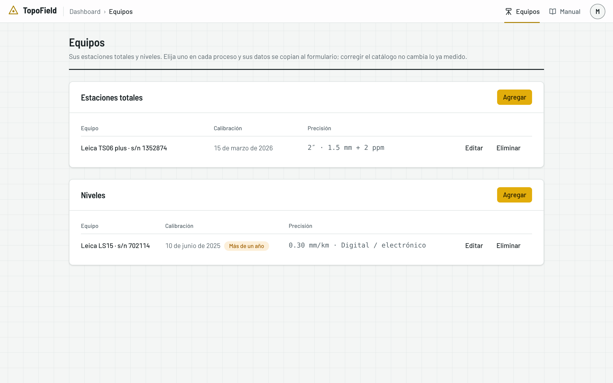
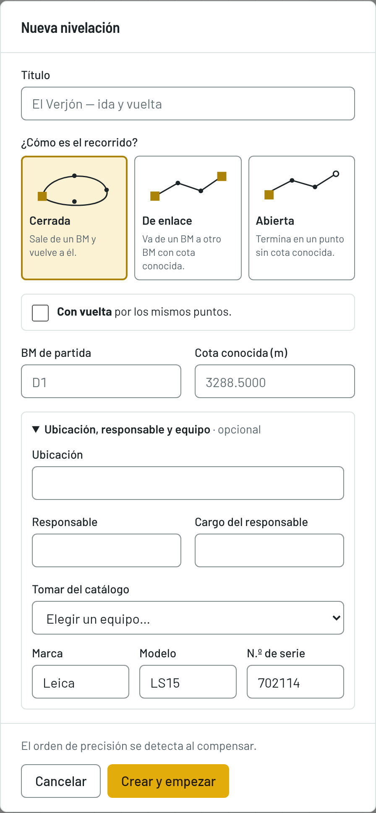

# El catálogo de equipos

Cómo guardar sus estaciones totales y sus niveles una sola vez, para no
escribirlos en cada proceso.

## Agregar un equipo

1. En la barra de arriba, pulse **Equipos**. Hay dos secciones: **Estaciones
   totales** y **Niveles**.

   

2. En la sección que corresponda, pulse **Agregar**.
3. Escriba la **Marca**, el **Modelo**, el **Número de serie** y la **Fecha de
   calibración**, y la precisión:
   - en una estación total, la **precisión angular (″)** y la de distancia,
     con su término constante (mm) y su término proporcional (ppm);
   - en un nivel, el **tipo de nivel** y su **desviación típica (mm/km)**.
4. Pulse **Guardar**.

Cada equipo tiene **Editar** y **Eliminar**.

## La calibración

Si la fecha de calibración tiene más de un año, la lista lo avisa con **Más de
un año**. Es solo un aviso: el equipo se puede seguir usando.

## Usarlo en un proceso

En una nivelación y en una visita de asentamientos, el bloque del equipo trae
**Tomar del catálogo**: al elegir un nivel, su marca, su modelo y su número de
serie se copian en los campos, que puede seguir editando. En la poligonal, el
equipo se escribe.

## Por qué es una plantilla

Cada proceso guarda su propia copia del equipo. Si corrige o elimina un equipo
del catálogo, no cambia ningún proceso, visita ni informe ya hecho.
