# Manual de usuario — TopoField

TopoField es una plataforma web para gestionar procesos topográficos: registrar
los datos de campo, calcularlos con validación en tiempo real y cerrarlos con
trazabilidad.

Este manual cubre lo que la aplicación permite hacer **hoy**. Las secciones
marcadas como *pendiente* corresponden a módulos aún no implementados; se
detallan aquí para que se vea el alcance completo previsto.

> **Este documento es la fuente de la redacción.** La página `/manual` de la
> aplicación (`src/app/(app)/manual/`) es una maquetación de este mismo texto
> con el sistema de diseño. El contenido vive por duplicado y no hay generación
> automática entre los dos: al cambiar la redacción aquí, refléjela allí en el
> mismo commit — y viceversa.

**Última actualización:** 2026-08-11 · Fases 1-3 implementadas.

La aplicación está publicada en
**[topofield-app.vercel.app](https://topofield-app.vercel.app)**.

---

## Índice

1. [Conceptos básicos](#1-conceptos-básicos)
2. [Entrar a la aplicación](#2-entrar-a-la-aplicación)
3. [El dashboard](#3-el-dashboard)
4. [Proyectos](#4-proyectos)
5. [Poligonales](#5-poligonales)
6. [Cerrar un proceso](#6-cerrar-un-proceso)
7. [Trabajo en campo](#7-trabajo-en-campo)
8. [Módulos pendientes](#8-módulos-pendientes)
9. [Preguntas frecuentes](#9-preguntas-frecuentes)

---

## 1. Conceptos básicos

Tres ideas ordenan toda la aplicación:

**Proyecto.** El contenedor de un trabajo topográfico. Guarda el cliente, la
ubicación, el datum, la proyección, el equipo usado y —lo más importante— el
**orden de precisión**, que determina qué tolerancias se exigirán a todos sus
procesos.

**Proceso.** Un levantamiento concreto dentro de un proyecto: una poligonal, una
nivelación, un control de asentamientos. Cada proceso pasa por estados:

| Estado | Significado |
|---|---|
| **Borrador** | Creado, sin datos suficientes |
| **En progreso** | Con datos de campo, aún sin cálculo completo |
| **Calculado** | Cálculo resuelto; se puede revisar y cerrar |
| **Cerrado** | Terminado y conforme. **Inmutable** |
| **Rechazado** | Terminado pero fuera de tolerancia. **Inmutable** |

**Cierre.** El acto de dar por terminado un proceso. Queda registrado con fecha,
hora y autor, y **a partir de ese momento los datos no se pueden modificar**. Es
lo que da trazabilidad al trabajo.

> **Sobre la inmutabilidad**
> Un proceso cerrado no se puede editar ni eliminar, ni desde la interfaz ni por
> ninguna otra vía. La restricción está aplicada en la propia base de datos, no
> solo en la pantalla. Si necesita corregir un levantamiento cerrado, cree uno
> nuevo.

---

## 2. Entrar a la aplicación

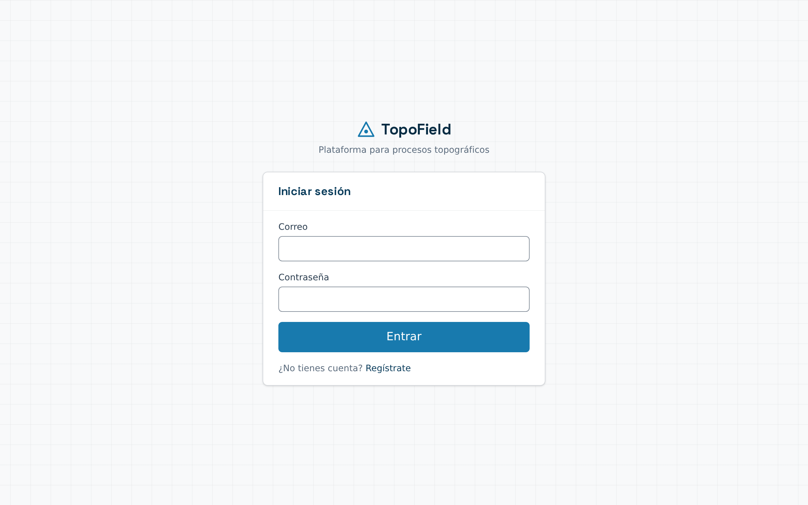

Ingrese con su correo y contraseña. Si aún no tiene cuenta, use **Regístrate**.

**Para crear una cuenta necesita un código de invitación.** Al registrarse se le
pide, junto con su nombre, correo y contraseña. Después recibirá un mensaje para
confirmar su dirección: hasta que pulse ese enlace no podrá entrar.

La primera vez que entre encontrará un **proyecto de ejemplo** con cuatro
poligonales ya calculadas, para que pueda ver cómo funciona la aplicación sin
capturar nada. Puede modificarlo o eliminarlo cuando quiera.

Cada usuario ve únicamente sus propios proyectos.

---

## 3. El dashboard

Es la pantalla de inicio tras entrar.

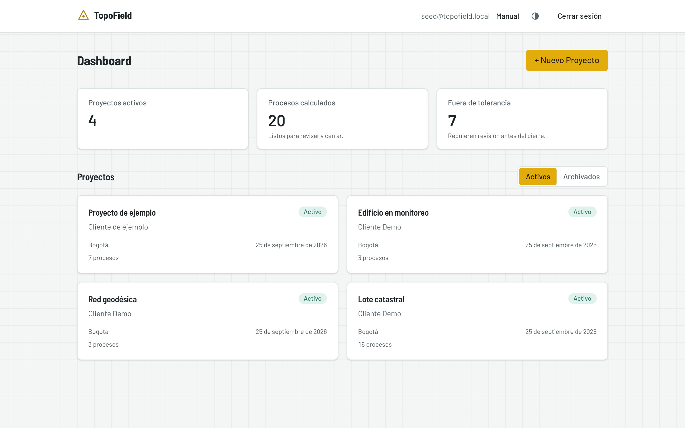

Arriba, tres indicadores del estado general:

- **Proyectos activos** — cuántos proyectos tiene en curso.
- **Procesos calculados** — levantamientos resueltos, listos para revisar y cerrar.
- **Fuera de tolerancia** — procesos calculados que no alcanzan el orden de
  precisión de su proyecto. Requieren revisión antes del cierre.

Debajo, sus proyectos. El selector **Activos / Archivados** filtra la lista.

Use **+ Nuevo Proyecto** para crear uno.

---

## 4. Proyectos

### 4.1 Crear un proyecto

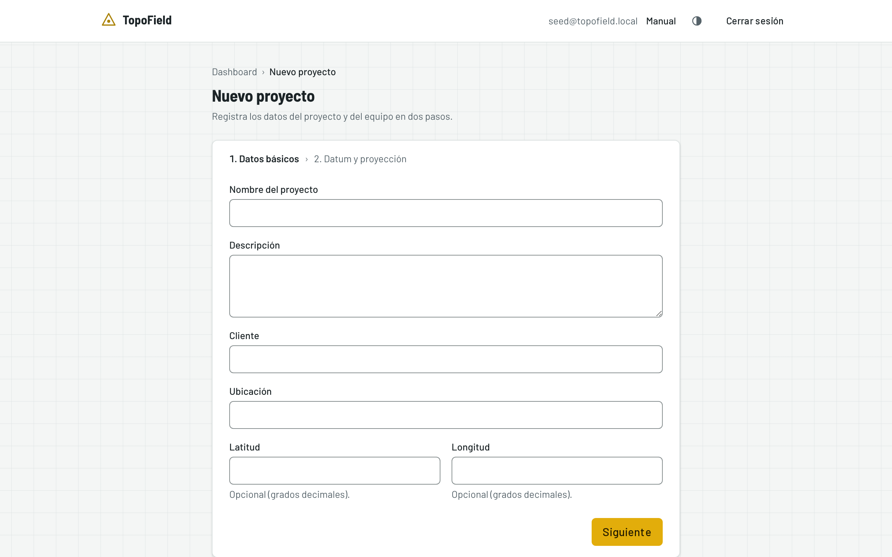

El formulario tiene dos pasos:

**Paso 1 — Datos básicos.** Nombre, descripción, cliente, ubicación y, si
quiere, las coordenadas geográficas en grados decimales.

**Paso 2 — Equipo y precisión.** Datum, proyección, datos del instrumento y el
**orden de precisión**.

> **El orden de precisión es la decisión más importante del proyecto.**
> Define las tolerancias que se exigirán a cada poligonal. Al elegirlo, el
> formulario le muestra la tolerancia angular y la precisión relativa mínima que
> implica:

| Orden | Tolerancia angular | Precisión relativa mínima | Uso típico |
|---|---|---|---|
| Primer orden | 1″·√n | 1:100.000 | Geodésico de alta precisión |
| Segundo orden | 5″·√n | 1:20.000 | Control urbano y catastral |
| Tercer orden | 15″·√n | 1:5.000 | Levantamiento topográfico común |
| Ordinario | 30″·√n | 1:3.000 | Levantamiento rural o reconocimiento |

Donde *n* es el número de ángulos medidos.

### 4.2 El proyecto por dentro

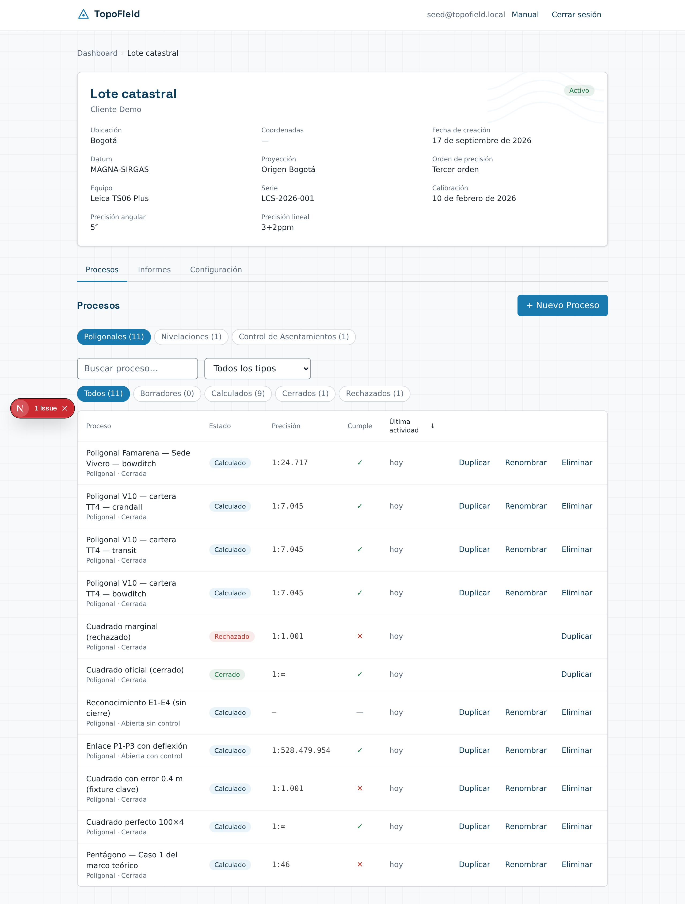

La ficha superior resume los datos del proyecto. Debajo, tres pestañas:

**Procesos** — el listado de levantamientos del proyecto. Se detalla en
[§ 4.3](#43-el-listado-de-procesos).

**Informes** — *pendiente de la fase 6.*

**Configuración** — edición de los datos del proyecto y gestión de los puntos de
referencia.

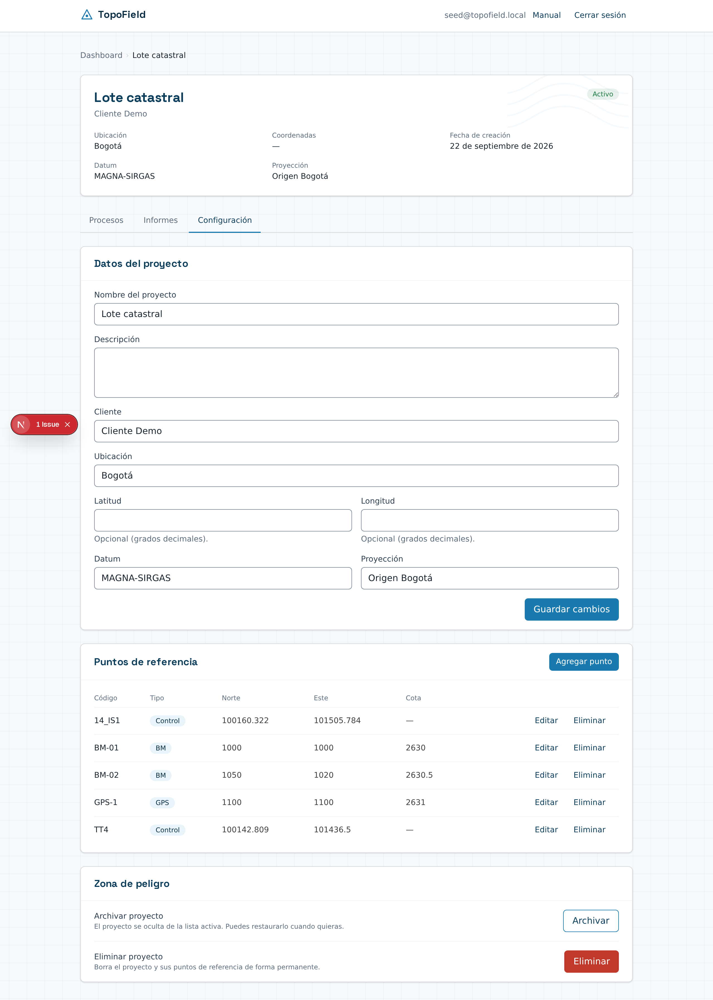

Los **puntos de referencia** son coordenadas conocidas (vértices geodésicos,
mojones) que puede reutilizar como punto de partida o de llegada de sus
poligonales, sin volver a teclearlas.

### 4.3 El listado de procesos

Todos los levantamientos del proyecto en una sola lista, con una barra para
encontrar lo que busca.

**Buscar.** Filtra por nombre mientras escribe. No distingue mayúsculas ni
acentos: «via» encuentra «Vía terciaria».

**Filtrar por estado.** Los chips muestran cuántos procesos hay en cada grupo,
así que ve la distribución del proyecto sin desplegar nada. Pulse uno para ver
solo ese grupo.

**Filtrar por tipo.** El selector acota a un tipo de poligonal.

Cuando hay algún filtro activo aparece **Limpiar filtros**, para volver a verlo
todo de un clic.

> El listado recuerda el último filtro que usó en cada proyecto, así que al
> volver lo encuentra como lo dejó. Si abre un enlace que alguien le compartió,
> manda lo que traiga ese enlace: verá lo mismo que quien se lo envió.

**Las columnas.**

| Columna | Qué muestra |
|---|---|
| Proceso | Nombre y tipo de poligonal |
| Estado | Borrador, Calculado, Cerrado o Rechazado |
| Precisión | La precisión relativa alcanzada |
| Cumple | ✓ si alcanza el orden del proyecto, ✕ si no, — si no aplica |
| Última actividad | Cuándo se modificó por última vez |

La columna **Cumple** es la que evita abrir cada proceso para saber si el
levantamiento sirve.

Pulse **Proceso**, **Precisión** o **Última actividad** para ordenar por esa
columna; pulsar de nuevo invierte el orden. Por defecto se ordena por actividad
reciente, así que lo que está trabajando queda arriba.

**Acciones por proceso.** Cada fila ofrece:

- **Duplicar** — crea un proceso nuevo con la misma configuración (tipo, punto
  de partida, método de corrección) pero sin estaciones, en estado Borrador.
- **Renombrar** — cambia el nombre sin abrir el editor.
- **Eliminar** — borra el proceso y sus estaciones, con confirmación previa.

> **Los procesos cerrados y rechazados solo se pueden duplicar.** No admiten
> renombrarse ni eliminarse, porque son inmutables. Si necesita rehacer un
> levantamiento cerrado, duplíquelo: obtendrá una copia editable y el original
> queda intacto como constancia.

En el teléfono, la tabla se convierte en tarjetas, una por proceso.

---

## 5. Poligonales

### 5.1 Tipos

TopoField maneja tres tipos, y la diferencia determina cómo se verifica el
trabajo:

| Tipo | Descripción | Cómo se verifica |
|---|---|---|
| **Cerrada** | Parte de un punto y regresa a él | Suma de ángulos + error de cierre lineal |
| **Abierta con control** | Parte de un punto conocido y llega a otro conocido | Comparación contra las coordenadas del punto de llegada |
| **Abierta sin control** | Parte de un punto conocido y no cierra | **No tiene verificación de cierre** |

La poligonal abierta sin control sirve para reconocimiento: calcula coordenadas,
pero no hay forma de comprobar si son correctas. La aplicación lo indica
explícitamente en vez de mostrar una precisión inexistente.

### 5.2 Crear una poligonal

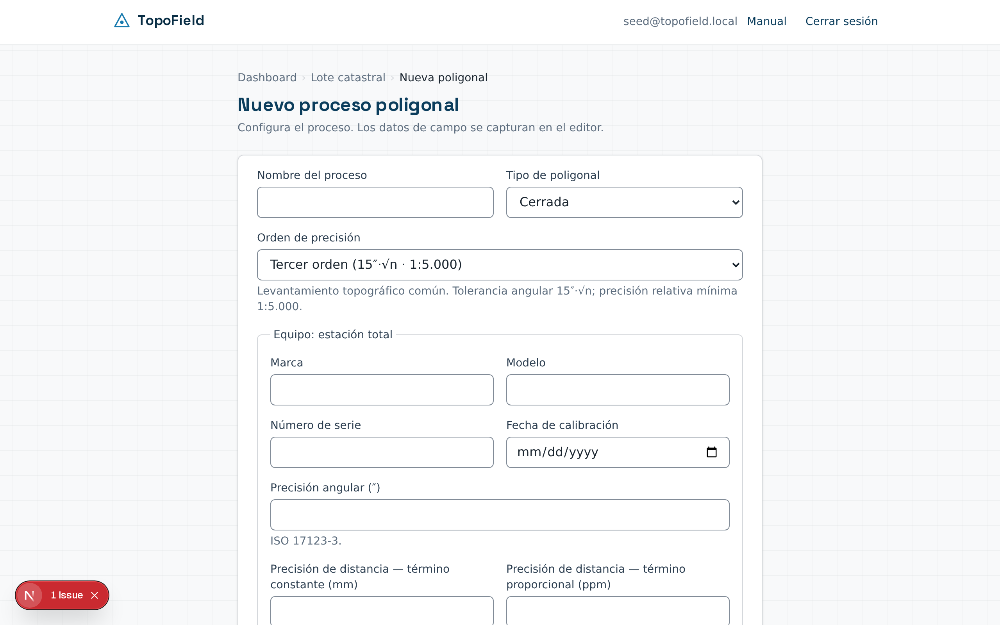

Desde el proyecto, **+ Nuevo Proceso → Poligonal**. Indique el nombre, el tipo y
el punto de partida (código, Norte, Este y azimut inicial).

Si el tipo es *abierta con control*, deberá indicar además el punto de llegada.

### 5.3 El editor

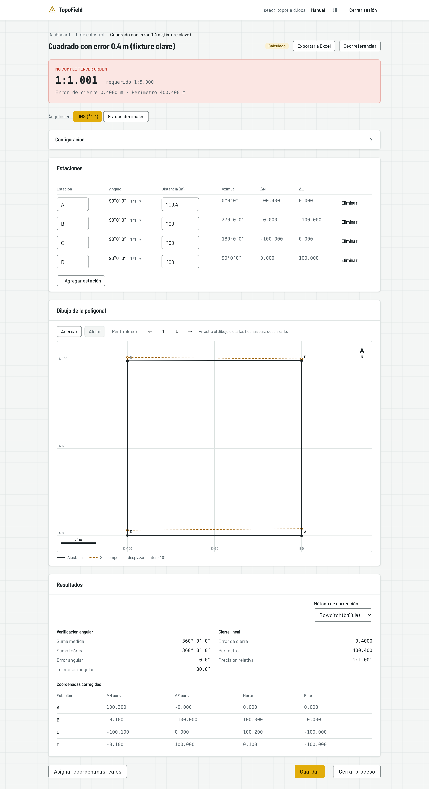

La pantalla se lee de arriba abajo:

**El veredicto.** Lo primero y más visible: si el levantamiento cumple o no el
orden de precisión exigido.

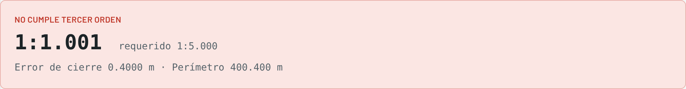

Muestra la precisión alcanzada junto a la requerida, el error de cierre y el
perímetro. El color lo resume: verde cumple, rojo no cumple.

**Configuración.** Plegada cuando el proceso ya está calculado. Ábrala para
cambiar el nombre, el tipo o el punto de partida.

**Estaciones.** La tabla de captura. Por cada estación registra el código, el
ángulo en grados-minutos-segundos y la distancia horizontal. A la derecha, la
aplicación calcula en vivo el azimut, ΔN y ΔE.

Los errores de captura se marcan al momento: una distancia de cero o mayor a
1000 m, minutos o segundos fuera del rango 0-59. Un ángulo de 0° o 360° genera
una advertencia, no un bloqueo: es válido, pero suele indicar un error de
tecleo.

**Resultados.** El detalle completo: verificación angular (suma medida contra
suma teórica, error y tolerancia), cierre lineal (error, perímetro, precisión
relativa) y la tabla de coordenadas corregidas.

Aquí elige el **método de corrección**:

| Método | Cómo reparte el error |
|---|---|
| **Bowditch** (brújula) | Proporcional a la longitud de cada lado. El más usado |
| **Tránsito** | Proporcional a las proyecciones. Útil si las distancias son menos fiables que los ángulos |
| **Crandall** | Mínimos cuadrados sobre las distancias, conservando los ángulos ajustados |

Cambiar el método recalcula las coordenadas al instante.

### 5.4 Reasignar coordenadas

El botón **Asignar coordenadas reales** permite recalcular toda la poligonal
desde un punto de partida distinto, conservando las mediciones. Es útil cuando
levantó en un sistema local y después obtuvo las coordenadas oficiales del
punto de arranque.

---

## 6. Cerrar un proceso

Cerrar es **irreversible**. Antes de permitirlo, la aplicación comprueba el
trabajo y decide entre tres desenlaces:

| Situación | Qué ocurre |
|---|---|
| Cumple las tolerancias | Se cierra como **Cerrado** |
| El error angular supera la tolerancia | **No se puede cerrar.** Corrija las mediciones |
| Cumple en ángulos pero la precisión relativa no alcanza | Solo se puede cerrar como **Rechazado** |
| Hay errores de captura pendientes | **No se puede cerrar.** Corrija las celdas marcadas |

La distinción importa: un error angular indica un fallo en la medición de
ángulos, que invalida el levantamiento. Una precisión relativa insuficiente
significa que el trabajo se hizo, pero no alcanza la calidad exigida — se
documenta como rechazado y queda constancia.

El diálogo de cierre resume el tipo, el perímetro, el error de cierre, la
precisión y la fecha. Debe marcar la confirmación explícitamente.

**Proceso cerrado:**

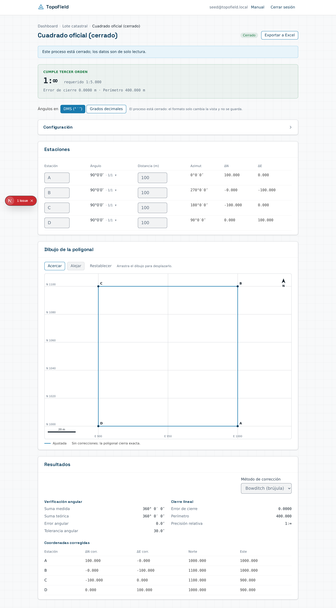

**Proceso rechazado:**

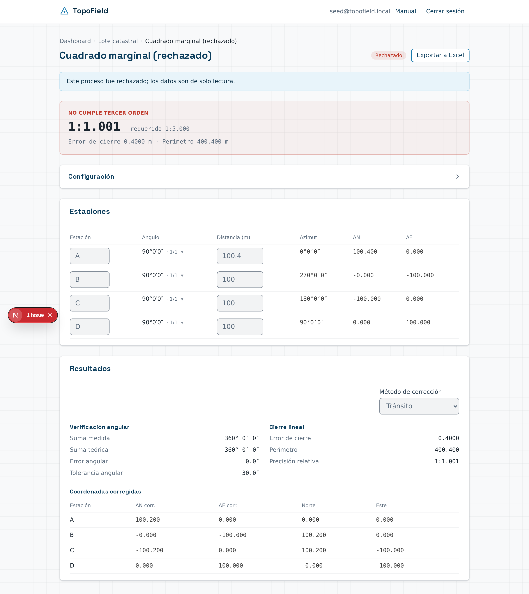

En ambos casos el editor se abre en solo lectura: los campos están
deshabilitados y no hay botones de guardado.

---

## 7. Trabajo en campo

La aplicación está pensada para usarse también desde el teléfono, en sitio.

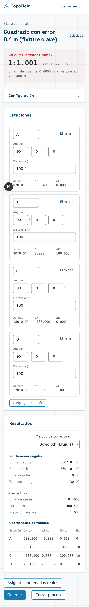

En pantallas pequeñas, la tabla de estaciones se convierte en **tarjetas**: una
por estación, con sus campos apilados y el azimut, ΔN y ΔE visibles sin
desplazamiento lateral. Los campos de grados, minutos y segundos son lo bastante
amplios para usarse con guantes.

La navegación se reduce a un retorno al nivel anterior, en lugar de la ruta
completa.

---

## 8. Módulos pendientes

Los siguientes módulos están especificados en el PRD pero **aún no
implementados**:

**Nivelación** *(fase 4)* — nivelación geométrica cerrada, de enlace e
ida y vuelta, con corrección proporcional a la distancia y tolerancia K·√D.

**Asentamientos** *(fase 5)* — control de asentamientos por punto, cálculo de
velocidades y semáforo de alertas por umbrales.

**Informes y exportación** *(fase 6)* — generación de informes en PDF, carteras
de campo y exportación de coordenadas.

La pestaña **Informes** del proyecto está visible pero vacía hasta entonces.

---

## 9. Preguntas frecuentes

**Cerré un proceso por error. ¿Puedo reabrirlo?**
No. El cierre es definitivo por diseño: es lo que da valor probatorio al
registro. Cree un proceso nuevo con los datos corregidos.

**¿Por qué mi poligonal no me deja cerrar?**
Revise el veredicto en la parte superior del editor. Si el error angular supera
la tolerancia, hay un problema en la medición de ángulos que debe corregir. Si
solo falla la precisión relativa, podrá cerrarla como rechazada.

**¿Por qué una poligonal muestra «Sin verificación de cierre»?**
Es de tipo *abierta sin control*: no regresa al punto de partida ni llega a un
punto conocido, así que no hay nada contra qué contrastar el resultado. Las
coordenadas se calculan, pero su exactitud no se puede verificar.

**¿Qué significa una precisión de 1:∞?**
Que el cierre fue exacto: el error lineal es cero o despreciable. Ocurre con
datos teóricos o levantamientos muy precisos.

**Cambié el orden de precisión del proyecto. ¿Se recalculan los procesos?**
Los procesos abiertos se reevalúan contra el orden nuevo al recalcularlos. Los
cerrados conservan su veredicto original, porque son inmutables.

**¿Otros usuarios pueden ver mis proyectos?**
No. Cada usuario accede solo a los suyos; la restricción se aplica en la base de
datos.

---

## Mantener este manual

Las capturas se regeneran con:

```bash
node docs/manual/capturas.mjs
```

Requiere el entorno local levantado (`npx supabase start`, `npm run dev`) y los
datos de ejemplo sembrados. El script consulta los identificadores en la base,
así que funciona después de cualquier `supabase db reset`.

Las capturas viven en **`public/manual/`**, una sola copia: la sirve la página
`/manual` de la aplicación, y este documento las referencia con una ruta
relativa (`../../public/manual/…`), que GitHub resuelve sin problema. Guardar
una segunda copia en `docs/` añadía 2,8 MB al historial de git en cada
regeneración, sin ganar nada.

Al implementar una fase nueva:

1. Mueva su sección de [Módulos pendientes](#8-módulos-pendientes) al cuerpo del
   manual y añada sus capturas.
2. Haga lo mismo en `src/app/(app)/manual/`: el texto en `manual-data.ts`, la
   sección nueva en `page.tsx`, y quite el módulo de `MODULOS_PENDIENTES`.
3. Regenere las capturas.
