# Manual de usuario — TopoField

TopoField es una plataforma web para gestionar procesos topográficos: registrar
los datos de campo, calcularlos con validación en tiempo real y cerrarlos con
trazabilidad.

Este manual cubre lo que la aplicación permite hacer **hoy**, que es el
alcance completo del proyecto: los tres módulos de proceso, el cierre con
trazabilidad, los informes y la exportación a Excel.

> **Este documento es la fuente de la redacción.** La página `/manual` de la
> aplicación (`src/app/(app)/manual/`) es una maquetación de este mismo texto
> con el sistema de diseño. El contenido vive por duplicado y no hay generación
> automática entre los dos: al cambiar la redacción aquí, refléjela allí en el
> mismo commit — y viceversa.

**Última actualización:** 2026-09-18 · Fase 8 (Precisión y equipo por
proceso) cerrada.

La aplicación está publicada en
**[topofield-app.vercel.app](https://topofield-app.vercel.app)**.

---

## Índice

1. [Conceptos básicos](#1-conceptos-básicos)
2. [Entrar a la aplicación](#2-entrar-a-la-aplicación)
3. [El dashboard](#3-el-dashboard)
4. [Proyectos](#4-proyectos)
5. [Poligonales](#5-poligonales)
6. [Nivelación](#6-nivelación)
7. [Control de Asentamientos](#7-control-de-asentamientos)
8. [Cerrar un proceso](#8-cerrar-un-proceso)
9. [Trabajo en campo](#9-trabajo-en-campo)
10. [Informes](#10-informes)
11. [Exportar a Excel](#11-exportar-a-excel)
12. [Preguntas frecuentes](#12-preguntas-frecuentes)

---

## 1. Conceptos básicos

Tres ideas ordenan toda la aplicación:

**Proyecto.** El contenedor de un trabajo topográfico. Guarda el cliente, la
ubicación, el datum y la proyección. El equipo usado y el **orden de
precisión** no viven aquí: cada proceso —poligonal, nivelación, visita de
asentamiento— declara los suyos, porque pueden cambiar de un levantamiento a
otro dentro de un mismo proyecto.

**Proceso.** Un levantamiento concreto dentro de un proyecto: una poligonal, una
nivelación, un control de asentamientos. Cada proceso pasa por estados:

| Estado | Significado |
|---|---|
| **Borrador** | Creado, sin datos suficientes |
| **En progreso** | Con datos de campo, aún sin cálculo completo |
| **Calculado** | Cálculo resuelto; se puede revisar y cerrar |
| **Cerrado** | Terminado y conforme. **Inmutable** |
| **Rechazado** | Terminado pero fuera de tolerancia. **Inmutable** |

**Cierre.** El acto de dar por terminado un proceso. Queda registrado con fecha,
hora y autor, y **a partir de ese momento los datos no se pueden modificar**. Es
lo que da trazabilidad al trabajo.

> **Sobre la inmutabilidad**
> Un proceso cerrado no se puede editar ni eliminar, ni desde la interfaz ni por
> ninguna otra vía. La restricción está aplicada en la propia base de datos, no
> solo en la pantalla. Si necesita corregir un levantamiento cerrado, cree uno
> nuevo.

---

## 2. Entrar a la aplicación


Ingrese con su correo y contraseña. Si aún no tiene cuenta, use **Regístrate**.

**Para crear una cuenta necesita un código de invitación.** Al registrarse se le
pide, junto con su nombre, correo y contraseña. Después recibirá un mensaje para
confirmar su dirección: hasta que pulse ese enlace no podrá entrar.

La primera vez que entre encontrará un **proyecto de ejemplo** con cuatro
poligonales ya calculadas, para que pueda ver cómo funciona la aplicación sin
capturar nada. Puede modificarlo o eliminarlo cuando quiera.

Cada usuario ve únicamente sus propios proyectos.

---

## 3. El dashboard

Es la pantalla de inicio tras entrar.


Arriba, tres indicadores del estado general:

- **Proyectos activos** — cuántos proyectos tiene en curso.
- **Procesos calculados** — levantamientos resueltos, listos para revisar y cerrar.
- **Fuera de tolerancia** — procesos calculados que no alcanzan el orden de
  precisión que ellos mismos declararon. Requieren revisión antes del cierre.

Debajo, sus proyectos. El selector **Activos / Archivados** filtra la lista.

Use **+ Nuevo Proyecto** para crear uno.

> **Empieza con un proyecto de ejemplo.** La primera vez que entra, su cuenta ya
> trae un **«Proyecto de ejemplo»** con poligonales, una nivelación, un lugar de
> control de asentamientos y sus informes, para que explore la aplicación con
> datos reales. Puede modificarlo o eliminarlo cuando quiera.

---

## 4. Proyectos

### 4.1 Crear un proyecto


El formulario tiene dos pasos:

**Paso 1 — Datos básicos.** Nombre, descripción, cliente, ubicación y, si
quiere, las coordenadas geográficas en grados decimales.

**Paso 2 — Datum y proyección.** El sistema de referencia del proyecto.

> **El equipo y el orden de precisión no se piden aquí.** Se declaran en cada
> proceso: cada poligonal, cada nivelación y cada visita de asentamiento tiene
> su propia configuración de orden y equipo, con los campos que corresponden a
> su tipo de instrumento. Un mismo proyecto puede así tener trabajos de
> distinto orden, medidos con instrumentos distintos y en fechas distintas.
> Vea [§ 5.2](#52-crear-una-poligonal), [§ 6.4](#64-crear-una-nivelación) y
> [§ 7.3](#73-registrar-una-visita).

### 4.2 El proyecto por dentro


La ficha superior resume los datos del proyecto. Debajo, tres pestañas:

**Procesos** — el listado de levantamientos del proyecto. Se detalla en
[§ 4.3](#43-el-listado-de-procesos).

**Informes** — genera los informes de cierre del proyecto con los procesos ya
cerrados, listos para imprimir o guardar como PDF. Se detalla en
[§ 10](#10-informes).

**Configuración** — edición de los datos del proyecto y gestión de los puntos de
referencia.


Los **puntos de referencia** son coordenadas conocidas (vértices geodésicos,
mojones) que puede reutilizar como punto de partida o de llegada de sus
poligonales, sin volver a teclearlas.

### 4.3 El listado de procesos

Todos los levantamientos del proyecto en una sola lista, con una barra para
encontrar lo que busca.

**Buscar.** Filtra por nombre mientras escribe. No distingue mayúsculas ni
acentos: «via» encuentra «Vía terciaria».

**Filtrar por estado.** Los chips muestran cuántos procesos hay en cada grupo,
así que ve la distribución del proyecto sin desplegar nada. Pulse uno para ver
solo ese grupo.

**Filtrar por tipo.** El selector acota a un tipo de poligonal.

Cuando hay algún filtro activo aparece **Limpiar filtros**, para volver a verlo
todo de un clic.

> El listado recuerda el último filtro que usó en cada proyecto, así que al
> volver lo encuentra como lo dejó. Si abre un enlace que alguien le compartió,
> manda lo que traiga ese enlace: verá lo mismo que quien se lo envió.

**Las columnas.**

| Columna | Qué muestra |
|---|---|
| Proceso | Nombre y tipo de poligonal |
| Estado | Borrador, Calculado, Cerrado o Rechazado |
| Precisión | La precisión relativa alcanzada |
| Cumple | ✓ si alcanza su orden de precisión, ✕ si no, — si no aplica |
| Última actividad | Cuándo se modificó por última vez |

La columna **Cumple** es la que evita abrir cada proceso para saber si el
levantamiento sirve.

Pulse **Proceso**, **Precisión** o **Última actividad** para ordenar por esa
columna; pulsar de nuevo invierte el orden. Por defecto se ordena por actividad
reciente, así que lo que está trabajando queda arriba.

**Acciones por proceso.** Cada fila ofrece:

- **Duplicar** — crea un proceso nuevo con la misma configuración (tipo, punto
  de partida, método de corrección) pero sin estaciones, en estado Borrador.
- **Renombrar** — cambia el nombre sin abrir el editor.
- **Eliminar** — borra el proceso y sus estaciones, con confirmación previa.

> **Los procesos cerrados y rechazados solo se pueden duplicar.** No admiten
> renombrarse ni eliminarse, porque son inmutables. Si necesita rehacer un
> levantamiento cerrado, duplíquelo: obtendrá una copia editable y el original
> queda intacto como constancia.

En el teléfono, la tabla se convierte en tarjetas, una por proceso.

---

## 5. Poligonales

### 5.1 Tipos

TopoField maneja tres tipos, y la diferencia determina cómo se verifica el
trabajo:

| Tipo | Descripción | Cómo se verifica |
|---|---|---|
| **Cerrada** | Parte de un punto y regresa a él | Suma de ángulos + error de cierre lineal |
| **Abierta con control** | Parte de un punto conocido y llega a otro conocido | Comparación contra las coordenadas del punto de llegada |
| **Abierta sin control** | Parte de un punto conocido y no cierra | **No tiene verificación de cierre** |

La poligonal abierta sin control sirve para reconocimiento: calcula coordenadas,
pero no hay forma de comprobar si son correctas. La aplicación lo indica
explícitamente en vez de mostrar una precisión inexistente.

### 5.2 Crear una poligonal


Desde el proyecto, **+ Nuevo Proceso → Poligonal**. Indique el nombre, el tipo,
el punto de partida (código, Norte, Este y azimut inicial), el **orden de
precisión** y los datos de la **estación total** con que va a medir: marca,
modelo, número de serie, fecha de calibración, precisión angular (en segundos,
ISO 17123-3) y precisión de distancia como término constante en mm más
término proporcional en ppm (ISO 17123-4).

Si el tipo es *abierta con control*, deberá indicar además el punto de llegada.

Arriba del formulario elige si tecleará los ángulos en **DMS** o en **grados
decimales** (ver [§ 5.3](#53-el-editor)).

> **El orden de precisión es la decisión más importante del proceso.** Define
> las tolerancias que se le exigirán al cierre. Al elegirlo, el formulario le
> muestra la tolerancia angular y la precisión relativa mínima que implica:

| Orden | Tolerancia angular | Precisión relativa mínima | Uso típico |
|---|---|---|---|
| Primer orden | 1″·√n | 1:100.000 | Geodésico de alta precisión |
| Segundo orden | 5″·√n | 1:20.000 | Control urbano y catastral |
| Tercer orden | 15″·√n | 1:5.000 | Levantamiento topográfico común |
| Ordinario | 30″·√n | 1:3.000 | Levantamiento rural o reconocimiento |

Donde *n* es el número de ángulos medidos.

> **Si la precisión angular del equipo no alcanza para el orden elegido, la
> aplicación se lo advierte** junto al campo de precisión angular — por
> ejemplo, una estación de 5″ con primer orden declarado (cuya tolerancia
> parte de 1″). Es un aviso, no un bloqueo: puede seguir capturando, porque la
> decisión de si el equipo basta es suya. Un equipo que cumple justo el orden
> (5″ con tercer orden, cuya tolerancia parte de 15″) no dispara el aviso.

### 5.3 El editor


La pantalla se lee de arriba abajo:

**El veredicto.** Lo primero y más visible: si el levantamiento cumple o no el
orden de precisión exigido.


Muestra la precisión alcanzada junto a la requerida, el error de cierre y el
perímetro. El color lo resume: verde cumple, rojo no cumple.

**Ángulos en DMS o en grados decimales.** Bajo el veredicto, el conmutador
**Ángulos en** elige cómo teclea los ángulos: en tres casillas (grados, minutos,
segundos) o en un solo campo de grados decimales. Afecta a las lecturas de las
estaciones, a los azimuts de partida y de llegada y al diálogo de reasignación.

- Cambiar de formato **no altera ningún valor**: la aplicación guarda los
  ángulos siempre en DMS y el decimal es solo otra forma de verlos, con seis
  decimales.
- Los ángulos se guardan a la **décima de segundo**. Si teclea un decimal con
  más precisión, bajo el campo aparece cómo se guardará —«Se guarda como
  124°29′42″»—.
- El formato se recuerda por proceso: al volver a abrirlo, aparece como lo
  dejó. En un proceso cerrado el conmutador solo cambia la vista.
- Resultados, informe y Excel muestran siempre DMS.

**Configuración.** Plegada cuando el proceso ya está calculado. Ábrala para
cambiar el nombre, el tipo, el punto de partida, el orden de precisión o los
datos de la estación total — los mismos campos del alta, editables mientras el
proceso siga abierto.

Ahí elige también el **tipo de ángulo** y el **punto de amarre**. TopoField no
preselecciona el tipo de ángulo a propósito: si recorre el polígono en un
sentido sus lecturas caen como interiores y en el otro como exteriores, y elegir
por usted produciría un levantamiento espejado sin ningún aviso.

El punto de amarre sale del catálogo de puntos del proyecto —solo aparecen los
que tienen coordenadas—, y con él **el azimut se calcula solo** desde las
coordenadas del arranque y las de la referencia. Si su cartera cierra visando de
vuelta al amarre, marque la casilla correspondiente: la última fila será ese
ángulo de cierre y no llevará distancia.

**Estaciones.** La tabla de captura. Por cada estación registra el código, el
ángulo y la distancia horizontal. A la derecha, la aplicación calcula en vivo el
azimut, ΔN y ΔE.

El ángulo se captura con **varias lecturas**. La celda muestra el promedio, la
dispersión entre lecturas y cuántas lleva de las exigidas —por ejemplo
`211°15'7″ · ±3.0″ · 3/3`—; al pulsarla se despliegan las lecturas individuales
y un botón para añadir más. El proceso exige un mínimo configurable, 3 por
defecto, y el promedio es el que alimenta el cálculo.

La dispersión avisa cuando supera lo que su equipo resuelve. Tres lecturas que
difieren 40″ con un teodolito de 5″ no son repetibilidad: son un error de
puntería o de tecleo. Es un aviso, no un bloqueo.

Los errores de captura se marcan al momento: una distancia de cero o mayor a
1000 m, minutos o segundos fuera del rango 0-59. Un ángulo de 0° o 360° genera
una advertencia, no un bloqueo: es válido, pero suele indicar un error de
tecleo.

**Resultados.** El detalle completo: verificación angular (suma medida contra
suma teórica, error y tolerancia), cierre lineal (error, perímetro, precisión
relativa) y la tabla de coordenadas corregidas.

Si su poligonal está amarrada aparece además el **control de reorientación**:
el último azimut de la cadena debe volver al azimut de amarre. Es un control de
calidad de su levantamiento, no un criterio de tolerancia, así que no impide
cerrar el proceso.

Aquí elige el **método de corrección**:

| Método | Cómo reparte el error |
|---|---|
| **Bowditch** (brújula) | Proporcional a la longitud de cada lado. El más usado |
| **Tránsito** | Proporcional a las proyecciones. Útil si las distancias son menos fiables que los ángulos |
| **Crandall** | Mínimos cuadrados sobre las distancias, conservando los ángulos ajustados |
| **Mínimos cuadrados** | Ajusta a la vez ángulos y distancias según el peso que usted les da. Solo en cerrada y abierta con control |

Cambiar el método recalcula las coordenadas al instante.

**Mínimos cuadrados.** Los otros tres métodos reparten el error con una regla
fija; este busca las correcciones más pequeñas —pesadas por la precisión de
cada observación— que hacen cerrar la poligonal. Al elegirlo aparecen tres
campos:

- **σ angular (″)**: la desviación típica que supone para cada ángulo.
- **σ de distancia (m)**: la de una medición de distancia.
- **Mediciones por distancia**: cuántas veces midió cada lado. Una distancia
  medida *n* veces pesa como σ/√*n*.

Todas las observaciones pesan igual. Los campos **salen vacíos**: la
aplicación no supone pesos por usted. La hoja de la universidad usa, por
ejemplo, 2″, 0.011 m y 2 mediciones. Mientras falte alguno verá «Faltan los
pesos del ajuste», sin coordenadas, y no podrá guardar.

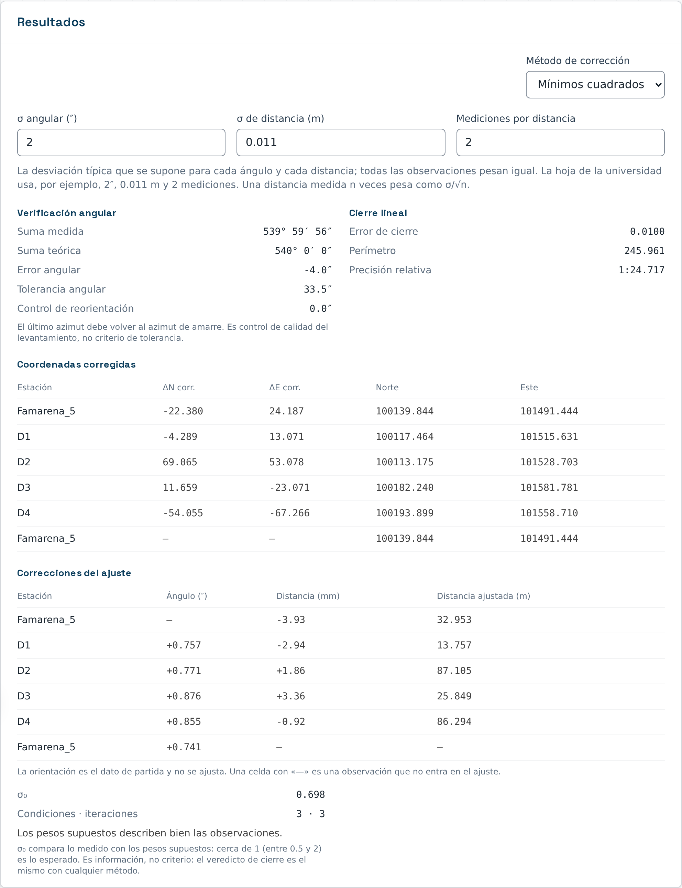

Con los pesos completos, **Resultados** suma una tabla con la **corrección de
cada ángulo**, en segundos, y de **cada distancia**, en milímetros, junto a la
distancia ajustada. El ángulo de orientación no se ajusta: es el dato de
partida. Debajo aparece **σ₀**, que compara lo medido con los pesos que
supuso:

- **Cerca de 1** (entre 0.5 y 2): los pesos describen bien sus observaciones.
- **Mayor que 2**: midió peor de lo supuesto, o hay un error grueso en la
  cartera.
- **Menor que 0.5**: sus σ son pesimistas; midió mejor de lo declarado.

Si los pesos están pero no hay ajuste posible, un aviso dice por qué: con un
solo lado, por ejemplo, las condiciones de llegada dependen de una sola
distancia y no hay nada que ajustar.

σ₀ es información, no un criterio. El **veredicto de cierre es el mismo** con
cualquier método: se juzga con el error de la cartera tal como se midió, antes
de corregir.

**Dibujo de la poligonal.** La poligonal a escala sobre una grilla de
coordenadas, con flecha de norte, barra de escala y el amarre si lo tiene. Se
actualiza en vivo mientras captura.

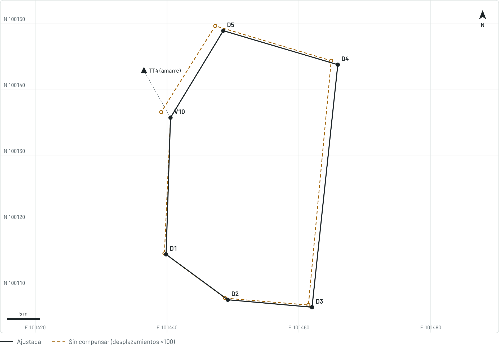

- En **trazo continuo**, la poligonal **ajustada**.
- En **trazo discontinuo**, la poligonal **sin compensar**, con los
  desplazamientos **exagerados** por el factor que indica la leyenda (×100 en
  la imagen). En una cerrada no llega a cerrar: el hueco del último vértice
  es el error de cierre.

> **Por qué se exagera.** En un buen levantamiento el error de cierre es de
> centímetros sobre cientos de metros: dibujado a escala real, ocupa menos de
> un píxel y las dos poligonales se verían idénticas. El factor se elige solo
> —1, 2 o 5 × 10ⁿ— para que el mayor desplazamiento ocupe alrededor del 5 %
> del dibujo, y nunca es menor que 1. Una abierta sin control no tiene nada que
> compensar y no muestra trazo discontinuo.

Con **Acercar**, **Alejar** y **Restablecer**, y con las **flechas** o
arrastrando el dibujo, puede acercarse a un vértice; todos los controles
funcionan con el teclado. Si el amarre está lejos, queda fuera del encuadre y
solo se ve su línea de orientación: la leyenda lo indica. La rueda del ratón no hace zoom, para no interferir con
el desplazamiento de la página. El factor de exageración no cambia al
acercarse.

### 5.4 Reasignar coordenadas

El botón **Asignar coordenadas reales** permite recalcular toda la poligonal
desde un punto de partida distinto, conservando las mediciones. Es útil cuando
levantó en un sistema local —1000, 1000— y después obtuvo las coordenadas
oficiales.

Si el proceso está amarrado, el diálogo pide también las coordenadas reales del
punto de amarre y **recalcula el azimut** a partir de las dos: no hay que
teclearlo.

Lo que no cambia al reasignar: el error angular, el error de cierre y la
precisión relativa. Girar y trasladar la poligonal no altera nada de lo que el
cierre certifica; solo se mueven las coordenadas.

---

## 6. Nivelación

### 6.1 Tipos

TopoField maneja tres tipos de nivelación geométrica:

| Tipo | Descripción | Cómo se verifica |
|---|---|---|
| **Cerrada** | Sale de un BM y vuelve a ese mismo BM | Error de cierre contra la cota de partida |
| **De enlace** | Va de un BM conocido a otro BM conocido distinto | Error de cierre contra la cota de llegada |
| **Abierta sin control** | No cierra contra ningún BM | **No tiene verificación de cierre** |

La nivelación abierta sin control sirve solo para reconocimiento: calcula
cotas, pero no hay forma de comprobar si son correctas, igual que la
poligonal abierta sin control (§ 5.1). No se puede calcular error de cierre ni
compensar.

### 6.2 Cómo se llena la libreta

La libreta es una fila por punto. Cada fila puede llevar dos lecturas:

- **Vista más (V+)** — la primera que se toma tras estacionar el nivel. Con
  ella se **abre la armada siguiente**: fija la altura del instrumento
  (AI = cota + V+) que usarán las filas venideras.
- **Vista menos (V−)** — **fija la cota del punto** de la fila. Viene de la
  armada anterior: cota = AI − V−.

Los nombres dicen qué hace cada número en la cuenta: la vista más se suma y la
vista menos se resta. Son los de la cartera de campo.

Por eso la columna **AI solo tiene valor en las filas que llevan V+**: la
altura de instrumento es un dato de la armada, no de la fila. Una fila con
solo V− (que cierra una armada sin abrir la siguiente) no muestra AI propia;
usa la de la armada en curso.

### 6.3 Tipos de punto

Cada fila indica de qué tipo es el punto que registra:

| Tipo | Qué hace | Lecturas que lleva |
|---|---|---|
| **BM** | Banco de nivel, de cota conocida. Ancla el recorrido | La primera fila solo lleva V+; la última, si es BM, solo lleva V− |
| **Punto de cambio** | Transmite la cota de una armada a la siguiente | V+ y V− (salvo en los extremos) |
| **Intermedio (radiación)** | Solo se lee para conocer su cota, sin continuar el recorrido a través de él | Solo V− |

El punto intermedio cuelga de la AI vigente pero **no propaga cota ni abre
una armada nueva**, y por eso queda fuera de la comprobación aritmética y de
la compensación: un error en su lectura no contamina el resto del recorrido,
pero tampoco se corrige.

### 6.4 Crear una nivelación

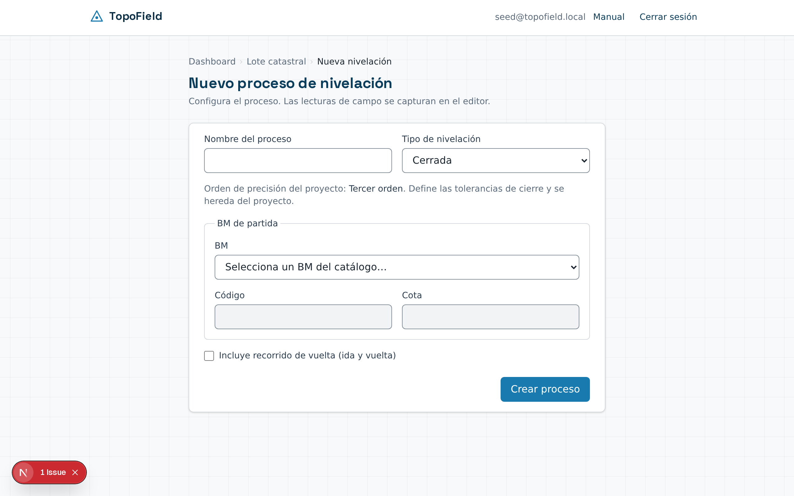

Desde el proyecto, **+ Nuevo Proceso → Nivelación**. Indique el nombre, el
tipo y el BM de partida: puede elegirlo del catálogo de puntos de referencia
del proyecto (autocompleta código y cota) o teclearlo directamente si no lo
tiene registrado. Indique también el **orden de precisión** y los datos del
**nivel**: marca, modelo, número de serie, fecha de calibración, tipo
(automático o digital) y desviación típica en mm por km de doble nivelación
(ISO 17123-2).

Si el tipo es *de enlace*, deberá indicar además el BM de llegada. Marque
**Incluye recorrido de vuelta** si va a medir ida y vuelta.

> **Si la desviación típica del nivel no alcanza para el orden elegido, la
> aplicación se lo advierte** junto al campo de desviación típica — por
> ejemplo, un nivel de obra de 5.0 mm/km con primer orden declarado (cuya
> tolerancia parte de 3 mm/km). Es un aviso, no un bloqueo: 2.5 mm/km con
> primer orden es ajustado pero posible, y no lo dispara.

### 6.5 El editor

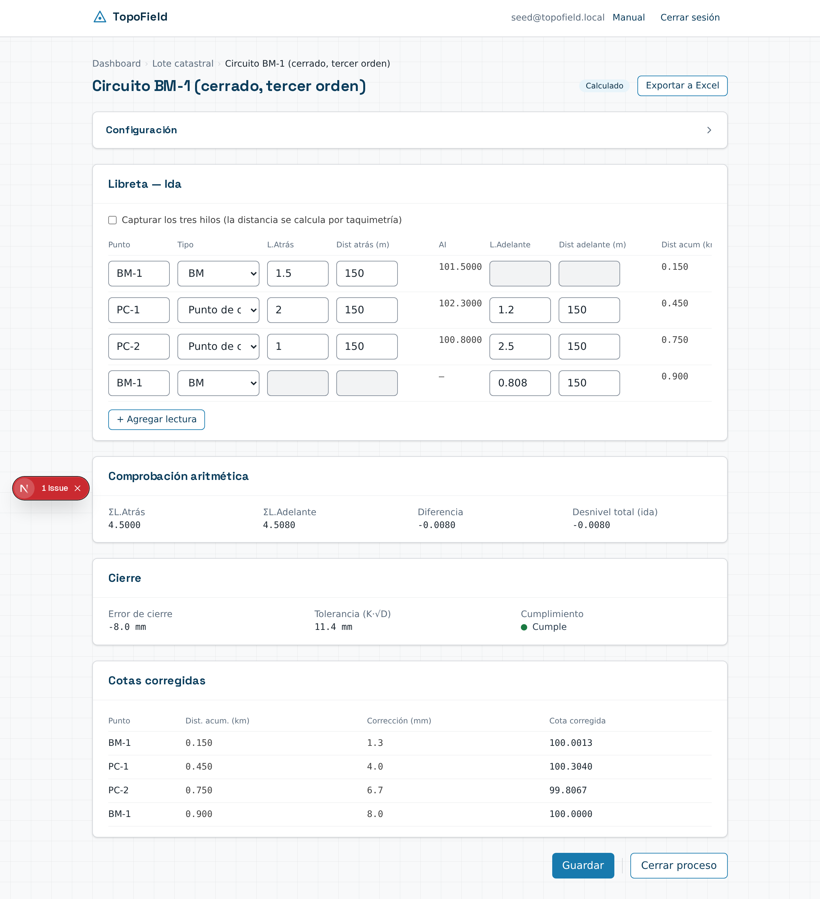

**Configuración.** Plegada cuando el proceso ya está calculado. Ábrala para
cambiar el nombre, el tipo, los BM o el orden de precisión y el equipo de
nivel — los mismos campos del alta, editables mientras el proceso siga
abierto.

La libreta se captura por fila: punto, tipo, V+ y V−, y la **distancia a
cada mira**. La distancia acumulada y la distancia total del
recorrido **no se teclean**: la aplicación las suma sola y las muestra en solo
lectura.

> **La distancia a cada mira es obligatoria en los BM y en los puntos de
> cambio.** Sin ella el recorrido no acumula, la distancia total sale menor de
> la real y el punto de cierre queda mal corregido — con el proceso informando
> que cumple. Los puntos intermedios no la necesitan: no entran en la
> compensación.

**Los tres hilos, con nivel automático.** Si el proceso declara un nivel
automático, la libreta ofrece capturar los tres hilos estadimétricos de cada
visual. Marque «Capturar los tres hilos» y aparecerán las casillas del hilo
superior y el inferior; la aplicación calcula entonces la distancia por
taquimetría, `D = (HS − HI) × 100`, y rellena la lectura de mira con el hilo
medio si aún está vacía.

Son **opcionales**: si midió la distancia a cinta, teclee la distancia y deje
los hilos en blanco. Y si ya anotó la lectura, teclear los hilos no la
sobrescribe.

Cuando están los tres, la aplicación comprueba que el hilo medio sea el
promedio de los otros dos. Si no cuadra, avisa: es un error de lectura o de
transcripción.

**Equilibrado de visuales.** Con las dos distancias de una armada, la
aplicación avisa si la V+ y la V− quedaron a distancias muy distintas. Equilibrarlas cancela el error de colimación del nivel, así que
es la regla de campo más importante de la nivelación de precisión. El límite
depende del orden: 2 m en primer orden, 3 en segundo, 4 en tercero y 6 en
ordinario.

> Con **nivel digital** el instrumento entrega la distancia y no se leen
> hilos: se teclean la lectura y la distancia.

**Comprobación aritmética.** ΣV+ − ΣV− debe coincidir con el
desnivel total del recorrido. Es una verificación de gabinete: confirma que
las sumas y traslados de la libreta son correctos, **no dice nada sobre la
calidad de la medición** — cuadra igual con un nivel descolimado. Los puntos
intermedios quedan fuera de esta suma.

**Cierre.** El error de cierre se compara contra la tolerancia K·√D, donde D
es la distancia del recorrido **en un solo sentido**, en kilómetros, y K
depende del orden de precisión que declaró el proceso:

| Orden | K (mm) |
|---|---|
| Primer orden | 3 |
| Segundo orden | 6 |
| Tercer orden | 12 |
| Ordinario | 24 |

**Corrección proporcional a la distancia.** Si el cierre cumple la
tolerancia, la aplicación reparte el error entre los puntos según su
distancia acumulada: a mayor distancia del origen, mayor corrección. El
resultado es que el **BM final cierra exacto** contra su cota conocida, con
corrección igual y de signo opuesto al error de cierre.

### 6.6 Ida y vuelta

Al activar el recorrido de vuelta, la libreta muestra dos pestañas. Ida y
vuelta son **mediciones independientes**: cada una tiene sus propios puntos
de cambio, y no hace falta —de hecho es mejor no— reocupar los mismos puntos
en los dos sentidos.

La aplicación compara los **desniveles totales** de ambos recorridos. La
discrepancia entre ellos se contrasta contra **T·√2**, donde T es la misma
tolerancia K·√D del cierre individual.

### 6.7 Cierre irreversible

Igual que en poligonales, cerrar una nivelación es **irreversible**
(§ 7). Un trabajo que no alcanza la tolerancia solo puede cerrarse como
**rechazado**; no hay forma de cerrarlo como conforme si no cumple.

---

## 7. Control de Asentamientos

El control de asentamientos sigue el descenso de una estructura en el tiempo:
cada visita mide la cota de un conjunto de puntos, y la aplicación calcula
cuánto ha bajado cada uno desde la visita anterior y desde el inicio.

### 7.1 El lugar

Un **lugar** es el sitio que se monitorea: un edificio, una presa, un
terraplén. Agrupa un catálogo de puntos de control y sus visitas sucesivas —
es el equivalente, para este módulo, a lo que una poligonal o una nivelación
son para los otros dos.

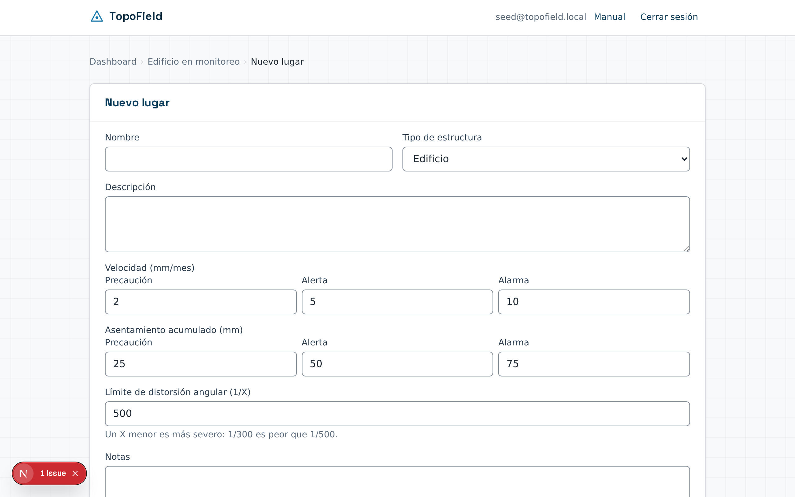

Desde el proyecto, **+ Nuevo Proceso → Control de Asentamientos**. Indique el
nombre y el **tipo de estructura**: edificio, presa, terraplén u otro. Elegir
el tipo aplica un juego de **umbrales de alerta** típico para ese tipo de
estructura — de velocidad y de asentamiento acumulado — que puede editar a
continuación si el caso lo requiere.

También define el **límite de distorsión angular**, expresado como `1/X`: un
X menor es más severo (1/300 es peor que 1/500).

### 7.2 Catalogar los puntos

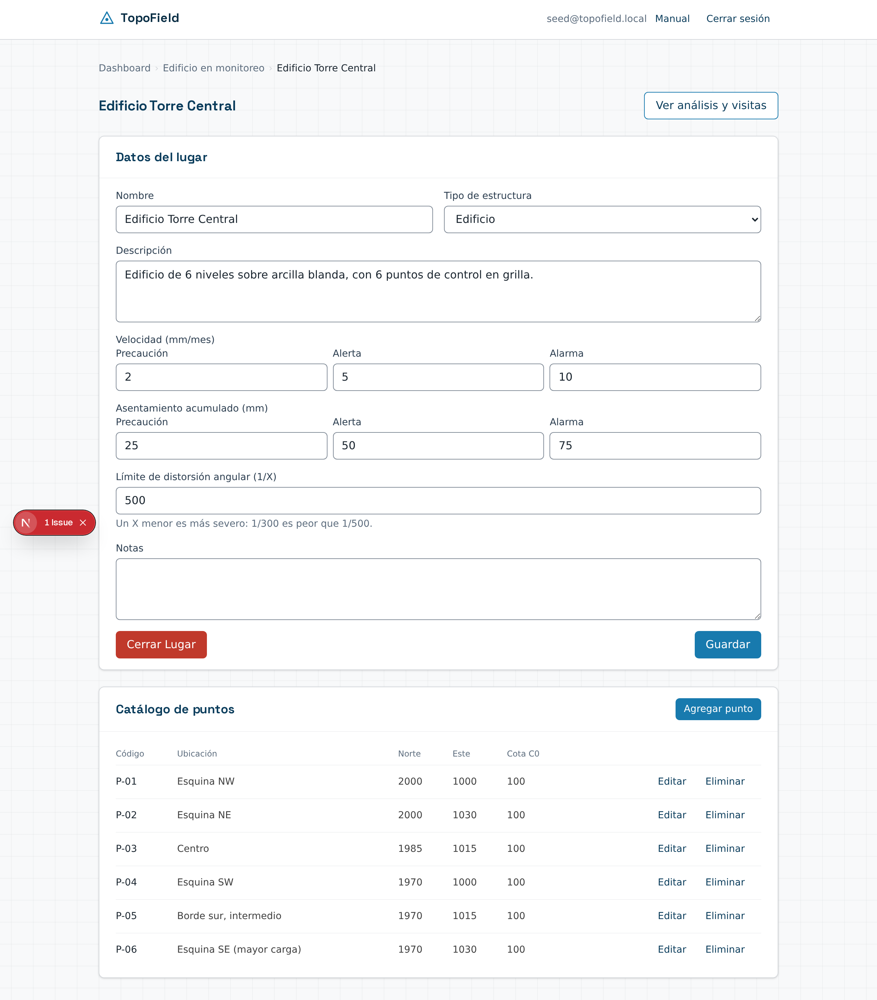

Ya creado el lugar, agregue sus **puntos de control**: código, ubicación,
coordenadas Norte/Este (opcionales, pero necesarias para calcular distorsión
angular entre puntos) y la **cota inicial (C0)** — la referencia contra la
que se mide el asentamiento acumulado de todas las visitas futuras.

La C0 es opcional. Si la deja vacía, la **línea base del punto es su primera
lectura**: esa lectura queda con acumulado 0 y las siguientes se miden contra
ella.

El catálogo puede cambiar a mitad del monitoreo —un punto se destruye, otro se
instala—; ver [§ 7.6](#76-dar-de-baja-y-de-alta-un-punto).

### 7.3 Registrar una visita

Cada **visita** es una fecha en la que se releyeron los puntos del catálogo.
La primera visita registrada es la **visita 0 o línea base**: fija el punto
de partida y no tiene asentamiento ni velocidad propios, porque no hay una
visita anterior contra la que compararla.

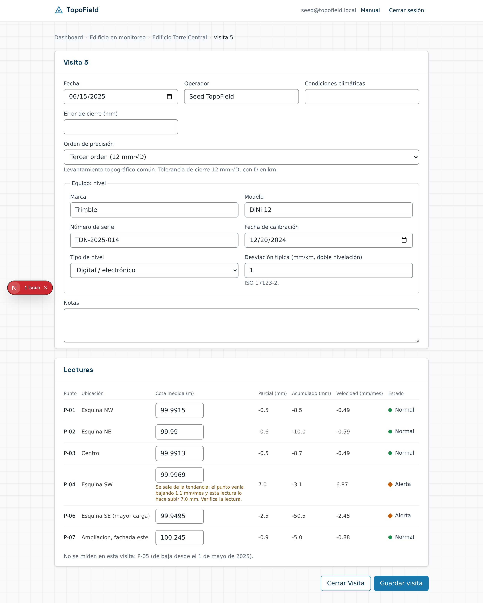

Cada visita declara también el **orden de precisión** con que se midió y los
datos del **nivel** usado: marca, modelo, número de serie, fecha de
calibración, tipo (automático o digital) y desviación típica en mm por km de
doble nivelación (ISO 17123-2). El instrumento puede cambiar entre una visita
y la siguiente —pueden pasar meses—, así que cada visita lleva su propio
equipo, no el lugar.

> **Si la desviación típica del nivel no alcanza para el orden que declaró la
> visita, la aplicación se lo advierte**, con el mismo criterio que en
> nivelación (§ 6.5): un nivel de 5.0 mm/km con primer orden (K = 3) avisa; uno
> de 2.5 mm/km, ajustado pero posible, no. Es un aviso, no un bloqueo.

La tabla pide los puntos **vigentes** en la fecha de la visita. Un punto de
baja, o dado de alta después de esa fecha, no aparece, y una nota debajo de la
tabla dice cuál falta y por qué, para que la ausencia no parezca un olvido.

Por cada punto se captura la **cota medida**. La aplicación calcula al
instante:

- **Parcial** — cuánto bajó (o subió) el punto desde la visita anterior, en mm.
- **Acumulado** — cuánto ha bajado desde la línea base del punto —su C0 o,
  sin C0, su primera lectura—, en mm.
- **Velocidad** — el parcial dividido entre el tiempo transcurrido, en
  mm/mes. **Se calcula con los días reales entre las dos visitas**, no con
  «un mes» genérico: una visita a 28 días y otra a 31 no dan la misma
  velocidad aunque el parcial fuera igual.
- **Estado** — el nivel de alerta de ese punto, semáforo explicado en
  [§ 7.4](#74-el-semáforo-y-la-gráfica).

Un valor positivo es un **levantamiento**, no un asentamiento, y se muestra
como tal: es un hallazgo que vale la pena revisar, no un error de signo.

**Lecturas fuera de tendencia.** Desde la tercera lectura de un punto, la
aplicación compara cada cota con la tendencia de ese punto y avisa bajo la
casilla si la lectura:

- va **contra** su tendencia más que el margen —por ejemplo, un punto que
  viene bajando y de pronto sube—, o
- lo mueve **más del doble** de lo que su ritmo anterior preveía, más el
  margen.

El margen absorbe el ruido de medición y depende del orden de precisión de la
visita: 1,5 mm en primer orden, 3 en segundo, 6 en tercero y 12 en ordinario.
Moverse **menos** de lo previsto nunca avisa, porque un asentamiento por
consolidación frena con el tiempo.

> **El aviso no bloquea.** Pide verificar la lectura en la libreta o volver a
> medir; una lectura atípica también puede ser real. Si dos visitas seguidas
> salen marcadas, casi siempre el error está en la primera: la segunda se
> compara contra una velocidad ya contaminada.

### 7.4 El semáforo y la gráfica

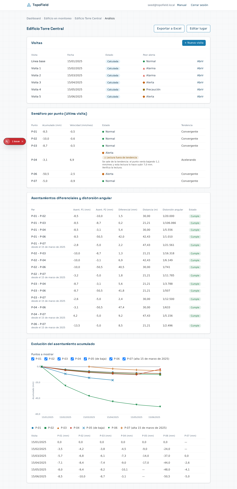

El panel del lugar reúne el historial completo:

**Visitas.** La lista cronológica, con la peor alerta de cada una.

**Semáforo por punto.** El estado de cada punto en la última visita, según
sus umbrales de velocidad y de acumulado — gana el peor de los dos. Tiene
cuatro niveles:

| Nivel | Significado | Forma |
|---|---|---|
| **Normal** | Dentro de todos los umbrales | ● círculo |
| **Precaución** | Supera el primer umbral; vigile la tendencia | ■ cuadrado |
| **Alerta** | Supera el segundo umbral; revise el punto | ◆ rombo |
| **Alarma** | Supera el umbral más alto; requiere atención inmediata | ▲ triángulo |

> **El semáforo no se distingue solo por color.** Cada nivel tiene además una
> forma propia y su nombre escrito junto al indicador, así que se reconoce
> igual con daltonismo o en una impresión en blanco y negro.

La columna de estado del semáforo muestra además la marca **⚠ Lectura fuera
de tendencia** cuando la lectura de la última visita la tuvo. No cambia el
nivel del semáforo: es un aviso sobre la calidad del dato, no sobre la
gravedad del movimiento. Es útil cuando el mismo punto sale en **Alerta** y
**Acelerando**: la marca indica que lo más probable es una lectura mal tomada,
no una aceleración real.

**Un dato en alarma se registra con normalidad.** El semáforo es un
diagnóstico, no un control de captura: la aplicación **nunca** impide guardar
una visita ni cerrarla por tener puntos en alerta o alarma. Un asentamiento
alarmante es exactamente el hallazgo que este módulo existe para documentar;
bloquearlo ocultaría el dato que más importa.

**Diferenciales y distorsión angular.** Compara cada par de puntos: cuánto
difieren sus asentamientos acumulados y qué **distorsión angular** implica
esa diferencia dada la distancia entre ellos, como `1/X`. Un par sin
coordenadas capturadas queda fuera de esta tabla en vez de calcularse con una
distancia de cero.

Si uno de los dos puntos se dio de alta a mitad del monitoreo, los dos
asentamientos se miden **desde la fecha de ese alta** —el periodo que ambos
comparten— y la fila lo indica debajo del par («desde el 15 de marzo de
2025»). Comparar un punto que lleva meses bajando con uno recién instalado
daría una distorsión que no significa nada.

**Gráfica de evolución.** El asentamiento acumulado de cada punto a lo largo
de las visitas. Puede activar o desactivar puntos con las casillas de
arriba. Cada serie se distingue por **forma de marcador además de color**
(círculo, cuadrado, triángulo, rombo, cruz), así que sigue siendo legible sin
color. Debajo, la misma información en una **tabla de datos**: la alternativa
textual para cuando la gráfica no basta.

### 7.5 Cerrar una visita o el lugar

Cerrar una **visita** la deja en solo lectura: es el registro de campo de una
fecha concreta, y una vez cerrada no admite más cambios. Se exige lectura de
todos los puntos **vigentes** en su fecha; los de baja no.

> **Cierre antes la visita de la línea base.** Si un punto sin C0 tiene su
> primera lectura en una visita anterior que sigue abierta, la aplicación no
> deja cerrar las posteriores: «Cierra antes la visita 2: contiene la primera
> lectura de P-07, que es su línea base». Si esa primera lectura siguiera
> editable, cambiarla movería el acumulado de visitas ya cerradas.

Cerrar el **lugar** termina el monitoreo por completo: el lugar y todas sus
visitas —cerradas o no— quedan en solo lectura. Use el cierre del lugar
cuando el seguimiento del sitio haya concluido, no visita por visita.

### 7.6 Dar de baja y de alta un punto

Los puntos que se miden no son siempre los mismos durante todo el monitoreo.
Un BM se destruye, se tapa o se pierde; otro se instala cuando la obra avanza.

**Dar de baja.** En el catálogo, **Dar de baja** pide dos datos:

- **De baja desde** — la primera fecha en que el punto ya **no** se mide. Debe
  ser posterior a su última lectura.
- **Motivo** — obligatorio: dentro de un año nadie recordará por qué el punto
  dejó de medirse.

La baja **no borra nada**. Las lecturas anteriores siguen en el análisis, la
gráfica muestra la serie hasta su última lectura con la marca «(de baja)», y
el informe cuenta el punto y dice desde cuándo está de baja. Un punto de baja
no se edita.

**Deshacer una baja** solo sirve para corregir un error, y solo mientras
ninguna visita cerrada tenga fecha igual o posterior a la baja. Después es
definitiva, y el catálogo dice qué visita la hizo definitiva. Si un BM tapado
aparece de nuevo, puede haberse movido: regístrelo como **punto nuevo**, con
otro código y su propia línea base, no como la continuación de su serie.

> **Borrar no es dar de baja.** Un punto con lecturas en visitas cerradas no
> se puede eliminar: es parte del registro del monitoreo. Borrar queda para
> los puntos creados por error.

**Dar de alta.** Un punto que se agrega cuando el lugar ya tiene visitas se da
de alta: el formulario pide la **fecha de alta** en lugar de la C0, porque su
línea base será su **primera lectura**, no la visita 0 del lugar. La fecha
debe ser posterior a la última visita cerrada, que se cerró sin él. El punto
se exige en las visitas desde esa fecha y no en las anteriores.

---

## 8. Cerrar un proceso

Cerrar es **irreversible**. Antes de permitirlo, la aplicación comprueba el
trabajo y decide entre tres desenlaces:

| Situación | Qué ocurre |
|---|---|
| Cumple las tolerancias | Se cierra como **Cerrado** |
| El error angular supera la tolerancia | **No se puede cerrar.** Corrija las mediciones |
| Cumple en ángulos pero la precisión relativa no alcanza | Solo se puede cerrar como **Rechazado** |
| Hay errores de captura pendientes | **No se puede cerrar.** Corrija las celdas marcadas |

La distinción importa: un error angular indica un fallo en la medición de
ángulos, que invalida el levantamiento. Una precisión relativa insuficiente
significa que el trabajo se hizo, pero no alcanza la calidad exigida — se
documenta como rechazado y queda constancia.

El diálogo de cierre resume el tipo, el perímetro, el error de cierre, la
precisión y la fecha. Debe marcar la confirmación explícitamente.

**Proceso cerrado:**


**Proceso rechazado:**


En ambos casos el editor se abre en solo lectura: los campos están
deshabilitados y no hay botones de guardado.

---

## 9. Trabajo en campo

La aplicación está pensada para usarse también desde el teléfono, en sitio.

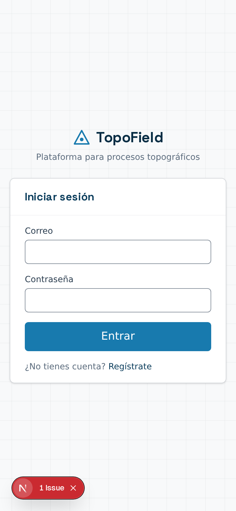

En pantallas pequeñas, la tabla de estaciones se convierte en **tarjetas**: una
por estación, con sus campos apilados y el azimut, ΔN y ΔE visibles sin
desplazamiento lateral. Los campos de grados, minutos y segundos son lo bastante
amplios para usarse con guantes.

La navegación se reduce a un retorno al nivel anterior, en lugar de la ruta
completa.

---

## 10. Informes

Un informe reúne varios trabajos ya terminados de un proyecto en un solo
documento imprimible, con su registro de quién cerró cada cosa y cuándo.

### 10.1 Qué puede incluirse

**Solo procesos cerrados.** Es la regla principal y tiene una razón práctica:
el informe no guarda una copia de los datos, sino que los vuelve a leer cada
vez que se abre. Como un proceso cerrado ya no puede cambiar, el informe dice
siempre lo mismo — hoy y dentro de un año.

De ahí se siguen dos consecuencias:

- Un proceso **rechazado no se puede incluir**. Queda como constancia del
  trabajo, pero no se informa.
- En control de asentamientos, lo que se incluye es el **lugar cerrado**, no
  una visita suelta. Un lugar todavía activo admite visitas nuevas, así que su
  informe cambiaría solo.

Si el proyecto no tiene nada cerrado, la pantalla se lo dice en vez de ofrecer
un formulario que no llevaría a ninguna parte.

### 10.2 Generar un informe

En la pestaña **Informes** del proyecto, pulse **Generar Nuevo Informe**.

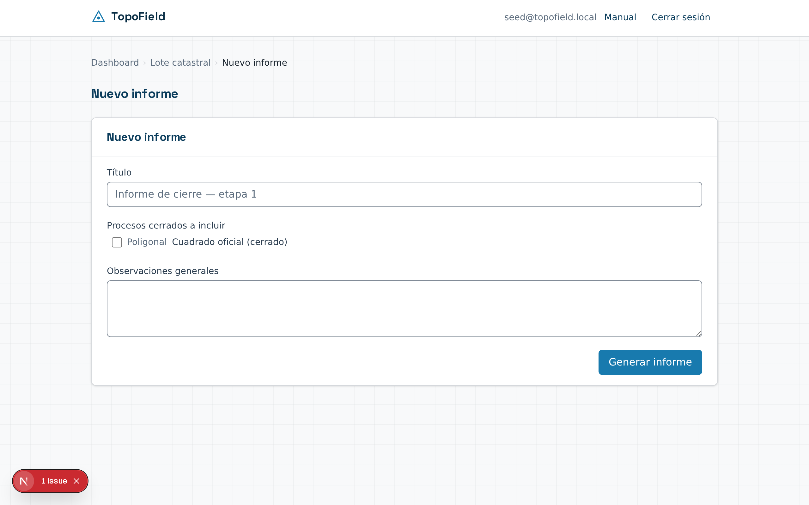

Se pide:

| Campo | Para qué |
|---|---|
| Título | Encabeza la portada del documento |
| Procesos a incluir | Marque los que quiera; solo aparecen los cerrados |
| Orden de las secciones | Con las flechas ↑ ↓ ordena cómo saldrán |
| Observaciones | Texto libre que se imprime al final |

### 10.3 Imprimir o guardar como PDF

Al generar, la aplicación abre el informe. El botón **Ver e imprimir** lleva al
documento maquetado, y allí **Imprimir o guardar como PDF** abre el diálogo del
navegador: elija «Guardar como PDF» como destino.

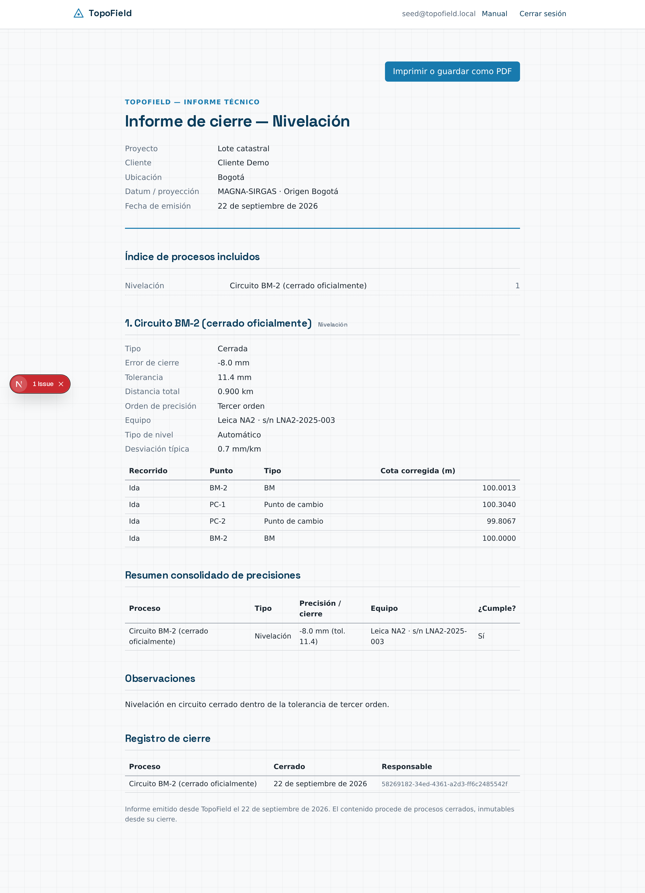

El documento lleva portada con los datos del proyecto, índice, una sección
por proceso con sus resultados **y su equipo** —en las poligonales, con su
dibujo—, el resumen consolidado de
precisiones —con una columna de equipo—, sus observaciones y el registro de
cierre. El equipo ya no es un dato del proyecto: cada sección imprime el que
declaró su propio proceso (en asentamientos, el de la visita más reciente).

> El PDF lo genera su navegador, no la aplicación. Los márgenes y los
> encabezados de página dependen de lo que usted elija en ese diálogo.

---

## 11. Exportar a Excel

Cada proceso tiene un botón **Exportar a Excel** en su editor —y el control de
asentamientos, en su panel de análisis—. Descarga un `.xlsx` con tres hojas:

| Hoja | Contiene |
|---|---|
| Datos Crudos | Las lecturas de campo tal como se capturaron, sin modificar |
| Cálculos | Lo que la aplicación derivó: cotas, coordenadas, correcciones |
| Resumen | Equipo, método, precisión, tolerancia, estado y trazabilidad |

Con **mínimos cuadrados**, «Cálculos» añade la corrección de cada ángulo y la
distancia ajustada, y «Resumen» los pesos y σ₀. El informe imprimible también
indica los pesos y σ₀ de cada poligonal ajustada así.

A diferencia del informe, la exportación funciona **en cualquier estado**:
también sobre un borrador. Las celdas que aún no se han calculado salen
vacías, no en cero — en topografía un `0.000` es una posición, no un dato que
falta.

---

## 12. Preguntas frecuentes

**Cerré un proceso por error. ¿Puedo reabrirlo?**
No. El cierre es definitivo por diseño: es lo que da valor probatorio al
registro. Cree un proceso nuevo con los datos corregidos.

**¿Por qué mi poligonal no me deja cerrar?**
Revise el veredicto en la parte superior del editor. Si el error angular supera
la tolerancia, hay un problema en la medición de ángulos que debe corregir. Si
solo falla la precisión relativa, podrá cerrarla como rechazada.

**¿Por qué una poligonal muestra «Sin verificación de cierre»?**
Es de tipo *abierta sin control*: no regresa al punto de partida ni llega a un
punto conocido, así que no hay nada contra qué contrastar el resultado. Las
coordenadas se calculan, pero su exactitud no se puede verificar.

**¿Qué significa una precisión de 1:∞?**
Que el cierre fue exacto: el error lineal es cero o despreciable. Ocurre con
datos teóricos o levantamientos muy precisos.

**¿Dónde declaro el equipo y el orden de precisión que usé?**
En cada proceso, no en el proyecto: cada poligonal, cada nivelación y cada
visita de asentamiento declara los suyos, en su propia configuración. Un mismo
proyecto puede así tener una poligonal de tercer orden medida con una estación
total y, meses después, una red de control de primer orden medida con otra —
cada una con el instrumento con que realmente se trabajó.

**Cambié el orden de precisión de un proceso abierto. ¿Se recalcula?**
Sí, al recalcularlo. Uno cerrado conserva su veredicto original, porque es
inmutable.

**¿Qué pasa si el equipo que declaro no alcanza el orden que elegí?**
La aplicación se lo advierte junto al campo de precisión del equipo,
comparando la precisión que declaró con la tolerancia del orden. Es un aviso,
no un bloqueo: puede seguir capturando y cerrando con normalidad. La decisión
de si el equipo basta para el trabajo es suya, no de la aplicación.

**Mi nivelación cuadra en la comprobación aritmética. ¿Ya sé que la medición
está bien?**
No. La comprobación aritmética (ΣV+ − ΣV− = desnivel total) solo
valida que las cuentas de gabinete están bien hechas: cuadra igual con un
nivel descolimado. La calidad de la medición la juzga el error de cierre
contra la tolerancia K·√D.

**¿Por qué una fila de mi libreta de nivelación no admite corrección?**
Le falta la distancia acumulada. Es obligatoria en los puntos BM y de cambio:
sin ella la aplicación no sabe a qué distancia del origen está el punto y no
puede repartirle su parte del error de cierre.

**Un punto quedó en alarma. ¿Puedo seguir guardando y cerrando la visita?**
Sí. El semáforo es un diagnóstico, no un bloqueo: un punto en alerta o alarma
se guarda y se cierra igual que cualquier otro. Es justamente el dato que el
control de asentamientos busca detectar y dejar documentado.

**¿Por qué la velocidad de dos visitas mensuales no me da el mismo número?**
Porque se calcula con los días reales entre las dos fechas, no con «un mes»
fijo. Un intervalo de 28 días y uno de 31 producen velocidades distintas
aunque el asentamiento parcial fuera idéntico.

**¿Otros usuarios pueden ver mis proyectos?**
No. Cada usuario accede solo a los suyos; la restricción se aplica en la base de
datos.

---

## Mantener este manual

Las capturas se regeneran con:

```bash
node docs/manual/capturas.mjs
```

Requiere el entorno local levantado (`npx supabase start`, `npm run dev`) y los
datos de ejemplo sembrados. El script consulta los identificadores en la base,
así que funciona después de cualquier `supabase db reset`.

Las capturas viven en **`public/manual/`**, una sola copia: la sirve la página
`/manual` de la aplicación, y este documento las referencia con una ruta
relativa (`../../public/manual/…`), que GitHub resuelve sin problema. Guardar
una segunda copia en `docs/` añadía 2,8 MB al historial de git en cada
regeneración, sin ganar nada.

**Ya no quedan módulos pendientes**: la fase 6 cerró el último y la sección
«Módulos pendientes» desapareció con ella. Al añadir funcionalidad nueva:

1. Escriba su sección en el cuerpo del manual y añada sus capturas.
2. Haga lo mismo en `src/app/(app)/manual/`: el texto en `manual-data.ts` y la
   sección nueva en `page.tsx`. **El texto vive por duplicado en los dos
   sitios y no hay generación automática**: al editar uno, edite el otro en el
   mismo commit.
3. Regenere las capturas con `node docs/manual/capturas.mjs`.
