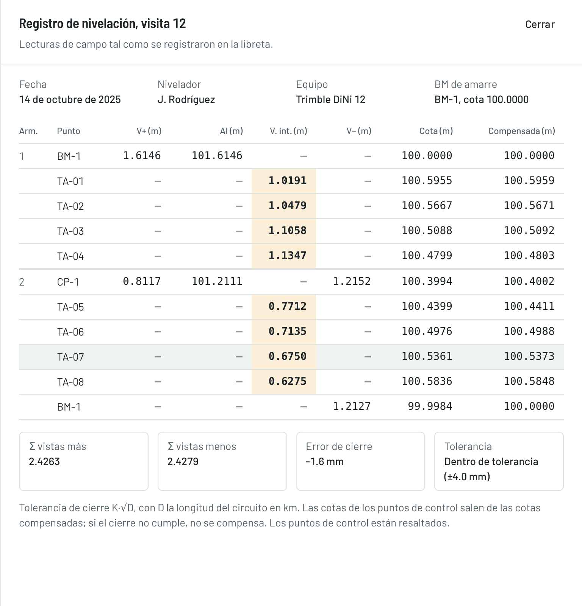

# Manual de usuario — TopoField

TopoField es una plataforma web para gestionar procesos topográficos: registrar
los datos de campo, calcularlos con validación en tiempo real y cerrarlos con
trazabilidad.

Este manual cubre lo que la aplicación permite hacer **hoy**, que es el
alcance completo del proyecto: los tres módulos de proceso, el cierre con
trazabilidad, los informes y la exportación a Excel.

> **Este documento es la fuente de la redacción.** La página `/manual` de la
> aplicación (`src/app/(app)/manual/`) es una maquetación de este mismo texto
> con el sistema de diseño. El contenido vive por duplicado y no hay generación
> automática entre los dos: al cambiar la redacción aquí, refléjela allí en el
> mismo commit — y viceversa.

**Última actualización:** 2026-10-06 · Fase 35 (La poligonal como la mide el topógrafo).

La aplicación está publicada en
**[topofield-app.vercel.app](https://topofield-app.vercel.app)**.

---

## Índice

1. [Conceptos básicos](#1-conceptos-básicos)
2. [Entrar a la aplicación](#2-entrar-a-la-aplicación)
3. [El dashboard](#3-el-dashboard)
4. [Proyectos](#4-proyectos)
5. [Poligonales](#5-poligonales)
6. [Nivelación](#6-nivelación)
7. [Control de Asentamientos](#7-control-de-asentamientos)
8. [Cerrar un proceso](#8-cerrar-un-proceso)
9. [Trabajo en campo](#9-trabajo-en-campo)
10. [Informes](#10-informes)
11. [Exportar a Excel](#11-exportar-a-excel)
12. [El catálogo de equipos](#12-el-catálogo-de-equipos)
13. [Preguntas frecuentes](#13-preguntas-frecuentes)

---

## 1. Conceptos básicos

Tres ideas ordenan toda la aplicación:

**Proyecto.** El contenedor de un trabajo topográfico. Guarda el cliente, la
ubicación, el datum y la proyección. El equipo usado y el **orden de
precisión** no viven aquí: van en cada proceso —poligonal, nivelación, visita
de asentamiento—, porque pueden cambiar de un levantamiento a otro dentro de un
mismo proyecto. El orden de una poligonal o de una nivelación no se declara:
se detecta al calcularla.

**Proceso.** Un levantamiento concreto dentro de un proyecto: una poligonal, una
nivelación, un control de asentamientos. Cada proceso pasa por estados:

| Estado | Significado |
|---|---|
| **Borrador** | Creado, sin datos suficientes |
| **En progreso** | Con datos de campo, aún sin cálculo completo |
| **Calculado** | Cálculo resuelto; se puede revisar y, en asentamientos, cerrar |
| **Cerrado** | Terminado y conforme. **Inmutable** mientras siga cerrado |
| **Rechazado** | Terminado pero fuera de tolerancia. **Inmutable** mientras siga cerrado |

**Cierre.** El acto de dar por terminada una visita o un lugar de
asentamientos. Queda registrado con fecha, hora y autor, y **a partir de ese
momento las mediciones y el veredicto no se pueden modificar**. Es lo que da
trazabilidad al trabajo. **La poligonal y la nivelación no se cierran**:
quedan calculadas, se corrigen cuando haga falta, y su informe dice qué orden
de precisión alcanzaron (§ 5 y § 6).

> **Sobre la inmutabilidad**
> Un proceso cerrado no se puede editar ni eliminar, ni desde la interfaz ni por
> ninguna otra vía. La restricción está aplicada en la propia base de datos, no
> solo en la pantalla. Para corregirlo, se reabre (§ 8).

---

## 2. Entrar a la aplicación


Ingrese con su correo y contraseña. Si aún no tiene cuenta, use **Regístrate**.

**Para crear una cuenta necesita un código de invitación.** Al registrarse se le
pide, junto con su nombre, correo y contraseña. Después recibirá un mensaje para
confirmar su dirección: hasta que pulse ese enlace no podrá entrar.

La primera vez que entre encontrará un **proyecto de ejemplo** hecho con
**carteras de campo reales**, ya calculadas, para que pueda ver cómo funciona la
aplicación sin capturar nada:

- Tres poligonales: la **V10**, amarrada a TT4, en tercer orden; la de la **Sede
  Vivero**, ajustada por mínimos cuadrados, y la misma en un sistema local,
  lista para **georreferenciar** con los vértices D1 y D3 del catálogo.
- Dos nivelaciones: la de **El Verjón**, con ida y vuelta por los mismos puntos
  —verá su discrepancia, la diferencia punto a punto entre ida y vuelta y la
  compensación del circuito—, y el **tramo 2**, leído del archivo de un nivel
  digital Leica.
- **Torre Alameda**, un control de asentamientos simulado con catorce visitas
  y su libreta de nivelación en cada una.
- Un informe consolidado por módulo.

Puede modificarlo o archivarlo cuando quiera.

Cada usuario ve únicamente sus propios proyectos.

**La barra de arriba.** Queda fija mientras baja por cualquier pantalla. A la
izquierda, el logo vuelve al dashboard, y a su lado va la **ruta** de la
pantalla —«Dashboard › Proyecto de ejemplo › Poligonal Famarena…»—: cada nombre
lleva a ese nivel. En el teléfono, la ruta se reduce al nivel anterior, con
«‹». A la derecha, **Equipos** (§ 12) y **Manual**, y un círculo con la inicial
de su correo: el **menú de cuenta**, con el correo, el tema y **Cerrar
sesión**.

**Tema claro u oscuro.** En el menú de cuenta —y con el icono de arriba a la
derecha en la pantalla de inicio de sesión— se elige el tema: **Sistema** sigue
la configuración del teléfono o del computador, y **Claro** u **Oscuro** lo
fijan. La elección se recuerda en ese navegador. El informe impreso sale
siempre en claro.

---

## 3. El dashboard

Es la pantalla de inicio tras entrar.


Arriba, tres indicadores del estado general:

- **Proyectos activos** — cuántos proyectos tiene en curso.
- **Procesos calculados** — levantamientos resueltos, listos para revisar.
- **Fuera de tolerancia** — procesos calculados que no cumplen su tolerancia
  —una poligonal o una nivelación, si no alcanza ningún orden—, y lugares con
  algún punto en alerta o alarma en una visita abierta. Requieren revisión.

Debajo, sus proyectos. El selector **Activos / Archivados** filtra la lista.
Cada tarjeta indica cuántos procesos tiene el proyecto y cuántos están en
curso, cerrados o rechazados.

Use **+ Nuevo Proyecto** para crear uno.

> **Empieza con un proyecto de ejemplo.** La primera vez que entra, su cuenta ya
> trae un **«Proyecto de ejemplo»** con carteras de campo reales —poligonales y
> nivelaciones—, un lugar de control de asentamientos simulado y sus informes,
> para que explore la aplicación con datos reales (§ 2). Puede modificarlo o
> archivarlo cuando quiera.

---

## 4. Proyectos

### 4.1 Crear un proyecto


El formulario reúne en una página los **datos básicos** —nombre, descripción,
cliente, ubicación y, si quiere, las coordenadas geográficas en grados
decimales— y el **sistema de referencia**: datum y proyección. El proyecto se
crea al pulsar **Crear proyecto**.

> **El equipo y el orden de precisión no se piden aquí.** Van en cada
> proceso: cada visita de asentamiento declara su orden y su equipo, y cada
> poligonal y cada nivelación su equipo —su orden se detecta al calcularla—. Un
> mismo proyecto puede así tener trabajos de distinto orden, medidos con
> instrumentos distintos y en fechas distintas.
> Vea [§ 5.2](#52-crear-una-poligonal), [§ 6.4](#64-crear-una-nivelación) y
> [§ 7.3](#73-registrar-una-visita).

### 4.2 El proyecto por dentro


La cabecera muestra el nombre y el estado del proyecto, su cliente, su
ubicación y su sistema de referencia, y el botón **+ Nuevo Proceso**. Debajo,
tres pestañas:

**Procesos** — el listado de levantamientos del proyecto. Se detalla en
[§ 4.3](#43-el-listado-de-procesos).

**Informes** — los informes **consolidados**, que reúnen poligonales y
nivelaciones calculadas y controles de asentamientos cerrados en un solo
documento. Se detalla en [§ 10](#10-informes). Cada
proceso tiene además su propio informe, en su pantalla
([§ 4.4](#44-la-pantalla-de-un-proceso)).

**Configuración** — los datos del proyecto (también la descripción), los
puntos de referencia, y archivar o eliminar el proyecto.


Los **puntos de referencia** son coordenadas conocidas (vértices geodésicos,
mojones) que puede reutilizar como punto de partida o de llegada de sus
poligonales, sin volver a teclearlas. Los que tienen cota sirven además como
BM de sus nivelaciones y como **BM de amarre** de las visitas de asentamiento.

**Archivar o eliminar.** Archivar oculta el proyecto de la lista activa del
dashboard; puede restaurarlo cuando quiera. Eliminarlo lo borra con todo lo
que contiene, y solo es posible si no tiene nada cerrado: un lugar o una
visita de asentamientos cerrados son registros que no se borran. En ese caso
la configuración dice cuántos tiene y propone archivarlo.

### 4.3 El listado de procesos

Los chips **Poligonales**, **Nivelaciones** y **Control de Asentamientos**
eligen el módulo, con cuántos tiene cada uno. Los tres listados funcionan
igual, con una barra para encontrar lo que busca.

**Buscar.** Filtra por nombre mientras escribe. No distingue mayúsculas ni
acentos: «via» encuentra «Vía terciaria».

**Filtrar por estado.** Los chips muestran cuántos hay en cada grupo, así que
ve la distribución del proyecto sin desplegar nada. Pulse uno para ver solo
ese grupo. En poligonales y nivelaciones los estados son **Borradores** y
**Calculados**: no se cierran. En control de asentamientos, **Activos** y
**Cerrados**.

**Filtrar por tipo.** El selector acota a un tipo de poligonal, de nivelación
o de estructura.

Cuando hay algún filtro activo aparece **Limpiar filtros**, para volver a verlo
todo de un clic.

> Cada listado recuerda el último filtro que usó en cada proyecto, así que al
> volver lo encuentra como lo dejó. Si abre un enlace que alguien le compartió,
> manda lo que traiga ese enlace: verá lo mismo que quien se lo envió.

**Las columnas.**

| Columna | Qué muestra |
|---|---|
| Nombre | Nombre y tipo (en asentamientos, el tipo de estructura y cuántas visitas tiene) |
| Estado | Borrador, En progreso o Calculado en una poligonal o una nivelación; Activo o Cerrado en un lugar |
| Resultado | La **precisión** relativa de una poligonal, el **cierre** de una nivelación (o su discrepancia, si es abierta con vuelta) o la **alerta** de un lugar |
| Cumple | ✓ si alcanza algún orden, ✕ si no, — si no aplica. No aparece en asentamientos |
| Última actividad | Cuándo se modificó por última vez |

La columna **Cumple** es la que evita abrir cada proceso para saber si el
levantamiento sirve.

Pulse **Nombre**, la columna de resultado o **Última actividad** para ordenar
por esa columna; pulsar de nuevo invierte el orden. Por defecto se ordena por
actividad reciente, así que lo que está trabajando queda arriba.

**Acciones por fila.** Cada fila ofrece:

- **Duplicar** — crea uno nuevo con la misma configuración, en borrador: una
  poligonal sin estaciones, una nivelación sin lecturas, un lugar con sus
  umbrales y su catálogo de puntos pero sin visitas.
- **Renombrar** — cambia el nombre sin abrirlo.
- **Eliminar** — lo borra con lo que contiene, con confirmación previa. Un
  lugar con alguna visita cerrada no se puede eliminar. Si lo que borra está en
  un informe consolidado —porque se reabrió después de emitirlo—, la
  confirmación lo avisa: el informe quedará sin esa sección.

> **Lo cerrado solo se puede duplicar.** Un lugar cerrado no admite
> renombrarse ni eliminarse. Una poligonal o una nivelación siempre admite las
> tres acciones: no se cierran. Si necesita rehacer un levantamiento cerrado,
> duplíquelo: obtendrá una copia editable y el original queda intacto como
> constancia. Para corregir el mismo lugar, reábralo desde su pantalla (§ 8).

En el teléfono, la tabla se convierte en tarjetas, una por fila, con las
mismas acciones.

### 4.4 La pantalla de un proceso

Los controles de asentamientos se abren en la pantalla de siempre. La
poligonal y la nivelación tienen la suya, por pasos
([§ 5.3](#53-la-pantalla-por-pasos) y [§ 6.5](#65-la-pantalla-por-pasos)).

**La cabecera.** El nombre, el estado y el tipo del proceso, y dos acciones:
**Exportar a Excel** ([§ 11](#11-exportar-a-excel)) y **Ver informe**. Si el
proceso está cerrado, una tercera: **Reabrir** (§ 8). La ruta de la barra
devuelve al listado del que vino.

**Las pestañas.** **Proceso** reúne todo el trabajo: configuración, captura,
cálculo, gráfico y análisis, que se recalculan mientras escribe. **Informe**
muestra el informe de ese proceso, listo para **Imprimir o guardar como PDF**
([§ 10](#10-informes)). El control de asentamientos tiene tres: **Panel**,
**Puntos y lugar** e **Informe** ([§ 7](#7-control-de-asentamientos)); la
poligonal, sus tres pasos: **Datos**, **Ajuste** e **Informe**, y la
nivelación los suyos: **Libreta**, **Compensación** e **Informe**.


Mientras el proceso no esté cerrado, su informe lleva la marca **«Borrador —
el informe se emite al cerrar el proceso»**, también en el PDF: sirve para
revisar antes de cerrar. Si se cerró como rechazado, lleva en cambio la marca
**«Rechazado»**: queda como constancia y no entra en informes consolidados. El
de una poligonal o una nivelación no lleva marca: no se cierran. Debajo, fuera
de la impresión, aparecen los informes consolidados que ya lo incluyen y, si
puede entrar en uno —un lugar cerrado, o una poligonal o una nivelación
calculadas—, un botón para generar uno nuevo con él.

**La barra de acciones.** Mientras el proceso se puede editar, **Guardar** y
**Cerrar proceso** van en una barra fija al pie de la pantalla, siempre a la
vista. A su izquierda dice si hay **cambios sin guardar** o qué impide guardar.
La poligonal y la nivelación no la tienen: cada popup guarda al confirmar.

> **Salir sin guardar pregunta.** Si tiene cambios sin guardar y pulsa una
> miga, otra pestaña o cualquier enlace de la aplicación, un diálogo pregunta
> antes de salir; al recargar o cerrar la pestaña, pregunta el navegador. Los
> botones atrás y adelante del navegador no preguntan.

---

## 5. Poligonales

La poligonal se trabaja como la mide el topógrafo: un alta corta y tres pasos
en una sola pantalla —**1 · Datos**, **2 · Ajuste** y **3 · Informe**—. **No
hay botón Guardar**: cada popup guarda al confirmar. Y **la poligonal no se
cierra**: queda calculada y se corrige cuando haga falta; su informe dice qué
orden de precisión alcanzó.

### 5.1 Tipos

TopoField maneja tres tipos, y la diferencia determina cómo se verifica el
trabajo:

| Tipo | Descripción | Cómo se verifica |
|---|---|---|
| **Cerrada** | Parte de un punto y regresa a él | Suma de ángulos + error de cierre lineal |
| **Abierta con control** | Parte de un punto conocido y llega a otro conocido | Comparación contra las coordenadas del punto de llegada |
| **Abierta sin control** | Parte de un punto conocido y no cierra | **No tiene verificación de cierre** |

La poligonal abierta sin control sirve para reconocimiento: calcula coordenadas,
pero no hay forma de comprobar si son correctas. La aplicación lo indica
explícitamente en vez de mostrar una precisión inexistente.

### 5.2 Crear una poligonal


Desde el proyecto, **+ Nuevo Proceso → Poligonal** abre un popup:

- **Título**, el único obligatorio.
- **Ubicación**, **Responsable** y **Cargo del responsable**: salen en el
  informe y en el Excel.
- **Tipo de poligonal**, con una línea que explica cómo se verifica cada uno.
- **Equipo**, plegado y opcional: marca, modelo y número de serie de la
  estación total, o **Tomar del catálogo** (§ 12).

**Crear y empezar** lleva al paso de Datos. Lo que no se pide: el **orden de
precisión** y el **tipo de ángulo** se detectan al calcular (§ 5.4 y § 5.5).

Estos datos se cambian después con **Editar datos**, en la cabecera. Cambiar
el tipo cuando ya hay mediciones las recalcula con el tipo nuevo, y el popup lo
avisa.

### 5.3 La pantalla por pasos

La **cabecera** lleva el tipo, el estado y el orden alcanzado; el título, la
ubicación, el responsable, el equipo y cuándo se guardó por última vez; y las
acciones **Editar datos**, **Exportar a Excel** (§ 11) y, bajo **⋯**,
**Duplicar** y **Eliminar**.

Debajo van los tres pasos y, a la derecha, **Ángulos en**: **DMS (° ′ ″)** o
**Grados decimales**. El formato rige la tabla, el ajuste, el informe y los
popups, y se recuerda por proceso.

- Cambiar de formato **no altera ningún valor**: la aplicación guarda los
  ángulos siempre en DMS y el decimal es solo otra forma de verlos, con seis
  decimales.
- Los ángulos se guardan a la **décima de segundo**. Si teclea un decimal con
  más precisión, bajo el campo aparece cómo se guardará —«Se guarda como
  124°29′42″»—.

### 5.4 Paso 1 · Datos


Dos columnas: a la izquierda, el amarre, las mediciones y el cierre angular; a
la derecha, el dibujo, que se queda fijo mientras baja la página.

**Los puntos de amarre.** Una poligonal nueva empieza por ellos: **Ingresar
puntos de amarre** abre un popup con

- la **estación de partida**: nombre, Norte y Este, o **Tomar del catálogo**;
- la **referencia, 0° atrás**, de tres maneras: **Punto con coordenadas** —el
  azimut de partida se calcula solo y el popup lo muestra—, **Solo el azimut**
  —si no tiene sus coordenadas: el nombre y el azimut de la partida a la
  referencia— o **Sin 0 atrás**, con el azimut del primer lado;
- en la abierta con control, la **llegada**: el punto conocido, con su Norte y
  su Este, y el azimut de llegada si lo tiene. Con él se comprueba también el
  cierre angular.

Los puntos con coordenadas se guardan en el catálogo del proyecto. Si el
nombre ya existe con otras coordenadas, el popup lo dice: tómelo del catálogo
o use otro nombre, porque ese punto puede estar en uso en otra poligonal. Sin
0 atrás, la partida no va al catálogo: puede ser local.

Con mediciones, el amarre se edita pero **no se pone ni se quita el 0 atrás**:
cambiaría lo que significa el primer ángulo —de orientación a vértice, o al
revés—. El popup pide deshacer las mediciones antes.

Si levanta en un sistema local, **Medir sin amarre, en coordenadas locales**
arranca en P1 (1000, 1000) con azimut 0°. Cuando tenga las coordenadas
reales, edite el amarre o georreferencie (§ 5.6).

**Las mediciones.** La tabla se lee como la cartera: cada fila va **desde →
hacia** —«V10 → D1»—, con el ángulo medido en el punto de partida, la
distancia y el **azimut sin ajustar**, encadenado con los ángulos tal como se
midieron. La primera fila es el **0 atrás**; el lado que vuelve a la partida
lleva la marca **cierre**, y la fila del cierre angular, **cierre angular**.

**+ Agregar punto** abre el popup de medición:

- arriba, dónde está: «Estás en D1 · atrás en V10»;
- el **punto siguiente**;
- las **lecturas del ángulo**: una o varias, con **+ Lectura**. Con dos o
  más, el popup muestra el promedio y la dispersión entre ellas; el promedio es
  el ángulo que entra en el cálculo. La dispersión es un dato: la aplicación
  no la juzga;
- en la abierta con control, el **sentido** de la deflexión: derecha o
  izquierda;
- la **distancia horizontal** hasta el punto siguiente.

**Agregar y seguir en D2** guarda y deja el popup listo para la medición
siguiente; **Terminar** guarda y lo cierra. Sin 0 atrás, la primera medición
no lleva ángulo.

Desde la segunda medición de una cerrada aparece la casilla **Cierre: este
lado vuelve a V10**, que fija como siguiente la estación de partida. Al
agregar el cierre, el popup sigue con el **cierre angular**:

- amarrada, en la estación de partida: hacia la referencia —la cartera cierra
  contra el amarre, como la TT4— o, si desmarca la casilla, hacia el primer
  lado —el ángulo del vértice de arranque, como la cartera de la Sede Vivero—;
- sin amarre, el ángulo en P1, entre el último punto y P2: se mide al final,
  porque al empezar no había punto atrás.

En la abierta con control la casilla es **Llegada: este lado llega a …**, y
con azimut de llegada el cierre angular es la deflexión en el punto de
llegada. Mientras falte el cierre angular, **Medir el cierre angular** ocupa el
lugar de **+ Agregar punto**.

El lápiz de cada fila abre el mismo popup para **editarla** —el ángulo, la
distancia o el nombre del punto siguiente— o **eliminarla**. Eliminar una
medición intermedia quita esa estación: el punto siguiente pasa a medirse desde
el anterior, y el popup lo avisa. **Deshacer la última medición** retrocede
de a una: primero el cierre angular, después el cierre y luego cada lado.

Los errores se detectan al confirmar y se quedan en el popup, sin perder lo
tecleado: un ángulo sin lecturas, minutos o segundos fuera de 0-59, segundos
con más de una cifra decimal, una distancia de cero, mayor a 1000 m o con más
de cuatro decimales, un punto sin nombre o repetido.

**El cierre angular**, debajo de la tabla, resume la cerrada: vértices,
**tipo de ángulo** con la marca *detectado*, ángulos en la condición, suma
observada y teórica, error angular y la corrección que le toca a cada ángulo.
En la abierta con control, el error contra el azimut de llegada.

> **El tipo de ángulo se detecta.** Interiores y exteriores solo cambian la
> suma teórica —(n − 2)·180° frente a (n + 2)·180°— y difieren en 720°: la
> suma observada dice sin ambigüedad cuál midió.

**El dibujo** muestra lo medido, sin ajustar, y crece con cada medición. En una
cerrada, el último lado no llega exactamente a la partida: ese hueco es el
error de cierre, a escala real. En el teléfono, un selector **Tabla | Dibujo**
alterna entre las dos columnas (§ 9).

### 5.5 Paso 2 · Ajuste


**El método.** Arriba, el selector. Cambiarlo recalcula y guarda al instante.

| Método | Cómo reparte el error |
|---|---|
| **Brújula (Bowditch)** | Proporcional a la longitud de cada lado. El más usado |
| **Tránsito** | Proporcional a las proyecciones. Útil si las distancias son menos fiables que los ángulos |
| **Crandall** | Mínimos cuadrados sobre las distancias, conservando los ángulos ajustados |
| **Mínimos cuadrados** | Ajusta a la vez ángulos y distancias según el peso que usted les da. Solo en cerrada y abierta con control |

Una abierta sin control no tiene nada que ajustar: el paso muestra sus
coordenadas encadenadas, sin selector.

**El orden alcanzado.** Cuatro cifras: error angular, error de cierre lineal,
precisión relativa y **orden alcanzado**, el más alto que cumple a la vez la
tolerancia angular y la precisión relativa mínima de su orden.


**Por qué** despliega cada orden con su tolerancia y su precisión mínima, y si
la poligonal las cumple:

| Orden | Tolerancia angular | Precisión relativa mínima | Uso típico |
|---|---|---|---|
| Primer orden | 1″·√n | 1:100.000 | Geodésico de alta precisión |
| Segundo orden | 5″·√n | 1:20.000 | Control urbano y catastral |
| Tercer orden | 15″·√n | 1:5.000 | Levantamiento topográfico común |
| Ordinario | 30″·√n | 1:3.000 | Levantamiento rural o reconocimiento |

Donde *n* es el número de ángulos que entran en la condición: los vértices de
una cerrada —más el de cierre si cierra contra el amarre— o las deflexiones de
una abierta con control. En la cartera TT4, el error de 12″ cabe en segundo
orden (13.2″), pero 1:7.045 solo alcanza el tercero (1:5.000): **tercer
orden**. Si no alcanza ni el ordinario, la cifra dice **No alcanza ningún
orden** y el informe lo alerta.

> **El orden no se declara: se detecta.** Es el mismo con cualquier método,
> porque se juzga con el error de la cartera tal como se midió, antes de
> corregir.

**La poligonal ajustada.** La tabla al estilo de la hoja de cálculo: cada lado
«desde → hacia» con el ángulo corregido, el azimut, la distancia, las
proyecciones, las proyecciones corregidas y las coordenadas del punto al que
llega. La fila **Σ** suma las proyecciones: en las crudas, el error de cierre;
en las corregidas, cero. En el teléfono, la tabla se desplaza de lado.

**Corrección por método …** resume cómo corrigió el método elegido: el reparto
del error angular —en la TT4, −1.71″ en cada uno de los 7 ángulos, incluido el
de orientación— y sus cifras propias:

- Brújula: las diferencias ΔN y ΔE, el perímetro y el factor −e/P de cada eje;
- Tránsito: la suma de proyecciones absolutas y la corrección unitaria de cada
  eje;
- Crandall: los multiplicadores λ₁ y λ₂ del ajuste de las distancias.

**Mínimos cuadrados.** Los otros tres métodos reparten el error con una regla
fija; este busca las correcciones más pequeñas —pesadas por la precisión de
cada observación— que hacen cerrar la poligonal. Al elegirlo aparecen tres
campos:

- **σ angular (″)**: la desviación típica que supone para cada ángulo.
- **σ de distancia (m)**: la de una medición de distancia.
- **Mediciones por distancia**: cuántas veces midió cada lado. Una distancia
  medida *n* veces pesa como σ/√*n*.

Todas las observaciones pesan igual. Los campos **salen vacíos**: la
aplicación no supone pesos por usted. La hoja de la universidad usa, por
ejemplo, 2″, 0.011 m y 2 mediciones. Se guardan al salir del campo, cuando
están los tres; mientras tanto el ajuste dice que faltan. Si cambia de método,
los pesos se conservan para cuando vuelva.


Con los pesos completos aparece la **corrección de cada ángulo**, en segundos,
y de **cada distancia**, en milímetros, junto a la distancia ajustada. El
ángulo de orientación no se ajusta: es el **datum**, porque un error suyo rota
la poligonal entera sin afectar al cierre. Debajo aparece **σ₀**, que compara
lo medido con los pesos que supuso. Con pesos correctos ronda 1, pero con tan
pocas condiciones fluctúa mucho; por eso se juzga con la **prueba χ² al 95 %**
de su número de condiciones, r (3, o 2 sin azimut de llegada):

- **Dentro del intervalo** (de 0.268 a 1.765 con r = 3; de 0.159 a 1.921 con
  r = 2): los pesos describen bien sus observaciones.
- **Por encima**: midió peor de lo supuesto, o hay un error grueso en la
  cartera.
- **Por debajo**: sus σ son pesimistas; midió mejor de lo declarado.

Si los pesos están pero no hay ajuste posible, un aviso dice por qué: con un
solo lado, por ejemplo, las condiciones de llegada dependen de una sola
distancia y no hay nada que ajustar. σ₀ es información, no un criterio: el
orden alcanzado no depende del método.

**El dibujo ajustado.** La poligonal a escala sobre una grilla de
coordenadas, con flecha de norte, barra de escala y el amarre si lo tiene.


- En **trazo continuo**, la poligonal **ajustada**.
- En **trazo discontinuo**, la poligonal **sin compensar**, con los
  desplazamientos **exagerados** por el factor que indica la leyenda (×100 en
  la imagen). En una cerrada no llega a cerrar: el hueco del último vértice
  es el error de cierre.

> **Por qué se exagera.** En un buen levantamiento el error de cierre es de
> centímetros sobre cientos de metros: dibujado a escala real, ocupa menos de
> un píxel y las dos poligonales se verían idénticas. El factor se elige solo
> —1, 2 o 5 × 10ⁿ— para que el mayor desplazamiento ocupe alrededor del 5 %
> del dibujo, y nunca es menor que 1. Una abierta sin control no tiene nada que
> compensar y no muestra trazo discontinuo.

Con **Acercar**, **Alejar** y **Restablecer**, y con las **flechas** o
arrastrando el dibujo, puede acercarse a un vértice; todos los controles
funcionan con el teclado. Si el amarre está lejos, queda fuera del encuadre y
solo se ve su línea de orientación: la leyenda lo indica. La rueda del ratón
no hace zoom, para no interferir con el desplazamiento de la página. El factor
de exageración no cambia al acercarse.

### 5.6 Georreferenciar

Un levantamiento suele arrancar en un sistema local —(1000, 2000) y un azimut
supuesto— y recibir coordenadas reales después. El botón **Georreferenciar**,
junto al dibujo del paso de Ajuste, lo lleva al sistema real con **dos de sus
estaciones** de coordenadas conocidas.


1. Elija la estación del **punto A** y teclee su Norte y Este reales, o tómelos
   de un punto del catálogo del proyecto.
2. Lo mismo para el **punto B**. Use las dos estaciones **más alejadas** entre
   sí: con puntos cercanos, un error pequeño en sus coordenadas gira mucho la
   poligonal.
3. Revise la vista previa: **rotación**, **traslación**, **factor de escala**,
   **residuos** en A y B, y las coordenadas actuales frente a las reales.
4. Confirme.

La poligonal se **gira y se traslada**, sin escala: las distancias y los
ángulos medidos no cambian, y el **orden alcanzado tampoco**. Se recalcula
con el nuevo arranque, así que coordenadas, azimuts y proyecciones quedan en el
sistema real. Sobre el dibujo queda anotada la última georreferenciación:
fecha, puntos, rotación y factor de escala. Puede georreferenciar otra vez para
corregir una coordenada mal tecleada.

Si lo que tiene son las coordenadas reales del **punto de partida y de la
referencia**, no hace falta georreferenciar: edite el amarre (§ 5.4) y la
poligonal se recalcula desde ellos.

El diálogo avisa, sin impedirlo, en tres casos:

- **El factor de escala se aparta de 1** más de lo que admite el orden
  alcanzado: la distancia real entre A y B no concuerda con la medida. Revise
  las coordenadas. Si están en una proyección con factor de escala distinto de
  1 (p. ej. CTM12), la diferencia puede ser de la proyección y no un error.
- **El método es Tránsito.** Tránsito reparte el error según la orientación,
  así que sus coordenadas cambian unos milímetros más allá del giro. El
  orden alcanzado no cambia.
- **El amarre es del catálogo.** Sus coordenadas siguen en el sistema
  anterior, así que pasa a amarre manual con el mismo código, y el dibujo deja
  de mostrarlo.

### 5.7 Paso 3 · Informe

El informe de la poligonal, listo para **Imprimir o guardar como PDF** (§ 10).
Es la misma sección que lleva en un informe consolidado:

1. **Resultado**: las cuatro cifras y por qué alcanza su orden. Si no alcanza
   ninguno, una alerta lo dice: «No alcanza la precisión de ningún orden».
2. **Datos de campo**: el amarre, las mediciones «desde → hacia» y el cierre
   angular, con su tolerancia.
3. **Corrección por método …**: cómo corrigió el método elegido, paso a paso,
   con sus fórmulas en notación matemática y las cifras de esta poligonal.
4. **Poligonal ajustada**, con la fila Σ.
5. **Coordenadas** y el dibujo.


No lleva marca de borrador: la poligonal no se cierra, y el informe muestra lo
que tenga al abrirlo. Los ángulos salen en el formato elegido.

---

## 6. Nivelación

La nivelación se trabaja como la mide el topógrafo, igual que la poligonal
(§ 5): un alta corta y tres pasos en una sola pantalla —**1 · Libreta**,
**2 · Compensación** y **3 · Informe**—. Cada armada se captura en un popup y
**no hay botón Guardar**: cada popup guarda al confirmar. El **orden de
precisión se detecta** al compensar, y **la nivelación no se cierra**: queda
calculada y se corrige cuando haga falta; su informe dice qué orden alcanzó.

### 6.1 Tipos

TopoField maneja tres tipos de nivelación geométrica:

| Tipo | Descripción | Cómo se verifica |
|---|---|---|
| **Cerrada** | Sale de un BM y vuelve a ese mismo BM | Error de cierre contra la cota de partida |
| **De enlace** | Va de un BM conocido a otro BM conocido distinto | Error de cierre contra la cota de llegada |
| **Abierta** | Termina en un punto sin cota conocida | Sin vuelta, ninguna; con vuelta, la **discrepancia entre ida y vuelta** |

Sin recorrido de vuelta, la nivelación abierta sirve solo para
reconocimiento: calcula cotas, pero no hay forma de comprobar si son
correctas, igual que la poligonal abierta sin control (§ 5.1). No tiene orden
ni se compensa, y la aplicación la rotula **Abierta sin control**. Con vuelta,
su veredicto es la discrepancia entre ida y vuelta (§ 6.8), y se rotula
**Abierta con ida y vuelta**.

### 6.2 Cómo se llena la libreta

La libreta es una fila por punto. Cada fila puede llevar dos lecturas:

- **Vista más (V+)** — la primera que se toma tras estacionar el nivel. Con
  ella se **abre la armada siguiente**: fija la altura del instrumento
  (AI = cota + V+) que usarán las filas venideras.
- **Vista menos (V−)** — **fija la cota del punto** de la fila. Viene de la
  armada anterior: cota = AI − V−.

Los nombres dicen qué hace cada número en la cuenta: la vista más se suma y la
vista menos se resta. Son los de la cartera de campo.

Una **armada** es una posición del nivel: la V+ a un punto que ya tiene cota y
la V− al siguiente, con las vistas intermedias que se lean desde ahí. Por eso
la columna **AI solo tiene valor en las filas que llevan V+**: la altura de
instrumento es un dato de la armada, no de la fila. En la aplicación se
captura armada por armada, y cada lectura va a la fila de su punto (§ 6.6).

### 6.3 Tipos de punto

Cada fila indica de qué tipo es el punto que registra:

| Tipo | Qué hace | Lecturas que lleva |
|---|---|---|
| **BM** | Banco de nivel, de cota conocida. Ancla el recorrido | La primera fila solo lleva V+; la última, si es BM, solo lleva V− |
| **Punto de cambio** | Transmite la cota de una armada a la siguiente | V+ y V− (salvo en los extremos) |
| **Intermedio (radiación)** | Solo se lee para conocer su cota, sin continuar el recorrido a través de él | Solo V− |

El punto intermedio cuelga de la AI vigente pero **no propaga cota ni abre
una armada nueva**, y por eso queda fuera de la comprobación aritmética: un
error en su lectura no contamina el resto del recorrido. En la compensación
recibe la corrección de su armada, la de la distancia acumulada hasta el
instrumento.

### 6.4 Crear una nivelación


Desde el proyecto, **+ Nuevo Proceso → Nivelación** abre un popup:

- **Título**, obligatorio.
- **¿Cómo es el recorrido?**: cerrada, de enlace o abierta, cada una con su
  recorrido dibujado.
- **Con vuelta**, si va a volver por los mismos puntos.
- El **BM de partida** y su **cota conocida**; en la de enlace, también el
  **BM de llegada** y la suya. El BM se teclea.
- Plegados y opcionales: **Ubicación**, **Responsable**, **Cargo del
  responsable** y el **equipo**: marca, modelo y número de serie del nivel, o
  **Tomar del catálogo** (§ 12).

**Crear y empezar** lleva a la libreta. Lo que no se pide: el **orden de
precisión**, que se detecta al compensar (§ 6.7), y el tipo de nivel, que no
entra en ningún cálculo.

Estos datos se cambian después con **Editar datos**, en la cabecera. Cambiar
el tipo o un BM recalcula la libreta, y el popup lo avisa.

### 6.5 La pantalla por pasos

La **cabecera** lleva el tipo, el estado y el orden alcanzado; el título, la
ubicación, el responsable, el equipo y cuándo se guardó por última vez; y las
acciones **Editar datos**, **Exportar a Excel** (§ 11) y, bajo **⋯**,
**Duplicar** y **Eliminar**. Debajo van los tres pasos y, a la derecha,
**Importar .L o CSV** (§ 6.9).

### 6.6 Paso 1 · Libreta


Dos columnas: a la izquierda, el BM, la libreta y su comprobación aritmética;
a la derecha, el perfil, que se queda fijo mientras baja la página.

**El BM.** Una tarjeta con el código y la cota del BM de partida y hacia dónde
va: el circuito de una cerrada, el BM de llegada de una de enlace o el final
sin cota conocida de una abierta. **Editar** abre su popup: el código y la
cota y, en la de enlace, los del BM de llegada. Cambiar la cota del BM
recalcula todas las cotas de la libreta, y cambiar su código cambia también
las filas de la libreta que lo llevan.

**La tabla de la hoja.** Como la cartera: **Punto**, **V+** y su distancia,
**AI**, **V−** y su distancia, **VI** —la lectura de una vista intermedia— y
la **cota**, sin compensar. Los rótulos marcan el **BM**, las vistas
**intermedias** y, en una abierta, el **fin de la ida**. Con vuelta, un
selector **Ida | Vuelta** cambia de recorrido. Las lecturas van con tres
decimales, o con cuatro si vienen de un nivel digital.

La tabla es de solo lectura: el **lápiz** de cada fila abre la armada que esa
fila cierra; el del BM de partida, la primera, y el de una vista intermedia,
la suya. **+ Agregar armada** abre la siguiente. Cuando la ida llega a su fin
y hay vuelta, **Seguir con la vuelta** abre la primera armada de la vuelta,
que parte del BM de partida en una cerrada, del de llegada en una de enlace o
del final de la ida en una abierta. Una libreta vacía muestra solo la fila
del BM, con **+ Agregar la primera armada** e **Importar .L o CSV**.

**El popup de armada.**


- Arriba, dónde está el nivel: «El nivel entre C 1, ya con cota, y el punto
  siguiente».
- **Vista atrás · V+**: la lectura y la distancia.
- **Vista adelante · V−**: el punto, su lectura y su distancia.
- En cada visual, **+ Hilos superior e inferior (opcional)**. Con los dos, la
  distancia sale de ellos —(superior − inferior) × 100— y el campo lo dice:
  «de los hilos». La aplicación comprueba además que la lectura sea el
  promedio de los dos hilos, a 2 mm. Sin hilos, la distancia se teclea.
- **+ Vista intermedia**: el punto y la lectura de una radiación de esta
  armada.
- En la última armada, la **casilla de fin**: **Llega al BM** en la cerrada,
  que fija el punto en el BM de partida; **Llega a** el BM de llegada en la de
  enlace; **Fin de la ida** en la abierta; y en la vuelta, **Llega a** el BM
  de partida.
- Abajo, en vivo: la **altura del instrumento**, la **cota del punto
  adelante** y las dos distancias.

**Guardar y seguir desde C 2** guarda y abre la armada siguiente; **Guardar**
guarda y cierra el popup. Con la casilla de fin marcada y vuelta por medir,
**Guardar y seguir con la vuelta**. En la última armada, **Quitar la armada**
la borra. Editar una armada del medio solo cambia sus filas: el punto de
cambio que la cierra conserva su V+, que abre la siguiente.

Los errores se detectan al confirmar y se quedan en el popup, sin perder lo
tecleado: una lectura fuera de 0 a 4 m, una distancia que falta o es cero, un
hilo superior que no es mayor que el inferior, un punto sin código, o llegar
al BM sin marcar la casilla de fin.

> **La distancia a cada mira es obligatoria en los BM y en los puntos de
> cambio.** Sin ella el recorrido no acumula, la distancia total sale menor de
> la real y el punto de cierre queda mal corregido. Los puntos intermedios no
> la necesitan: no acumulan distancia. La distancia acumulada y la total
> **no se teclean**: la aplicación las suma sola.

> **La libreta a medias se guarda.** Cada armada se guarda al confirmar,
> aunque el recorrido no haya llegado a su BM. Mientras tanto la nivelación
> está *En progreso* y la compensación espera: se calcula cuando la ida —y la
> vuelta, si la hay— llega a su fin.

**El perfil.** Lo medido, sin compensar: la cota de cada punto frente a la
distancia y, por cada armada, la **mira atrás** (V+), la **visual** a la
altura del instrumento con el nivel, y la **mira adelante** (V−). Con vuelta,
las armadas del otro recorrido se dibujan **tenues**. El BM de partida va
siempre a la izquierda; arriba, la exageración vertical. «Ver datos en tabla»
da los mismos valores en texto.

**Comprobación aritmética.** Bajo la tabla: ΣV+ − ΣV− frente a la cota final
menos la inicial —**cuadra** si coinciden— y la distancia del recorrido. Es
una verificación de gabinete: confirma que las sumas y traslados de la libreta
son correctos, **no dice nada sobre la calidad de la medición** —cuadra igual
con un nivel descolimado—. Los puntos intermedios quedan fuera de esta suma.

En el teléfono, un selector **Tabla | Perfil** alterna entre las dos columnas,
y la libreta se ve como una lista por armada (§ 9).

### 6.7 Paso 2 · Compensación


**El método.** Corrección proporcional a la distancia, el único, con una
frase que dice qué error se reparte según el tipo.

**El orden alcanzado.** Cuatro cifras: el **error de cierre** —en una abierta
con vuelta, la **discrepancia**—, la **distancia**, la **tolerancia** del
orden alcanzado y el **orden alcanzado**: el más alto cuya tolerancia K·√D
cumple el trabajo. D es la distancia del recorrido **en un solo sentido**, en
kilómetros, y K depende del orden:

| Orden | K (mm) |
|---|---|
| Primer orden | 3 |
| Segundo orden | 6 |
| Tercer orden | 12 |
| Ordinario | 24 |

**Por qué** despliega los cuatro órdenes con su tolerancia y si el trabajo la
cumple. En una cerrada o de enlace con vuelta, cada recorrido se juzga con su
propia distancia y tienen que cumplir los dos. En una abierta con vuelta se
juzga la discrepancia contra K·√D·√2, con D el más corto de los dos
recorridos. En El Verjón, la discrepancia de 5.0 mm cabe en segundo orden
(5.3 mm) y no en primero (2.6 mm): **segundo orden**. El tramo 2 cierra en
−0.4 mm frente a 3.5 mm: **primer orden**.

> **El orden no se declara: se detecta.** Antes la nivelación declaraba su
> orden y, si no lo cumplía, no se compensaba. Ahora se compensa y se dice qué
> orden alcanzó, como en la poligonal.

**Se compensa siempre** que haya contra qué cerrar: la cerrada, la de enlace y
la abierta con vuelta. Si el trabajo no alcanza ni el ordinario, se compensa
igual y un aviso lo dice: «No alcanza ningún orden: la compensación se aplicó
igual. En la práctica, un trabajo fuera de tolerancia se repite».

**La tabla.** Sin vuelta: **Punto**, **Dist. acum.**, **Cota medida**,
**Corrección (mm)** y **Cota ajustada**. Con vuelta: la **cota de la ida** y
la de la **vuelta** de cada punto, su diferencia —**Vuelta − ida (mm)**—, la
corrección de cada recorrido y la cota ajustada. Un punto que se lee dos
veces —el BM de una cerrada— va en sus dos filas.

La corrección es proporcional a la distancia acumulada, que es el recorrido
**desde el origen hasta el punto**: llega hasta su V− y no cuenta la V+ que
sale de él hacia la armada siguiente. A mayor distancia del origen, mayor
corrección. **El BM de partida no se corrige**: su cota es conocida. Y el
**punto de cierre cierra exacto** contra la suya.

**La cota ajustada.** Una por punto: el promedio de sus cotas compensadas si
se leyó dos veces —en la ida y en la vuelta, o al ir y al volver de un mismo
recorrido—, su cota compensada si se leyó una, y la cota conocida en el BM de
partida y, en la de enlace, en el de llegada.

**El gráfico.** Uno solo: la **cota ajustada**, a escala, y lo **medido**
—la ida y, si la hay, la vuelta— separado de ella con la diferencia
**exagerada ×1000**: 1 mm se dibuja como 1 m. Las cifras de los extremos son
esa diferencia, en mm. En El Verjón, la ida va 1.0 mm por encima en C 1, la
vuelta 6.0 mm por debajo, y las dos llegan a D4 2.5 mm por debajo de su cota
ajustada.

Una **abierta sin vuelta** no se compensa: el paso dice **Sin compensación**
y muestra la comprobación aritmética. Una libreta a medias dice qué recorrido
falta terminar y qué casilla marcar.

### 6.8 Ida y vuelta

Ida y vuelta son **mediciones independientes**. En campo se hace de dos
maneras: con puntos de cambio propios en cada sentido, o **volviendo por los
mismos puntos**. La aplicación admite las dos.

La aplicación compara los **desniveles totales** de ambos recorridos. La
discrepancia entre ellos se contrasta contra **T·√2**, donde T es la misma
tolerancia K·√D del cierre individual, con D la menor de las dos distancias.

- En una **abierta**, la discrepancia es el veredicto: decide el orden
  alcanzado, y la muestran la lista de procesos del proyecto y el informe.
- En una **cerrada** o **de enlace**, el veredicto es el cierre de **cada
  recorrido**, cada uno con su propia distancia. La discrepancia es un control
  más.

**Cómo se compensa con vuelta.**

- En una **abierta**, ida y vuelta forman un **circuito** que sale del BM de
  partida y vuelve a él. Lo que la vuelta llega de más o de menos al BM es el
  error del circuito, y se reparte por distancia a lo largo de los dos
  recorridos, como en una cerrada.
- En una **cerrada** o **de enlace**, cada recorrido se compensa con su
  propio cierre: la ida contra su cota conocida y la vuelta contra la del BM
  de partida.

**La cota del BM de partida no cambia nunca**, y tampoco la del BM de
llegada en una de enlace: son datos, no mediciones.

En El Verjón el circuito mide 781.9 m y cierra en −5.0 mm. D4 queda en
3315.0855, entre lo que dicen la ida (3315.083) y la vuelta (3315.088), y C 1
en 3289.4400, el promedio de sus dos cotas compensadas, 3289.4414 y
3289.4386. Lo mismo vale para un recorrido único que vuelve por sus propios
puntos, como el tramo 2.

**Vuelta − ida, punto a punto.** Si la vuelta pasa por los mismos puntos, la
tabla de la compensación compara la cota de cada punto en los dos recorridos,
con las cotas sin compensar. Los códigos se emparejan sin distinguir espacios
ni mayúsculas (`AUX1` y `AUX 1` son el mismo punto). Un único número de
discrepancia esconde lo que la serie deja ver:

- si la diferencia **crece a lo largo del recorrido**, hay un error
  sistemático repartido;
- si **salta en un punto**, revise ese punto.

### 6.9 Importar desde archivo

Con un nivel digital, las lecturas y las distancias ya están en un archivo.
**Importar .L o CSV** —a la derecha de los pasos, o en la libreta vacía— las
pasa a la libreta sin teclearlas.


Se leen:

- el archivo **.L de un nivel digital Leica**;
- la **plantilla CSV** de TopoField, que se descarga desde el mismo diálogo,
  para cualquier otro instrumento: una fila por cada fila de la libreta, con
  `;` y coma decimal si viene de Excel en español.

El formato se reconoce por el contenido, no por el nombre del archivo. Si no
se reconoce, el diálogo dice qué formatos se leen.

Antes de usar las lecturas, la previsualización deja decidir:

- **Cómo se lee el recorrido.** Un archivo que va y vuelve por los mismos
  puntos puede ser **un recorrido cerrado** o **ida y vuelta**. Con ida y
  vuelta, elija en qué armada empieza la vuelta; se propone la detectada.
- **La cota del BM de partida**, si la del archivo no coincide con la del
  proceso.
- **El tipo de cada punto.** El instrumento no distingue un BM de un punto de
  cambio o de una radiación: se deduce de su posición y usted lo corrige.

El instrumento mide dos veces cada visual; se guarda el **promedio**,
redondeado a 0.1 mm. El diálogo muestra la mayor diferencia entre las dos
lecturas y la mayor desviación típica del instrumento, como control.

Al aceptar, la libreta se reemplaza y **se guarda**, y se propone el tipo de
proceso: **cerrada** si el recorrido vuelve a su BM, **abierta con vuelta**
si es ida y vuelta. Después, cada armada se corrige con su lápiz.

### 6.10 Paso 3 · Informe

El informe de la nivelación, listo para **Imprimir o guardar como PDF**
(§ 10). Es la misma sección que lleva en un informe consolidado, y cambia
según el tipo.

Arriba, el **resumen**: el tipo, los BM, la distancia y el equipo; las cifras
del orden alcanzado, y por qué lo alcanza —«La discrepancia cabe en la
tolerancia de segundo orden, no en la de primer orden (2.6 mm)»—. Si no
alcanza ninguno, una alerta lo dice. Después:

1. **Datos iniciales**: la libreta —la ida y, si la hay, la vuelta— con sus
   lecturas, su distancia acumulada y la cota medida.
2. **Datos ajustados**: el método en una frase, con el error que se repartió,
   y la cota ajustada de cada punto. Con vuelta, junto a la cota de la ida y
   la de la vuelta; en una cerrada que vuelve por sus puntos, junto a sus dos
   lecturas; en las demás, junto a la cota medida y su corrección.
3. **El gráfico** de la compensación.

Una abierta sin vuelta no tiene datos ajustados: el informe dice que no tiene
verificación. No lleva marca de borrador: la nivelación no se cierra, y el
informe muestra lo que tenga al abrirlo.

---

## 7. Control de Asentamientos

El control de asentamientos sigue el descenso de una estructura en el tiempo:
cada visita mide la cota de un conjunto de puntos, y la aplicación calcula
cuánto ha bajado cada uno desde la visita anterior y desde el inicio.

### 7.1 El lugar

Un **lugar** es el sitio que se monitorea: un edificio, una presa, un
terraplén. Agrupa un catálogo de puntos de control y sus visitas sucesivas —
es el equivalente, para este módulo, a lo que una poligonal o una nivelación
son para los otros dos.


Desde el proyecto, **+ Nuevo Proceso → Control de Asentamientos**. Indique el
nombre y el **tipo de estructura**: edificio, presa, terraplén u otro. Elegir
el tipo aplica un juego de **umbrales de alerta** típico para ese tipo de
estructura — de velocidad y de asentamiento acumulado — que puede editar a
continuación si el caso lo requiere.

Al abrir un lugar desde el proyecto se ve su pantalla
([§ 4.4](#44-la-pantalla-de-un-proceso)), con tres pestañas: **Panel**, con
el historial del monitoreo (§ 7.4); **Puntos y lugar**, con los datos, los
umbrales y el catálogo de puntos (§ 7.2); e **Informe**. En la cabecera,
**+ Nueva visita** (§ 7.3), **Exportar a Excel** y **Ver informe**.

### 7.2 Catalogar los puntos


Ya creado el lugar, en su pestaña **Puntos y lugar** agregue sus **puntos de
control**: código, ubicación y la **cota inicial (C0)** — la referencia
contra la que se mide el asentamiento acumulado de todas las visitas futuras.

Los puntos no llevan coordenadas: el módulo mide cuánto baja cada punto, no
dónde está, así que no calcula distancias entre puntos, asentamientos
diferenciales ni distorsión angular. Un lugar cerrado antes de este cambio
tampoco los muestra ya.

La C0 es opcional. Si la deja vacía, la **línea base del punto es su primera
lectura**: esa lectura queda con acumulado 0 y las siguientes se miden contra
ella.

Cuando un punto ya se midió en una visita **cerrada**, su C0 queda fija: los
asentamientos con que se cerró esa visita dependen de ella. El diálogo
**Editar** la muestra bloqueada; el código y la ubicación se siguen pudiendo
cambiar.

**Renombrar un punto** cambia también su código en la libreta de las visitas
**abiertas** (§ 7.3), para que su cota siga saliendo de su fila. Las visitas
cerradas conservan el código con que se midieron.

El catálogo puede cambiar a mitad del monitoreo —un punto se destruye, otro se
instala—; ver [§ 7.7](#77-dar-de-baja-y-de-alta-un-punto).

### 7.3 Registrar una visita

Cada **visita** es una fecha en la que se releyeron los puntos del catálogo.
La primera visita registrada es la **visita 0 o línea base**: fija el punto
de partida y no tiene velocidad, porque no hay una visita anterior contra la
que compararla. Su acumulado es cero en los puntos cuya C0 es su lectura de
esta visita; si la C0 viene de otra medición, la visita 0 muestra ya lo que el
punto se movió desde entonces.

**Crear la visita.** En el panel del lugar (§ 7.4), **+ Nueva visita** pide:


- **Fecha** y **Nivelador**. La fecha tiene que ser posterior a la de la
  última visita: dos visitas del mismo lugar no comparten fecha, y al editar
  una visita abierta su fecha tiene que quedar entre la de la anterior y la de
  la siguiente.
- **Captura** — cómo llegan las cotas: *digitar la libreta de nivelación*,
  *importar la libreta desde un archivo* o *cotas directas*, para una
  nivelación calculada fuera de la aplicación.
- **BM de amarre** — el banco de nivel sobre el que se cierra la nivelación
  de la visita. Elíjalo del catálogo de puntos de referencia del proyecto
  (§ 4.2), que trae código y cota, o tecléelo con **Otro (entrada libre)** si
  el proyecto no lo tiene registrado. Para digitar es obligatorio; al importar
  puede dejarlo vacío, porque lo trae el archivo.
- El **orden de precisión** y los datos del **nivel**.

El nivelador, el amarre, el orden y el equipo **vienen de la visita
anterior**: cambie solo lo que no sea igual. **Crear y abrir** lleva al
editor de la visita, con el diálogo de importación ya abierto si eligió
importar.

Cada visita declara también el **orden de precisión** con que se midió y los
datos del **nivel** usado: marca, modelo, número de serie, fecha de
calibración, tipo (automático o digital) y desviación típica en mm por km de
doble nivelación (ISO 17123-2). El instrumento puede cambiar entre una visita
y la siguiente —pueden pasar meses—, así que cada visita lleva su propio
equipo, no el lugar.

**La libreta de nivelación.** En una visita con libreta, las cotas de los
puntos de control **no se teclean: salen de la libreta**. Es la libreta de la
nivelación (§ 6.2 y § 6.3) —V+, V−, distancia a cada mira, hilos con nivel
automático— y forma un **circuito cerrado sobre el BM de amarre**: la
primera y la última fila son el amarre.


Para capturar en campo, la libreta llega **precargada** con la secuencia de la
visita anterior —códigos y tipos, sin lecturas— y el amarre de esta visita.
Si no hay visita anterior con libreta, con el amarre, los puntos de control
como intermedios y el amarre otra vez. Solo queda llenar las lecturas.
Además:

- la casilla del punto **sugiere** los códigos del catálogo y el del amarre;
- **Insertar** añade una fila debajo de la actual, por ejemplo para un punto
  de cambio que la secuencia no traía;
- bajo el código, una nota marca las filas que son **Punto de control** o
  **BM de amarre**.

Debajo de la tabla, el resumen: ΣV+, ΣV−, el error de cierre y la tolerancia
K·√D del orden de la visita.

**De dónde sale la cota de cada punto.** De la fila de la libreta con su
código y con **vista menos**. Si el cierre cumple la tolerancia del orden de
la visita, es la cota **compensada** (§ 6.7); si no, la calculada: a
diferencia de una nivelación, la visita no compensa un cierre fuera de
tolerancia. La tabla
**Cotas de los puntos de control**, bajo la libreta, las muestra en solo
lectura, y el servidor las recalcula al pulsar **Guardar visita**.

La libreta avisa de lo que no cuadra:

| Situación | Qué ocurre |
|---|---|
| El cierre supera la tolerancia | **Solo avisa.** La visita se guarda y se cierra igual, con sus cotas sin compensar |
| Otro BM del catálogo no nivela con el amarre | **Solo avisa**: ver «Comprobar los BM», abajo |
| Faltan las distancias por visual | Avisa: sin distancias no se evalúa la tolerancia ni se compensa |
| Todavía no se leyó el amarre de cierre | «Libreta incompleta»: aún no hay error de cierre |
| La primera o la última fila no es el BM de amarre | **No se puede guardar** |
| Un punto de control sin vista menos | Avisa: el punto queda sin cota |
| Un punto que no está vigente en la fecha | Avisa: su lectura no se usa |
| El mismo punto con vista menos en dos filas | **No se puede guardar** hasta dejar una |
| La comprobación aritmética no cuadra | **No se puede cerrar la visita** (§ 7.6) |

> **Fuera de tolerancia solo avisa.** Un cierre que no alcanza la tolerancia
> es un resultado de campo, no un error de captura: se registra, y el aviso
> queda en el editor, en la columna Cierre del panel, en la vista de la visita
> y al cerrarla. Conviene revisar la libreta o repetir la nivelación. La
> comprobación aritmética sí bloquea el cierre, porque una suma que no cuadra
> es un error de la libreta.

**Comprobar los BM.** Todas las cotas de la visita salen del BM de amarre. Si
ese BM se movió, todos los puntos parecen asentarse a la vez. Para detectarlo,
haga pasar el circuito también por **otro BM del catálogo** (§ 4.2), por
ejemplo como una lectura más de la primera armada. Es lo que recomienda el
protocolo de campo: nivelar primero entre BMs.

La aplicación compara la cota que la libreta le da a ese BM —la calculada,
antes de compensar— con la del catálogo. La tolerancia es K·√L del orden de
la visita, con L la distancia desde el amarre hasta ese BM.

- Si nivela, el resumen de la libreta lo dice: «BM-2 nivela con BM-1:
  -0.4 mm, tolerancia 2.0 mm.»
- Si no, avisa con las dos cotas. Uno de los dos BM pudo moverse, o hay un
  error en la libreta o en la cota del catálogo. Con dos BM no se sabe cuál
  se movió; con un tercero, comparándolos entre sí, sí.

**Solo avisa**: la visita se guarda y se cierra igual. El aviso queda en el
editor, junto al amarre en la tabla de visitas del panel, en la vista de la
visita y al cerrarla.

Cuentan los puntos de referencia de tipo BM, con cota y distintos del amarre.
Un código que también es punto de control del lugar se trata como punto de
control. Al guardar, la visita conserva la cota de catálogo con que se
comparó: si después se corrige el catálogo, una visita cerrada no cambia.

**Importar la libreta.** Con un nivel digital, **Importar desde archivo** pasa
a la libreta el archivo **.L de Leica** o la **plantilla CSV** de TopoField,
como en nivelación (§ 6.9), con dos diferencias: el archivo se lee siempre
como **un solo recorrido** —el circuito cerrado sobre el amarre, sin ida y
vuelta— y **el amarre sale de su primera fila**: si la visita no tenía o
tenía otro, se propone el del archivo. Si la visita ya tenía libreta, se
reemplaza, con aviso. Nada se guarda hasta pulsar **Guardar visita**.


**Cotas directas.** Para una nivelación procesada fuera de la aplicación,
elija **Cotas directas** en *Captura de las cotas*: se teclea la **cota
medida** de cada punto y el **error de cierre (mm)**, que se registra tal
cual, sin tolerancia. Las visitas registradas antes de que existiera la
libreta siguen en este modo. Al cambiar de modo, el editor avisa de lo que
descartará al guardar: la libreta o las cotas tecleadas.

**El cálculo.** En los dos modos, con la cota de cada punto, la aplicación
calcula al instante:

- **Parcial** — cuánto bajó (o subió) el punto desde la visita anterior, en mm.
- **Acumulado** — cuánto ha bajado desde la línea base del punto —su C0 o,
  sin C0, su primera lectura—, en mm.
- **Velocidad** — el parcial dividido entre el tiempo transcurrido, en
  mm/mes. **Se calcula con los días reales entre las dos visitas**, no con
  «un mes» genérico: una visita a 28 días y otra a 31 no dan la misma
  velocidad aunque el parcial fuera igual.
- **Estado** — el nivel de alerta de ese punto, semáforo explicado en
  [§ 7.4](#74-el-panel-del-lugar).

Un valor positivo es un **levantamiento**, no un asentamiento, y se muestra
como tal: es un hallazgo que vale la pena revisar, no un error de signo.

La tabla de cotas pide los puntos **vigentes** en la fecha de la visita. Un
punto de baja, o dado de alta después de esa fecha, no aparece, y una nota
debajo de la tabla dice cuál falta y por qué, para que la ausencia no parezca
un olvido.

**Lecturas fuera de tendencia.** Desde la tercera lectura de un punto, la
aplicación compara cada cota con la tendencia de ese punto y avisa bajo la
cota si la lectura:

- va **contra** su tendencia más que el margen —por ejemplo, un punto que
  viene bajando y de pronto sube—, o
- lo mueve **más del doble** de lo que su ritmo anterior preveía, más el
  margen.

El margen absorbe el ruido de medición de las dos cotas que se comparan y sale
de la tolerancia de cierre del circuito de cada visita: de su orden de
precisión y de la longitud de su libreta. Con dos circuitos de 112 m en tercer
orden, como los de Torre Alameda, es de 2,8 mm; con dos de 1,5 km, de 10,4 mm.
Una visita capturada sin libreta cuenta como un circuito de 500 m: entre dos
visitas así, el margen es de 1,5 mm en primer orden, 3 en segundo, 6 en
tercero y 12 en ordinario. Moverse **menos** de lo previsto nunca avisa,
porque un asentamiento por consolidación frena con el tiempo.

> **El aviso no bloquea.** Pide verificar la lectura en la libreta o volver a
> medir; una lectura atípica también puede ser real. Si dos visitas seguidas
> salen marcadas, casi siempre el error está en la primera: la segunda se
> compara contra una velocidad ya contaminada.

### 7.4 El panel del lugar


Abrir el lugar desde el proyecto lleva a su pestaña **Panel**, que reúne el
historial completo. La cabecera dice cuántos puntos de control tiene y la
fecha de la lectura base; arriba del panel, la leyenda de los tres umbrales de
acumulado que dibujan las gráficas.

**Indicadores.** Cinco, sobre la última visita y el histórico:

| Indicador | Qué muestra |
|---|---|
| Asentamiento máximo | El acumulado de mayor magnitud en la última visita, con su punto. Un levantamiento también cuenta |
| Promedio actual | El promedio encadenado de la última visita (ver abajo) |
| Velocidad máxima | La de mayor magnitud en la última visita, en mm/mes, con su punto |
| Visitas en alerta | Cuántas visitas tienen algún punto en precaución o más |
| Visitas | El total, con la fecha de la lectura base y la de la última |

El **promedio es encadenado**: el de la visita anterior más la media de lo que
se movieron los puntos medidos en las dos. Un punto dado de alta entra con
acumulado 0 y uno dado de baja deja de contar; la media de los acumulados se
movería con eso sin que nada se asentara, el encadenado no. Sin altas ni bajas,
los dos coinciden.

**Visitas.** De la más reciente a la más antigua; pulse una fila para abrir
la visita (§ 7.5). Por visita: el promedio y el máximo del acumulado, el BM
de amarre con su cota —con **⚠** si otro BM de la libreta no nivela con él
(§ 7.3)—, el **mayor Δ** desde la anterior, el **cierre** de la
libreta en mm —con **⚠** si supera la tolerancia; en cotas directas, el
tecleado—, la peor alerta y el estado: borrador, calculada o cerrada.

**Tendencia del asentamiento.** El promedio de los puntos en cada visita, con
una banda que va del punto menos asentado al más asentado y las líneas de los
umbrales. El eje horizontal es el **tiempo**, no el número de visita: si las
visitas pasan de quincenales a mensuales, la pendiente no se exagera. Pulse
una visita en la línea para abrirla.

**Evolución por punto.** El acumulado de cada punto de control según los días
desde la lectura base. Los chips de arriba muestran el último valor de cada
punto; pulse uno para resaltarlo y atenuar los demás, y **Todos** para volver.
Cada punto se distingue por **forma de marcador además de color** (círculo,
cuadrado, triángulo, rombo, cruz), y las marcas «(de baja)» y «(alta …)»
señalan los puntos que salieron o entraron a mitad del monitoreo.

Bajo cada gráfica, **Ver datos en tabla** despliega los mismos valores en
texto: la alternativa para cuando la gráfica no basta.

**Semáforo por punto.** El estado de cada punto en la última visita, según
sus umbrales de velocidad y de acumulado — gana el peor de los dos. Tiene
cuatro niveles:

| Nivel | Significado | Forma |
|---|---|---|
| **Normal** | Dentro de todos los umbrales | ● círculo |
| **Precaución** | Supera el primer umbral; vigile la tendencia | ■ cuadrado |
| **Alerta** | Supera el segundo umbral; revise el punto | ◆ rombo |
| **Alarma** | Supera el umbral más alto; requiere atención inmediata | ▲ triángulo |

> **El semáforo no se distingue solo por color.** Cada nivel tiene además una
> forma propia y su nombre escrito junto al indicador, así que se reconoce
> igual con daltonismo o en una impresión en blanco y negro.

La columna de estado del semáforo muestra además la marca **⚠ Lectura fuera
de tendencia** cuando la lectura de la última visita la tuvo. No cambia el
nivel del semáforo: es un aviso sobre la calidad del dato, no sobre la
gravedad del movimiento. Es útil cuando el mismo punto sale en **Alerta** y
**Acelerando**: la marca indica que lo más probable es una lectura mal tomada,
no una aceleración real.

**Tendencia.** Desde la tercera visita de un punto, la columna dice si
**acelera** —su velocidad crece más de lo que explica el error de las lecturas—
o **converge**. Las dos velocidades salen de las tres últimas cotas del punto,
así que el margen suma el ruido de las tres, con el circuito de cada visita: es
unas √3 veces el del aviso de lectura fuera de tendencia. En Torre Alameda,
5,35 mm/mes. Un solo salto no basta para decir que un punto acelera.

**Un dato en alarma se registra con normalidad.** El semáforo es un
diagnóstico, no un control de captura: la aplicación **nunca** impide guardar
una visita ni cerrarla por tener puntos en alerta o alarma. Un asentamiento
alarmante es exactamente el hallazgo que este módulo existe para documentar;
bloquearlo ocultaría el dato que más importa.

### 7.5 La vista de una visita


Abrir una visita, desde la tabla o desde la tendencia, lleva a su vista, en
solo lectura. Arriba, **← Volver** al lugar, la fecha, el amarre, el
nivelador y el equipo, y las flechas **← →** para pasar a la visita anterior
o a la siguiente. Las acciones: **Ver registro de nivelación**, en las
visitas con libreta, y **Editar** y **Cerrar visita** mientras siga abierta.
Una visita cerrada no se edita.

**Indicadores.** El asentamiento máximo; el promedio, con su diferencia
frente a la visita anterior —la media de lo que se movieron los puntos medidos
en las dos—; el mayor movimiento desde la anterior; los puntos
en alerta, de los medidos; el **cierre de nivelación**, con la tolerancia y si
cumple; y la peor alerta junto al estado de la visita. Si otro BM de la libreta
no nivela con el amarre, un aviso debajo lo dice, con las dos cotas (§ 7.3).

**Puntos de control.** Por punto: la cota base (su C0 o su primera lectura),
la cota actual, el acumulado, el Δ desde la anterior, la velocidad y la
alerta, con la marca de lectura fuera de tendencia. Seleccione un punto para
ver al lado —debajo, en pantallas angostas— su **historial**: el acumulado hasta esta
visita frente a los umbrales, y cuánto le falta para el siguiente: «Le faltan
21.3 mm para el umbral de alerta (−50 mm)», o si ya superó el de alarma.

**Barras.** *Asentamiento acumulado por punto*, con las líneas de los
umbrales, y *Movimiento desde la visita anterior*. Pulse una barra para
seleccionar su punto.

**Registro de nivelación.** Un panel lateral con la libreta tal como se
guardó: la fecha, el nivelador, el equipo y el BM de amarre; por fila, la
armada, el punto, V+, AI, la vista intermedia (V. int.), V−, la cota y la
cota compensada; y al pie ΣV+, ΣV−, el error de cierre, la tolerancia y la
comprobación de cada BM de control (§ 7.3). Las
vistas intermedias de los puntos de control van resaltadas: de ellas sale la
cota del punto. Se cierra con **Cerrar** o con Esc.



### 7.6 Cerrar una visita o el lugar

Cerrar una **visita** la deja en solo lectura: es el registro de campo de una
fecha concreta, y mientras está cerrada no admite cambios. Se exige lectura de
todos los puntos **vigentes** en su fecha; los de baja no.

En una visita con libreta, el diálogo de cierre muestra además el cierre de la
libreta. **Si la comprobación aritmética no cuadra, no se puede cerrar**:
corrija la libreta. Si el cierre supera la tolerancia, solo avisa: la visita
se cierra con sus cotas sin compensar. Lo mismo si otro BM no nivela con el
amarre (§ 7.3): el diálogo lo recuerda y la visita se cierra igual.

> **Cierre las visitas en orden.** El parcial, la velocidad y la alerta de
> cada punto se miden contra su lectura anterior, y un punto sin C0 acumula
> desde su primera lectura. Si la visita que tiene esas lecturas sigue
> abierta, la aplicación no deja cerrar las posteriores: «Cierra antes la
> visita 2: P-01, P-07 se calculan contra sus lecturas». Si esas lecturas
> siguieran editables, corregirlas movería lo que ya quedó cerrado.

Cerrar el **lugar** termina el monitoreo por completo: el lugar y todas sus
visitas —cerradas o no— quedan en solo lectura. Use el cierre del lugar
cuando el seguimiento del sitio haya concluido, no visita por visita. El botón
**Cerrar lugar** está en la barra de la pestaña **Puntos y lugar**.

**Eliminar una visita.** Solo se puede eliminar la **última** visita del
lugar, y solo si no está cerrada: el botón **Eliminar** aparece en su vista.
Una visita intermedia no se borra, porque dejaría un hueco en la numeración y
cambiaría el asentamiento parcial y la velocidad de la siguiente.

**Reabrir.** Una visita cerrada se reabre con **Reabrir**, en su vista, y
vuelve a editarse. Si el lugar está cerrado, primero se reabre el lugar: su
botón **Reabrir** está en la cabecera, donde estaba **Nueva visita**. Reabrir
el lugar no reabre sus visitas: las cerradas siguen cerradas. Si la visita
tiene visitas posteriores, el diálogo lo recuerda: el parcial, la velocidad y
la alerta de la siguiente se calculan contra sus lecturas, y cambian si
cambian ellas.

### 7.7 Dar de baja y de alta un punto

Los puntos que se miden no son siempre los mismos durante todo el monitoreo.
Un BM se destruye, se tapa o se pierde; otro se instala cuando la obra avanza.

**Dar de baja.** En el catálogo, **Dar de baja** pide dos datos:

- **De baja desde** — la primera fecha en que el punto ya **no** se mide. Debe
  ser posterior a su última lectura.
- **Motivo** — obligatorio: dentro de un año nadie recordará por qué el punto
  dejó de medirse.

La baja **no borra nada**. Las lecturas anteriores siguen en el análisis, la
gráfica muestra la serie hasta su última lectura con la marca «(de baja)», y
el informe cuenta el punto y dice desde cuándo está de baja. Un punto de baja
no se edita.

**Deshacer una baja** solo sirve para corregir un error, y solo mientras
ninguna visita cerrada tenga fecha igual o posterior a la baja. Después es
definitiva, y el catálogo dice qué visita la hizo definitiva. Si un BM tapado
aparece de nuevo, puede haberse movido: regístrelo como **punto nuevo**, con
otro código y su propia línea base, no como la continuación de su serie.

> **Borrar no es dar de baja.** Un punto con lecturas en visitas cerradas no
> se puede eliminar: es parte del registro del monitoreo. Borrar queda para
> los puntos creados por error.

**Dar de alta.** Un punto que se agrega cuando el lugar ya tiene visitas se da
de alta: el formulario pide la **fecha de alta** en lugar de la C0, porque su
línea base será su **primera lectura**, no la visita 0 del lugar. La fecha
debe ser posterior a la última visita cerrada, que se cerró sin él. El punto
se exige en las visitas desde esa fecha y no en las anteriores.

---

## 8. Cerrar un proceso

En control de asentamientos se cierran las **visitas** y el **lugar** (§ 7.6).
**La poligonal y la nivelación no se cierran**: quedan calculadas y se
corrigen cuando haga falta; su informe dice qué orden alcanzaron y alerta si
no alcanzan ninguno (§ 5.7 y § 6.10).

Cerrar deja el trabajo en solo lectura. El diálogo de cierre resume el
resultado y la fecha, y debe marcar la confirmación explícitamente. Si la
comprobación aritmética de la libreta de una visita no cuadra, no se puede
cerrar: corrija la libreta. Cerrado, el trabajo se abre en solo lectura: los
campos están deshabilitados y no hay barra de acciones. Su pestaña
**Informe** ya no lleva la marca de borrador: es el informe del trabajo
cerrado.

**Reabrir.** Una visita o un lugar cerrados se reabren con **Reabrir**.
Vuelven a editarse, y se cierran otra vez con el diálogo de siempre. Se borra
su registro de cierre —fecha y responsable—, y el nuevo cierre escribe el
suyo. Si el lugar está en un informe consolidado, el diálogo lo avisa: el
informe mostrará los datos nuevos (§ 10.1).

---

## 9. Trabajo en campo

La aplicación está pensada para usarse también desde el teléfono, en sitio.


En el teléfono, el paso de Datos de una poligonal apila sus columnas y un
selector **Tabla | Dibujo** alterna entre las mediciones y el dibujo. La tabla
lleva el azimut bajo cada punto, sin desplazamiento lateral, y cada medición
se captura en su popup, que ocupa el ancho de la pantalla. Los campos de
grados, minutos y segundos son lo bastante amplios para usarse con guantes.

La navegación se reduce a un retorno al nivel anterior, en lugar de la ruta
completa.

**Coma o punto decimal.** Las celdas numéricas aceptan los dos: `2541,7545` y
`2541.7545` son el mismo número, y el teclado del teléfono ofrece el separador
de su idioma. Lo que no se acepta es un separador de miles: `1.234,5` no se
adivina. Si lo tecleado no es un número, la celda lo dice —**«No es un
número»**— y la aplicación no guarda hasta corregirlo, para que un dato mal
escrito no se pierda como si la celda estuviera vacía.

**A pleno sol**, el tema claro se lee mejor; de noche o bajo techo, el oscuro
cansa menos. Se cambia en el menú de cuenta (§ 2).


---

## 10. Informes

Hay dos clases de informe:

- **El informe de un proceso** está en su pestaña **Informe**
  ([§ 4.4](#44-la-pantalla-de-un-proceso)): no hay que generarlo. Mientras el
  proceso no esté cerrado sale como borrador; el de una poligonal o una
  nivelación, que no se cierran, sin marca.
- **Un informe consolidado** reúne varios trabajos ya terminados de un
  proyecto en un solo documento imprimible, con título, orden y observaciones
  propios. Se genera en la pestaña **Informes** del proyecto.

Los dos llevan el registro de quién cerró cada cosa y cuándo, con el nombre
de la persona. Las poligonales y las nivelaciones no tienen fila en él: no
se cierran.

### 10.1 Qué puede incluirse

**Poligonales y nivelaciones calculadas y lugares cerrados**, en un informe
consolidado. El
informe no guarda una copia de las mediciones: las vuelve a leer cada vez que
se abre. Solo guarda su título, sus observaciones, la lista de procesos y la
portada del día en que se emitió (§ 10.3).

- Un lugar **cerrado** no puede cambiar sus mediciones ni su veredicto
  mientras siga cerrado, así que su sección dice lo mismo hoy y dentro de un
  año. Si se reabre (§ 8), el informe muestra sus datos actuales y, mientras
  siga abierto, «—» en su registro de cierre, y el pie dice que se reabrió
  después de emitirlo.
- Una **poligonal** o una **nivelación** no se cierran: entran calculadas,
  cumplan o no un orden, y su sección muestra lo que tengan al abrir el
  informe. Si no alcanzan ningún orden, la sección lo alerta. Una nivelación
  con la libreta a medias no entra.

Un PDF ya descargado no cambia.

De ahí se sigue una consecuencia:

- En control de asentamientos, lo que se incluye es el **lugar cerrado**, no
  una visita suelta. Un lugar todavía activo admite visitas nuevas, así que su
  informe cambiaría solo.

Si el proyecto no tiene nada que incluir, la pantalla se lo dice en vez de
ofrecer un formulario que no llevaría a ninguna parte.

### 10.2 Generar un informe consolidado

En la pestaña **Informes** del proyecto, pulse **Generar Nuevo Informe**. Desde
la pestaña **Informe** de un lugar cerrado o de una poligonal o una nivelación
calculadas,
**Generar un informe consolidado con este proceso** abre el mismo formulario
con ese proceso ya marcado.


Se pide:

| Campo | Para qué |
|---|---|
| Título | Encabeza la portada del documento |
| Procesos a incluir | Marque los que quiera; aparecen las poligonales y las nivelaciones calculadas y los lugares cerrados |
| Orden de las secciones | Con las flechas ↑ ↓ ordena cómo saldrán |
| Observaciones | Texto libre que se imprime al final |

### 10.3 Imprimir o guardar como PDF

Al generar, la aplicación abre el documento maquetado —también al pulsar un
informe de la lista de la pestaña **Informes**—, y allí **Imprimir o guardar
como PDF** abre el diálogo del navegador: elija «Guardar como PDF» como
destino. La ruta de la barra vuelve al proyecto, y **Eliminar informe** lo borra: los
procesos que incluye no cambian, y puede volver a generarlo. Un informe
emitido no se edita: para corregirlo, elimínelo y genérelo de nuevo.


El documento lleva portada con los datos del proyecto **al emitirlo** —si
después cambian el nombre o el cliente del proyecto, la portada no—, índice,
una sección
por proceso con sus resultados **y su equipo** —en las poligonales, con la
corrección por método y su dibujo (§ 5.7)—, el resumen consolidado de
precisiones —con una columna de equipo y, en las poligonales, el orden
alcanzado—, sus observaciones y el registro de cierre. El equipo ya no es un dato del proyecto: cada sección imprime el que
declaró su propio proceso (en asentamientos, el de la visita más reciente).

> El PDF lo genera su navegador, no la aplicación. Los márgenes y los
> encabezados de página dependen de lo que usted elija en ese diálogo.

---

## 11. Exportar a Excel

Cada proceso tiene un botón **Exportar a Excel** en la cabecera de su pantalla
—también el control de asentamientos—. Descarga un `.xlsx` con tres hojas:

| Hoja | Contiene |
|---|---|
| Datos Crudos | Las lecturas de campo tal como se capturaron, sin modificar |
| Cálculos | Lo que la aplicación derivó: cotas, coordenadas, correcciones |
| Resumen | Equipo, método, precisión, tolerancia, estado y trazabilidad. En una poligonal, la ubicación, el responsable, y el orden alcanzado y el tipo de ángulo detectados; en una nivelación, el orden alcanzado |

Con **mínimos cuadrados**, «Cálculos» añade la corrección de cada ángulo y la
distancia ajustada, y «Resumen» los pesos y σ₀. El informe imprimible también
indica los pesos y σ₀ de cada poligonal ajustada así.
Si la poligonal se georreferenció, «Resumen» lleva además la sección
«Georreferenciación», con la última.

En una nivelación, el libro lleva una cuarta hoja, **«Cotas ajustadas»**: una
cota por punto, con cuántas lecturas la forman y de dónde sale (§ 6.7).

En control de asentamientos, «Datos Crudos» añade un bloque **«Visitas»**
con el modo de captura, el BM de amarre, el cierre y la tolerancia de cada
una, y el libro lleva una cuarta hoja, **«Libretas»**: la libreta de cada
visita que la tiene, con sus cotas calculadas y compensadas y la cota de
catálogo de los BM de control (§ 7.3).

A diferencia del informe, la exportación funciona **en cualquier estado**:
también sobre un borrador. Las celdas que aún no se han calculado salen
vacías, no en cero — en topografía un `0.000` es una posición, no un dato que
falta.

---

## 12. El catálogo de equipos


**Equipos**, en la barra de arriba, guarda sus estaciones totales y sus niveles para
no teclearlos en cada proceso. Cada equipo lleva marca, modelo, número de
serie, fecha de calibración y precisión: angular y de distancia en una
estación total; tipo y desviación típica en un nivel. Cada sección tiene
**Agregar**, y cada equipo **Editar** y **Eliminar**.

En el formulario de equipo de cada visita:

- **Tomar del catálogo** copia los datos del equipo elegido en los campos, que
  siguen editables.
- **Guardar en el catálogo** guarda lo que ha tecleado. Si el mismo aparato
  —misma marca, modelo y serie— ya está, el botón dice «Ya está en el
  catálogo».

En una poligonal y en una nivelación, el equipo es solo su identidad —marca,
modelo y número de serie—, y **Tomar del catálogo** la copia.

> **El catálogo es una plantilla.** Cada proceso guarda su propia copia del
> equipo: corregir o eliminar un equipo del catálogo no cambia ningún
> proceso, visita ni informe ya hecho.

**Calibración de más de un año.** La lista y el formulario avisan cuando la
fecha de calibración tiene más de 12 meses: en una visita, a la fecha de la
visita. Es un aviso; la visita se guarda igual.

---

## 13. Preguntas frecuentes

**La aplicación se ve oscura (o clara). ¿Cómo la cambio?**
En el menú de cuenta —el círculo con su inicial, arriba a la derecha—:
**Sistema**, **Claro** u **Oscuro** (§ 2). Con **Sistema**, sigue la
configuración del teléfono o del computador.

**Cerré una visita o un lugar por error. ¿Puedo reabrirlo?**
Sí: con **Reabrir** (§ 8). Vuelve a ser editable y se cierra otra vez cuando
esté listo.

**¿Cómo cierro una poligonal o una nivelación?**
No se cierran: quedan calculadas y se corrigen cuando haga falta. El paso de
Ajuste o de Compensación y su informe dicen qué orden de precisión alcanzaron
(§ 5.5 y § 6.7); si no alcanzan ninguno, el informe lo alerta. Un informe
consolidado las incluye calculadas.

**¿Por qué una poligonal muestra «Sin verificación de cierre»?**
Es de tipo *abierta sin control*: no regresa al punto de partida ni llega a un
punto conocido, así que no hay nada contra qué contrastar el resultado. Las
coordenadas se calculan, pero su exactitud no se puede verificar.

**¿Qué significa una precisión de 1:∞?**
Que el cierre fue exacto: el error lineal es cero o despreciable. Ocurre con
datos teóricos o levantamientos muy precisos.

**¿Dónde declaro el equipo y el orden de precisión que usé?**
En cada proceso, no en el proyecto. Cada visita de asentamiento declara su
orden y su equipo en su propia configuración. Una poligonal o una nivelación
declara su equipo en el alta, y su orden no se declara: se detecta al
calcularla (§ 5.5 y § 6.7). Si el equipo es el de siempre, tómelo del
catálogo de equipos (§ 12).

**Mi nivelación no alcanza ningún orden. ¿Por qué se compensó?**
Porque la nivelación compensa siempre que haya contra qué cerrar, y avisa:
en la práctica, un trabajo fuera de tolerancia se repite (§ 6.7). Una visita
de asentamientos, en cambio, no compensa un cierre fuera de tolerancia.

**Levanté una poligonal en un sistema local. ¿Puedo pasarla a coordenadas
reales?**
Sí: **Georreferenciar** (§ 5.6), con dos estaciones de coordenadas conocidas,
o editando el amarre con las coordenadas reales de la partida y la referencia.
El orden alcanzado no cambia.

**¿Qué pasa si el equipo que declaro no alcanza el orden que elegí?**
En una visita, la aplicación no lo juzga: registra el equipo para el informe,
y lo que dice si el trabajo cumple es el cierre contra la tolerancia del
orden. Si el equipo no da para el orden, lo más probable es que el cierre no
cumpla. Una poligonal o una nivelación no eligen orden: alcanzan el que su
cierre permite.

**Mi nivelación cuadra en la comprobación aritmética. ¿Ya sé que la medición
está bien?**
No. La comprobación aritmética (ΣV+ − ΣV− = desnivel total) solo
valida que las cuentas de gabinete están bien hechas: cuadra igual con un
nivel descolimado. La calidad de la medición la juzga el error de cierre
contra la tolerancia K·√D, en el paso de Compensación (§ 6.7).

**¿Por qué mi nivelación dice «Sin compensación todavía»?**
Porque la libreta no ha llegado a su BM: falta marcar la casilla de fin en
la última armada —«Llega al BM», «Llega a …» o «Fin de la ida»—, o terminar
la vuelta. El paso de Compensación dice qué falta (§ 6.7).

**Un punto quedó en alarma. ¿Puedo seguir guardando y cerrando la visita?**
Sí. El semáforo es un diagnóstico, no un bloqueo: un punto en alerta o alarma
se guarda y se cierra igual que cualquier otro. Es justamente el dato que el
control de asentamientos busca detectar y dejar documentado.

**La libreta de una visita salió fuera de tolerancia. ¿Puedo cerrarla?**
Sí. Fuera de tolerancia solo avisa: la visita se guarda y se cierra con sus
cotas sin compensar, y el aviso queda en la columna Cierre del panel y en la
vista de la visita. Lo que sí impide cerrarla es una comprobación aritmética
que no cuadra, porque indica un error en la libreta.

**¿Por qué no puedo teclear la cota de un punto en la visita?**
Porque la visita se captura con libreta: la cota sale de la vista menos del
punto en la libreta. Si nivelaron y calcularon fuera de la aplicación, cambie
*Captura de las cotas* a **Cotas directas**.

**¿Por qué la velocidad de dos visitas mensuales no me da el mismo número?**
Porque se calcula con los días reales entre las dos fechas, no con «un mes»
fijo. Un intervalo de 28 días y uno de 31 producen velocidades distintas
aunque el asentamiento parcial fuera idéntico.

**¿Puedo eliminar un proyecto?**
Si no tiene nada cerrado, sí, desde **Configuración**. Si tiene algún lugar o
visita de asentamientos cerrados, no: esos registros no se borran. Archívelo
para ocultarlo de la lista activa (§ 4.2).

**Salí de un editor y perdí lo que había tecleado.**
Si pulsó un enlace de la aplicación o recargó la página, la aplicación o el
navegador le preguntó antes. Los botones atrás y adelante del navegador no
preguntan: guarde antes de usarlos (§ 4.4). En una poligonal o una nivelación
no hay qué perder: cada popup guarda al confirmar.

**¿Otros usuarios pueden ver mis proyectos?**
No. Cada usuario accede solo a los suyos; la restricción se aplica en la base de
datos.

---

## Mantener este manual

Las capturas se regeneran con:

```bash
node docs/manual/capturas.mjs
```

Requiere el entorno local levantado (`npx supabase start`, `npm run dev`) y los
datos de ejemplo sembrados. El script consulta los identificadores en la base,
así que funciona después de cualquier `supabase db reset`.

Las capturas viven en **`public/manual/`**, una sola copia: la sirve la página
`/manual` de la aplicación, y este documento las referencia con una ruta
relativa (`../../public/manual/…`), que GitHub resuelve sin problema. Guardar
una segunda copia en `docs/` añadía 2,8 MB al historial de git en cada
regeneración, sin ganar nada.

**Ya no quedan módulos pendientes**: la fase 6 cerró el último y la sección
«Módulos pendientes» desapareció con ella. Al añadir funcionalidad nueva:

1. Escriba su sección en el cuerpo del manual y añada sus capturas.
2. Haga lo mismo en `src/app/(app)/manual/`: el texto en `manual-data.ts` y la
   sección nueva en `page.tsx`. **El texto vive por duplicado en los dos
   sitios y no hay generación automática**: al editar uno, edite el otro en el
   mismo commit.
3. Regenere las capturas con `node docs/manual/capturas.mjs`.
