# Manual de usuario — TopoField

TopoField es una plataforma web para gestionar procesos topográficos: registrar
los datos de campo, calcularlos con validación en tiempo real e informarlos.

Este manual cubre lo que la aplicación permite hacer **hoy**, que es el
alcance completo del proyecto: los tres módulos de proceso, los informes y la
exportación a Excel.

> **Este documento es la fuente de la redacción.** La página `/manual` de la
> aplicación (`src/app/(app)/manual/`) es una maquetación de este mismo texto
> con el sistema de diseño. El contenido vive por duplicado y no hay generación
> automática entre los dos: al cambiar la redacción aquí, refléjela allí en el
> mismo commit — y viceversa.

**Última actualización:** 2026-10-07 · Fase 37 (Los asentamientos como los mide el topógrafo).

La aplicación está publicada en
**[topofield-app.vercel.app](https://topofield-app.vercel.app)**.

---

## Índice

1. [Conceptos básicos](#1-conceptos-básicos)
2. [Entrar a la aplicación](#2-entrar-a-la-aplicación)
3. [El dashboard](#3-el-dashboard)
4. [Proyectos](#4-proyectos)
5. [Poligonales](#5-poligonales)
6. [Nivelación](#6-nivelación)
7. [Control de Asentamientos](#7-control-de-asentamientos)
8. [Sin cierre](#8-sin-cierre)
9. [Trabajo en campo](#9-trabajo-en-campo)
10. [Informes](#10-informes)
11. [Exportar a Excel](#11-exportar-a-excel)
12. [El catálogo de equipos](#12-el-catálogo-de-equipos)
13. [Preguntas frecuentes](#13-preguntas-frecuentes)

---

## 1. Conceptos básicos

Tres ideas ordenan toda la aplicación:

**Proyecto.** El contenedor de un trabajo topográfico. Guarda el cliente, la
ubicación, el datum y la proyección. El equipo usado y el **orden de
precisión** no viven aquí: van en cada proceso —poligonal, nivelación, visita
de asentamiento—, porque pueden cambiar de un levantamiento a otro dentro de un
mismo proyecto. El orden no se declara: se detecta al calcular.

**Proceso.** Un levantamiento concreto dentro de un proyecto: una poligonal, una
nivelación, un control de asentamientos. La poligonal, la nivelación y cada
visita de asentamientos pasan por estados:

| Estado | Significado |
|---|---|
| **Borrador** | Creado, sin datos suficientes |
| **En progreso** | Con datos de campo, aún sin cálculo completo. En una visita se dice **En medición** |
| **Calculado** | Cálculo resuelto, listo para revisar y para un informe |

El lugar de asentamientos no tiene estado: agrupa sus visitas.

**Cálculo en vivo.** Ningún proceso se cierra (§ 8): lo que se captura se
guarda al confirmarlo y todo se recalcula al momento. Corregir una lectura, la
cota de un BM o la C0 de un punto cambia lo que depende de ellos, y la
aplicación avisa antes cuánto cambia. Lo que queda fijo es el **informe
consolidado** ya emitido: para corregirlo, se elimina y se genera de nuevo
(§ 10.3).

---

## 2. Entrar a la aplicación

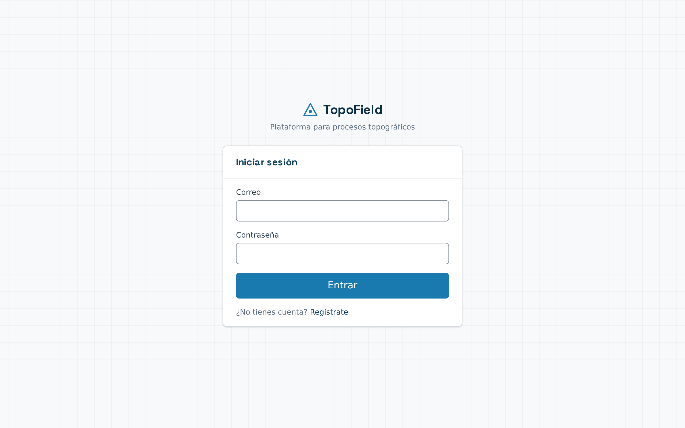

Ingrese con su correo y contraseña. Si aún no tiene cuenta, use **Regístrate**.

**Para crear una cuenta necesita un código de invitación.** Al registrarse se le
pide, junto con su nombre, correo y contraseña. Después recibirá un mensaje para
confirmar su dirección: hasta que pulse ese enlace no podrá entrar.

La primera vez que entre encontrará un **proyecto de ejemplo** hecho con
**carteras de campo reales**, ya calculadas, para que pueda ver cómo funciona la
aplicación sin capturar nada:

- Tres poligonales: la **V10**, amarrada a TT4, en tercer orden; la de la **Sede
  Vivero**, ajustada por mínimos cuadrados, y la misma en un sistema local,
  lista para **georreferenciar** con los vértices D1 y D3 del catálogo.
- Dos nivelaciones: la de **El Verjón**, con ida y vuelta por los mismos puntos
  —verá su discrepancia, la diferencia punto a punto entre ida y vuelta y la
  compensación del circuito—, y el **tramo 2**, leído del archivo de un nivel
  digital Leica.
- Dos controles de asentamientos: **Torre Alameda**, simulado, con catorce
  visitas, BM-1 y BM-2 como BM del lugar, la visita 9 sin verificación y la 13
  con BM-2 desplazado; y la cartera real **Control de asentamiento
  estructural**: dieciséis puntos y siete visitas de una armada desde el BM de
  la piscina, de marzo a junio de 2022.
- Un informe consolidado por módulo.

Puede modificarlo o archivarlo cuando quiera.

Cada usuario ve únicamente sus propios proyectos.

**La barra de arriba.** Queda fija mientras baja por cualquier pantalla. A la
izquierda, el logo vuelve al dashboard, y a su lado va la **ruta** de la
pantalla —«Dashboard › Proyecto de ejemplo › Poligonal Famarena…»—: cada nombre
lleva a ese nivel. En el teléfono, la ruta se reduce al nivel anterior, con
«‹». A la derecha, **Equipos** (§ 12) y **Manual**, y un círculo con la inicial
de su correo: el **menú de cuenta**, con el correo, el tema y **Cerrar
sesión**.

**Tema claro u oscuro.** En el menú de cuenta —y con el icono de arriba a la
derecha en la pantalla de inicio de sesión— se elige el tema: **Sistema** sigue
la configuración del teléfono o del computador, y **Claro** u **Oscuro** lo
fijan. La elección se recuerda en ese navegador. El informe impreso sale
siempre en claro.

---

## 3. El dashboard

Es la pantalla de inicio tras entrar.

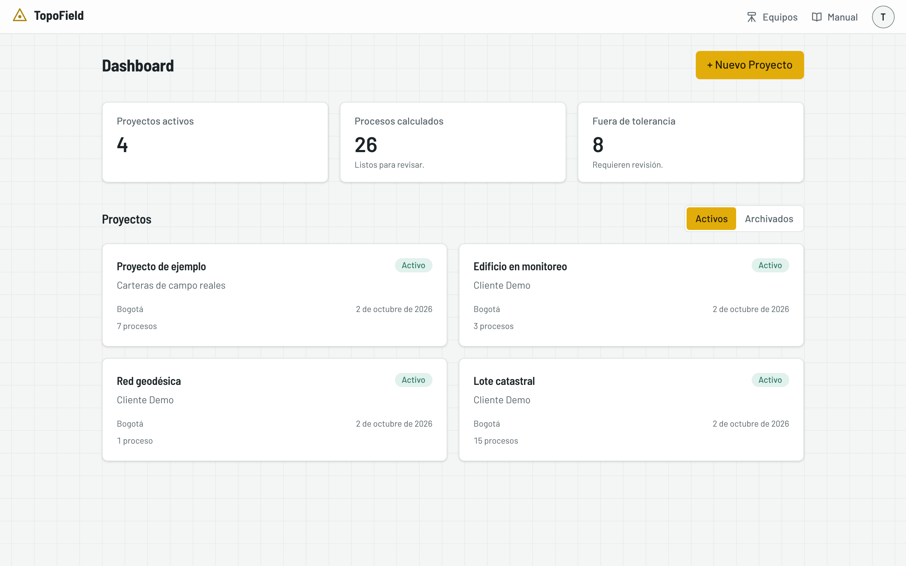

Arriba, tres indicadores del estado general:

- **Proyectos activos** — cuántos proyectos tiene en curso.
- **Procesos calculados** — levantamientos resueltos, listos para revisar.
- **Fuera de tolerancia** — procesos calculados que no cumplen su tolerancia
  —una poligonal o una nivelación, si no alcanza ningún orden—, y lugares con
  algún punto en alerta o alarma en una visita calculada. Requieren revisión.

Debajo, sus proyectos. El selector **Activos / Archivados** filtra la lista.
Cada tarjeta indica cuántos procesos tiene el proyecto.

Use **+ Nuevo Proyecto** para crear uno.

> **Empieza con un proyecto de ejemplo.** La primera vez que entra, su cuenta ya
> trae un **«Proyecto de ejemplo»** con carteras de campo reales —poligonales,
> nivelaciones y un control de asentamientos—, otro control de asentamientos
> simulado y sus informes, para que explore la aplicación con datos reales
> (§ 2). Puede modificarlo o archivarlo cuando quiera.

---

## 4. Proyectos

### 4.1 Crear un proyecto

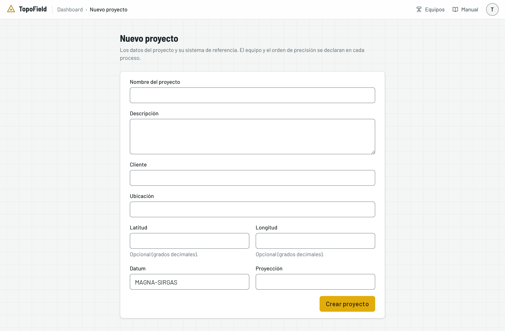

El formulario reúne en una página los **datos básicos** —nombre, descripción,
cliente, ubicación y, si quiere, las coordenadas geográficas en grados
decimales— y el **sistema de referencia**: datum y proyección. El proyecto se
crea al pulsar **Crear proyecto**.

> **El equipo y el orden de precisión no se piden aquí.** Cada poligonal, cada
> nivelación y cada visita de asentamiento lleva su equipo, y su orden se
> detecta al calcularla. Un mismo proyecto puede así tener trabajos de
> distinto orden, medidos con instrumentos distintos y en fechas distintas.
> Vea [§ 5.2](#52-crear-una-poligonal), [§ 6.4](#64-crear-una-nivelación) y
> [§ 7.4](#74-una-visita-nueva).

### 4.2 El proyecto por dentro

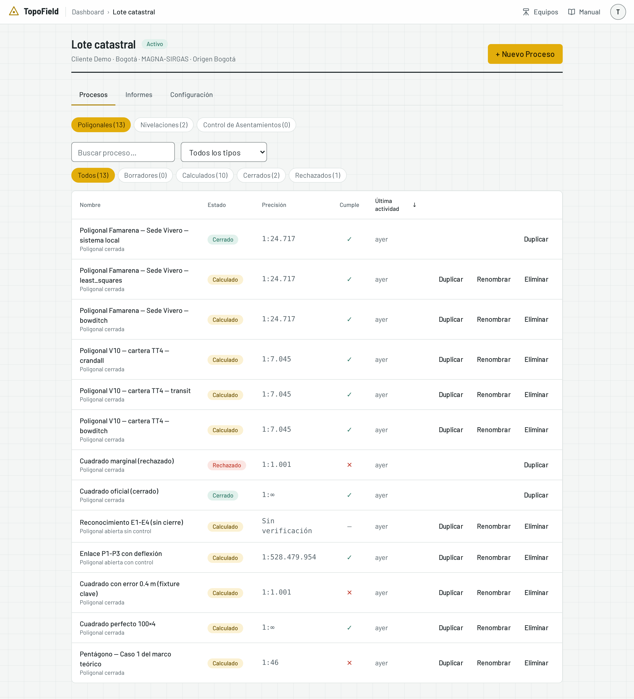

La cabecera muestra el nombre y el estado del proyecto, su cliente, su
ubicación y su sistema de referencia, y el botón **+ Nuevo Proceso**. Debajo,
tres pestañas:

**Procesos** — el listado de levantamientos del proyecto. Se detalla en
[§ 4.3](#43-el-listado-de-procesos).

**Informes** — los informes **consolidados**, que reúnen poligonales y
nivelaciones calculadas y controles de asentamientos con alguna visita
calculada en un solo documento. Se detalla en [§ 10](#10-informes). Cada
proceso tiene además su propio informe, en su pantalla
([§ 4.4](#44-la-pantalla-de-un-proceso)).

**Configuración** — los datos del proyecto (también la descripción), los
puntos de referencia, y archivar o eliminar el proyecto.

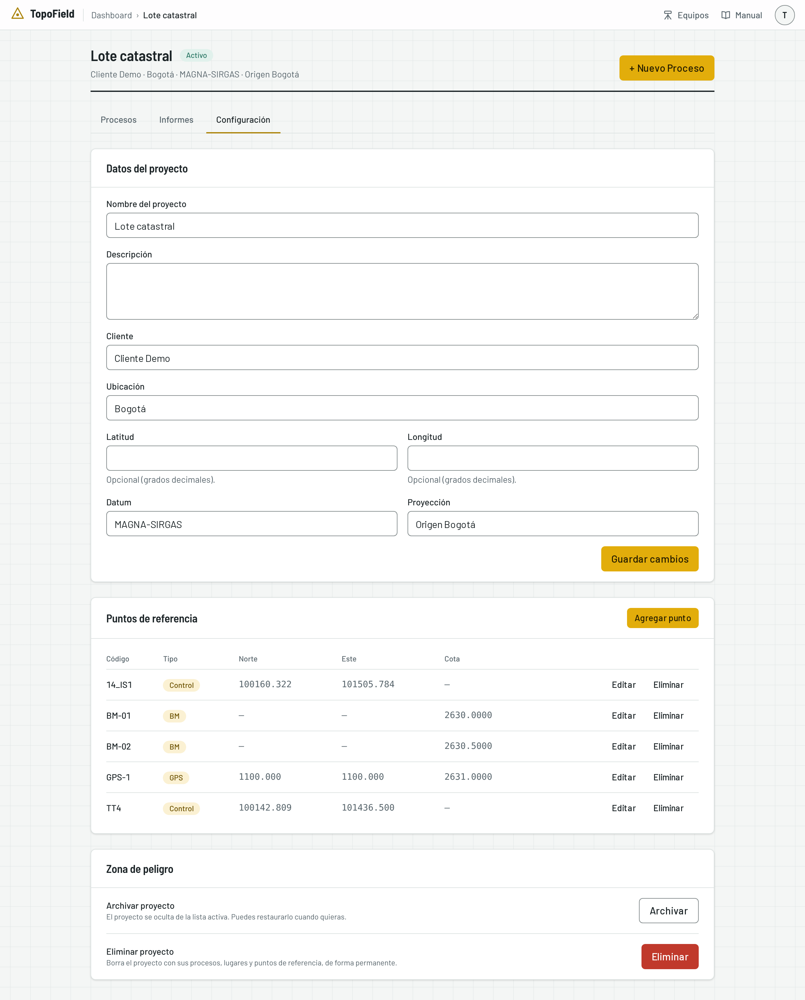

Los **puntos de referencia** son coordenadas conocidas (vértices geodésicos,
mojones) que puede reutilizar como punto de partida o de llegada de sus
poligonales, sin volver a teclearlas. Las visitas de asentamiento no los
usan: cada lugar tiene sus propios BM (§ 7.3).

**Archivar o eliminar.** Archivar oculta el proyecto de la lista activa del
dashboard; puede restaurarlo cuando quiera. Eliminarlo lo borra con todo lo
que contiene, de forma permanente.

### 4.3 El listado de procesos

Los chips **Poligonales**, **Nivelaciones** y **Control de Asentamientos**
eligen el módulo, con cuántos tiene cada uno. Los tres listados funcionan
igual, con una barra para encontrar lo que busca.

**Buscar.** Filtra por nombre mientras escribe. No distingue mayúsculas ni
acentos: «via» encuentra «Vía terciaria».

**Filtrar por estado.** Los chips muestran cuántos hay en cada grupo, así que
ve la distribución del proyecto sin desplegar nada. Pulse uno para ver solo
ese grupo: **Borradores** o **Calculados**. El control de asentamientos no los
tiene: el lugar no tiene estado.

**Filtrar por tipo.** El selector acota a un tipo de poligonal, de nivelación
o de estructura.

Cuando hay algún filtro activo aparece **Limpiar filtros**, para volver a verlo
todo de un clic.

> Cada listado recuerda el último filtro que usó en cada proyecto, así que al
> volver lo encuentra como lo dejó. Si abre un enlace que alguien le compartió,
> manda lo que traiga ese enlace: verá lo mismo que quien se lo envió.

**Las columnas.**

| Columna | Qué muestra |
|---|---|
| Nombre | Nombre y tipo (en asentamientos, el tipo de estructura y cuántas visitas tiene) |
| Estado | Borrador, En progreso o Calculado. No aparece en asentamientos |
| Resultado | La **precisión** relativa de una poligonal, el **cierre** de una nivelación (o su discrepancia, si es abierta con vuelta) o la **alerta** de un lugar |
| Cumple | ✓ si alcanza algún orden, ✕ si no, — si no aplica. No aparece en asentamientos |
| Última actividad | Cuándo se modificó por última vez |

La columna **Cumple** es la que evita abrir cada proceso para saber si el
levantamiento sirve.

Pulse **Nombre**, la columna de resultado o **Última actividad** para ordenar
por esa columna; pulsar de nuevo invierte el orden. Por defecto se ordena por
actividad reciente, así que lo que está trabajando queda arriba.

**Acciones por fila.** Cada fila ofrece siempre las tres, porque ningún
proceso se cierra:

- **Duplicar** — crea uno nuevo con la misma configuración: una poligonal sin
  estaciones, una nivelación sin lecturas, un lugar con sus umbrales, su
  catálogo de puntos y sus BM pero sin visitas.
- **Renombrar** — cambia el nombre sin abrirlo.
- **Eliminar** — lo borra con lo que contiene, con confirmación previa. Si lo
  que borra está en un informe consolidado, la confirmación lo avisa: el
  informe quedará sin esa sección.

En el teléfono, la tabla se convierte en tarjetas, una por fila, con las
mismas acciones.

### 4.4 La pantalla de un proceso

Los tres módulos comparten la cabecera. Lleva sus rótulos —el tipo y, si lo
tiene, el estado—, el nombre, sus datos y cuándo se guardó por última vez, y
las acciones
**Editar datos**, **Exportar a Excel** ([§ 11](#11-exportar-a-excel)) y, bajo
**⋯**, **Duplicar** y **Eliminar**. La ruta de la barra devuelve al listado
del que vino.

Debajo van los pasos de la poligonal —**Datos**, **Ajuste** e **Informe**— y
de la nivelación —**Libreta**, **Compensación** e **Informe**—
([§ 5.3](#53-la-pantalla-por-pasos) y [§ 6.5](#65-la-pantalla-por-pasos)), o
las pestañas del lugar de asentamientos —**Panel**, **Puntos**, **BMs** e
**Informe**—, cuya cabecera añade **+ Nueva visita**
([§ 7](#7-control-de-asentamientos)).

**No hay botón Guardar.** Cada popup guarda al confirmar, y la libreta de una
visita, lectura por lectura (§ 7.7).

**El informe.** El paso o la pestaña **Informe** muestra el informe de ese
proceso, listo para **Imprimir o guardar como PDF** ([§ 10](#10-informes)),
que pasa a ser la primera acción de la cabecera.

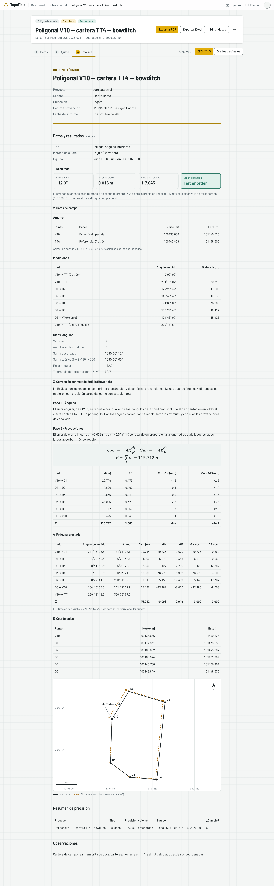

No lleva marca de borrador ni registro de cierre: ningún proceso se cierra, y
el informe muestra lo que tenga al abrirlo. Debajo, fuera de la impresión,
aparecen los informes consolidados que ya lo incluyen y, si puede entrar en
uno —una poligonal o una nivelación calculadas, o un lugar con alguna visita
calculada—, un botón para generar uno nuevo con él.

---

## 5. Poligonales

La poligonal se trabaja como la mide el topógrafo: un alta corta y tres pasos
en una sola pantalla —**1 · Datos**, **2 · Ajuste** y **3 · Informe**—. **No
hay botón Guardar**: cada popup guarda al confirmar. Y **la poligonal no se
cierra**: queda calculada y se corrige cuando haga falta; su informe dice qué
orden de precisión alcanzó.

### 5.1 Tipos

TopoField maneja tres tipos, y la diferencia determina cómo se verifica el
trabajo:

| Tipo | Descripción | Cómo se verifica |
|---|---|---|
| **Cerrada** | Parte de un punto y regresa a él | Suma de ángulos + error de cierre lineal |
| **Abierta con control** | Parte de un punto conocido y llega a otro conocido | Comparación contra las coordenadas del punto de llegada |
| **Abierta sin control** | Parte de un punto conocido y no cierra | **No tiene verificación de cierre** |

La poligonal abierta sin control sirve para reconocimiento: calcula coordenadas,
pero no hay forma de comprobar si son correctas. La aplicación lo indica
explícitamente en vez de mostrar una precisión inexistente.

### 5.2 Crear una poligonal

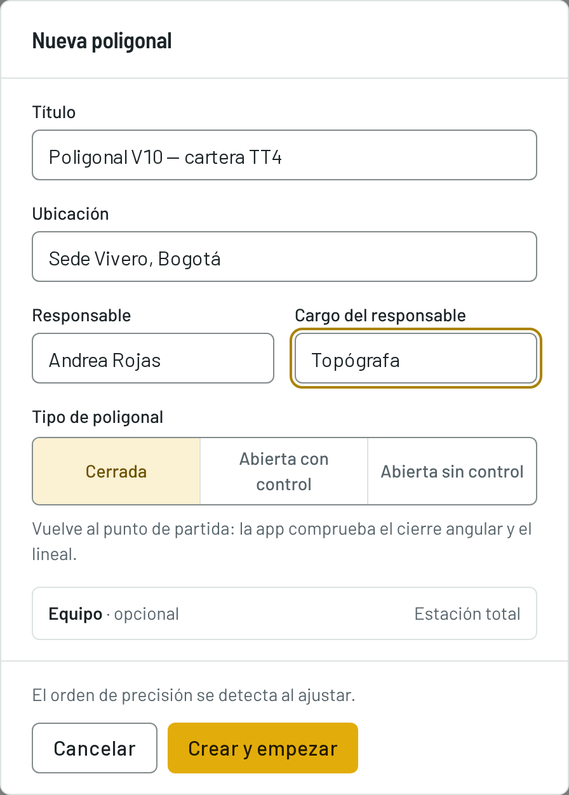

Desde el proyecto, **+ Nuevo Proceso → Poligonal** abre un popup:

- **Título**, el único obligatorio.
- **Ubicación**, **Responsable** y **Cargo del responsable**: salen en el
  informe y en el Excel.
- **Tipo de poligonal**, con una línea que explica cómo se verifica cada uno.
- **Equipo**, plegado y opcional: marca, modelo y número de serie de la
  estación total, que se escriben.

**Crear y empezar** lleva al paso de Datos. Lo que no se pide: el **orden de
precisión** y el **tipo de ángulo** se detectan al calcular (§ 5.4 y § 5.5).

Estos datos se cambian después con **Editar datos**, en la cabecera. Cambiar
el tipo cuando ya hay mediciones las recalcula con el tipo nuevo, y el popup lo
avisa.

### 5.3 La pantalla por pasos

La **cabecera** lleva el tipo, el estado y el orden alcanzado; el título, la
ubicación, el responsable, el equipo y cuándo se guardó por última vez; y las
acciones **Editar datos**, **Exportar a Excel** (§ 11) y, bajo **⋯**,
**Duplicar** y **Eliminar**.

Debajo van los tres pasos y, a la derecha, **Ángulos en**: **DMS (° ′ ″)** o
**Grados decimales**. El formato rige la tabla, el ajuste, el informe y los
popups, y se recuerda por proceso.

- Cambiar de formato **no altera ningún valor**: la aplicación guarda los
  ángulos siempre en DMS y el decimal es solo otra forma de verlos, con seis
  decimales.
- Los ángulos se guardan a la **décima de segundo**. Si teclea un decimal con
  más precisión, bajo el campo aparece cómo se guardará —«Se guarda como
  124°29′42″»—.

### 5.4 Paso 1 · Datos

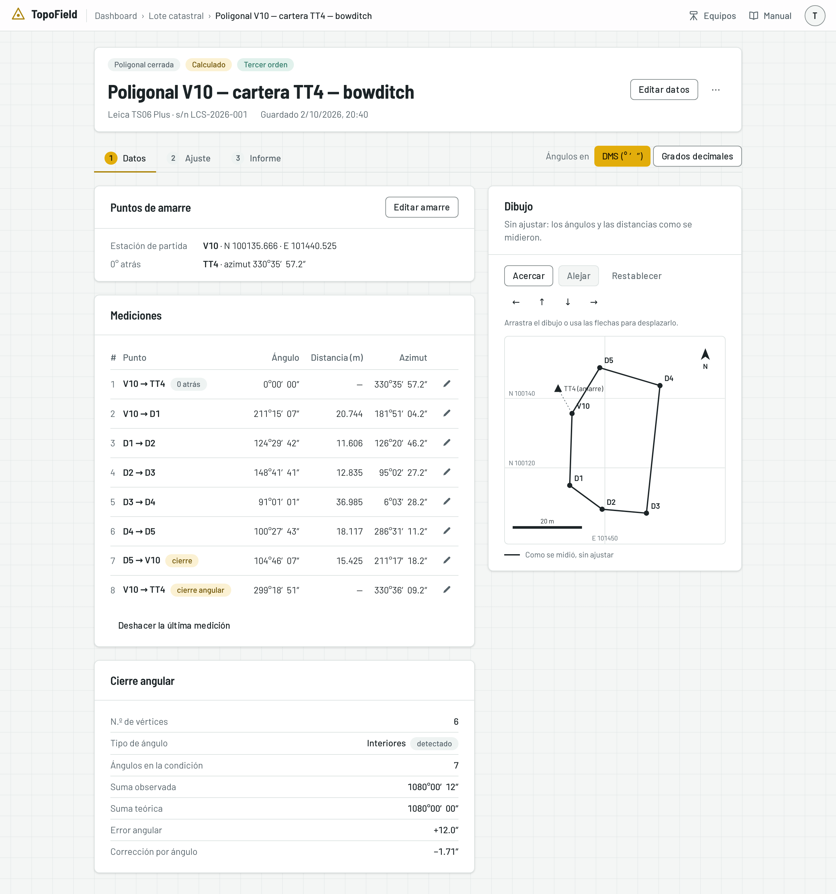

Dos columnas: a la izquierda, el amarre, las mediciones y el cierre angular; a
la derecha, el dibujo, que se queda fijo mientras baja la página.

**Los puntos de amarre.** Una poligonal nueva empieza por ellos: **Ingresar
puntos de amarre** abre un popup con

- la **estación de partida**: nombre, Norte y Este, o **Tomar del catálogo**;
- la **referencia, 0° atrás**, de tres maneras: **Punto con coordenadas** —el
  azimut de partida se calcula solo y el popup lo muestra—, **Solo el azimut**
  —si no tiene sus coordenadas: el nombre y el azimut de la partida a la
  referencia— o **Sin 0 atrás**, con el azimut del primer lado;
- en la abierta con control, la **llegada**: el punto conocido, con su Norte y
  su Este, y el azimut de llegada si lo tiene. Con él se comprueba también el
  cierre angular.

Los puntos con coordenadas se guardan en el catálogo del proyecto. Si el
nombre ya existe con otras coordenadas, el punto toma las que usted tecleó: así
se corrige el amarre, y la poligonal se recalcula con las mediciones que ya
tiene, sin volver a medir. Antes de guardar, el popup avisa qué puntos cambian
en el catálogo, con sus coordenadas de antes y las otras poligonales que los
usan. Dos puntos del amarre no pueden llamarse igual con coordenadas
distintas. Sin 0 atrás, la partida no va al catálogo: puede ser local.

Con mediciones, el amarre se edita pero **no se pone ni se quita el 0 atrás**:
cambiaría lo que significa el primer ángulo —de orientación a vértice, o al
revés—. El popup pide deshacer las mediciones antes.

Si levanta en un sistema local, **Medir sin amarre, en coordenadas locales**
arranca en P1 (1000, 1000) con azimut 0°. Cuando tenga las coordenadas
reales, edite el amarre o georreferencie (§ 5.6).

**Las mediciones.** La tabla se lee como la cartera: cada fila va **desde →
hacia** —«V10 → D1»—, con el ángulo medido en el punto de partida, la
distancia y el **azimut sin ajustar**, encadenado con los ángulos tal como se
midieron. La primera fila es el **0 atrás**; el lado que vuelve a la partida
lleva la marca **cierre**, y la fila del cierre angular, **cierre angular**.

**+ Agregar punto** abre el popup de medición:

- arriba, dónde está: «Estás en D1 · atrás en V10»;
- el **punto siguiente**;
- las **lecturas del ángulo**: una o varias, con **+ Lectura**. Con dos o
  más, el popup muestra el promedio y la dispersión entre ellas; el promedio es
  el ángulo que entra en el cálculo. La dispersión es un dato: la aplicación
  no la juzga;
- en la abierta con control, el **sentido** de la deflexión: derecha o
  izquierda;
- la **distancia horizontal** hasta el punto siguiente.

**Agregar y seguir en D2** guarda y deja el popup listo para la medición
siguiente; **Terminar** guarda y lo cierra. Sin 0 atrás, la primera medición
no lleva ángulo.

Desde la segunda medición de una cerrada aparece la casilla **Cierre: este
lado vuelve a V10**, que fija como siguiente la estación de partida. Al
agregar el cierre, el popup sigue con el **cierre angular**:

- amarrada, en la estación de partida: hacia la referencia —la cartera cierra
  contra el amarre, como la TT4— o, si desmarca la casilla, hacia el primer
  lado —el ángulo del vértice de arranque, como la cartera de la Sede Vivero—;
- sin amarre, el ángulo en P1, entre el último punto y P2: se mide al final,
  porque al empezar no había punto atrás.

En la abierta con control la casilla es **Llegada: este lado llega a …**, y
con azimut de llegada el cierre angular es la deflexión en el punto de
llegada. Mientras falte el cierre angular, **Medir el cierre angular** ocupa el
lugar de **+ Agregar punto**.

El lápiz de cada fila abre el mismo popup para **editarla** —el ángulo, la
distancia o el nombre del punto siguiente— o **eliminarla**. Eliminar una
medición intermedia quita esa estación: el punto siguiente pasa a medirse desde
el anterior, y el popup lo avisa. **Deshacer la última medición** retrocede
de a una: primero el cierre angular, después el cierre y luego cada lado.

Los errores se detectan al confirmar y se quedan en el popup, sin perder lo
tecleado: un ángulo sin lecturas, minutos o segundos fuera de 0-59, segundos
con más de una cifra decimal, una distancia de cero, mayor a 1000 m o con más
de cuatro decimales, un punto sin nombre o repetido.

**El cierre angular**, debajo de la tabla, resume la cerrada: vértices,
**tipo de ángulo** con la marca *detectado*, ángulos en la condición, suma
observada y teórica, error angular y la corrección que le toca a cada ángulo.
En la abierta con control, el error contra el azimut de llegada.

> **El tipo de ángulo se detecta.** Interiores y exteriores solo cambian la
> suma teórica —(n − 2)·180° frente a (n + 2)·180°— y difieren en 720°: la
> suma observada dice sin ambigüedad cuál midió.

**El dibujo** muestra lo medido, sin ajustar, y crece con cada medición. En una
cerrada, el último lado no llega exactamente a la partida: ese hueco es el
error de cierre, a escala real. En el teléfono, un selector **Tabla | Dibujo**
alterna entre las dos columnas (§ 9).

### 5.5 Paso 2 · Ajuste

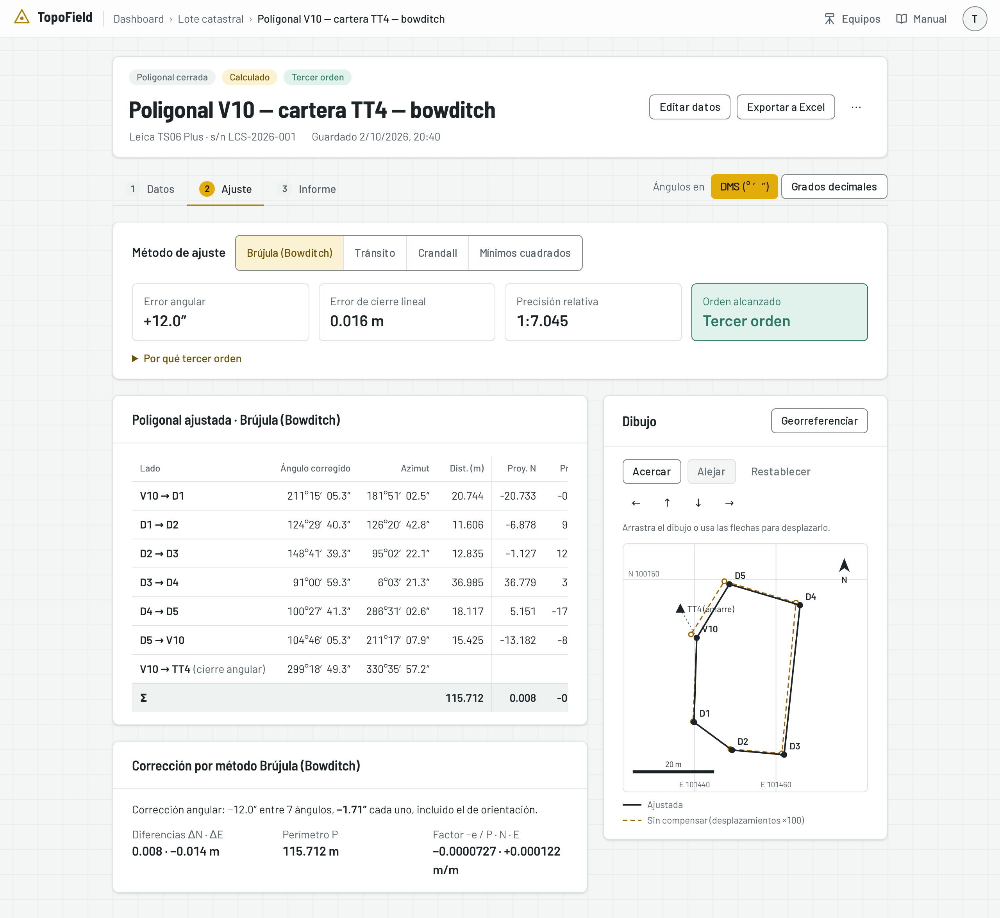

**El método.** Arriba, el selector. Cambiarlo recalcula y guarda al instante.

| Método | Cómo reparte el error |
|---|---|
| **Brújula (Bowditch)** | Proporcional a la longitud de cada lado. El más usado |
| **Tránsito** | Proporcional a las proyecciones. Útil si las distancias son menos fiables que los ángulos |
| **Crandall** | Mínimos cuadrados sobre las distancias, conservando los ángulos ajustados |
| **Mínimos cuadrados** | Ajusta a la vez ángulos y distancias según el peso que usted les da. Solo en cerrada y abierta con control |

Una abierta sin control no tiene nada que ajustar: el paso muestra sus
coordenadas encadenadas, sin selector.

**El orden alcanzado.** Cuatro cifras: error angular, error de cierre lineal,
precisión relativa y **orden alcanzado**, el más alto que cumple a la vez la
tolerancia angular y la precisión relativa mínima de su orden.

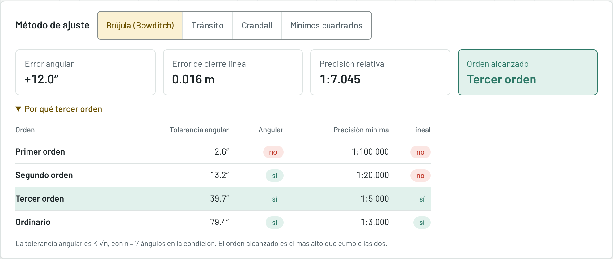

**Por qué** despliega cada orden con su tolerancia y su precisión mínima, y si
la poligonal las cumple:

| Orden | Tolerancia angular | Precisión relativa mínima | Uso típico |
|---|---|---|---|
| Primer orden | 1″·√n | 1:100.000 | Geodésico de alta precisión |
| Segundo orden | 5″·√n | 1:20.000 | Control urbano y catastral |
| Tercer orden | 15″·√n | 1:5.000 | Levantamiento topográfico común |
| Ordinario | 30″·√n | 1:3.000 | Levantamiento rural o reconocimiento |

Donde *n* es el número de ángulos que entran en la condición: los vértices de
una cerrada —más el de cierre si cierra contra el amarre— o las deflexiones de
una abierta con control. En la cartera TT4, el error de 12″ cabe en segundo
orden (13.2″), pero 1:7.045 solo alcanza el tercero (1:5.000): **tercer
orden**. Si no alcanza ni el ordinario, la cifra dice **No alcanza ningún
orden** y el informe lo alerta.

> **El orden no se declara: se detecta.** Es el mismo con cualquier método,
> porque se juzga con el error de la cartera tal como se midió, antes de
> corregir.

**La poligonal ajustada.** La tabla al estilo de la hoja de cálculo: cada lado
«desde → hacia» con el ángulo corregido, el azimut, la distancia, las
proyecciones, las proyecciones corregidas y las coordenadas del punto al que
llega. La fila **Σ** suma las proyecciones: en las crudas, el error de cierre;
en las corregidas, cero. En el teléfono, la tabla se desplaza de lado.

**Corrección por método …** resume cómo corrigió el método elegido: el reparto
del error angular —en la TT4, −1.71″ en cada uno de los 7 ángulos, incluido el
de orientación— y sus cifras propias:

- Brújula: las diferencias ΔN y ΔE, el perímetro y el factor −e/P de cada eje;
- Tránsito: la suma de proyecciones absolutas y la corrección unitaria de cada
  eje;
- Crandall: los multiplicadores λ₁ y λ₂ del ajuste de las distancias.

**Mínimos cuadrados.** Los otros tres métodos reparten el error con una regla
fija; este busca las correcciones más pequeñas —pesadas por la precisión de
cada observación— que hacen cerrar la poligonal. Al elegirlo aparecen tres
campos:

- **σ angular (″)**: la desviación típica que supone para cada ángulo.
- **σ de distancia (m)**: la de una medición de distancia.
- **Mediciones por distancia**: cuántas veces midió cada lado. Una distancia
  medida *n* veces pesa como σ/√*n*.

Todas las observaciones pesan igual. Los campos **salen vacíos**: la
aplicación no supone pesos por usted. La hoja de la universidad usa, por
ejemplo, 2″, 0.011 m y 2 mediciones. Se guardan al salir del campo, cuando
están los tres; mientras tanto el ajuste dice que faltan. Si cambia de método,
los pesos se conservan para cuando vuelva.

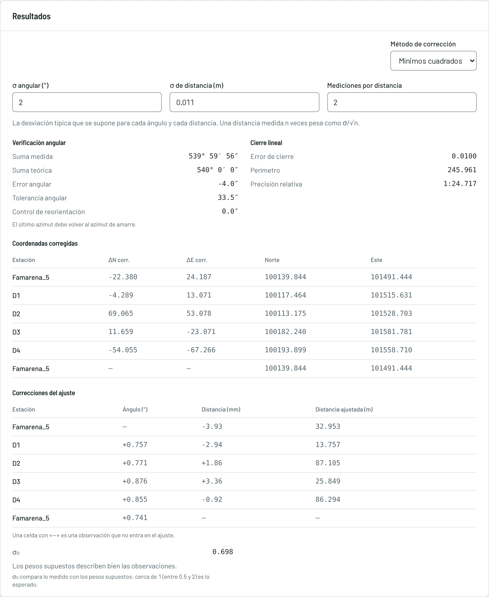

Con los pesos completos aparece la **corrección de cada ángulo**, en segundos,
y de **cada distancia**, en milímetros, junto a la distancia ajustada. El
ángulo de orientación no se ajusta: es el **datum**, porque un error suyo rota
la poligonal entera sin afectar al cierre. Debajo aparece **σ₀**, que compara
lo medido con los pesos que supuso. Con pesos correctos ronda 1, pero con tan
pocas condiciones fluctúa mucho; por eso se juzga con la **prueba χ² al 95 %**
de su número de condiciones, r (3, o 2 sin azimut de llegada):

- **Dentro del intervalo** (de 0.268 a 1.765 con r = 3; de 0.159 a 1.921 con
  r = 2): los pesos describen bien sus observaciones.
- **Por encima**: midió peor de lo supuesto, o hay un error grueso en la
  cartera.
- **Por debajo**: sus σ son pesimistas; midió mejor de lo declarado.

Si los pesos están pero no hay ajuste posible, un aviso dice por qué: con un
solo lado, por ejemplo, las condiciones de llegada dependen de una sola
distancia y no hay nada que ajustar. σ₀ es información, no un criterio: el
orden alcanzado no depende del método.

**El dibujo ajustado.** La poligonal a escala sobre una grilla de
coordenadas, con flecha de norte, barra de escala y el amarre si lo tiene.

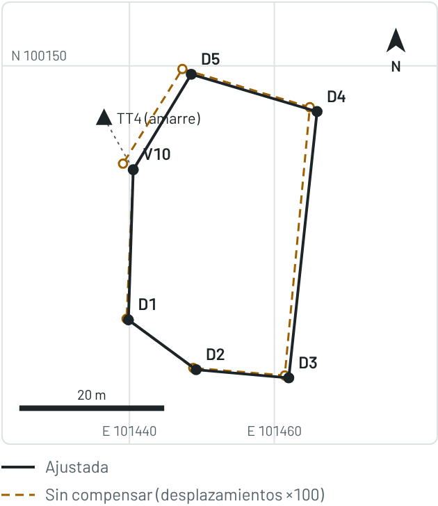

- En **trazo continuo**, la poligonal **ajustada**.
- En **trazo discontinuo**, la poligonal **sin compensar**, con los
  desplazamientos **exagerados** por el factor que indica la leyenda (×100 en
  la imagen). En una cerrada no llega a cerrar: el hueco del último vértice
  es el error de cierre.

> **Por qué se exagera.** En un buen levantamiento el error de cierre es de
> centímetros sobre cientos de metros: dibujado a escala real, ocupa menos de
> un píxel y las dos poligonales se verían idénticas. El factor se elige solo
> —1, 2 o 5 × 10ⁿ— para que el mayor desplazamiento ocupe alrededor del 5 %
> del dibujo, y nunca es menor que 1. Una abierta sin control no tiene nada que
> compensar y no muestra trazo discontinuo.

Con **Acercar**, **Alejar** y **Restablecer**, y con las **flechas** o
arrastrando el dibujo, puede acercarse a un vértice; todos los controles
funcionan con el teclado. Si el amarre está lejos, queda fuera del encuadre y
solo se ve su línea de orientación: la leyenda lo indica. La rueda del ratón
no hace zoom, para no interferir con el desplazamiento de la página. El factor
de exageración no cambia al acercarse.

### 5.6 Georreferenciar

Un levantamiento suele arrancar en un sistema local —(1000, 2000) y un azimut
supuesto— y recibir coordenadas reales después. El botón **Georreferenciar**,
junto al dibujo del paso de Ajuste, lo lleva al sistema real con **dos de sus
estaciones** de coordenadas conocidas.

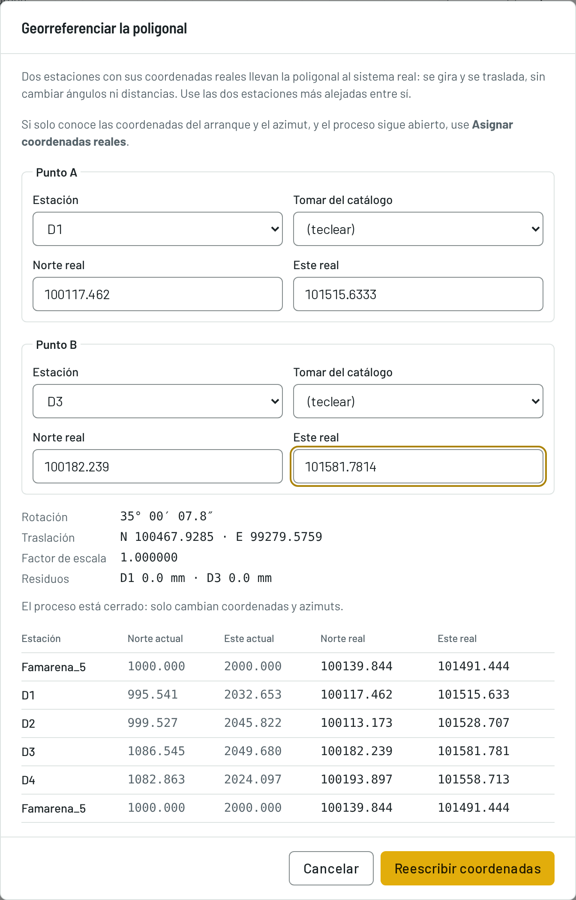

1. Elija la estación del **punto A** y teclee su Norte y Este reales, o tómelos
   de un punto del catálogo del proyecto.
2. Lo mismo para el **punto B**. Use las dos estaciones **más alejadas** entre
   sí: con puntos cercanos, un error pequeño en sus coordenadas gira mucho la
   poligonal.
3. Revise la vista previa: **rotación**, **traslación**, **factor de escala**,
   **residuos** en A y B, y las coordenadas actuales frente a las reales.
4. Confirme.

La poligonal se **gira y se traslada**, sin escala: las distancias y los
ángulos medidos no cambian, y el **orden alcanzado tampoco**. Se recalcula
con el nuevo arranque, así que coordenadas, azimuts y proyecciones quedan en el
sistema real. Sobre el dibujo queda anotada la última georreferenciación:
fecha, puntos, rotación y factor de escala. Puede georreferenciar otra vez para
corregir una coordenada mal tecleada.

Si lo que tiene son las coordenadas reales del **punto de partida y de la
referencia**, no hace falta georreferenciar: edite el amarre (§ 5.4) y la
poligonal se recalcula desde ellos.

El diálogo avisa, sin impedirlo, en tres casos:

- **El factor de escala se aparta de 1** más de lo que admite el orden
  alcanzado: la distancia real entre A y B no concuerda con la medida. Revise
  las coordenadas. Si están en una proyección con factor de escala distinto de
  1 (p. ej. CTM12), la diferencia puede ser de la proyección y no un error.
- **El método es Tránsito.** Tránsito reparte el error según la orientación,
  así que sus coordenadas cambian unos milímetros más allá del giro. El
  orden alcanzado no cambia.
- **El amarre es del catálogo.** Sus coordenadas siguen en el sistema
  anterior, así que pasa a amarre manual con el mismo código, y el dibujo deja
  de mostrarlo.

### 5.7 Paso 3 · Informe

El informe de la poligonal, listo para **Imprimir o guardar como PDF** (§ 10).
Es la misma sección que lleva en un informe consolidado:

1. **Resultado**: las cuatro cifras y por qué alcanza su orden. Si no alcanza
   ninguno, una alerta lo dice: «No alcanza la precisión de ningún orden».
2. **Datos de campo**: el amarre, las mediciones «desde → hacia» y el cierre
   angular, con su tolerancia.
3. **Corrección por método …**: cómo corrigió el método elegido, paso a paso,
   con sus fórmulas en notación matemática y las cifras de esta poligonal.
4. **Poligonal ajustada**, con la fila Σ.
5. **Coordenadas** y el dibujo.

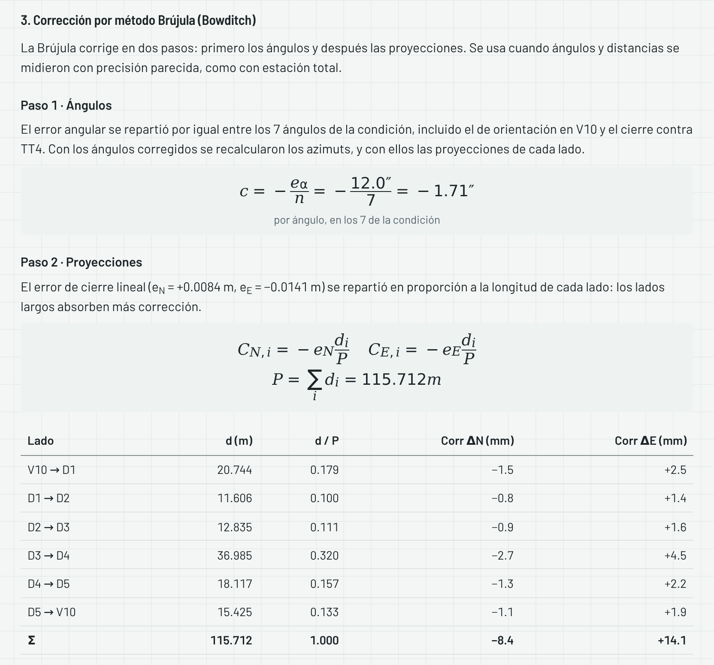

No lleva marca de borrador: la poligonal no se cierra, y el informe muestra lo
que tenga al abrirlo. Los ángulos salen en el formato elegido.

---

## 6. Nivelación

La nivelación se trabaja como la mide el topógrafo, igual que la poligonal
(§ 5): un alta corta y tres pasos en una sola pantalla —**1 · Libreta**,
**2 · Compensación** y **3 · Informe**—. Cada armada se captura en un popup y
**no hay botón Guardar**: cada popup guarda al confirmar. El **orden de
precisión se detecta** al compensar, y **la nivelación no se cierra**: queda
calculada y se corrige cuando haga falta; su informe dice qué orden alcanzó.

### 6.1 Tipos

TopoField maneja tres tipos de nivelación geométrica:

| Tipo | Descripción | Cómo se verifica |
|---|---|---|
| **Cerrada** | Sale de un BM y vuelve a ese mismo BM | Error de cierre contra la cota de partida |
| **De enlace** | Va de un BM conocido a otro BM conocido distinto | Error de cierre contra la cota de llegada |
| **Abierta** | Termina en un punto sin cota conocida | Sin vuelta, ninguna; con vuelta, la **discrepancia entre ida y vuelta** |

Sin recorrido de vuelta, la nivelación abierta sirve solo para
reconocimiento: calcula cotas, pero no hay forma de comprobar si son
correctas, igual que la poligonal abierta sin control (§ 5.1). No tiene orden
ni se compensa, y la aplicación la rotula **Abierta sin control**. Con vuelta,
su veredicto es la discrepancia entre ida y vuelta (§ 6.8), y se rotula
**Abierta con ida y vuelta**.

### 6.2 Cómo se llena la libreta

La libreta es una fila por punto. Cada fila puede llevar dos lecturas:

- **Vista más (V+)** — la primera que se toma tras estacionar el nivel. Con
  ella se **abre la armada siguiente**: fija la altura del instrumento
  (AI = cota + V+) que usarán las filas venideras.
- **Vista menos (V−)** — **fija la cota del punto** de la fila. Viene de la
  armada anterior: cota = AI − V−.

Los nombres dicen qué hace cada número en la cuenta: la vista más se suma y la
vista menos se resta. Son los de la cartera de campo.

Una **armada** es una posición del nivel: la V+ a un punto que ya tiene cota y
la V− al siguiente, con las vistas intermedias que se lean desde ahí. Por eso
la columna **AI solo tiene valor en las filas que llevan V+**: la altura de
instrumento es un dato de la armada, no de la fila. En la aplicación se
captura armada por armada, y cada lectura va a la fila de su punto (§ 6.6).

### 6.3 Tipos de punto

Cada fila indica de qué tipo es el punto que registra:

| Tipo | Qué hace | Lecturas que lleva |
|---|---|---|
| **BM** | Banco de nivel, de cota conocida. Ancla el recorrido | La primera fila solo lleva V+; la última, si es BM, solo lleva V− |
| **Punto de cambio** | Transmite la cota de una armada a la siguiente | V+ y V− (salvo en los extremos) |
| **Intermedio (radiación)** | Solo se lee para conocer su cota, sin continuar el recorrido a través de él | Solo V− |

El punto intermedio cuelga de la AI vigente pero **no propaga cota ni abre
una armada nueva**, y por eso queda fuera de la comprobación aritmética: un
error en su lectura no contamina el resto del recorrido. En la compensación
recibe la corrección de su armada, la de la distancia acumulada hasta el
instrumento.

### 6.4 Crear una nivelación

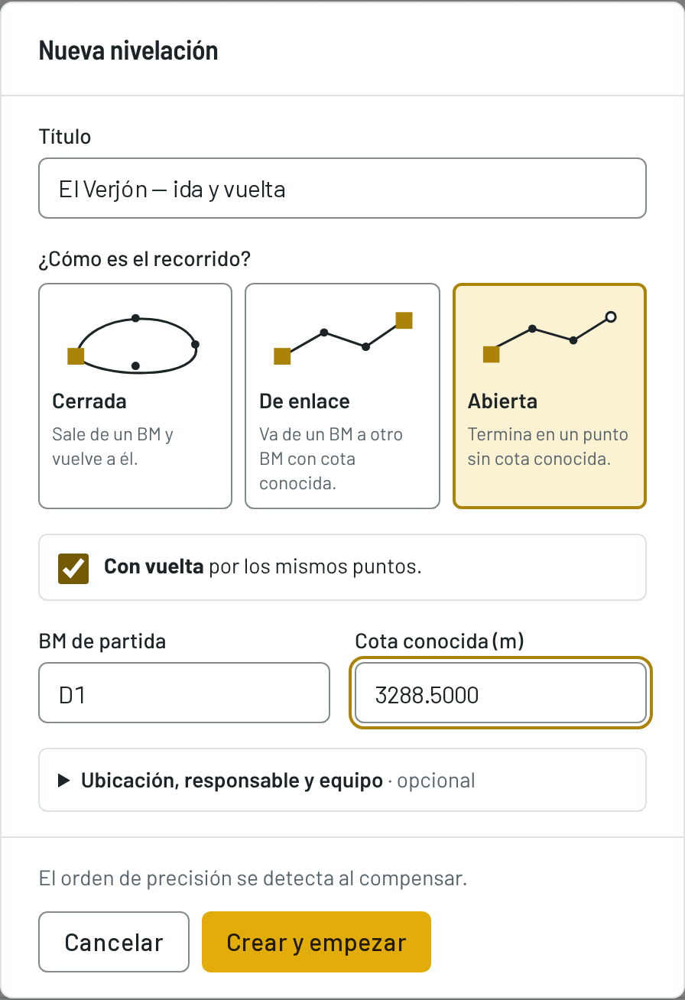

Desde el proyecto, **+ Nuevo Proceso → Nivelación** abre un popup:

- **Título**, obligatorio.
- **¿Cómo es el recorrido?**: cerrada, de enlace o abierta, cada una con su
  recorrido dibujado.
- **Con vuelta**, si va a volver por los mismos puntos.
- El **BM de partida** y su **cota conocida**; en la de enlace, también el
  **BM de llegada** y la suya. El BM se teclea.
- Plegados y opcionales: **Ubicación**, **Responsable**, **Cargo del
  responsable** y el **equipo**: marca, modelo y número de serie del nivel, o
  **Tomar del catálogo** (§ 12).

**Crear y empezar** lleva a la libreta. Lo que no se pide: el **orden de
precisión**, que se detecta al compensar (§ 6.7), y el tipo de nivel, que no
entra en ningún cálculo.

Estos datos se cambian después con **Editar datos**, en la cabecera. Cambiar
el tipo o un BM recalcula la libreta, y quitar la vuelta borra su libreta: el
popup avisa de los dos, y en el segundo dice cuántas armadas se borran.

### 6.5 La pantalla por pasos

La **cabecera** lleva el tipo, el estado y el orden alcanzado; el título, la
ubicación, el responsable, el equipo y cuándo se guardó por última vez; y las
acciones **Editar datos**, **Exportar a Excel** (§ 11) y, bajo **⋯**,
**Duplicar** y **Eliminar**. Debajo van los tres pasos y, a la derecha,
**Importar .L o CSV** (§ 6.9).

### 6.6 Paso 1 · Libreta

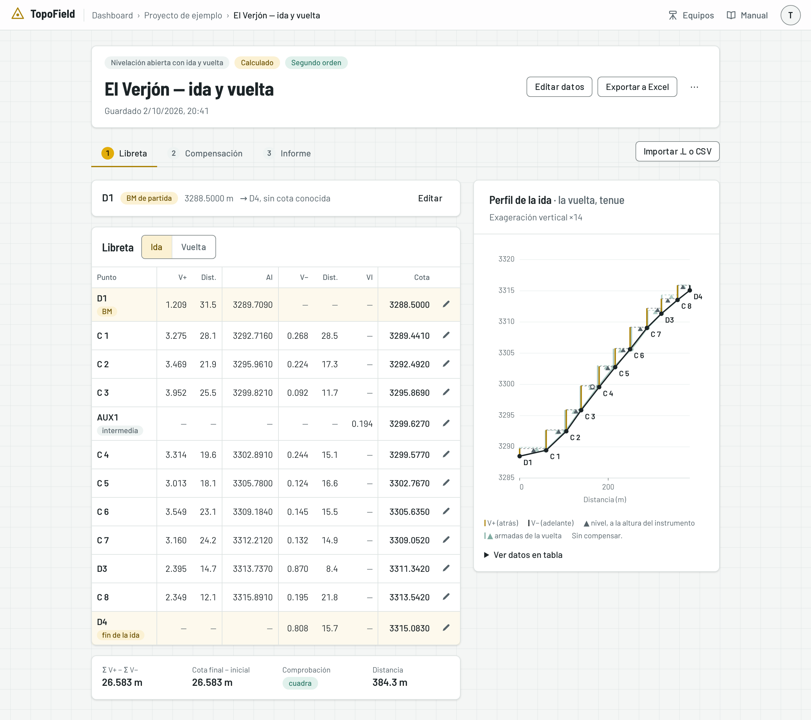

Dos columnas: a la izquierda, el BM, la libreta y su comprobación aritmética;
a la derecha, el perfil, que se queda fijo mientras baja la página.

**El BM.** Una tarjeta con el código y la cota del BM de partida y hacia dónde
va: el circuito de una cerrada, el BM de llegada de una de enlace o el final
sin cota conocida de una abierta. **Editar** abre su popup: el código y la
cota y, en la de enlace, los del BM de llegada. Cambiar la cota del BM
recalcula todas las cotas de la libreta, y cambiar su código cambia también
las filas de la libreta que lo llevan.

**La tabla de la hoja.** Como la cartera: **Punto**, **V+** y su distancia,
**AI**, **V−** y su distancia, **VI** —la lectura de una vista intermedia— y
la **cota**, sin compensar. Los rótulos marcan el **BM**, las vistas
**intermedias** y, en una abierta, el **fin de la ida**. Con vuelta, un
selector **Ida | Vuelta** cambia de recorrido. Las lecturas van con tres
decimales, o con cuatro si vienen de un nivel digital.

La tabla es de solo lectura: el **lápiz** de cada fila abre la armada que esa
fila cierra; el del BM de partida, la primera, y el de una vista intermedia,
la suya. **+ Agregar armada** abre la siguiente. Cuando la ida llega a su fin
y hay vuelta, **Seguir con la vuelta** abre la primera armada de la vuelta,
que parte del BM de partida en una cerrada, del de llegada en una de enlace o
del final de la ida en una abierta. Una libreta vacía muestra solo la fila
del BM, con **+ Agregar la primera armada** e **Importar .L o CSV**.

**El popup de armada.**

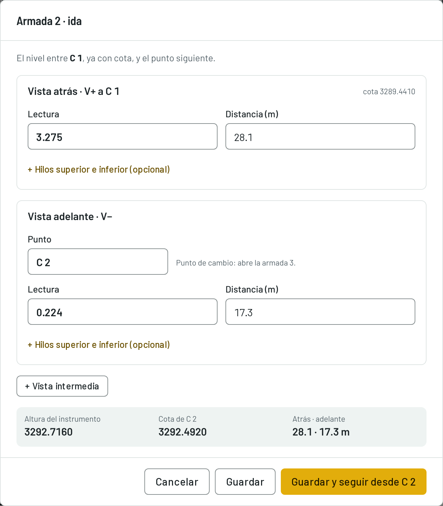

- Arriba, dónde está el nivel: «El nivel entre C 1, ya con cota, y el punto
  siguiente».
- **Vista atrás · V+**: la lectura y la distancia.
- **Vista adelante · V−**: el punto, su lectura y su distancia.
- En cada visual, **+ Hilos superior e inferior (opcional)**. Con los dos, la
  distancia sale de ellos —(superior − inferior) × 100— y el campo lo dice:
  «de los hilos». La aplicación comprueba además que la lectura sea el
  promedio de los dos hilos, a 2 mm. Sin hilos, la distancia se teclea.
- **+ Vista intermedia**: el punto y la lectura de una radiación de esta
  armada.
- En la última armada, la **casilla de fin**: **Llega al BM** en la cerrada,
  que fija el punto en el BM de partida; **Llega a** el BM de llegada en la de
  enlace; **Fin de la ida** en la abierta; y en la vuelta, **Llega a** el BM
  de partida.
- Abajo, en vivo: la **altura del instrumento**, la **cota del punto
  adelante** y las dos distancias.

**Guardar y seguir desde C 2** guarda y abre la armada siguiente; **Guardar**
guarda y cierra el popup. Con la casilla de fin marcada y vuelta por medir,
**Guardar y seguir con la vuelta**. En la última armada, **Quitar la armada**
la borra. Editar una armada del medio solo cambia sus filas: el punto de
cambio que la cierra conserva su V+, que abre la siguiente.

Los errores se detectan al confirmar y se quedan en el popup, sin perder lo
tecleado: una lectura fuera de 0 a 4 m, una distancia que falta o es cero, un
hilo superior que no es mayor que el inferior, un punto sin código, o llegar
al BM sin marcar la casilla de fin.

> **La distancia a cada mira es obligatoria en los BM y en los puntos de
> cambio.** Sin ella el recorrido no acumula, la distancia total sale menor de
> la real y el punto de cierre queda mal corregido. Los puntos intermedios no
> la necesitan: no acumulan distancia. La distancia acumulada y la total
> **no se teclean**: la aplicación las suma sola.

> **La libreta a medias se guarda.** Cada armada se guarda al confirmar,
> aunque el recorrido no haya llegado a su BM. Mientras tanto la nivelación
> está *En progreso* y la compensación espera: se calcula cuando la ida —y la
> vuelta, si la hay— llega a su fin.

**El perfil.** Lo medido, sin compensar: la cota de cada punto frente a la
distancia y, por cada armada, la **mira atrás** (V+), la **visual** a la
altura del instrumento con el nivel, y la **mira adelante** (V−). Con vuelta,
las armadas del otro recorrido se dibujan **tenues**. El BM de partida va
siempre a la izquierda; arriba, la exageración vertical. «Ver datos en tabla»
da los mismos valores en texto.

**Comprobación aritmética.** Bajo la tabla: ΣV+ − ΣV− frente a la cota final
menos la inicial —**cuadra** si coinciden— y la distancia del recorrido. Es
una verificación de gabinete: confirma que las sumas y traslados de la libreta
son correctos, **no dice nada sobre la calidad de la medición** —cuadra igual
con un nivel descolimado—. Los puntos intermedios quedan fuera de esta suma.

En el teléfono, un selector **Tabla | Perfil** alterna entre las dos columnas,
y la libreta se ve como una lista por armada (§ 9).

### 6.7 Paso 2 · Compensación

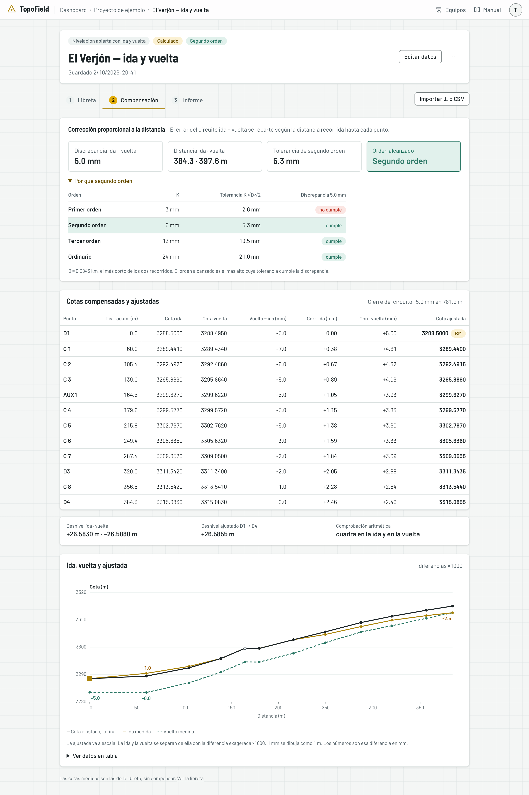

**El método.** Corrección proporcional a la distancia, el único, con una
frase que dice qué error se reparte según el tipo.

**El orden alcanzado.** Cuatro cifras: el **error de cierre** —en una abierta
con vuelta, la **discrepancia**—, la **distancia**, la **tolerancia** del
orden alcanzado y el **orden alcanzado**: el más alto cuya tolerancia K·√D
cumple el trabajo. D es la distancia del recorrido **en un solo sentido**, en
kilómetros, y K depende del orden:

| Orden | K (mm) |
|---|---|
| Primer orden | 3 |
| Segundo orden | 6 |
| Tercer orden | 12 |
| Ordinario | 24 |

**Por qué** despliega los cuatro órdenes con su tolerancia y si el trabajo la
cumple. En una cerrada o de enlace con vuelta, cada recorrido se juzga con su
propia distancia y tienen que cumplir los dos. En una abierta con vuelta se
juzga la discrepancia contra K·√D·√2, con D el más corto de los dos
recorridos. En El Verjón, la discrepancia de 5.0 mm cabe en segundo orden
(5.3 mm) y no en primero (2.6 mm): **segundo orden**. El tramo 2 cierra en
−0.4 mm frente a 3.5 mm: **primer orden**.

> **El orden no se declara: se detecta.** Antes la nivelación declaraba su
> orden y, si no lo cumplía, no se compensaba. Ahora se compensa y se dice qué
> orden alcanzó, como en la poligonal.

**Se compensa siempre** que haya contra qué cerrar: la cerrada, la de enlace y
la abierta con vuelta. Si el trabajo no alcanza ni el ordinario, se compensa
igual y un aviso lo dice: «No alcanza ningún orden: la compensación se aplicó
igual. En la práctica, un trabajo fuera de tolerancia se repite».

**La tabla.** Sin vuelta: **Punto**, **Dist. acum.**, **Cota medida**,
**Corrección (mm)** y **Cota ajustada**. Con vuelta: la **cota de la ida** y
la de la **vuelta** de cada punto, su diferencia —**Vuelta − ida (mm)**—, la
corrección de cada recorrido y la cota ajustada. Un punto que se lee dos
veces —el BM de una cerrada— va en sus dos filas.

La corrección es proporcional a la distancia acumulada, que es el recorrido
**desde el origen hasta el punto**: llega hasta su V− y no cuenta la V+ que
sale de él hacia la armada siguiente. A mayor distancia del origen, mayor
corrección. **El BM de partida no se corrige**: su cota es conocida. Y el
**punto de cierre cierra exacto** contra la suya.

**La cota ajustada.** Una por punto: el promedio de sus cotas compensadas si
se leyó dos veces —en la ida y en la vuelta, o al ir y al volver de un mismo
recorrido—, su cota compensada si se leyó una, y la cota conocida en el BM de
partida y, en la de enlace, en el de llegada.

**El gráfico.** Uno solo: la **cota ajustada**, a escala, y lo **medido**
—la ida y, si la hay, la vuelta— separado de ella con la diferencia
**exagerada ×1000**: 1 mm se dibuja como 1 m. Las cifras de los extremos son
esa diferencia, en mm. En El Verjón, la ida va 1.0 mm por encima en C 1, la
vuelta 6.0 mm por debajo, y las dos llegan a D4 2.5 mm por debajo de su cota
ajustada.

Una **abierta sin vuelta** no se compensa: el paso dice **Sin compensación**
y muestra la comprobación aritmética. Una libreta a medias dice qué recorrido
falta terminar y qué casilla marcar. Una libreta que **no encadena** —un punto
de cambio al que le falta la V+ o la V−, o una comprobación aritmética que no
cuadra— tampoco se compensa: la libreta y este paso dicen qué fila revisar,
porque sus cotas salen de una altura de instrumento equivocada.

### 6.8 Ida y vuelta

Ida y vuelta son **mediciones independientes**. En campo se hace de dos
maneras: con puntos de cambio propios en cada sentido, o **volviendo por los
mismos puntos**. La aplicación admite las dos.

La aplicación compara los **desniveles totales** de ambos recorridos. La
discrepancia entre ellos se contrasta contra **T·√2**, donde T es la misma
tolerancia K·√D del cierre individual, con D la menor de las dos distancias.

- En una **abierta**, la discrepancia es el veredicto: decide el orden
  alcanzado, y la muestran la lista de procesos del proyecto y el informe.
- En una **cerrada** o **de enlace**, el veredicto es el cierre de **cada
  recorrido**, cada uno con su propia distancia. La discrepancia es un control
  más.

**Cómo se compensa con vuelta.**

- En una **abierta**, ida y vuelta forman un **circuito** que sale del BM de
  partida y vuelve a él. Lo que la vuelta llega de más o de menos al BM es el
  error del circuito, y se reparte por distancia a lo largo de los dos
  recorridos, como en una cerrada.
- En una **cerrada** o **de enlace**, cada recorrido se compensa con su
  propio cierre: la ida contra su cota conocida y la vuelta contra la del BM
  de partida.

**La cota del BM de partida no cambia nunca**, y tampoco la del BM de
llegada en una de enlace: son datos, no mediciones.

En El Verjón el circuito mide 781.9 m y cierra en −5.0 mm. D4 queda en
3315.0855, entre lo que dicen la ida (3315.083) y la vuelta (3315.088), y C 1
en 3289.4400, el promedio de sus dos cotas compensadas, 3289.4414 y
3289.4386. Lo mismo vale para un recorrido único que vuelve por sus propios
puntos, como el tramo 2.

**Vuelta − ida, punto a punto.** Si la vuelta pasa por los mismos puntos, la
tabla de la compensación compara la cota de cada punto en los dos recorridos,
con las cotas sin compensar. Los códigos se emparejan sin distinguir espacios
ni mayúsculas (`AUX1` y `AUX 1` son el mismo punto). Un único número de
discrepancia esconde lo que la serie deja ver:

- si la diferencia **crece a lo largo del recorrido**, hay un error
  sistemático repartido;
- si **salta en un punto**, revise ese punto.

### 6.9 Importar desde archivo

Con un nivel digital, las lecturas y las distancias ya están en un archivo.
**Importar .L o CSV** —a la derecha de los pasos, o en la libreta vacía— las
pasa a la libreta sin teclearlas.

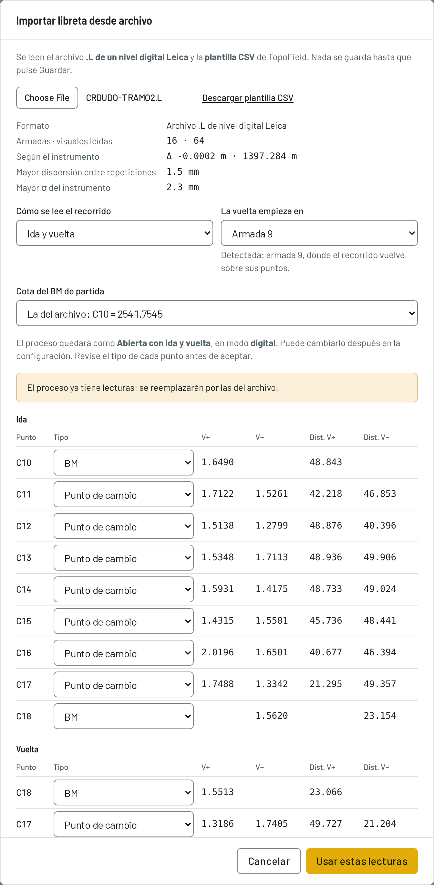

Se leen:

- el archivo **.L de un nivel digital Leica**;
- la **plantilla CSV** de TopoField, que se descarga desde el mismo diálogo,
  para cualquier otro instrumento: una fila por cada fila de la libreta, con
  `;` y coma decimal si viene de Excel en español.

El formato se reconoce por el contenido, no por el nombre del archivo. Si no
se reconoce, el diálogo dice qué formatos se leen.

Antes de usar las lecturas, la previsualización deja decidir:

- **Cómo se lee el recorrido.** Un archivo que va y vuelve por los mismos
  puntos puede ser **un recorrido cerrado** o **ida y vuelta**. Con ida y
  vuelta, elija en qué armada empieza la vuelta; se propone la detectada.
- **La cota del BM de partida**, si la del archivo no coincide con la del
  proceso.
- **El tipo de cada punto.** El instrumento no distingue un BM de un punto de
  cambio o de una radiación: se deduce de su posición y usted lo corrige.

El instrumento mide dos veces cada visual; se guarda el **promedio**,
redondeado a 0.1 mm. El diálogo muestra la mayor diferencia entre las dos
lecturas y la mayor desviación típica del instrumento, como control.

Al aceptar, la libreta se reemplaza y **se guarda**, y se propone el tipo de
proceso: **cerrada** si el recorrido vuelve a su BM, **abierta con vuelta**
si es ida y vuelta. Después, cada armada se corrige con su lápiz.

### 6.10 Paso 3 · Informe

El informe de la nivelación, listo para **Imprimir o guardar como PDF**
(§ 10). Es la misma sección que lleva en un informe consolidado, y cambia
según el tipo.

Arriba, el **resumen**: el tipo, los BM, la distancia y el equipo; las cifras
del orden alcanzado, y por qué lo alcanza —«La discrepancia cabe en la
tolerancia de segundo orden, no en la de primer orden (2.6 mm)»—. Si no
alcanza ninguno, una alerta lo dice. Después:

1. **Datos iniciales**: la libreta —la ida y, si la hay, la vuelta— con sus
   lecturas, su distancia acumulada y la cota medida.
2. **Datos ajustados**: el método en una frase, con el error que se repartió,
   y la cota ajustada de cada punto. Con vuelta, junto a la cota de la ida y
   la de la vuelta; en una cerrada que vuelve por sus puntos, junto a sus dos
   lecturas; en las demás, junto a la cota medida y su corrección.
3. **El gráfico** de la compensación.

Una abierta sin vuelta no tiene datos ajustados: el informe dice que no tiene
verificación. No lleva marca de borrador: la nivelación no se cierra, y el
informe muestra lo que tenga al abrirlo.

---

## 7. Control de Asentamientos

El control de asentamientos sigue el descenso de una estructura en el tiempo:
cada visita mide la cota de un conjunto de puntos, y la aplicación calcula
cuánto ha bajado cada uno desde la visita anterior y desde el inicio.

Se trabaja como lo mide el topógrafo, igual que la poligonal y la nivelación
(§ 5 y § 6): el **lugar** se crea en un popup y tiene cuatro pestañas
—**Panel**, **Puntos**, **BMs** e **Informe**—, y cada **visita**, dos pasos
—**1 · Libreta** y **2 · Resultados**—. **No hay botón Guardar**: cada popup
guarda al confirmar, y la libreta, lectura por lectura. La visita **no se
compensa** —la cota de cada punto es la de su lectura— y **nada se cierra**:
todo se recalcula en vivo.

### 7.1 El lugar

Un **lugar** es el sitio que se monitorea: un edificio, una presa, un
terraplén. Agrupa un catálogo de puntos de control, sus BM y sus visitas
sucesivas —es el equivalente, para este módulo, a lo que una poligonal o una
nivelación son para los otros dos—.

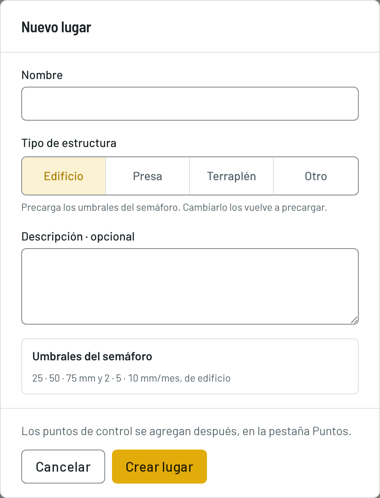

Desde el proyecto, **+ Nuevo Proceso → Control de Asentamientos** abre un
popup:

- **Nombre**, el único obligatorio.
- **Tipo de estructura**: edificio, presa, terraplén u otro. Precarga los
  umbrales del semáforo, y cambiarlo los vuelve a precargar.
- **Descripción**, opcional.
- **Umbrales del semáforo**, plegados: los de velocidad y de asentamiento
  acumulado típicos del tipo de estructura, que puede editar si el caso lo
  requiere.

**Crear lugar** lleva a su panel. Los puntos de control se agregan después,
en la pestaña Puntos (§ 7.2). Estos datos se cambian con **Editar datos**, en
la cabecera, que abre el mismo popup.

**La pantalla del lugar.** La cabecera lleva el tipo de estructura, el
nombre, cuántos puntos de control y BM tiene, la fecha de la lectura base y
cuándo se guardó por última vez; y las acciones **+ Nueva visita** (§ 7.4),
**Editar datos**, **Exportar a Excel** (§ 11) y, bajo **⋯**, **Duplicar** y
**Eliminar**. Debajo, las pestañas **Panel** (§ 7.11), **Puntos** (§ 7.2),
**BMs** (§ 7.3) e **Informe** (§ 7.12).

El lugar **no tiene estado**: ni activo ni cerrado. Admite visitas siempre.

### 7.2 Los puntos de control

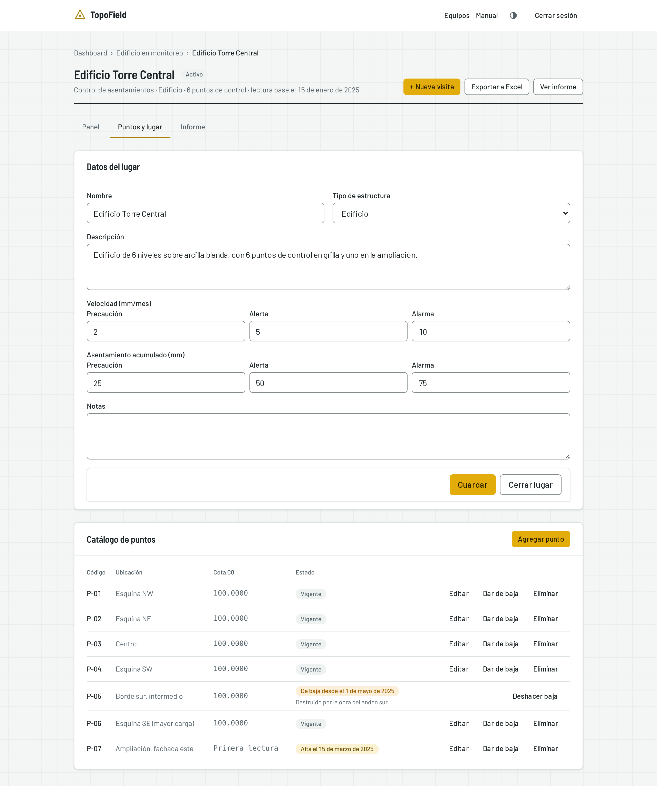

En la pestaña **Puntos**, **Agregar punto** pide el **código**, la
**ubicación** y la **cota C0**: la referencia contra la que se mide el
asentamiento acumulado de todas las visitas.

La C0 es opcional. Si la deja vacía, la **línea base del punto es su primera
lectura**: esa lectura queda con acumulado 0 y las siguientes se miden contra
ella.

Los puntos no llevan coordenadas: el módulo mide cuánto baja cada punto, no
dónde está, así que no calcula distancias entre puntos, asentamientos
diferenciales ni distorsión angular.

La tabla da el código, la ubicación, la C0 y el estado de cada punto
—**Vigente**, **Alta el …** o **De baja desde el …**, con su motivo—, y sus
acciones: **Editar**, **Dar de baja** y **Eliminar**.

- **Editar** cambia el código, la ubicación y la C0, aunque el punto ya tenga
  lecturas. Cambiar la **C0** de un punto medido cambia su acumulado en cada
  visita: el popup avisa en cuántas —«Cambiar la C0 cambia el acumulado de
  este punto en 7 visitas»— y, al guardar otra vez, todo se recalcula.
- **Renombrar un punto** cambia también su código en la libreta de todas las
  visitas, para que su cota siga saliendo de su fila.
- **Eliminar** un punto con lecturas pide confirmación, con cuántas se
  pierden: **Eliminar de todos modos**.

El catálogo puede cambiar a mitad del monitoreo —un punto se destruye, otro se
instala—; ver [§ 7.13](#713-dar-de-baja-y-de-alta-un-punto).

### 7.3 Los BM del lugar

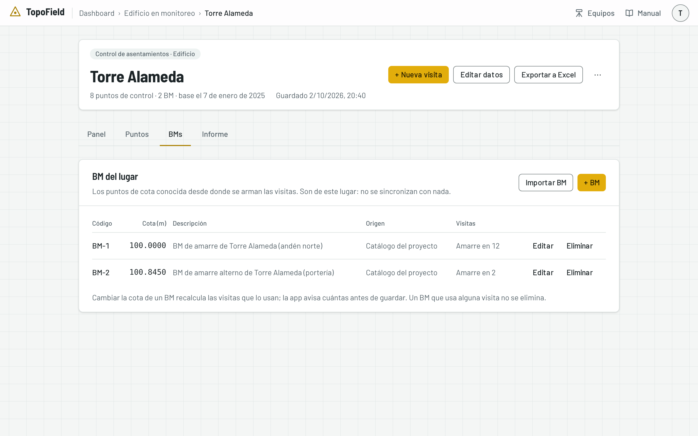

Cada lugar tiene su propio catálogo de **BM**: los puntos de cota conocida
desde donde se arman las visitas. Son del lugar y no se sincronizan con nada.
La visita no usa los puntos de referencia del proyecto (§ 4.2).

La tabla da el **código**, la **cota**, la **descripción**, el **origen** —de
dónde vino— y en cuántas **visitas** arranca un tramo —«Amarre en 12»—.

- **+ BM** agrega uno: código, cota y una descripción opcional.
- **Editar** cambia sus datos. Si el BM lo usan algunas visitas, cambiar su
  **cota** o su **código** avisa en cuántas —«BM-1 se usa en 14 visitas: al
  guardar se recalculan sus cotas»— y **Guardar y recalcular** las recalcula.
  Un código nuevo cambia también en sus libretas.
- **Eliminar** solo se puede si ninguna visita lo usa.
- **Importar BM** los trae de dos fuentes:
  - **De una nivelación del proyecto**: elija una nivelación calculada y marque
    sus puntos; entran con su **cota ajustada** de hoy (§ 6.7).
  - **De un CSV**: una fila por BM con `codigo,cota,descripcion` —la
    descripción es opcional—, separada por coma o por punto y coma. Con punto
    y coma, la cota admite coma decimal.

> **Los BM importados son copias.** Anotan su origen, pero no siguen a su
> fuente: si la nivelación cambia después, el BM no. Se corrigen aquí. Un
> código que ya está en el lugar no se importa: quítelo de la importación o
> edítelo.

Un BM también puede nacer en campo: el punto auxiliar donde termina una
armada (§ 7.7).

### 7.4 Una visita nueva

Cada **visita** es una fecha en la que se releyeron los puntos. La primera es
la **línea base**: fija el punto de partida y no tiene velocidad, porque no hay
una visita anterior contra la que compararla. Su acumulado es cero en los
puntos cuya C0 es su lectura de esta visita; si la C0 viene de otra medición,
la primera visita muestra ya lo que el punto se movió desde entonces.

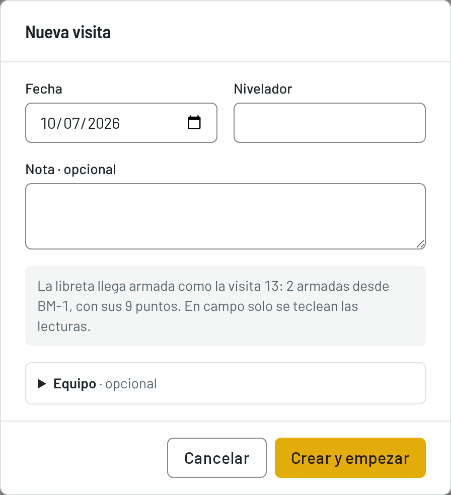

**+ Nueva visita**, en la cabecera del lugar, abre un popup:

- **Fecha**: posterior a la de la última visita. Dos visitas del mismo lugar no
  comparten fecha, y al editar una su fecha tiene que quedar entre la de la
  anterior y la de la siguiente.
- **Nivelador**.
- **Nota**, opcional: sale en los Resultados y en el informe.
- **Equipo**, plegado y opcional: marca, modelo y número de serie del nivel, o
  **Tomar del catálogo** (§ 12).

**No pide BM ni cómo se mide.** La libreta llega **armada como la de la visita
anterior**: las mismas armadas, con sus BM, sus puntos de cambio y sus puntos
de control, sin lecturas; sin los puntos dados de baja y con los dados de
alta. La primera visita llega con una armada desde el primer BM del lugar y
todos los puntos vigentes. El popup dice cuál de las dos trae. Si el lugar no
tiene BM, pide agregarlos antes en la pestaña BMs (§ 7.3).

**Crear y empezar** abre la visita en su libreta. Solo queda teclear las
lecturas.

### 7.5 La pantalla de la visita

La **cabecera** lleva cuántas **armadas** tiene la visita, su
**verificación** —el orden que alcanza o **Sin verificación** (§ 7.9)— y su
estado: **En medición** si falta alguna lectura, **Calculada** si no. Debajo,
«Visita 12 · fecha», el nivelador, el equipo y cuándo se guardó por última
vez. Las acciones:

- **← →** pasan a la visita anterior o a la siguiente, en el mismo paso.
- **Editar datos** abre el popup del alta: fecha, nivelador, nota y equipo.
- **Eliminar** borra la visita con su libreta y sus lecturas. Cualquier visita
  se elimina, también una del medio: el parcial y la velocidad de la
  siguiente se recalculan contra la anterior.

Debajo van los dos pasos y, a la derecha, **Importar .L o CSV** (§ 7.8).

### 7.6 Paso 1 · Libreta

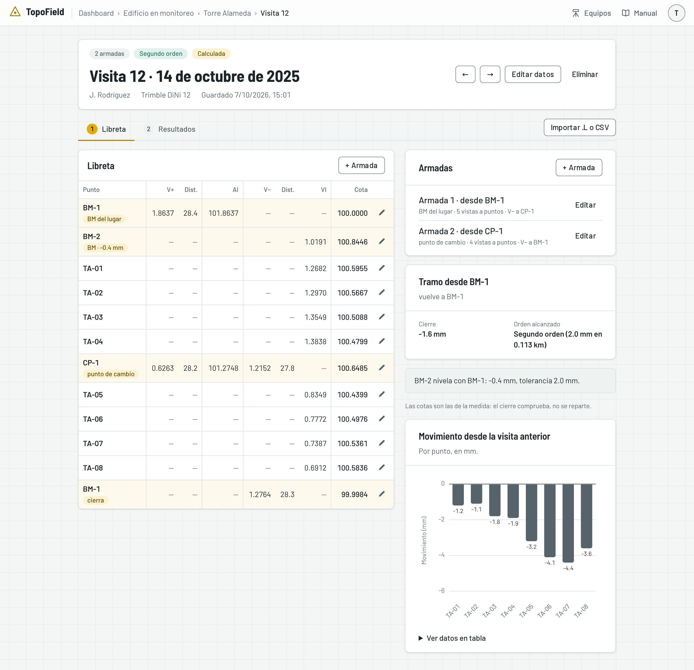

Dos columnas: a la izquierda, la libreta; a la derecha, fijas mientras baja la
página, las armadas, la verificación de cada tramo y el movimiento de cada
punto desde la visita anterior.

**La tabla de la hoja.** La de la nivelación (§ 6.6): **Punto**, **V+** y su
distancia, **AI**, **V−** y su distancia, **VI** —la lectura a un punto de
control— y la **cota**. Los rótulos marcan el **BM del lugar** donde arranca
cada tramo, los **puntos de cambio**, el BM del lugar donde el tramo
**cierra** o **llega**, un BM del lugar leído de paso con su diferencia
—«BM · -0.4 mm»— y los puntos **pendientes** de leer. El lápiz de cada fila
abre su armada (§ 7.7).

**Armadas.** Una fila por armada —«Armada 1 · desde BM-1», con de dónde sale,
cuántas vistas a puntos lleva y su V−— con **Editar**, o **Retomar** si le
falta alguna lectura. **+ Armada** agrega la siguiente.

**Los tramos.** Una tarjeta por tramo —«Tramo desde BM-1», «vuelve a BM-1»—
con su **Cierre** y su **Orden alcanzado** (§ 7.9). Debajo, el aviso de cada
BM del lugar leído de paso y la nota «Las cotas son las de la medida: el
cierre comprueba, no se reparte.»

**Movimiento desde la visita anterior.** Una barra por punto, en mm, y el
aviso de cada lectura fuera de tendencia (§ 7.9): «B10 bajó 50.0 mm en 12
días; a su ritmo anterior serían unos 17.1 mm. Verifica la lectura.»

**La medición a medias.** Si falta alguna lectura, la visita queda **En
medición** y la libreta lo dice arriba: **La medición quedó a medias**, con la
armada y el punto que faltan. **Retomar medición** abre esa armada con el
cursor en la primera lectura que falta. Nada se pierde: lo leído ya está
guardado.

Una visita sin armadas muestra **+ Agregar la primera armada**. Si el lugar no
tiene BM, la libreta pide agregar uno en la pestaña **BMs**: cada armada sale
de un BM del lugar o de un punto de cambio.

En el teléfono, la libreta es la lista de armadas, con sus lecturas y sus
cotas; pulsar una la abre (§ 9).

### 7.7 La armada

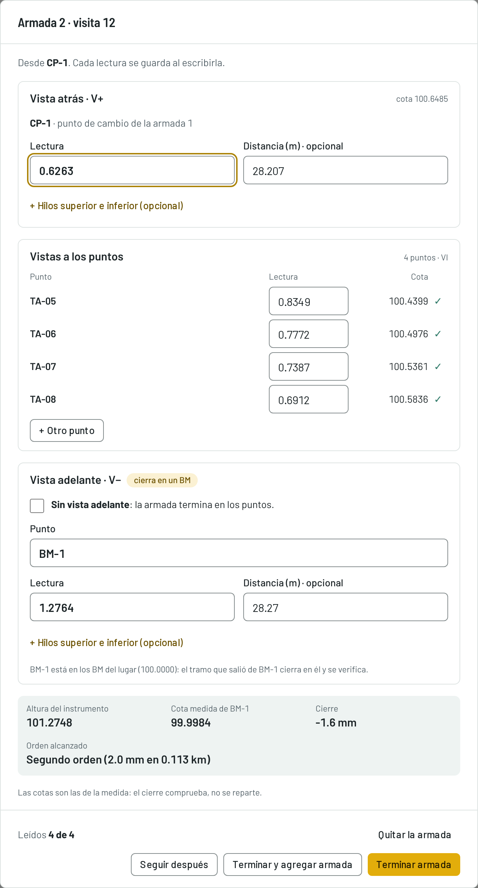

Una **armada** es una posición del nivel (§ 6.2): una vista atrás a un punto
con cota, las vistas a los puntos de control y, si la hay, una vista adelante.
Su popup —«Armada 2 · visita 12»— tiene tres partes:

- **Vista atrás · V+.** **Desde** dónde sale: **Un BM del lugar**, que se
  elige de la lista y empieza un tramo, o **Un punto de cambio**, la V− de la
  armada anterior, que solo se ofrece si esa armada terminó en uno. Se elige
  antes de la primera lectura guardada; después, y al editar, queda fijo.
  Luego, la lectura y la distancia, **opcional**, con **+ Hilos superior e
  inferior (opcional)** como en la nivelación.
- **Vistas a los puntos.** Una fila por punto, ya cargada con los de la
  plantilla: su **lectura** (VI), su **cota** en vivo y un **✓** cuando quedó
  guardada. **+ Otro punto** agrega uno con código libre.
- **Vista adelante · V−.** **Sin vista adelante** termina la armada en sus
  puntos. Si no, el **punto**, su **lectura** y su **distancia**, opcional:
  - a un **BM del lugar**, con el rótulo **cierra en un BM**: el tramo que
    salió de su BM **cierra** en él, si es el mismo, o **llega**, si es otro, y
    se verifica. El popup muestra el **Cierre** o la **Llegada** y el **Orden
    alcanzado**;
  - a **otro punto**, con el rótulo **punto de cambio**: la armada siguiente
    puede seguir desde él. Si no es punto de control ni BM del lugar, es un
    **punto auxiliar**.

Abajo, en vivo, la **altura del instrumento** y la cota del punto adelante.

**Cada lectura se guarda al escribirla**: al salir del campo o con Enter, que
además pasa al campo siguiente, como en la libreta de papel. Los guardados van
en orden, y el pie dice cómo van: «Leídos 5 de 9 · guardado», «guardando…» o
«sin guardar». Si la red falla, el error se queda en el popup con lo tecleado,
y se reintenta con la lectura siguiente. Los errores de captura —una lectura
fuera de 0 a 4 m, una distancia de cero, un punto sin código— también se
quedan en el popup.

Los botones:

- **Seguir después** cierra el popup. Lo leído ya está guardado; si falta algo,
  la visita queda En medición.
- **Terminar armada** la da por terminada: los puntos que quedaron sin leer
  salen de la libreta.
- **Terminar y seguir con la armada 3** —si la libreta ya la trae—,
  **Terminar y seguir desde CP-1** —si la V− fue a un punto de cambio— o
  **Terminar y agregar armada**: termina y abre la siguiente.
- **Quitar la armada**, en la última, la borra.

Dos preguntas al guardar:

- **Un punto de control en dos armadas.** Una visita da una cota por punto. El
  popup «TA-04 está en dos armadas» muestra las dos lecturas con su cota y su
  diferencia: elija la que se queda, y **Eliminar la de la armada N** borra la
  otra.
- **Una V− a un punto auxiliar.** Al terminar la armada, «¿Guardar CP-1 en los
  BM del lugar?», con su cota medida hoy y una descripción opcional. **Guardar
  en los BM** lo agrega al lugar (§ 7.3), y las próximas visitas pueden
  armarse desde él; **Solo en esta visita** lo deja como punto de cambio.

En el teléfono, el popup ocupa la pantalla, con la barra de guardado fija
abajo.

### 7.8 Importar la libreta

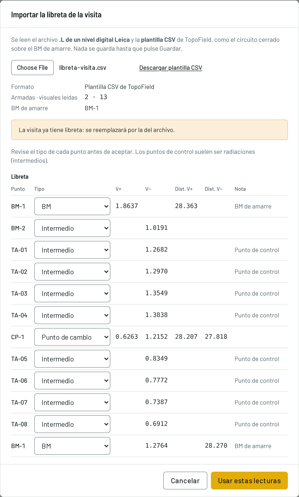

Con un nivel digital, **Importar .L o CSV**, a la derecha de los pasos, pasa a
la libreta el archivo **.L de Leica** o la **plantilla CSV** de TopoField,
como en nivelación (§ 6.9), con tres diferencias:

- el archivo se lee como **un solo tramo** desde el BM de su primera fila, que
  **tiene que estar en los BM del lugar**; si no, el diálogo pide agregarlo
  antes en la pestaña BMs;
- se guardan las **lecturas**: la cota de cada punto sale de la medida, no del
  archivo;
- **reemplaza la libreta** de la visita, y el diálogo lo avisa si ya tenía
  lecturas.

Revise el tipo de cada punto antes de aceptar: los puntos de control suelen
ser vistas intermedias. **Usar estas lecturas** guarda la libreta.

### 7.9 El cálculo

La visita **no compensa**: el cierre de un tramo comprueba la medida, no se
reparte. La cota de cada punto es la de su lectura:

- **AI = cota + V+**: la altura del instrumento de la armada, con la cota del
  BM del lugar o del punto de cambio de donde sale.
- **Cota = AI − lectura**: la VI de un punto de control, o la V− del punto
  adelante.

**Los tramos.** Un tramo empieza en una armada que sale de un BM del lugar y
sigue por sus puntos de cambio. Si su última V− cae en un BM del lugar, se
**verifica**: en el mismo BM es un **cierre**; en otro, una **llegada**. El
error se contrasta con la tolerancia K·√L de cada orden, con L la distancia
del tramo en kilómetros y K la de la nivelación (§ 6.7), y el tramo alcanza el
orden más alto que cumple.

| El tramo… | Qué dice |
|---|---|
| Vuelve a su BM | Su cierre, en mm, y el orden alcanzado, con su tolerancia |
| Llega a otro BM del lugar | Su llegada, en mm, y el orden alcanzado |
| Termina en sus puntos | **Sin verificación**: no termina en un BM del lugar |
| No tiene distancias | **Sin distancias**: el cierre no da orden |
| Supera la tolerancia de todos los órdenes | **Fuera de los órdenes**: queda sin verificación |

La cartera real es una sola armada por visita, de radiaciones desde el BM de
la piscina: sus tramos terminan en sus puntos y quedan sin verificación.

**La verificación de la visita** es la de su tramo peor: si todos se
verifican, el orden más bajo de ellos; si alguno no, **Sin verificación**. La
llevan la cabecera de la visita, el informe y el Excel. En Torre Alameda, la
visita 12, de dos armadas por CP-1, cierra en −1.6 mm en BM-1: segundo orden.
La 9 supera todas las tolerancias y queda sin verificación.

**Un BM del lugar leído de paso.** Todas las cotas de un tramo salen de su BM
de arranque: si ese BM se movió, todos los puntos parecen asentarse a la vez.
Para detectarlo, haga pasar la libreta también por **otro BM del lugar**, como
una vista más. Es lo que recomienda el protocolo de campo: nivelar primero
entre BMs.

La aplicación compara la cota que la libreta le da a ese BM con la suya en los
BM del lugar, con la tolerancia de **tercer orden** sobre la distancia
recorrida desde el arranque:

- si nivela, la libreta lo dice: «BM-2 nivela con BM-1: -0.4 mm, tolerancia
  2.0 mm.»;
- si no, avisa con las dos cotas. Uno de los dos BM pudo moverse, o hay un
  error en la libreta o en la cota del BM. Con dos BM no se sabe cuál se
  movió; con un tercero, comparándolos entre sí, sí.

**Solo avisa.** El aviso queda en la libreta, en el popup de la armada y con
**⚠** junto a la fecha en la tabla de visitas del panel. En Torre Alameda, la
visita 13 muestra BM-2 desplazado.

**Parcial, acumulado, velocidad y estado.** Con la cota de cada punto, la
aplicación calcula al instante:

- **Parcial** — cuánto bajó (o subió) el punto desde la visita anterior, en mm.
- **Acumulado** — cuánto ha bajado desde la línea base del punto —su C0 o,
  sin C0, su primera lectura—, en mm.
- **Velocidad** — el parcial dividido entre el tiempo transcurrido, en
  mm/mes. **Se calcula con los días reales entre las dos visitas**, no con
  «un mes» genérico: una visita a 28 días y otra a 31 no dan la misma
  velocidad aunque el parcial fuera igual.
- **Estado** — el nivel de alerta de ese punto, semáforo explicado en
  [§ 7.11](#711-el-panel-del-lugar).

Un valor positivo es un **levantamiento**, no un asentamiento, y se muestra
como tal: es un hallazgo que vale la pena revisar, no un error de signo.

La lectura de un punto que no está vigente en la fecha de la visita —de baja,
o dado de alta después— no se usa.

**Lecturas fuera de tendencia.** Desde la tercera lectura de un punto, la
aplicación compara cada cota con la tendencia de ese punto y avisa si la
lectura:

- va **contra** su tendencia más que el margen —por ejemplo, un punto que
  viene bajando y de pronto sube—, o
- lo mueve **más del doble** de lo que su ritmo anterior preveía, más el
  margen.

El margen absorbe el ruido de medición de las dos cotas que se comparan, y es
**fijo: 6 mm** entre dos visitas, sin depender del orden ni de la longitud de
la libreta. Moverse **menos** de lo previsto nunca avisa, porque un
asentamiento por consolidación frena con el tiempo. En la cartera real, B10
avisa en la visita 3 —baja 50.0 mm en 12 días, donde su ritmo preveía unos
17.1— y en la 4, contra su tendencia.

El aviso sale en la libreta (§ 7.6), en los avisos del panel (§ 7.11) y en el
informe.

> **El aviso no bloquea.** Pide verificar la lectura en la libreta o volver a
> medir; una lectura atípica también puede ser real. Si dos visitas seguidas
> salen marcadas, casi siempre el error está en la primera: la segunda se
> compara contra una velocidad ya contaminada.

### 7.10 Paso 2 · Resultados

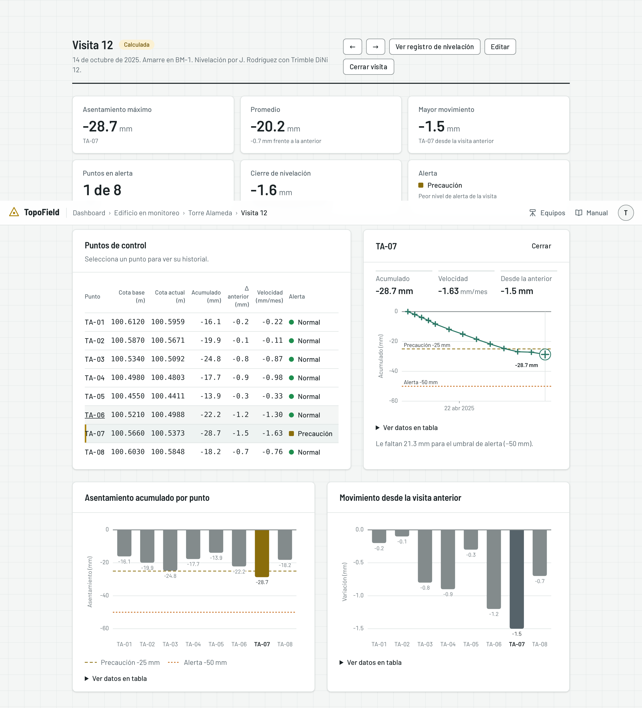

**Indicadores.** Una franja con cuatro:

- **Asentamiento máximo**: el acumulado de mayor magnitud, con sus puntos.
- **Promedio**: el promedio encadenado de la visita (§ 7.11), con su cambio
  frente a la anterior.
- **Mayor movimiento**: el parcial de mayor magnitud, con sus puntos y los
  días desde la anterior.
- **Alerta**: la peor de la visita, y cuántos puntos están en precaución o
  más.

**Nota de la visita.** La que se escribió en el alta o en **Editar datos**.

**Puntos de control.** Por punto: **Cota (m)**, **Parcial**, **Acumulado**,
**Velocidad**, **Estado** —el semáforo (§ 7.11)— y **Tendencia**: **Acelera**
o **Converge**.

**Tendencia.** Desde la tercera lectura de un punto, dice si **acelera** —su
velocidad crece más de lo que explica el error de las lecturas— o
**converge**. Las dos velocidades salen de las tres últimas cotas del punto,
así que el margen suma el ruido de las tres: con visitas a intervalos iguales,
es unas √3 veces el del aviso de lectura fuera de tendencia, dividido entre el
intervalo. En Torre Alameda, con visitas cada 28 días, 11,3 mm/mes. Un solo
salto no basta para decir que un punto acelera.

**El gráfico.** Al lado, fijo: **Acumulado**, por punto, con las líneas de los
umbrales, o **Desde la anterior**, el movimiento de cada punto.

### 7.11 El panel del lugar

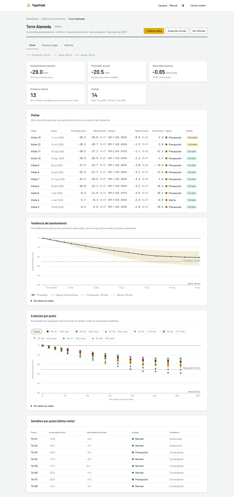

Abrir el lugar desde el proyecto lleva a su pestaña **Panel**, que reúne el
historial completo.

**Indicadores.** Cinco, en una franja, sobre la última visita y el histórico:

| Indicador | Qué muestra |
|---|---|
| Asentamiento máximo | El acumulado de mayor magnitud en la última visita, con su punto. Un levantamiento también cuenta |
| Promedio actual | El promedio encadenado de la última visita (ver abajo) |
| Velocidad máxima | La de mayor magnitud en la última visita, en mm/mes, con su punto |
| Visitas en alerta | Cuántas visitas, de todas, tienen algún punto en precaución o más |
| Umbrales | Los tres de acumulado, en mm, y los tres de velocidad, en mm/mes |

El **promedio es encadenado**: el de la visita anterior más la media de lo que
se movieron los puntos medidos en las dos. Un punto dado de alta entra con
acumulado 0 y uno dado de baja deja de contar; la media de los acumulados se
movería con eso sin que nada se asentara, el encadenado no. Sin altas ni bajas,
los dos coinciden.

**Visitas.** De la más reciente a la más antigua: la visita —con **En
medición** si le falta alguna lectura—, la fecha —con **⚠** si un BM del
lugar leído de paso no nivela (§ 7.9)—, el promedio y el máximo del
acumulado, el **mayor Δ** desde la anterior y la peor alerta. Pulse una fila
para resaltarla en la tendencia; el enlace de la visita la abre.

**Tendencia.** Al lado, fija mientras baja la página, con dos vistas:

- **Promedio**: el promedio de los puntos en cada visita, con una banda que va
  del punto menos asentado al más asentado y las líneas de los umbrales. La
  visita elegida en la tabla va resaltada. El eje horizontal es el
  **tiempo**, no el número de visita: si las visitas pasan de quincenales a
  mensuales, la pendiente no se exagera.
- **Por punto**: el acumulado de cada punto de control según los días desde la
  lectura base. Los chips de arriba muestran el último valor de cada punto;
  pulse uno para resaltarlo y atenuar los demás, y **Todos** para volver. Cada
  punto se distingue por **forma de marcador además de color** (círculo,
  cuadrado, triángulo, rombo, cruz), y las marcas «(de baja)» y «(alta …)»
  señalan los puntos que salieron o entraron a mitad del monitoreo.

Debajo, la última visita en una línea: cuántos puntos están normales y los
tres más asentados. Bajo cada gráfica, **Ver datos en tabla** despliega los
mismos valores en texto: la alternativa para cuando la gráfica no basta.

**Avisos.** Las lecturas fuera de tendencia de todas las visitas, por punto y
visita (§ 7.9).

**Semáforo por punto.** El estado de cada punto, según sus umbrales de
velocidad y de acumulado — gana el peor de los dos. La columna de alerta de
las visitas da el peor de cada una, y la columna Estado de los Resultados, el
de cada punto (§ 7.10). Tiene cuatro niveles:

| Nivel | Significado | Forma |
|---|---|---|
| **Normal** | Dentro de todos los umbrales | ● círculo |
| **Precaución** | Supera el primer umbral; vigile la tendencia | ■ cuadrado |
| **Alerta** | Supera el segundo umbral; revise el punto | ◆ rombo |
| **Alarma** | Supera el umbral más alto; requiere atención inmediata | ▲ triángulo |

> **El semáforo no se distingue solo por color.** Cada nivel tiene además una
> forma propia y su nombre escrito junto al indicador, así que se reconoce
> igual con daltonismo o en una impresión en blanco y negro.

**Un dato en alarma se registra con normalidad.** El semáforo es un
diagnóstico, no un control de captura: la aplicación **nunca** impide guardar
una lectura por dejar un punto en alerta o alarma. Un asentamiento alarmante
es exactamente el hallazgo que este módulo existe para documentar;
bloquearlo ocultaría el dato que más importa.

### 7.12 El informe del lugar

La pestaña **Informe** muestra el informe del lugar, listo para **Imprimir o
guardar como PDF** (§ 10). Es la misma sección que lleva en un informe
consolidado:

1. Los datos del lugar: tipo de estructura, puntos de control —y cuáles están
   de baja—, visitas, y el BM de arranque y el equipo de la última.
2. **Veredicto**: la peor alerta de la última visita y el mayor acumulado, con
   lo que le falta para el umbral siguiente, y si las visitas se verifican
   (§ 7.9).
3. **Cómo se calcula**: cuatro fórmulas —la altura del instrumento, la cota de
   cada punto, el acumulado y la velocidad— y los umbrales del semáforo.
4. **Evolución**: el acumulado de cada punto en el tiempo.
5. **Visitas**: el promedio, el máximo, el mayor Δ, la verificación y la peor
   alerta de cada una.
6. **Puntos de la última visita**: su acumulado, su velocidad y su estado.
7. **Notas de las visitas** y **avisos** de lecturas fuera de tendencia.

Informa las visitas **calculadas**: las que están en medición se nombran
aparte y entran cuando se terminan. Un informe consolidado admite el lugar con
alguna visita calculada (§ 10.1).

### 7.13 Dar de baja y de alta un punto

Los puntos que se miden no son siempre los mismos durante todo el monitoreo.
Un punto se destruye, se tapa o se pierde; otro se instala cuando la obra
avanza.

**Dar de baja.** En la pestaña Puntos, **Dar de baja** pide dos datos:

- **De baja desde** — la primera fecha en que el punto ya **no** se mide. Debe
  ser posterior a su última lectura.
- **Motivo** — obligatorio: dentro de un año nadie recordará por qué el punto
  dejó de medirse.

La baja **no borra nada**. Las lecturas anteriores siguen en el análisis, la
gráfica muestra la serie hasta su última lectura con la marca «(de baja)», y
el informe cuenta el punto y dice desde cuándo está de baja. Las visitas
nuevas ya no lo traen en su libreta. Un punto de baja no se edita.

**Deshacer baja** la quita, para corregir un error. Si un punto tapado aparece
de nuevo, puede haberse movido: regístrelo como **punto nuevo**, con otro
código y su propia línea base, no como la continuación de su serie.

> **Borrar no es dar de baja.** Eliminar un punto se lleva sus lecturas de
> todas las visitas. Si se perdió en campo, dele de baja: su serie sigue en el
> análisis. Borrar queda para los puntos creados por error.

**Dar de alta.** Un punto que se agrega cuando el lugar ya tiene visitas se da
de alta: el formulario pide la **fecha de alta** en lugar de la C0, porque su
línea base será su **primera lectura**, no la de la primera visita del lugar.
Las visitas nuevas desde esa fecha lo traen en su libreta; a una que ya existe
se agrega con **+ Otro punto** (§ 7.7).

---

## 8. Sin cierre

Ningún proceso se cierra: ni la poligonal (§ 5), ni la nivelación (§ 6), ni
el lugar o la visita de asentamientos (§ 7). No hay **Cerrar** ni
**Reabrir**, ni modo de solo lectura, ni registro de cierre, y un proyecto se
puede eliminar siempre (§ 4.2).

Lo que daba el cierre lo dan ahora tres cosas:

- **Todo se recalcula en vivo.** Corregir una lectura, la cota de un BM o la
  C0 de un punto recalcula lo que depende de ellos —en asentamientos, todas
  las visitas que los usan—, y la aplicación avisa antes cuánto cambia.
- **El orden se detecta.** La poligonal, la nivelación y cada tramo de una
  visita dicen qué orden de precisión alcanzaron, y su informe alerta si no
  alcanzan ninguno (§ 5.5, § 6.7 y § 7.9).
- **El informe consolidado queda fijo.** Guarda la portada del día en que se
  emitió y no se edita: para corregirlo, se elimina y se genera de nuevo
  (§ 10.3). Sus secciones muestran los datos actuales de cada proceso; un PDF
  ya descargado no cambia.

---

## 9. Trabajo en campo

La aplicación está pensada para usarse también desde el teléfono, en sitio.

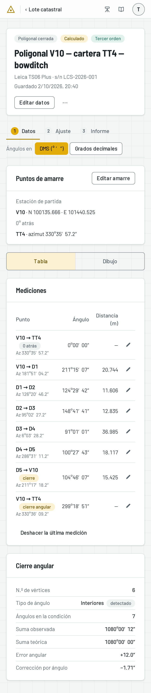

En el teléfono, el paso de Datos de una poligonal apila sus columnas y un
selector **Tabla | Dibujo** alterna entre las mediciones y el dibujo. La tabla
lleva el azimut bajo cada punto, sin desplazamiento lateral, y cada medición
se captura en su popup, que ocupa el ancho de la pantalla. Los campos de
grados, minutos y segundos son lo bastante amplios para usarse con guantes.

La navegación se reduce a un retorno al nivel anterior, en lugar de la ruta
completa.

**Una visita de asentamientos en el teléfono.** La libreta es la lista de
armadas, y el popup de la armada ocupa la pantalla, con la barra de guardado
fija abajo. Cada lectura se guarda al salir del campo: si se pierde la señal,
lo tecleado se queda en el popup y se guarda con la lectura siguiente; si hay
que irse, **Retomar medición** sigue donde quedó (§ 7.6 y § 7.7).

**Coma o punto decimal.** Las celdas numéricas aceptan los dos: `2541,7545` y
`2541.7545` son el mismo número, y el teclado del teléfono ofrece el separador
de su idioma. Lo que no se acepta es un separador de miles: `1.234,5` no se
adivina. Si lo tecleado no es un número, la celda lo dice —**«No es un
número»**— y la aplicación no guarda hasta corregirlo, para que un dato mal
escrito no se pierda como si la celda estuviera vacía.

**A pleno sol**, el tema claro se lee mejor; de noche o bajo techo, el oscuro
cansa menos. Se cambia en el menú de cuenta (§ 2).

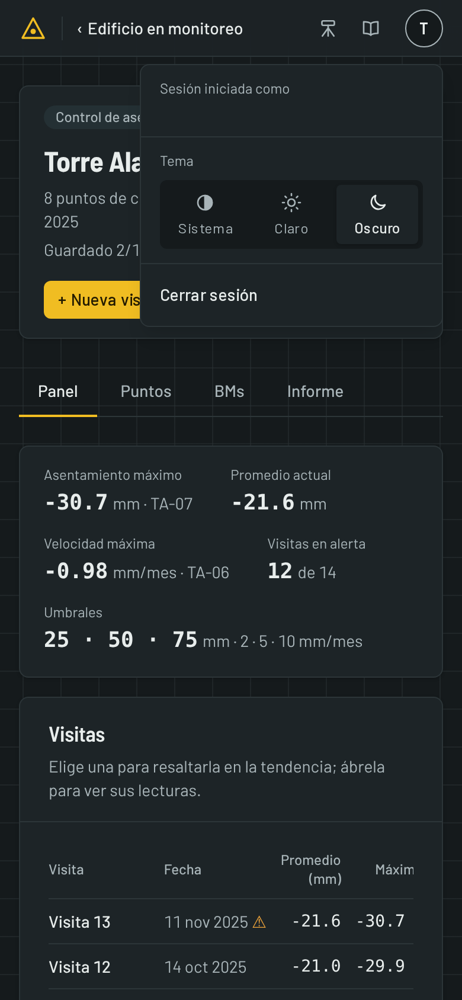

---

## 10. Informes

Hay dos clases de informe:

- **El informe de un proceso** está en su paso o pestaña **Informe**
  ([§ 4.4](#44-la-pantalla-de-un-proceso)): no hay que generarlo, y no lleva
  marca de borrador, porque ningún proceso se cierra.
- **Un informe consolidado** reúne varios trabajos calculados de un proyecto
  en un solo documento imprimible, con título, orden y observaciones propios.
  Se genera en la pestaña **Informes** del proyecto.

### 10.1 Qué puede incluirse

**Poligonales y nivelaciones calculadas y lugares con alguna visita
calculada**, en un informe consolidado. El informe no guarda una copia de las
mediciones: las vuelve a leer cada vez que se abre. Solo guarda su título, sus
observaciones, la lista de procesos y la portada del día en que se emitió
(§ 10.3).

- Una **poligonal** o una **nivelación** entran calculadas, cumplan o no un
  orden, y su sección muestra lo que tengan al abrir el informe. Si no
  alcanzan ningún orden, la sección lo alerta. Una nivelación con la libreta a
  medias no entra.
- Un **lugar** entra con sus visitas calculadas, y su sección muestra lo que
  tenga al abrir el informe: una visita nueva aparece sola. Las que están en
  medición se nombran aparte y entran cuando se terminan (§ 7.12).

Un PDF ya descargado no cambia.

Si el proyecto no tiene nada que incluir, la pantalla se lo dice en vez de
ofrecer un formulario que no llevaría a ninguna parte.

### 10.2 Generar un informe consolidado

En la pestaña **Informes** del proyecto, pulse **Generar Nuevo Informe**. Desde
el **Informe** de una poligonal o una nivelación calculadas, o de un lugar con
alguna visita calculada, **Generar un informe consolidado con este proceso**
abre el mismo formulario con ese proceso ya marcado.

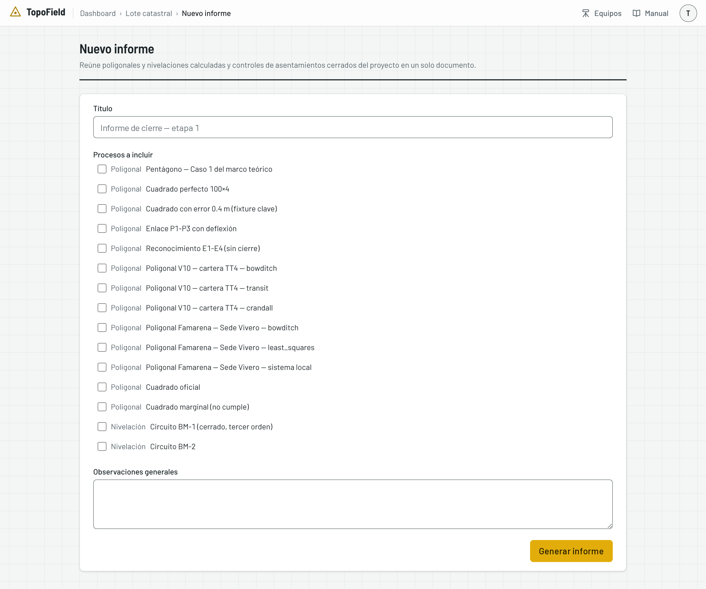

Se pide:

| Campo | Para qué |
|---|---|
| Título | Encabeza la portada del documento |
| Procesos a incluir | Marque los que quiera; aparecen las poligonales y las nivelaciones calculadas y los lugares con alguna visita calculada |
| Orden de las secciones | Con las flechas ↑ ↓ ordena cómo saldrán |
| Observaciones | Texto libre que se imprime al final |

### 10.3 Imprimir o guardar como PDF

Al generar, la aplicación abre el documento maquetado —también al pulsar un
informe de la lista de la pestaña **Informes**—, y allí **Imprimir o guardar
como PDF** abre el diálogo del navegador: elija «Guardar como PDF» como
destino. La ruta de la barra vuelve al proyecto, y **Eliminar informe** lo borra: los
procesos que incluye no cambian, y puede volver a generarlo. Un informe
emitido no se edita: para corregirlo, elimínelo y genérelo de nuevo.

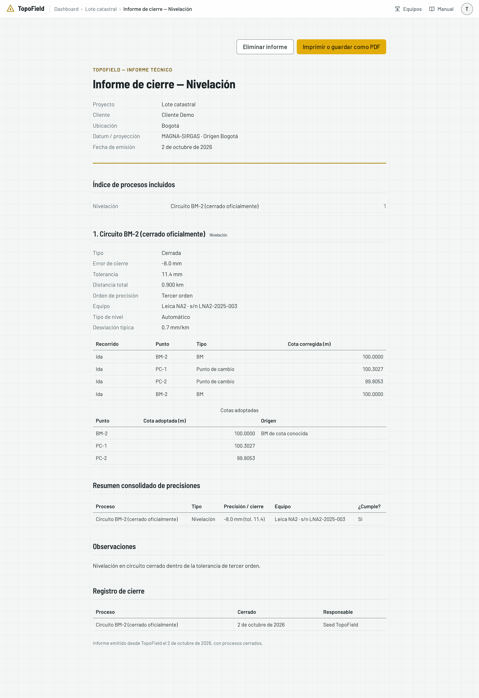

El documento lleva portada con los datos del proyecto **al emitirlo** —si
después cambian el nombre o el cliente del proyecto, la portada no—, índice,
una sección
por proceso con sus resultados **y su equipo** —en las poligonales, con la
corrección por método y su dibujo (§ 5.7)—, el resumen consolidado de
precisiones —con una columna de equipo y, en las poligonales, el orden
alcanzado— y sus observaciones. El equipo ya no es un dato del proyecto: cada
sección imprime el que declaró su propio proceso (en asentamientos, el de la
visita más reciente).

> El PDF lo genera su navegador, no la aplicación. Los márgenes y los
> encabezados de página dependen de lo que usted elija en ese diálogo.

---

## 11. Exportar a Excel

Cada proceso tiene un botón **Exportar a Excel** en la cabecera de su pantalla
—también el control de asentamientos—. Descarga un `.xlsx` con tres hojas:

| Hoja | Contiene |
|---|---|
| Datos Crudos | Las lecturas de campo tal como se capturaron, sin modificar |
| Cálculos | Lo que la aplicación derivó: cotas, coordenadas, correcciones |
| Resumen | Equipo, método, precisión, tolerancia, estado y trazabilidad. En una poligonal, la ubicación, el responsable, y el orden alcanzado y el tipo de ángulo detectados; en una nivelación, el orden alcanzado |

Con **mínimos cuadrados**, «Cálculos» añade la corrección de cada ángulo y la
distancia ajustada, y «Resumen» los pesos y σ₀. El informe imprimible también
indica los pesos y σ₀ de cada poligonal ajustada así.
Si la poligonal se georreferenció, «Resumen» lleva además la sección
«Georreferenciación», con la última.

En una nivelación, el libro lleva una cuarta hoja, **«Cotas ajustadas»**: una
cota por punto, con cuántas lecturas la forman y de dónde sale (§ 6.7). El
libro da lo que daría guardar la nivelación ahora: el orden detectado y las
cotas compensadas, también en una guardada antes de que el orden se detectara.

En control de asentamientos, «Datos Crudos» añade un bloque **«Visitas»**
con el estado, el BM de arranque, la verificación, el cierre, la tolerancia y
la nota de cada una, y el libro lleva una cuarta hoja, **«Libretas»**: la
libreta de cada visita, fila por fila con su **tramo**, la cota de la medida
—sin compensar— y la de los BM del lugar leídos de paso (§ 7.9).

A diferencia del informe, la exportación funciona **en cualquier estado**:
también sobre un borrador. Las celdas que aún no se han calculado salen
vacías, no en cero — en topografía un `0.000` es una posición, no un dato que
falta.

---

## 12. El catálogo de equipos

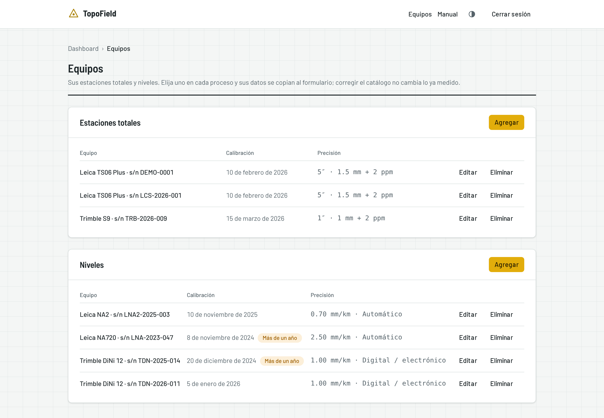

**Equipos**, en la barra de arriba, guarda sus estaciones totales y sus niveles para
no teclearlos en cada proceso. Cada equipo lleva marca, modelo, número de
serie, fecha de calibración y precisión: angular y de distancia en una
estación total; tipo y desviación típica en un nivel. Cada sección tiene
**Agregar**, y cada equipo **Editar** y **Eliminar**.

En un proceso, el equipo es solo su identidad —marca, modelo y número de
serie—. En una nivelación y en una visita de asentamientos, **Tomar del
catálogo** copia los datos del nivel elegido en los campos, que siguen
editables; en la poligonal se escriben.

> **El catálogo es una plantilla.** Cada proceso guarda su propia copia del
> equipo: corregir o eliminar un equipo del catálogo no cambia ningún
> proceso, visita ni informe ya hecho.

**Calibración de más de un año.** La lista avisa cuando la fecha de
calibración tiene más de 12 meses. Es un aviso: el equipo se usa igual.

---

## 13. Preguntas frecuentes

**La aplicación se ve oscura (o clara). ¿Cómo la cambio?**
En el menú de cuenta —el círculo con su inicial, arriba a la derecha—:
**Sistema**, **Claro** u **Oscuro** (§ 2). Con **Sistema**, sigue la
configuración del teléfono o del computador.

**¿Cómo cierro un proceso?**
No se cierra (§ 8): ni la poligonal, ni la nivelación, ni el lugar o la visita
de asentamientos. Quedan calculados y se corrigen cuando haga falta. El paso
de Ajuste o de Compensación, la verificación de cada visita y su informe dicen
qué orden de precisión alcanzaron (§ 5.5, § 6.7 y § 7.9); si no alcanzan
ninguno, el informe lo alerta. Un informe consolidado los incluye calculados.

**¿Por qué una poligonal muestra «Sin verificación de cierre»?**
Es de tipo *abierta sin control*: no regresa al punto de partida ni llega a un
punto conocido, así que no hay nada contra qué contrastar el resultado. Las
coordenadas se calculan, pero su exactitud no se puede verificar.

**¿Qué significa una precisión de 1:∞?**
Que el cierre fue exacto: el error lineal es cero o despreciable. Ocurre con
datos teóricos o levantamientos muy precisos.

**¿Dónde declaro el equipo y el orden de precisión que usé?**
El equipo, en cada proceso y no en el proyecto: una poligonal o una nivelación
lo declara en su alta, y cada visita de asentamiento en la suya. El orden no se
declara en ninguno: se detecta al calcular (§ 5.5, § 6.7 y § 7.9). Si el
equipo es el de siempre, tómelo del catálogo de equipos (§ 12).

**Mi nivelación no alcanza ningún orden. ¿Por qué se compensó?**
Porque la nivelación compensa siempre que haya contra qué cerrar, y avisa:
en la práctica, un trabajo fuera de tolerancia se repite (§ 6.7). Una visita
de asentamientos, en cambio, no compensa nunca: su cierre solo comprueba
(§ 7.9).

**Levanté una poligonal en un sistema local. ¿Puedo pasarla a coordenadas
reales?**
Sí: **Georreferenciar** (§ 5.6), con dos estaciones de coordenadas conocidas,
o editando el amarre con las coordenadas reales de la partida y la referencia.
El orden alcanzado no cambia.

**¿La aplicación juzga si mi equipo da para el orden que necesito?**
No: registra el equipo para el informe. Lo que dice si el trabajo cumple es su
cierre contra la tolerancia de cada orden: ningún proceso elige orden, alcanza
el que su cierre permite. Si el equipo no da para el orden que necesita, lo
más probable es que el cierre no lo alcance.

**Mi nivelación cuadra en la comprobación aritmética. ¿Ya sé que la medición
está bien?**
No. La comprobación aritmética (ΣV+ − ΣV− = desnivel total) solo
valida que las cuentas de gabinete están bien hechas: cuadra igual con un
nivel descolimado. La calidad de la medición la juzga el error de cierre
contra la tolerancia K·√D, en el paso de Compensación (§ 6.7).

**¿Por qué mi nivelación dice «Sin compensación todavía»?**
Porque la libreta no ha llegado a su BM: falta marcar la casilla de fin en
la última armada —«Llega al BM», «Llega a …» o «Fin de la ida»—, o terminar
la vuelta. El paso de Compensación dice qué falta (§ 6.7).

**Un punto quedó en alarma. ¿Puedo seguir midiendo?**
Sí. El semáforo es un diagnóstico, no un bloqueo: un punto en alerta o alarma
se guarda igual que cualquier otro. Es justamente el dato que el control de
asentamientos busca detectar y dejar documentado.

**Un tramo de mi visita no alcanza ningún orden. ¿Qué pasa?**
Nada se bloquea: la visita queda calculada con las cotas de la medida, y el
tramo y la visita dicen **Sin verificación** (§ 7.9). Conviene revisar la
libreta o repetir la nivelación.

**¿Por qué no puedo teclear la cota de un punto en la visita?**
Porque toda visita se mide con libreta: la cota sale de la lectura del punto,
AI − lectura (§ 7.9). Si nivelaron con un nivel digital, importe su archivo
.L o la plantilla CSV (§ 7.8).

**La medición de una visita quedó a medias. ¿Perdí algo?**
No: cada lectura se guarda al escribirla. La visita queda **En medición**, y
**Retomar medición** abre la armada en la primera lectura que falta (§ 7.6).

**¿Por qué la velocidad de dos visitas mensuales no me da el mismo número?**
Porque se calcula con los días reales entre las dos fechas, no con «un mes»
fijo. Un intervalo de 28 días y uno de 31 producen velocidades distintas
aunque el asentamiento parcial fuera idéntico.

**¿Puedo eliminar un proyecto?**
Sí, desde **Configuración**: se borra con todo lo que contiene, de forma
permanente. Para ocultarlo de la lista activa sin borrarlo, archívelo (§ 4.2).

**Salí de una pantalla y perdí lo que había tecleado.**
Ninguna pantalla de proceso tiene botón Guardar: la poligonal y la nivelación
guardan cada popup al confirmar, y la visita de asentamientos cada lectura al
salir del campo o con Enter (§ 4.4). Solo se pierde lo tecleado en un popup
que se cierra sin confirmar.

**¿Otros usuarios pueden ver mis proyectos?**
No. Cada usuario accede solo a los suyos; la restricción se aplica en la base de
datos.

---

## Mantener este manual

Las capturas se regeneran con:

```bash
node docs/manual/capturas.mjs
```

Requiere el entorno local levantado (`npx supabase start`, `npm run dev`) y los
datos de ejemplo sembrados. El script consulta los identificadores en la base,
así que funciona después de cualquier `supabase db reset`.

Las capturas viven en **`public/manual/`**, una sola copia: la sirve la página
`/manual` de la aplicación, y este documento las referencia con una ruta
relativa (`../../public/manual/…`), que GitHub resuelve sin problema. Guardar
una segunda copia en `docs/` añadía 2,8 MB al historial de git en cada
regeneración, sin ganar nada.

**Ya no quedan módulos pendientes**: la fase 6 cerró el último y la sección
«Módulos pendientes» desapareció con ella. Al añadir funcionalidad nueva:

1. Escriba su sección en el cuerpo del manual y añada sus capturas.
2. Haga lo mismo en `src/app/(app)/manual/`: el texto en `manual-data.ts` y la
   sección nueva en `page.tsx`. **El texto vive por duplicado en los dos
   sitios y no hay generación automática**: al editar uno, edite el otro en el
   mismo commit.
3. Regenere las capturas con `node docs/manual/capturas.mjs`.
